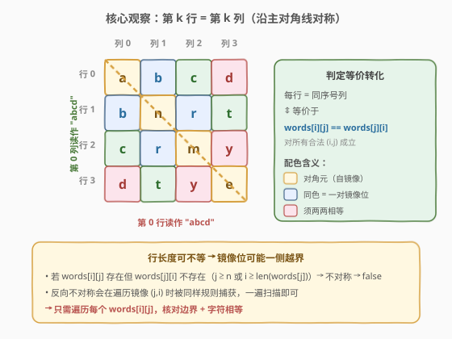
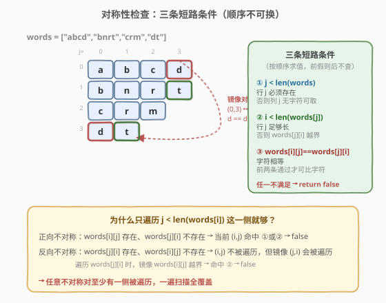
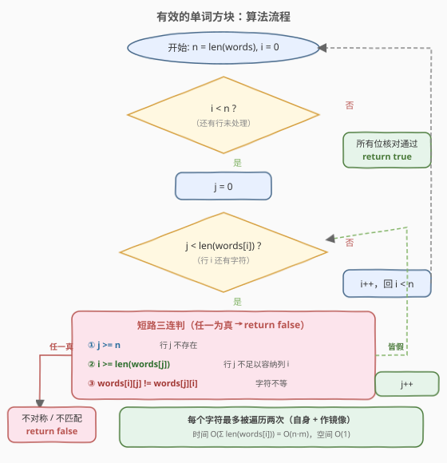
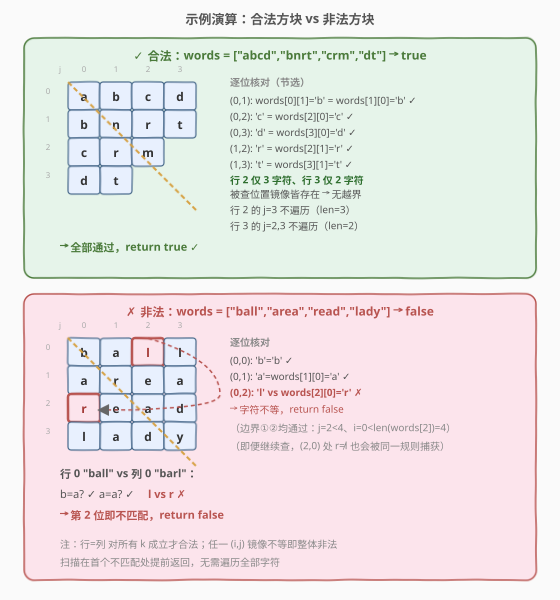

# LeetCode 有效的单词方块 题解

## 1. 题目概述

- **标题 / 题号**：有效的单词方块（#422，easy）
- **链接**：https://leetcode.cn/problems/valid-word-square/
- **难度**：简单
- **标签**：数组、字符串、矩阵

**题意**：给定一个字符串序列 `words`，判断它是否构成一个**有效的单词方块**。

把 `words[k]` 看作矩阵的第 `k` 行，则该矩阵的第 `k` 列也读出一个字符串。若对任意 `k`，**第 `k` 行与第 `k` 列读出的字符串完全相同**，则称该序列构成有效的单词方块。

**示例 1**：

```text
输入：words = ["abcd","bnrt","crmy","dtye"]
输出：true

矩阵：
a b c d
b n r t
c r m y
d t y e

第 0 行 "abcd" = 第 0 列 "abcd"
第 1 行 "bnrt" = 第 1 列 "bnrt"
第 2 行 "crmy" = 第 2 列 "crmy"
第 3 行 "dtye" = 第 3 列 "dtye"
```

**示例 2**（允许行长度不等）：

```text
输入：words = ["abcd","bnrt","crm","dt"]
输出：true

矩阵（注意第 2、3 行较短）：
a b c d
b n r t
c r m
d t

第 0 行 "abcd" = 第 0 列 "abcd"
第 1 行 "bnrt" = 第 1 列 "bnrt"
第 2 行 "crm"  = 第 2 列 "crm"
第 3 行 "dt"   = 第 3 列 "dt"
```

**示例 3**：

```text
输入：words = ["ball","area","read","lady"]
输出：false

矩阵：
b a l l
a r e a
r e a d
l a d y

第 0 行 "ball"  vs 第 0 列 "barl"  → 第 2 位 'l' ≠ 'r'，不匹配
```

**约束**：

- `1 <= words.length <= 500`
- `words[i].length <= 500`
- `words[i]` 仅由小写英文字母组成

> ⚠️ **两个易错点**：① 各行长度**不必相等**（见示例 2），必须处理「一侧有字符、另一侧越界」的不对称情况；② 行列相等意味着矩阵**沿主对角线对称**，即 `words[i][j] == words[j][i]`，这是把问题降维的关键。

## 2. 解题思路

### 2.1 暴力思路

逐行 `k` 构造出第 `k` 列的字符串，再与 `words[k]` 比较。构造第 `k` 列需遍历所有行取第 `k` 个字符，整体 $O(n \cdot m)$（$n$ 为行数，$m$ 为最大行长），空间 $O(m)$ 存列字符串。该法直观但要把"列越界"的边界处理嵌入字符串拼接，略显啰嗦。

### 2.2 核心观察：主对角线对称



「第 $k$ 行 = 第 $k$ 列」对**所有** $k$ 成立，等价于矩阵沿主对角线对称：对任意合法位置 $(i, j)$，都有

$$\text{words}[i][j] = \text{words}[j][i].$$

> 💡 **等价性证明**：若每行等于同序号列，则 `words[i]` 的第 $j$ 个字符（行 $i$ 列 $j$）等于 `words[j]` 的第 $i$ 个字符（行 $j$ 列 $i$），即 `words[i][j] == words[j][i]`。反之若所有 $(i,j)$ 满足该等式，则第 $k$ 行 `words[k]` 的每个字符都等于第 $k$ 列对应位置的字符，故行=列。

于是判定转化为：**遍历每个 `words[i][j]`，检查它与镜像位置 `words[j][i]` 是否同时存在且相等**。这正是判定一般矩阵对称性的套路，只是这里行长度不齐，需额外校验边界对称。

### 2.3 对称性检查：边界 + 字符



对每个 `i` 行的每个 `j` 列字符 `words[i][j]`（即 `j < len(words[i])`），需同时满足三条：

1. **行 `j` 存在**：`j < len(words)`——否则列 $j$ 无从取字符，但行 $i$ 在列 $j$ 有字符，不对称；
2. **行 `j` 足够长**：`i < len(words[j])`——否则 `words[j][i]` 越界，而行 $i$ 在列 $j$ 有字符，不对称；
3. **字符相等**：`words[i][j] == words[j][i]`。

任一不满足即返回 `false`。注意三条用短路 `or` 串联，**顺序不能乱**：必须先确认 `words[j]` 存在且 `i` 在其范围内，才能安全访问 `words[j][i]`，否则越界。

> ⚠️ **为什么只需遍历 `j < len(words[i])` 这一侧？** 反向不对称（`words[j][i]` 存在而 `words[i][j]` 不存在）会在外层循环走到 `i'=j`、内层 `j'=i` 时被捕获——彼时 `words[j][i]` 存在故被遍历，而镜像 `words[i][j]` 越界触发条件 2。因此一遍扫描即可覆盖所有不对称对。

### 2.4 算法流程图



### 2.5 示例演算



以 `words = ["abcd","bnrt","crm","dt"]` 为例，逐位核对（绿色 ✓ 表示通过，红色 ✗ 表示失败）：

| (i, j) | words[i][j] | words[j][i] | 边界 | 结果 |
|--------|-------------|-------------|------|------|
| (0,0) | a | a | ✓ | ✓ |
| (0,1) | b | b | ✓ | ✓ |
| (0,2) | c | c | ✓ | ✓ |
| (0,3) | d | d | ✓ | ✓ |
| (1,0) | b | b | ✓ | ✓ |
| (1,1) | n | n | ✓ | ✓ |
| (1,2) | r | r | ✓ | ✓ |
| (1,3) | t | t | ✓ | ✓ |
| (2,0) | c | c | ✓ | ✓ |
| (2,1) | r | r | ✓ | ✓ |
| (2,2) | m | m | ✓ | ✓ |
| (3,0) | d | d | ✓ | ✓ |
| (3,1) | t | t | ✓ | ✓ |

行 2 仅 3 个字符（`j` 只到 2），行 3 仅 2 个字符（`j` 只到 1），不存在越界不对称。全部通过 → `true`。

再看 `words = ["ball","area","read","lady"]`，在 `(i=0, j=2)` 处：

- `words[0][2] = 'l'`，`words[2][0] = 'r'`，边界都满足但字符不等 → 返回 `false`。

## 3. 参考代码

### C++

```cpp
// 主对角线对称判定，O(n·m) / O(1)
class Solution {
public:
    bool validWordSquare(vector<string>& words) {
        int n = words.size();
        for (int i = 0; i < n; i++) {
            int m = words[i].size();
            for (int j = 0; j < m; j++) {
                // 短路顺序：先判 j 是否为合法行号，再判行 j 是否够长，最后比字符
                if (j >= n || i >= (int)words[j].size() || words[i][j] != words[j][i]) {
                    return false;
                }
            }
        }
        return true;
    }
};
```

### Python

```python
class Solution:
    def validWordSquare(self, words: List[str]) -> bool:
        n = len(words)
        for i in range(n):
            for j, ch in enumerate(words[i]):
                # 短路顺序：j 必须是合法行号；行 j 长度须 > i；字符须相等
                if j >= n or i >= len(words[j]) or ch != words[j][i]:
                    return False
        return True
```

> 💡 **细节**：C++ 中 `words[j].size()` 返回 `size_t`（无符号），与负数比较会隐式转换为巨大无符号值导致误判，故 `i` 先与 `(int)words[j].size()` 比较，或写成 `i + 1 > words[j].size()`。Python 无此问题。`enumerate` 直接拿到字符，避免重复索引。

## 4. 复杂度分析

| 维度 | 复杂度 | 说明 |
|------|--------|------|
| **时间** | $O(n \cdot m)$ | $n$ 为行数，$m$ 为最长行长度；每个字符最多被访问两次（自身一次 + 作为某镜像一次），常数因子很小 |
| **空间** | $O(1)$ | 仅用下标变量，原地判定，不构造列字符串 |
| **正确性** | 一遍扫描覆盖所有不对称 | 正向不对称在当前 $(i,j)$ 暴露；反向不对称在镜像 $(j,i)$ 暴露 |

> ⚠️ **为何不是 $O(n^2)$**：当各行长度都为 $n$ 时确实是 $O(n^2)$，但题给行长可短至 1，实际访问次数为 $\sum_i \text{len}(\text{words}[i])$，即字符总数。

## 5. 扩展：构造单词方块（425. Word Squares）

判定一个方块是否合法是 $O(n \cdot m)$ 的对称性检查；更强的版本是 [425. 单词方块](https://leetcode.cn/problems/word-squares/)——给定一个不含重复的单词词典，**构造**出所有有效的 $n \times n$ 单词方块。那里需要回溯 + Trie 剪枝：逐行填词，下一行的前缀由已填的列确定（列 $j$ 的前 $i$ 个字符即行 $0..i-1$ 的第 $j$ 个字符），用 Trie 快速枚举所有该前缀的候选词。本题的对称性理解是 425 的前置基础。

## 6. 面试要点

1. **为什么「行=列 对所有 k 成立」等价于 `words[i][j] == words[j][i]`？**

   - 行 $k$ 等于列 $k$，意味着 `words[k]` 的第 $j$ 个字符（位置 $(k,j)$）等于列 $k$ 的第 $j$ 个字符，而列 $k$ 的第 $j$ 个字符正是 `words[j][k]`（位置 $(j,k)$）。把 $k$ 换成 $i$ 即得对称条件。反之亦然。

2. **三个条件为什么用 `or` 串联且顺序不能换？**

   - 任一不满足就要返回 `false`，故用 `or`。顺序上必须先 `j >= n` 再 `i >= len(words[j])` 再比较字符——前两者是访问 `words[j][i]` 的前置安全条件，靠短路求值避免越界。颠倒会先访问越界内存（C++）或抛 `IndexError`（Python）。

3. **只遍历 `j < len(words[i])` 会不会漏掉反向不对称？**

   - 不会。若 `words[j][i]` 存在而 `words[i][j]` 不存在（即 `j >= len(words[i])`），则在外层循环到 `i' = j`、内层 `j' = i` 时，`words[j][i]` 会被遍历，此时检查 `i' = j >= len(words[i']) = len(words[i])`？等等——这里 `i' = j`，`len(words[i']) = len(words[j])`，条件 2 变为 `j' = i >= len(words[i'])`？需重新对照：遍历的是 `words[j][i]`，镜像位置 `(j, i)` 的字符是 `words[i][j]`，检查 `i >= len(words[i])` 即 `j' >= len(words[i'])`，命中条件 2 返回 `false`。故反向不对称必被镜像迭代捕获。

4. **各行长不等的边界如何处理？示例 2 为何成立？**

   - 行 $i$ 只遍历到 `len(words[i]) - 1`，多余长度自然不查；只要每个被查位置 $(i,j)$ 的镜像 $(j,i)$ 同样存在且字符相等即可。示例 2 中行 2 仅 3 字符、行 3 仅 2 字符，被查位置恰好都有合法镜像，故成立。

5. **若输入保证所有行等长，能否简化？**

   - 可去掉边界两条检查，只比 `words[i][j] != words[j][i]`；且只需遍历上三角 $j > i$（对角线以下由对称性自动成立）。但本题不保证等长，简化会漏判越界不对称。

## 同类练习题

| # | 题目 | 与本题的关联 |
|---|------|-------------|
| 425 | [单词方块](https://leetcode.cn/problems/word-squares/) | 本题的构造升级版，回溯 + Trie 按列前缀枚举候选词，困难 |
| 36 | [有效的数独](https://leetcode.cn/problems/valid-sudoku/)（[题解](../0001-0100/36_有效的数独.md)） | 另一种矩阵合法性判定，按行/列/宫三视角去重，对照本题按对角线对称判定 |
| 48 | [旋转图像](https://leetcode.cn/problems/rotate-image/) | 矩阵沿对角线转置 + 翻转的经典操作，理解主/副对角线对称有助于本题 |
| 14 | [最长公共前缀](https://leetcode.cn/problems/longest-common-prefix/)（[题解](../0001-0100/14_最长公共前缀.md)） | 字符串数组逐位比对的入门题，本题逐位比的是「行字符 vs 列字符」 |
