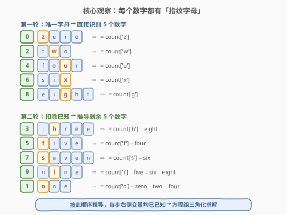
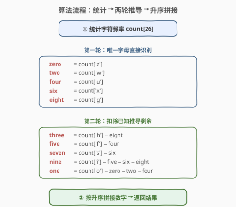
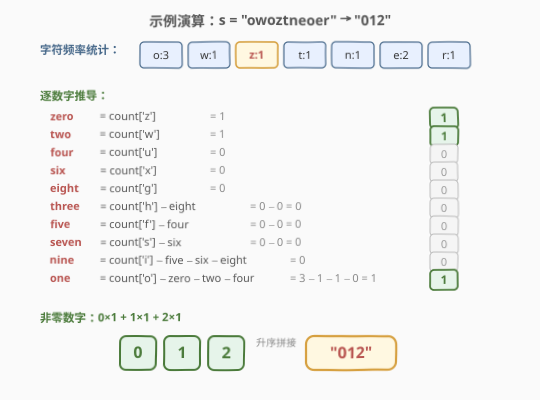

# LeetCode 从英文中重建数字 题解

## 1. 题目概述

- **标题 / 题号**：从英文中重建数字（#423，medium）
- **链接**：https://leetcode.cn/problems/reconstruct-original-digits-from-english/
- **难度**：中等
- **标签**：哈希表、数学、字符串

**题意**：给定一个字符串 `s`，其中包含字母顺序打乱的用英文单词表示的若干数字（`0-9`）。按 **升序** 返回原始的数字。

换句话说，`s` 是若干个 `"zero"`、`"one"`、…、`"nine"` 的字母打乱拼接后的结果，你需要还原出原始包含哪些数字，并按升序输出。

**示例 1**：

```text
输入：s = "owoztneoer"
输出："012"
```

**示例 2**：

```text
输入：s = "fviefuro"
输出："45"
```

**约束**：

- `1 <= s.length <= 10^5`
- `s[i]` 为 `["e","g","f","i","h","o","n","s","r","u","t","w","v","x","z"]` 这些字符之一。
- `s` 保证是一个符合题目要求的字符串（即一定可以还原出一组数字）。

> 💡 `s` 的长度可达 $10^5$，但只涉及 10 个英文数字单词，共 26 个字母中的 15 个。关键不是搜索匹配，而是利用**字母频率**的线性方程组来**唯一确定**每个数字的出现次数。

## 2. 解题思路

### 2.1 暴力思路

最直觉的做法是**回溯搜索**：从 `s` 中尝试剥离数字单词，每次选一个数字，检查 `s` 是否包含其所有字母，扣除后递归。但 `s` 长度达 $10^5$，数字种类 10 个，搜索树极深，指数级爆炸，必然超时。

另一种是**计数后枚举所有可能的数字组合**，但数字个数不确定，组合空间巨大，同样不可行。

正确方向是**放弃搜索，改用频率方程组**：统计 `s` 中每个字母的频次，再利用数字单词的字母构成建立线性方程，逐步求解每个数字的个数。

### 2.2 核心观察：指纹字母 + 三角化求解

0-9 的英文单词如下：

| 数字 | 英文 | 字母 |
|------|------|------|
| 0 | zero | z, e, r, o |
| 1 | one | o, n, e |
| 2 | two | t, w, o |
| 3 | three | t, h, r, e, e |
| 4 | four | f, o, u, r |
| 5 | five | f, i, v, e |
| 6 | six | s, i, x |
| 7 | seven | s, e, v, e, n |
| 8 | eight | e, i, g, h, t |
| 9 | nine | n, i, n, e |

> 💡 **关键观察**：有些字母只出现在**唯一一个**数字单词中——它们是该数字的「指纹字母」。看到 `z` 就一定有 `zero`，看到 `w` 就一定有 `two`，以此类推。

**第一轮：唯一指纹字母直接识别 5 个数字**

| 指纹字母 | 仅出现在 | 公式 |
|----------|----------|------|
| `z` | zero | `count(zero) = count['z']` |
| `w` | two | `count(two) = count['w']` |
| `u` | four | `count(four) = count['u']` |
| `x` | six | `count(six) = count['x']` |
| `g` | eight | `count(eight) = count['g']` |

这一轮直接确定了 0、2、4、6、8 五个数字的个数，无需任何扣除。

**第二轮：扣除已知后推导剩余 5 个**

第一轮之后，5 个数字已知。剩余的 1、3、5、7、9 虽然没有唯一字母，但每个都有一个「特征字母」**仅出现在该数字和某个已知数字中**，因此可以用已知的数字来扣除：

| 特征字母 | 出现在 | 公式 |
|----------|--------|------|
| `h` | three, eight | `count(three) = count['h'] − count(eight)` |
| `f` | five, four | `count(five) = count['f'] − count(four)` |
| `s` | seven, six | `count(seven) = count['s'] − count(six)` |
| `i` | five, six, eight, nine | `count(nine) = count['i'] − count(five) − count(six) − count(eight)` |
| `o` | zero, one, two, four | `count(one) = count['o'] − count(zero) − count(two) − count(four)` |

> ⚠️ **推导顺序至关重要**：计算 `nine` 时需要 `five`、`six`、`eight`，而 `five` 依赖 `four`，`eight` 和 `six` 来自第一轮。因此必须严格按 `three → five → seven → nine → one` 的顺序推导，保证每步右侧的变量均已已知。



从数学角度看，这本质是一个**线性方程组的三角化求解**（类似高斯消元的回代阶段）。10 个字母频率方程构成一个 10×10 的线性系统，通过选择合适的消元顺序，使得每步只需做一次减法即可解出一个未知数。

### 2.3 算法流程图



整体分三步：

1. **统计频率**：遍历 `s` 一次，得到 `count[26]` 字母频率表。
2. **两轮推导**：按固定顺序解出 10 个数字的个数（第一轮 5 个 + 第二轮 5 个）。
3. **升序拼接**：按 0-9 顺序，每个数字重复其个数次，拼接成结果字符串。

### 2.4 示例演算

以 `s = "owoztneoer"`（示例 1）为例：

**第 1 步**：统计字母频率

| o | w | z | t | n | e | r |
|---|---|---|---|---|---|---|
| 3 | 1 | 1 | 1 | 1 | 2 | 1 |

**第 2 步**：逐数字推导



- **第一轮**：`zero = count['z'] = 1`，`two = count['w'] = 1`，其余 4/6/8 的指纹字母频次为 0。
- **第二轮**：`h/f/s/i` 频次均为 0，扣除已知后仍为 0。最后 `one = count['o'] − zero − two − four = 3 − 1 − 1 − 0 = 1`。

**第 3 步**：非零数字为 `0×1 + 1×1 + 2×1`，按升序拼接得 `"012"`。

> 💡 注意 `count['o'] = 3`，但 `zero` 和 `two` 各消耗一个 `o`，所以 `one` 只有 $3 - 1 - 1 = 1$ 个。这正是「扣除已知」的意义——同一个字母被多个数字共享时，必须先扣除已知数字的贡献，才能得到剩余数字的个数。

## 3. 参考代码

### C++

```cpp
class Solution {
  public:
    string originalDigits(string s) {
        int cnt[26] = {};
        for (char c : s) cnt[c - 'a']++;

        int d[10] = {};
        // 第一轮：唯一指纹字母
        d[0] = cnt['z' - 'a'];         // zero
        d[2] = cnt['w' - 'a'];         // two
        d[4] = cnt['u' - 'a'];         // four
        d[6] = cnt['x' - 'a'];         // six
        d[8] = cnt['g' - 'a'];         // eight
        // 第二轮：扣除已知
        d[3] = cnt['h' - 'a'] - d[8];  // three  (h 只在 three+eight)
        d[5] = cnt['f' - 'a'] - d[4];  // five   (f 只在 five+four)
        d[7] = cnt['s' - 'a'] - d[6];  // seven  (s 只在 seven+six)
        d[9] = cnt['i' - 'a'] - d[5] - d[6] - d[8];  // nine (i 在 5/6/8/9)
        d[1] = cnt['o' - 'a'] - d[0] - d[2] - d[4];  // one  (o 在 0/1/2/4)

        string ans;
        for (int i = 0; i <= 9; i++)
            ans += string(d[i], '0' + i);
        return ans;
    }
};
```

### Python

```python
class Solution:
    def originalDigits(self, s: str) -> str:
        cnt = [0] * 26
        for c in s:
            cnt[ord(c) - 97] += 1

        d = [0] * 10
        # 第一轮：唯一指纹字母
        d[0] = cnt[25]  # z -> zero
        d[2] = cnt[22]  # w -> two
        d[4] = cnt[20]  # u -> four
        d[6] = cnt[23]  # x -> six
        d[8] = cnt[6]   # g -> eight
        # 第二轮：扣除已知
        d[3] = cnt[7] - d[8]              # h -> three
        d[5] = cnt[5] - d[4]              # f -> five
        d[7] = cnt[18] - d[6]             # s -> seven
        d[9] = cnt[8] - d[5] - d[6] - d[8]  # i -> nine
        d[1] = cnt[14] - d[0] - d[2] - d[4]  # o -> one

        return "".join(str(i) * d[i] for i in range(10))
```

> ⚠️ **两个易错点**：
> 1. **推导顺序不能乱**：`d[9]`（nine）依赖 `d[5]`、`d[6]`、`d[8]`，`d[1]`（one）依赖 `d[0]`、`d[2]`、`d[4]`。必须先算第一轮 5 个，再按 `3→5→7→9→1` 的顺序算第二轮。
> 2. **不需要用 `e` 的频率**：`e` 出现在 zero/one/three/five/seven/eight/nine 共 7 个数字中，方程最复杂。但上面 10 个方程已经够解出所有未知数，`e` 是冗余方程（可用于校验但非必需）。

## 4. 复杂度分析

| 维度 | 复杂度 | 说明 |
|------|--------|------|
| 时间复杂度 | $O(n)$ | 遍历 `s` 统计频率 $O(n)$ + 10 次常数运算 $O(1)$ + 拼接结果 $O(n)$ |
| 空间复杂度 | $O(1)$ | `cnt[26]` 和 `d[10]` 均为固定大小（输出字符串不计入额外空间） |

> 💡 本题瓶颈在线性扫描统计频率。对于 $n \leq 10^5$，约 $10^5$ 次字符计数，毫秒级完成。无论 `s` 多长，推导阶段始终是 10 次常数运算，与 $n$ 无关。

## 5. 扩展：为什么这 10 个方程恰好够？

从线性代数角度看，本题是一个**10 元一次方程组**：

- **未知数**：$x_0, x_1, \ldots, x_9$（每个数字的出现次数）
- **方程**：对每个字母 $c$，$\sum_{i: c \in \text{word}(i)} x_i = \text{count}[c]$

10 个未知数需要 10 个独立方程。虽然 15 个字母给出了 15 个方程，但它们并非全部独立（例如 `e` 的方程可以由其他方程线性组合得到）。上述解法选取了 10 个**恰好构成三角形式**的方程：

- 5 个「单变量方程」（$x_0 = c_z$ 等）直接给出解
- 5 个「双/多变量方程」在代入已知解后退化为单变量方程

这就是为什么不需要搜索或枚举——**线性方程组 + 三角消元**即可唯一求解。

> 💡 如果英文数字单词的字母构成不巧（比如所有字母都被多个数字共享），就无法这样三角化求解，可能需要回溯或线性方程组通用解法。本题的数字英文恰好具有「5 个唯一字母」的良好性质，是精心设计的。

## 6. 面试要点

1. **为什么暴力回溯不行？**
   - `s` 长度达 $10^5$，数字种类 10 个，搜索树深度可能上千层，分支因子 10，指数级爆炸。必须利用字母频率的线性约束，而非搜索匹配。

2. **「指纹字母」是什么意思？**
   - 某个字母只出现在唯一一个数字单词中，如 `z` 只在 `zero`。看到 `z` 的频次就直接知道 `zero` 的个数，无需扣除其他数字。0-9 中恰好有 5 个这样的字母：`z/w/u/x/g`。

3. **第二轮为什么要按特定顺序？**
   - `nine` 的特征字母 `i` 出现在 five/six/eight/nine 四个数字中，计算 `nine` 需要先知道 `five`、`six`、`eight`。而 `five` 又依赖 `four`。所以必须先解不依赖其他未知数的（第一轮），再按依赖链 `three→five→seven→nine→one` 逐步解出。

4. **为什么不用字母 `e`？**
   - `e` 出现在 7 个数字中，方程最复杂。但 10 个未知数只需 10 个独立方程，上述选取的 10 个已够。`e` 的方程是冗余的，可用于校验结果正确性但非必需。

5. **结果为什么一定是升序？**
   - 题目要求按升序返回。我们按 0-9 顺序拼接 `string(d[i], '0'+i)`，天然升序。若题目改为任意顺序，则需额外排序。

6. **如果输入不合法（无法还原）怎么办？**
   - 题目保证 `s` 合法。若不保证，可用 `e` 的方程做校验：检查 $\sum_{i} x_i \cdot \text{count}_e(\text{word}(i))$ 是否等于 `count['e']`，不等则无解。

## 同类练习题

| # | 题目 | 与本题的关联 |
|---|------|-------------|
| 12 | [整数转罗马数字](https://leetcode.cn/problems/integer-to-roman/)（[题解](../0001-0100/12_整数转罗马数字.md)） | 贪心匹配唯一面值符号，与本题「指纹字母直接识别」思路类似——先处理唯一确定的，再处理需扣除的 |
| 13 | [罗马数字转整数](https://leetcode.cn/problems/roman-to-integer/)（[题解](../0001-0100/13_罗马数字转整数.md)） | 哈希 + 贪心判定（左小右大则减），同样是利用符号的唯一性做映射 |
| 242 | [有效的字母异位词](https://leetcode.cn/problems/valid-anagram/) | 字母频率统计 + 比较，本题频率统计的基础功 |
| 387 | [字符串中的第一个唯一字符](https://leetcode.cn/problems/first-unique-character-in-a-string/) | 字母频率统计找唯一，与本题「找唯一指纹字母」的思路一脉相承 |
| 451 | [根据字符出现频率排序](https://leetcode.cn/problems/sort-characters-by-frequency/) | 频率统计 + 按频率排序，频率表操作的进阶练习 |
