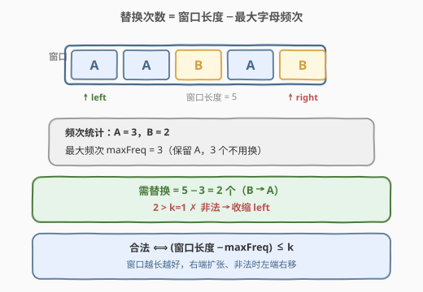
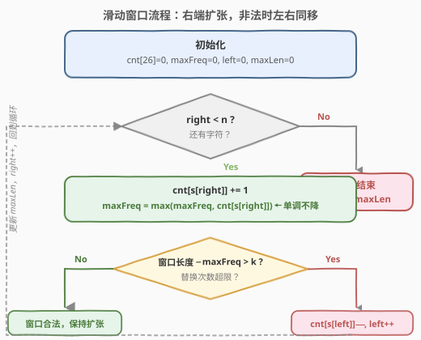
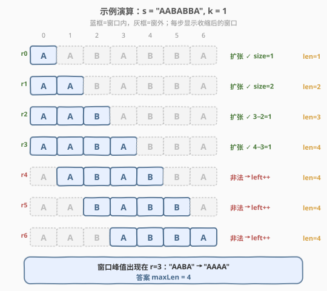

# 替换后的最长重复字符

- **题目名称**：替换后的最长重复字符
- **链接**：[424. 替换后的最长重复字符](https://leetcode.cn/problems/longest-repeating-character-replacement/)
- **难度**：中等
- **标签**：滑动窗口、哈希表、字符串、双指针

## 1. 题目概述

给定一个字符串 `s` 和一个整数 `k`。你可以选择 `s` 中的任意一个字符，并将其更改为任何其他大写英文字符。该操作最多可执行 `k` 次。返回执行上述操作后，**包含相同字母的最长子串的长度**。

> ⚠️ 一次「替换」只能把某个位置改成另一个字母；目标是让某段连续子串**全部变成同一个字母**，问这段子串最长能有多长。

**示例 1**：

```text
输入：s = "ABAB", k = 2
输出：4
解释：用两次操作把两个 'A' 替换为 'B'（或反之），得到 "BBBB" / "AAAA"。
```

**示例 2**：

```text
输入：s = "AABABBA", k = 1
输出：4
解释：把下标 2 的 'B' 换成 'A'，子串 "AABA" → "AAAA"，长度为 4。
```

**约束条件**：

- $1 \leq s.\text{length} \leq 10^5$
- `s` 仅由大写英文字母组成
- $0 \leq k \leq s.\text{length}$

> 💡 关键转化：要让一段子串全变成同一个字母，**保留出现次数最多的那个字母**，把其余字母都替换掉最划算。于是「最少替换次数 = 子串长度 − 子串中某个字母的最大出现次数」。问题变为：找最长的子串，使其「长度 − 字母最大频次 $\leq k$」。这是经典**滑动窗口**判定题。

---

## 2. 解题思路

### 2.1 暴力思路

枚举所有子串 $O(n^2)$ 个，对每个子串统计字母频次求最大频次，判断「子串长度 − 最大频次 $\leq k$」是否成立，取最大长度。统计部分 $O(26)$，总复杂度 $O(26 n^2)$，$n=10^5$ 时不可行。

> 💡 暴力的浪费在于：每次从左端点重新统计频次。注意到「合法子串越长越好」，且右端点扩张时频次只增不减——这正符合**滑动窗口**的单调性，可以用双指针把 $O(n^2)$ 压成 $O(n)$。

### 2.2 核心观察：窗口合法性 =「长度 − 最大频次 $\leq k$」



对一个窗口 $[l, r]$，设窗口内出现次数最多的字母频次为 $\text{maxFreq}$：

- 要把整个窗口变成同一个字母，**保留 maxFreq 个**，其余 $(r-l+1) - \text{maxFreq}$ 个都要替换；
- 当 $(r-l+1) - \text{maxFreq} \leq k$ 时窗口**合法**，否则**非法**。

于是维护一个窗口：右端 `r` 不断右移扩张；一旦非法就让左端 `l` 右移收缩，直到重新合法。过程中记录窗口最大长度即为答案。

> ⚠️ **优雅的「不收缩」技巧**：其实我们**根本不需要让 maxFreq 跟着收缩**。`maxFreq` 只记录「历史上出现过的某个字母的最大频次」，单调不降。当窗口非法时，`l` 和 `r` **同时右移一格**（窗口大小不变），而不是反复收缩。这样窗口大小只增不减，最终窗口大小就是答案。原因见第 5 节证明。这个技巧把内层 `while` 降为 `if`，是本题最经典的 $O(n)$ 写法。

### 2.3 算法流程图



维护状态：

- `cnt[26]`：当前窗口各字母频次；
- `maxFreq`：历史最大单字母频次（**单调不降**，不随 `l` 移动而回退）；
- `left`：窗口左端；`maxLen`：答案。

对每个右端 `right`：

1. `cnt[s[right]] += 1`，并更新 `maxFreq = max(maxFreq, cnt[s[right]])`；
2. 若 `(right - left + 1) - maxFreq > k`（非法）：把 `s[left]` 移出窗口（`cnt` 减 1），`left += 1`（窗口大小保持不变）；
3. 更新 `maxLen = max(maxLen, right - left + 1)`。

> 💡 第 2 步用 `if` 而非 `while`：因为窗口大小只增不减，非法时左右同移一格即可，无需反复收缩。`maxFreq` 可能暂时「偏大」（高估了当前窗口的真实最大频次），但这只会让判定更宽松、窗口不会错误地继续增长，详见第 5 节。

### 2.4 示例演算

以 `s = "AABABBA", k = 1` 为例（下标 $0\sim6$）：



| right | 字符 | cnt 变化 | maxFreq | 窗口大小 | 判定 | 动作 | left | maxLen |
|-------|------|----------|---------|----------|------|------|------|--------|
| 0 | A | A:1 | 1 | 1 | 1−1=0 ≤1 ✓ | 扩张 | 0 | 1 |
| 1 | A | A:2 | 2 | 2 | 2−2=0 ≤1 ✓ | 扩张 | 0 | 2 |
| 2 | B | B:1 | 2 | 3 | 3−2=1 ≤1 ✓ | 扩张 | 0 | 3 |
| 3 | A | A:3 | 3 | 4 | 4−3=1 ≤1 ✓ | 扩张 | 0 | 4 |
| 4 | B | B:2 | 3 | 5 | 5−3=2 >1 ✗ | 移出 s[0]=A，left→1 | 1 | 4 |
| 5 | B | B:3 | 3 | 5 | 5−3=2 >1 ✗ | 移出 s[1]=A，left→2 | 2 | 4 |
| 6 | A | A:2 | 3 | 5 | 5−3=2 >1 ✗ | 移出 s[2]=B，left→3 | 3 | 4 |

最终 `maxLen = 4` ✓。对应子串 `"AABA"`（下标 0–3，3 个 A 换掉 1 个 B）或 `"BABB"`（下标 2–5，3 个 B 换掉 1 个 A）。

> 💡 注意第 4 步后 `maxFreq=3` 已是「历史最大」，但当前窗口 `[1,4]="ABAB"` 真实最大频次只有 2——这正是「不收缩」技巧的高估，它让窗口判定保持宽松、大小稳定在 4，不会误增也不会漏掉真正的最大值。

---

## 3. 参考代码

### C++

```cpp
class Solution {
  public:
    int characterReplacement(string s, int k) {
        int cnt[26] = {0};
        int maxFreq = 0, left = 0, maxLen = 0;
        for (int right = 0; right < (int)s.size(); ++right) {
            int idx = s[right] - 'A';
            ++cnt[idx];
            maxFreq = max(maxFreq, cnt[idx]);      // 单调不降
            if ((right - left + 1) - maxFreq > k) { // 非法：左右同移，窗口大小不变
                --cnt[s[left] - 'A'];
                ++left;
            }
            maxLen = max(maxLen, right - left + 1);
        }
        return maxLen;
    }
};
```

### Python

```python
class Solution:
    def characterReplacement(self, s: str, k: int) -> int:
        cnt = [0] * 26
        max_freq = left = max_len = 0
        for right, ch in enumerate(s):
            idx = ord(ch) - 65
            cnt[idx] += 1
            max_freq = max(max_freq, cnt[idx])      # 单调不降
            if (right - left + 1) - max_freq > k:    # 非法：左右同移，窗口大小不变
                cnt[ord(s[left]) - 65] -= 1
                left += 1
            max_len = max(max_len, right - left + 1)
        return max_len
```

> ⚠️ 第 2 步必须是 `if` 而非 `while`，且 `maxFreq` 不能在 `left` 右移时回退——这正是「不收缩」技巧成立的两点关键，改成 `while` + 回退 maxFreq 会退化为 $O(26n)$（虽然也对，但失去本题最优雅的 $O(n)$ 性质）。

---

## 4. 复杂度分析

| 维度 | 复杂度 | 说明 |
|------|--------|------|
| 时间复杂度 | $O(n)$ | `right` 与 `left` 各至多遍历一遍，每步 $O(1)$；`maxFreq` 单调更新无需扫描全部 26 字母 |
| 空间复杂度 | $O(1)$ | 仅 `cnt[26]` 与常数变量，字母表大小固定为 26 |

> 💡 这是该题的最优解：右端点单调推进保证了 $O(n)$ 下界，空间为字母表常数级。

---

## 5. 扩展：为什么「不收缩」是正确的

**直觉**：我们只关心「最大合法窗口长度」。窗口大小只增不减，因此一旦某个大小被达到，就不会再缩小到比它小。

**严格说明**（为什么 `maxFreq` 高估也安全）：

设 `maxFreq` 是历史峰值，可能 **≥** 当前窗口真实最大频次 $f^*$。

- 判定式 $(r-l+1) - \text{maxFreq} > k$ 中，`maxFreq` 偏大会使左边偏小，即**判定更宽松**——可能把一个实际非法的窗口判为合法。
- 后果只是：本该收缩却没有收缩，窗口大小保持不变（左右同移），**绝不会错误地继续增长**。因为要让窗口增长，需要 `maxFreq` 真正增大，而 `maxFreq` 只在某字母真实计数超过历史峰值时才上升——那一刻对应一个**真实合法**的更大窗口。
- 因此记录到的最大窗口大小 = 真实答案。窗口在过程中可能短暂「含非法配置」，但其尺寸从未超过真实最优。

> 💡 **「老实」写法**：若担心正确性，可把 `if` 换成 `while`，并在每次判定时用 `max(cnt)` 重新计算当前窗口真实最大频次，时间 $O(26n)$，仍为 $O(n)$，逻辑最直观：

```python
while (right - left + 1) - max(cnt) > k:
    cnt[ord(s[left]) - 65] -= 1
    left += 1
```

面试时两种都能讲：先讲「老实 `while + max(cnt)`」保证正确，再讲「`if` + 单调 `maxFreq`」优化到 $O(n)$，体现对窗口单调性的理解。

---

## 6. 面试要点

1. **窗口合法性的判定式是怎么来的？**
   - 要让一段子串全变成同一字母，保留出现最多的字母最省替换次数。所以「最少替换次数 = 子串长度 − 最大字母频次」。该值 $\leq k$ 即合法。

2. **为什么 `maxFreq` 可以不随 `left` 收缩？**
   - `maxFreq` 是历史峰值，高估它只会让判定更宽松，导致「该收缩时不收缩」，窗口大小保持不变而非错误增长。要让窗口真正变大，`maxFreq` 必须真实增大，那一刻窗口确实是合法的。所以最大窗口尺寸始终正确。

3. **`if` 和 `while` 有什么区别？**
   - `while + 回退 maxFreq`（或 `max(cnt)` 重算）是「老实收缩」，每步把窗口收缩到合法，逻辑最直观，$O(26n)$。`if + 单调 maxFreq` 是「不收缩」技巧，窗口大小只增不减，$O(n)$，是本题最优雅写法。两者答案一致。

4. **这题和「无重复字符的最长子串」(3) 的区别？**
   - [3. 无重复字符的最长子串](https://leetcode.cn/problems/longest-substring-without-repeating-characters/)（[题解](../0001-0100/3_无重复字符的最长子串.md)）要求窗口内**无重复**，一旦重复就 `while` 收缩到合法，收缩条件直接由「该字符频次 > 1」触发。本题允许「重复但替换次数受限」，判定式变为「窗口长度 − 最大频次 ≤ k」，且可用「不收缩」技巧。两者同属滑动窗口，但判定与收缩策略不同。

5. **如果字母表不是 26 个大写字母（如任意 Unicode）怎么办？**
   - 把 `cnt[26]` 换成 `dict`/`Counter` 即可，逻辑不变；`maxFreq` 仍取历史峰值。空间从 $O(1)$ 变为 $O(\text{不同字符数})$。

---

## 7. 同类练习题

- [3. 无重复字符的最长子串](https://leetcode.cn/problems/longest-substring-without-repeating-characters/)（[题解](../0001-0100/3_无重复字符的最长子串.md)）：滑动窗口祖师题，对比「收缩到合法」与本题「不收缩」的差异
- [209. 长度最小的子数组](https://leetcode.cn/problems/minimum-size-subarray-sum/)（[题解](../0201-0300/209_长度最小的子数组.md)）：正数单调前缀和上的窗口收缩，求「最短合法」
- [76. 最小覆盖子串](https://leetcode.cn/problems/minimum-window-substring/)（[题解](../0001-0100/76_最小覆盖子串.md)）：窗口合法性由多字符计数决定，求「最短合法」，对比「最长 vs 最短」窗口的收缩方向
- [438. 找到字符串中所有字母异位词](https://leetcode.cn/problems/find-all-anagrams-in-a-string/)（[题解](438_找到字符串中所有字母异位词.md)）：固定长度的滑动窗口 + 字母计数匹配
- [1004. 最大连续1的个数 III](https://leetcode.cn/problems/max-consecutive-ones-iii/)：本题的完全同构版——把 0 翻转为 1，最多翻 k 个，求最长连续 1。判定式完全一致，强烈推荐对照练习
