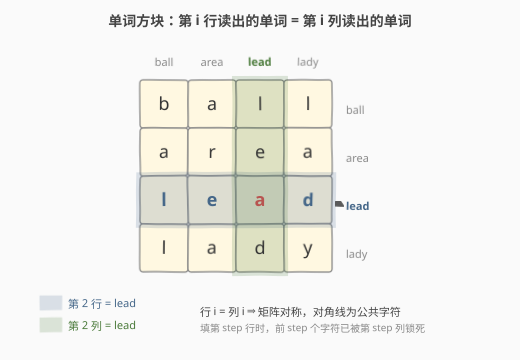
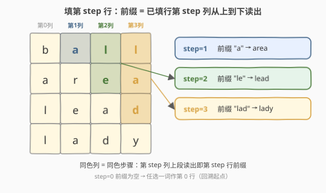
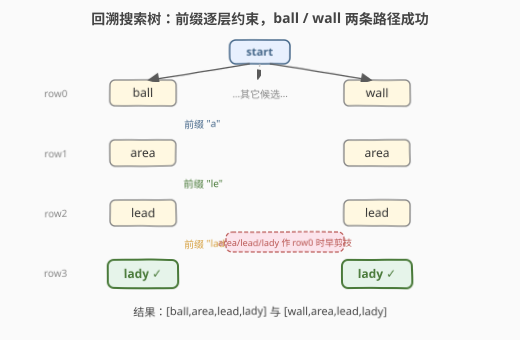

# LeetCode 单词方块 题解

## 1. 题目概述

- **标题 / 题号**：单词方块（#425，hard）
- **链接**：https://leetcode.cn/problems/word-squares/
- **难度**：困难
- **标签**：字典树、回溯、深度优先搜索

**题意**：给定一组**互不相同**且**长度相同**的单词 `words`，返回所有能由这些单词组成的**单词方块**（word square）。

一个 $k \times k$ 的单词方块满足：对任意 $0 \le i, j < k$，位置 $(i, j)$ 的字符等于位置 $(j, i)$ 的字符。等价地说——**第 $i$ 行读出的单词，等于第 $i$ 列读出的单词**，且每个都来自 `words`。

**示例 1**：

```text
输入：words = ["area","lead","wall","lady","ball"]
输出：[["wall","area","lead","lady"],["ball","area","lead","lady"]]
解释：下面两个方块都合法（行 = 列）：
  b a l l       w a l l
  a r e a       a r e a
  l e a d       l e a d
  l a d y       l a d y
第 0 行/列 = ball / wall；第 1 行/列 = area；第 2 行/列 = lead；第 3 行/列 = lady。
```

**示例 2**：

```text
输入：words = ["abat","baba","atan","atal"]
输出：[["baba","abat","baba","atan"],["baba","abat","baba","atal"]]
```

**约束**：

- $1 \le \text{words.length} \le 1000$
- $1 \le \text{words[i].length} \le 5$（单词很短，这是 Trie 剪枝能快速收敛的关键）
- `words[i]` 仅由小写英文字母组成
- 所有单词长度相同且互不相同

> 💡 关键观察：方块要「行 = 列」，意味着**填第 `step` 行时，它的前 `step` 个字符已经被前面填好的行锁死了**——这前 `step` 个字符正好是已填行第 `step` 列从上到下的字符。于是问题天然变成「带前缀约束的回溯」，而**按前缀取候选**正是 Trie 的拿手好戏。

## 2. 解题思路

### 2.1 暴力思路

枚举所有 $N^k$ 种行排列（$N$ 为单词数，$k$ 为单词长度），每种排列检查是否构成方块。$N=1000$、$k=5$ 时高达 $10^{15}$，完全不可行。即使边填边检查，前几行没有任何约束引导，分支因子始终是 $N$，搜索树爆炸。

> 💡 暴力的浪费在于：**没有利用「行 = 列」提前暴露出的前缀约束**。其实填到第 `step` 行时，前 `step` 个字符已经被前面锁死，剩下能选的词极少——把这个前缀查出来就能把分支因子从 $N$ 砍到个位数。

### 2.2 核心观察：下一行的前缀 = 已填行第 step 列从上到下



「行 = 列」的对称性带来一个直接结论：填第 `step` 行时（行号从 0 计），它的前 `step` 个字符必须满足

$$
\text{square}[\text{step}][j] = \text{square}[j][\text{step}], \quad 0 \le j < \text{step}
$$

也就是**已填好的第 `step` 列从上到下读出来**，就是第 `step` 行必须带上的前缀。



以示例 1 的方块 `[ball, area, lead, lady]` 为例：

- `step=0`：无约束，任选一个词作第 0 行，选 `"ball"`；
- `step=1`：前缀 = `square[0][1]` = `'a'` → 第 1 行必须以 `'a'` 开头 → `"area"`；
- `step=2`：前缀 = `square[0][2] + square[1][2]` = `'l' + 'e'` = `"le"` → `"lead"`；
- `step=3`：前缀 = `square[0][3] + square[1][3] + square[2][3]` = `'l' + 'a' + 'd'` = `"lad"` → `"lady"`。

> ⚠️ 注意 `step=0` 时前缀为空串，此时所有词都是候选——这正是回溯的起点（Trie 根节点对应空前缀）。

### 2.3 算法流程：Trie 存前缀候选 + 回溯

把所有单词插入一棵 Trie，**每个节点额外存一份「经过该节点的单词下标列表」**（即「具有该前缀的所有单词」）。回溯时按前缀走到对应节点，直接拿到候选下标集合，逐一尝试：

1. **建 Trie**：插入每个 `words[i]`，沿途每个节点（含根）把下标 `i` 追加到 `wordIds`；终点节点也追加。
2. **回溯 `dfs(step)`**：
   - 若 `step == k`：已填满 $k$ 行，把当前 `square` 收入答案；
   - 否则拼出前缀 `prefix = square[0][step] + square[1][step] + ... + square[step-1][step]`；
   - 沿 Trie 走到 `prefix` 对应节点（任一字符无子节点 ⇒ 本分支无候选，直接剪枝返回）；
   - 遍历该节点的 `wordIds`，每个作为第 `step` 行压栈，递归 `dfs(step+1)`，再弹栈回溯。

> 💡 **为什么 Trie 比哈希表 `prefix→list` 更合适**：本题前缀逐字符增长（`"a"` → `"le"` → `"lad"`），Trie 走一条边即扩展一字符，$O(1)$ 续接；且沿途节点天然缓存了每个前缀的候选集，无需重复扫描。哈希表也能做，但 Trie 把「前缀树」的语义直接表达出来，和「前缀约束逐层加严」的过程同构。

### 2.4 示例演算

以 `words = ["area","lead","wall","lady","ball"]`、$k=4$ 为例，回溯搜索树如下（仅展示有效分支，`area`/`lead`/`lady` 作行 0 时在 `step≥1` 因前缀无匹配而早剪枝）：



| step | 已填行 0 | 前缀（=第 step 列上段） | Trie 命中 | 选定第 step 行 | 状态 |
|------|----------|--------------------------|-----------|----------------|------|
| 0 | — | ""（空） | 全部 5 词 | ball / wall | 分两支 |
| 1 | ball | "a" | area | area | 继续 |
| 2 | ball,area | "le" | lead | lead | 继续 |
| 3 | ball,area,lead | "lad" | lady | lady | ✓ 收集 |
| 1 | wall | "a" | area | area | 继续 |
| 2 | wall,area | "le" | lead | lead | 继续 |
| 3 | wall,area,lead | "lad" | lady | lady | ✓ 收集 |

最终收集到两个方块：`[ball,area,lead,lady]` 与 `[wall,area,lead,lady]`。

> 💡 注意 `step=1` 时无论行 0 选 `ball` 还是 `wall`，前缀都是 `'a'`（`ball[1] == wall[1] == 'a'`），所以行 1 都收敛到 `area`——这正是前缀剪枝把「$N$ 叉」砍成「几乎单叉」的典型体现。

## 3. 参考代码

### C++

```cpp
struct TrieNode {
    TrieNode* children[26] = {};
    vector<int> wordIds;  // 经过该节点的单词下标 = 具有该前缀的所有单词
};

class Solution {
    vector<vector<string>> ans;
    vector<string> square;
    int k;
    const vector<string>* W;

    void dfs(int step, TrieNode* root) {
        if (step == k) {                         // 填满 k 行 → 收集
            ans.push_back(square);
            return;
        }
        TrieNode* node = root;                   // 拼前缀并沿 Trie 下走
        for (int i = 0; i < step; ++i) {
            node = node->children[square[i][step] - 'a'];
            if (!node) return;                   // 该前缀无单词 → 剪枝
        }
        for (int id : node->wordIds) {           // 逐一尝试同前缀候选
            square.push_back((*W)[id]);
            dfs(step + 1, root);
            square.pop_back();
        }
    }

  public:
    vector<vector<string>> wordSquares(vector<string>& words) {
        k = words[0].size();
        W = &words;
        TrieNode* root = new TrieNode();
        for (int i = 0; i < (int)words.size(); ++i) {
            TrieNode* cur = root;
            cur->wordIds.push_back(i);           // 根节点 = 空前缀，含全部单词
            for (char c : words[i]) {
                int idx = c - 'a';
                if (!cur->children[idx]) cur->children[idx] = new TrieNode();
                cur = cur->children[idx];
                cur->wordIds.push_back(i);       // 沿途每个节点都记下该单词
            }
        }
        dfs(0, root);
        return ans;
    }
};
```

### Python

```python
class TrieNode:
    __slots__ = ("children", "word_ids")
    def __init__(self):
        self.children = {}
        self.word_ids = []

class Solution:
    def wordSquares(self, words: List[str]) -> List[List[str]]:
        k = len(words[0])
        root = TrieNode()
        for i, w in enumerate(words):
            cur = root
            cur.word_ids.append(i)              # 根节点 = 空前缀
            for c in w:
                if c not in cur.children:
                    cur.children[c] = TrieNode()
                cur = cur.children[c]
                cur.word_ids.append(i)

        ans = []
        square = []
        def dfs(step: int) -> None:
            if step == k:
                ans.append(list(square))
                return
            node = root
            for i in range(step):                # 沿第 step 列上段拼前缀
                node = node.children.get(square[i][step])
                if not node:
                    return
            for wid in node.word_ids:
                square.append(words[wid])
                dfs(step + 1)
                square.pop()

        dfs(0)
        return ans
```

> ⚠️ 前缀拼接时 `square[i][step]` 的 `i` 只到 `step-1`：因为第 `step` 行还没填，能贡献第 `step` 列字符的只有前 `step` 行。`step=0` 时循环不执行，`node` 停在根节点，候选即全部单词——这正是建 Trie 时**根节点也要存全部单词下标**的原因。

## 4. 复杂度分析

| 维度 | 复杂度 | 说明 |
|------|--------|------|
| 时间复杂度 | $O(N \cdot k + \Sigma)$ | 建 Trie $O(Nk)$；回溯工作量 $\Sigma$ = 搜索树节点总数。前缀约束使每层候选极少，$\Sigma$ 远小于朴素上界 $O(N^k)$ |
| 空间复杂度 | $O(N \cdot k)$ | Trie 节点与 `wordIds` 总数：每个单词在沿途 $k+1$ 个节点各存一次下标，合计 $O(Nk)$；递归栈深 $O(k)$ |

> 💡 本题能过不靠「复杂度漂亮」而靠「剪枝凶」：$k \le 5$ 很小，且每填一行前缀就加长一字符，候选数迅速收缩到 1–2 个。极端退化用例（所有单词同前缀）才会接近上界，但 $k \le 5$ 仍可控。

## 5. 扩展：候选集存的两种姿势

| 方式 | 实现 | 取舍 |
|------|------|------|
| **节点存下标列表**（本解） | 每个节点 `vector<int> wordIds` | 查询 $O(1)$ 拿到候选；空间 $O(Nk)$；代码最简洁 |
| **节点只存子指针** | 终点节点存 `word`/`id`，查询时 DFS 收集子树 | 空间 $O(\sum\lvert w\rvert)$ 更省；但每次取候选要遍历子树，常数略大 |
| **哈希表 `prefix→list`** | `unordered_map<string, vector<int>>` | 实现最直白；但丢失「前缀逐字符增长」的共享，拼前缀要重复哈希 |

> 💡 另一个常见优化是**按字符计数预过滤**：若某字母在所有单词中根本没出现，相关前缀分支直接不建。对本题影响不大，因为 $k$ 小、Trie 本身已强剪枝。

## 6. 面试要点

1. **「行 = 列」是怎么转化成前缀约束的？**
   - 由对称性 `square[step][j] == square[j][step]`，填第 `step` 行时它的前 `step` 个字符等于已填行第 `step` 列从上到下读出的串。这个串就是必须满足的前缀。

2. **为什么用 Trie 而不是哈希表？**
   - 前缀逐字符增长（`"a"` → `"le"` → `"lad"`），Trie 走一条边就扩展一字符、$O(1)$ 续接；沿途节点天然缓存了每个前缀的候选集。哈希表虽然也行，但每次要重新哈希整段前缀，且无法共享前缀存储。

3. **`step=0` 时前缀是什么？节点落在哪？**
   - 前缀是空串，循环 0 次，`node` 停在根节点。所以建 Trie 时**根节点也要存全部单词下标**，否则 `step=0` 取不到候选。

4. **回溯的剪枝发生在哪里？**
   - 两处：①沿 Trie 走前缀时，任一字符无子节点 ⇒ 本分支不可能成方块，立即 `return`；②节点 `wordIds` 为空也自然不进入循环。前者是关键，把大量无效分支挡在浅层。

5. **这题和「单词搜索 II」(212) 的 Trie 用法有何异同？**
   - [212. 单词搜索 II](https://leetcode.cn/problems/word-search-ii/)（[题解](../0201-0300/212_单词搜索II.md)）用 Trie **限制 DFS 走向**（board 上走的字符必须在 Trie 子节点中），Trie 是「搜索空间裁剪器」；本题用 Trie **按前缀取候选**，Trie 是「候选集索引」。两者都是「回溯 + Trie 剪枝」，但 Trie 扮演的角色不同。

## 同类练习题

| # | 题目 | 与本题的关联 |
|---|------|-------------|
| 212 | [单词搜索 II](https://leetcode.cn/problems/word-search-ii/)（[题解](../0201-0300/212_单词搜索II.md)） | 回溯 + Trie 剪枝的经典应用，Trie 限制 DFS 走向，对比本题「Trie 取前缀候选」 |
| 208 | [实现 Trie（前缀树）](https://leetcode.cn/problems/implement-trie-prefix-tree/)（[题解](../0201-0300/208_实现Trie.md)） | Trie 基础数据结构，本题前置知识 |
| 79 | [单词搜索](https://leetcode.cn/problems/word-search/)（[题解](../0001-0100/79_单词搜索.md)） | 纯回溯搜索，对照加上 Trie 剪枝后的差异 |
| 421 | [数组中两个数的最大异或值](https://leetcode.cn/problems/maximum-xor-of-two-numbers-in-an-array/)（[题解](421_数组中两个数的最大异或值.md)） | Trie 的另一种用法——按二进制前缀贪心匹配 |
| 51 | [N 皇后](https://leetcode.cn/problems/n-queens/)（[题解](../0001-0100/51_N皇后.md)） | 逐行填放的回溯范式，本题的「逐行 + 列约束」与皇后「逐行 + 列/对角线约束」同构 |
