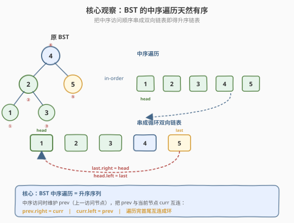
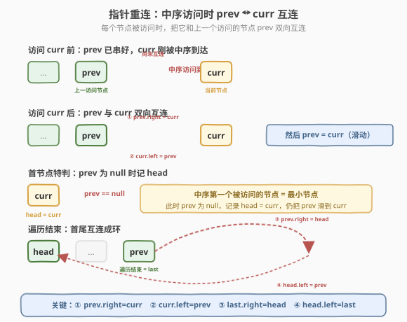
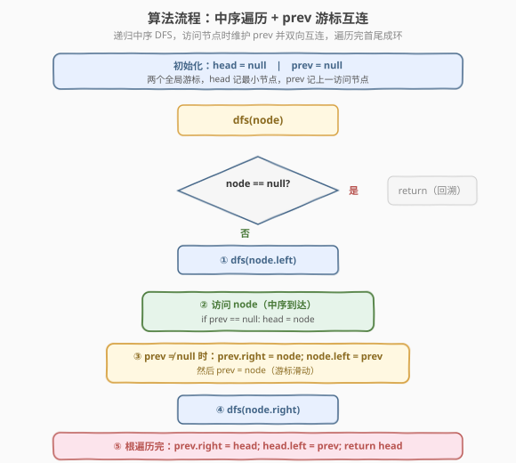

# 将二叉搜索树转化为排序的双向链表

- **题目名称**：将二叉搜索树转化为排序的双向链表
- **链接**：[426. 将二叉搜索树转化为排序的双向链表](https://leetcode.cn/problems/convert-binary-search-tree-to-sorted-doubly-linked-list/)
- **难度**：中等
- **标签**：树、链表、二叉搜索树、中序遍历

## 1. 题目概述

给定一棵**二叉搜索树（BST）**的根节点 `root`。请将其转化为一个**排序的循环双向链表**，要求：

- 每个节点都有两个指针：`left` 和 `right`。
- 转化后，节点的 `left` 指向**前驱**（中序前一个节点），`right` 指向**后继**（中序后一个节点）。
- **原地转化**：不得新建节点，只能调整已有节点的指针。
- 最终是**循环**链表：链表头（最小节点）的 `left` 指向链表尾（最大节点），链表尾的 `right` 指向链表头。
- 返回指向链表中**最小元素**的节点（即链表头 `head`）。

节点定义：

```cpp
class Node {
  public:
    int val;
    Node* left;
    Node* right;

    Node() {}
    Node(int _val) : val(_val), left(nullptr), right(nullptr) {}
    Node(int _val, Node* _left, Node* _right) : val(_val), left(_left), right(_right) {}
};
```

**示例 1**：

```text
输入：root = [4,2,5,1,3]
输出：[1,2,3,4,5]

        4
       / \
      2   5
     / \
    1   3

转化后：1 ⇄ 2 ⇄ 3 ⇄ 4 ⇄ 5（循环，5.right 指回 1，1.left 指回 5）
返回节点 1（最小值）。
```

**示例 2**：

```text
输入：root = [2,1,3]
输出：[1,2,3]
解释：1 ⇄ 2 ⇄ 3 循环双向链表。
```

**约束条件**：

- 节点数目范围 `[0, 2000]`
- `0 <= Node.val <= 1000`
- 题目保证输入是一棵合法的 BST（无重复值）

> 💡 这道题是 **BST 中序遍历** 与 **双向链表指针操作** 的综合题。核心观察：**BST 的中序遍历序列天然升序**，只要在中序访问每个节点时，把它和上一个访问的节点「互连」（`prev.right = curr`、`curr.left = prev`），最后把首尾互连成环即可。和 [109. 有序链表转换二叉搜索树](../0101-0200/109_有序链表转换二叉搜索树.md) 是一对互逆题：一个把链表变成 BST，一个把 BST 变成链表。

---

## 2. 解题思路

### 2.1 暴力思路：先收集再重连

最直观的做法：

1. 中序遍历 BST，把所有节点按访问顺序存入一个数组 `nodes`。
2. 遍历数组，相邻节点互连：`nodes[i].right = nodes[i+1]`、`nodes[i+1].left = nodes[i]`。
3. 首尾互连成环。

能过，但：

- 需要 `O(n)` 额外空间存数组。
- 多了一次遍历数组的开销。
- 没利用中序遍历「顺序访问」的特性——其实可以在遍历过程中直接连接。

> ⚠️ 数组法正确但不优。BST 中序遍历本身已经按升序访问节点，没必要把节点先存起来再连，完全可以在「访问节点」这一步就地完成连接，省去额外空间。这是面试中典型的「能用更优做法」的提示点。

### 2.2 核心观察：中序遍历 + prev 游标就地互连

**整体思路**：在中序遍历的过程中维护一个游标 `prev`，记录**上一个被中序访问到的节点**。每访问当前节点 `curr`，就把 `prev` 和 `curr` 双向互连：



**关键操作**（中序访问 `curr` 时，设 `prev` 为上一访问节点）：

1. 若 `prev == null`（即 `curr` 是中序第一个节点 = BST 最小节点）：记 `head = curr`，这是链表头。
2. 若 `prev != null`：双向互连——`prev.right = curr`；`curr.left = prev`。
3. 滑动游标：`prev = curr`（为下一个节点做准备）。

中序遍历结束后，`prev` 停在最后一个被访问的节点（即 BST 最大节点 = 链表尾 `last`），把它与 `head` 互连成环：

- `prev.right = head`（尾的后继指向头）
- `head.left = prev`（头的前驱指向尾）



> 💡 **为什么用 `left`/`right` 而不是 `prev`/`next`？** 题目复用 BST 节点的 `left`、`right` 两个指针字段来表达双向链表的「前驱」和「后继」——`left` 即前驱（类比 `prev`），`right` 即后继（类比 `next`）。所谓「原地转化」就是不新建节点，只改这两个指针的指向。理解了这一点，剩下的就是标准的中序遍历 + 指针重连。

### 2.3 算法流程图



**完整步骤**（递归中序 `dfs(node)`，外部维护 `head`、`prev` 两个游标）：

1. **判空**：若 `node == null`，直接 `return`。
2. **递归左子树**：`dfs(node.left)`。
3. **访问当前节点 `node`（中序位置）**：
   - 若 `prev == null`：`head = node`（记首节点）。
   - 否则：`prev.right = node`；`node.left = prev`（互连）。
   - 滑动：`prev = node`。
4. **递归右子树**：`dfs(node.right)`。
5. **遍历结束后（在 `treeToDoublyList` 主函数里）**：若 `head == null`（空树）返回 `null`；否则 `prev.right = head`；`head.left = prev`（成环），返回 `head`。

> ⚠️ 第 5 步的「首尾成环」必须在**整棵树的中序遍历完全结束之后**做，不能放在递归内部。因为递归过程中 `prev` 还在滑动，只有遍历完最后一个节点后 `prev` 才停在链表尾。常见错误是在递归左子树回溯时就尝试成环，导致指针错乱。

### 2.4 示例演算

以示例 1 的 BST 为例，中序访问顺序为 `1 → 2 → 3 → 4 → 5`：

![示例演算：BST [4,2,5,1,3] 中序顺序逐步互连成循环双向链表](../images/bst2dlist_example_walkthrough.svg)

| 步骤 | 访问节点 | 操作 | 链表状态（head … prev） |
|------|---------|------|----------------------|
| ① | `1` | `prev=null` → `head=1`；`prev=1` | `1` |
| ② | `2` | `1.right=2`；`2.left=1`；`prev=2` | `1 ⇄ 2` |
| ③ | `3` | `2.right=3`；`3.left=2`；`prev=3` | `1 ⇄ 2 ⇄ 3` |
| ④ | `4` | `3.right=4`；`4.left=3`；`prev=4` | `1 ⇄ 2 ⇄ 3 ⇄ 4` |
| ⑤ | `5` | `4.right=5`；`5.left=4`；`prev=5` | `1 ⇄ 2 ⇄ 3 ⇄ 4 ⇄ 5` |
| ⑥ | — | `5.right=1`；`1.left=5`（成环） | `1 ⇄ 2 ⇄ 3 ⇄ 4 ⇄ 5 ⇄ 1`（循环） |

最终返回 `head`（节点 `1`），与示例 1 一致。

> 💡 注意步骤①的特判：中序第一个节点（BST 最小值）的 `prev` 为 `null`，此时**只记 `head` 不做互连**（因为没有前驱可连）。`prev` 滑到该节点后，从步骤②开始才有 `prev ≠ null`，才能互连。这是中序就地连接的通用模板，[98. 验证二叉搜索树](../0001-0100/98_验证二叉搜索树.md) 的迭代中序也用同样的「prev 游标」思路。

---

## 3. 参考代码

### C++

```cpp
/*
// Definition for a Node.
class Node {
  public:
    int val;
    Node* left;
    Node* right;
};
*/
class Solution {
    Node* head = nullptr;
    Node* prev = nullptr;

    void dfs(Node* node) {
        if (node == nullptr) return;
        dfs(node->left);                       // 递归左子树

        // 访问当前节点（中序位置）
        if (prev == nullptr) {
            head = node;                       // 中序首节点 = 最小节点
        } else {
            prev->right = node;                // ① prev.right = curr
            node->left = prev;                 // ② curr.left = prev
        }
        prev = node;                           // 游标滑动

        dfs(node->right);                      // 递归右子树
    }

  public:
    Node* treeToDoublyList(Node* root) {
        if (root == nullptr) return nullptr;
        dfs(root);
        // 首尾成环
        prev->right = head;                    // ③ last.right = head
        head->left = prev;                     // ④ head.left = last
        return head;
    }
};
```

### Python

```python
"""
# Definition for a Node.
class Node:
    def __init__(self, val, left=None, right=None):
        self.val = val
        self.left = left
        self.right = right
"""
class Solution:
    def treeToDoublyList(self, root: 'Node') -> 'Node':
        if not root:
            return None

        head = [None]      # 用 list 包一层做「可变引用」
        prev = [None]

        def dfs(node: 'Node') -> None:
            if not node:
                return
            dfs(node.left)                       # 递归左子树

            # 访问当前节点（中序位置）
            if prev[0] is None:
                head[0] = node                   # 中序首节点 = 最小节点
            else:
                prev[0].right = node             # ① prev.right = curr
                node.left = prev[0]              # ② curr.left = prev
            prev[0] = node                       # 游标滑动

            dfs(node.right)                      # 递归右子树

        dfs(root)
        # 首尾成环
        prev[0].right = head[0]                  # ③ last.right = head
        head[0].left = prev[0]                   # ④ head.left = last
        return head[0]
```

> 💡 两版逻辑完全一致。C++ 用成员变量 `head`/`prev` 做游标最简洁；Python 闭包内不能直接对外层变量赋值，用 `list` 包一层做「可变引用」（或用 `nonlocal` 关键字声明）。也可以把 `head`、`prev` 作为 `dfs` 的返回值或参数传递，但用外部游标更贴近中序遍历的「访问-连接」语义，代码更清晰。

---

## 4. 复杂度分析

| 维度 | 复杂度 | 说明 |
|------|--------|------|
| **时间复杂度** | $O(n)$ | 标准中序遍历，每个节点访问一次；首尾成环 $O(1)$，整体 $O(n)$ |
| **空间复杂度** | $O(h)$ | 递归调用栈深度等于树高 $h$；平衡 BST 时 $h = O(\log n)$，退化为链时 $h = O(n)$；除递归栈外只用 $O(1)$ 额外游标 |

> ⚠️ 空间复杂度是**递归栈**而非额外数据结构。若面试要求 $O(1)$ 额外空间（不含递归栈），可改用**迭代中序**（显式栈仍是 $O(h)$）；若要严格 $O(1)$ 总空间，可用 **Morris 中序遍历**——利用空闲的 `right` 指针做线索，但本题中 `right` 指针要被改写为后继，Morris 的「线索化」与「链表化」会冲突，需要更精细的处理，面试中一般不要求。

---

## 5. 扩展：迭代中序写法

递归中序改迭代用显式栈，逻辑等价但避免递归栈溢出（本题节点 ≤ 2000 不会溢出，但迭代版在节点数极大时更稳）：

```python
def treeToDoublyList(self, root: 'Node') -> 'Node':
    if not root:
        return None
    head = None
    prev = None
    stack = []
    curr = root
    while stack or curr:
        while curr:                    # 一路向左压栈
            stack.append(curr)
            curr = curr.left
        curr = stack.pop()             # 中序访问
        if prev is None:
            head = curr
        else:
            prev.right = curr
            curr.left = prev
        prev = curr
        curr = curr.right              # 转向右子树
    # 首尾成环
    prev.right = head
    head.left = prev
    return head
```

> 💡 迭代版与递归版的「访问-连接」逻辑完全相同，区别只是用显式栈模拟递归调用。`prev`/`head` 游标的维护方式不变。掌握递归版即可，迭代版作为「避免栈溢出」的备选，和 [94. 二叉树的中序遍历](../0001-0100/94_二叉树的中序遍历.md) 的迭代模板一致。

---

## 6. 面试要点

1. **为什么用中序遍历？**

   - BST 的核心性质：**中序遍历序列升序**。要得到「排序的双向链表」，等价于按升序把节点串起来，而中序遍历天然按升序访问节点。所以中序是本题的唯一正确遍历顺序——前序/后序都无法保证链表有序。

2. **`prev` 游标的作用是什么？为什么不用数组先存？**

   - `prev` 记录「上一个中序访问的节点」，每来一个新节点就把它和 `prev` 互连，实现**就地连接**。
   - 不用数组是因为中序遍历本身已按顺序访问节点，没必要先存再连——`prev` 游标把「遍历」和「连接」合二为一，省去 $O(n)$ 额外空间。这是「流式处理」思想：不缓存全部数据，边读边处理。

3. **首节点为什么要特判？**

   - 中序第一个节点（BST 最小值）没有前驱，`prev` 此时为 `null`，无法做 `prev.right = curr` 的连接。所以首节点只记 `head = curr`，不做互连；从第二个节点起 `prev` 非 `null`，才能互连。这是所有「中序就地连接」题的通用特判，[98. 验证二叉搜索树](../0001-0100/98_验证二叉搜索树.md) 也用同样的 `prev` 模式。

4. **为什么首尾成环放在遍历结束后？**

   - 遍历过程中 `prev` 还在滑动，只有访问完最后一个节点（BST 最大值）后，`prev` 才停在链表尾 `last`。此时才能把 `last` 和 `head` 互连成环。若在递归内部提前成环，会把中间节点误当成尾，破坏链表结构。**成环是「遍历完成后的收尾动作」，不是遍历中的动作**。

5. **`left`/`right` 和普通链表的 `prev`/`next` 是什么关系？**

   - 本题复用 BST 节点的 `left`、`right` 字段表示双向链表的前驱/后继：`left` = 前驱（`prev`），`right` = 后继（`next`）。「原地转化」就是不新建节点，只改这两个指针。转化完成后，原 BST 结构被覆盖，节点变成纯链表节点——这是题目允许的，因为转化后不再需要 BST 结构。

> 💡 **一句话总结**：426 是 BST 中序遍历与双向链表的结合题——中序访问时维护 `prev` 游标，每访问一个节点就和 `prev` 双向互连（`prev.right=curr`、`curr.left=prev`），首节点特判记 `head`，遍历完把 `prev`（尾）与 `head`（头）互连成环。$O(n)$ 时间、$O(h)$ 递归栈空间。核心是「**中序顺序 = 升序，边遍历边连接**」，是 BST 与链表互转的招牌模板。

---

## 7. 同类练习题

- [109. 有序链表转换二叉搜索树](https://leetcode.cn/problems/convert-sorted-list-to-binary-search-tree/)（[题解](../0101-0200/109_有序链表转换二叉搜索树.md)）：本题的逆操作——链表转 BST，中序填充的镜像
- [94. 二叉树的中序遍历](https://leetcode.cn/problems/binary-tree-inorder-traversal/)（[题解](../0001-0100/94_二叉树的中序遍历.md)）：中序遍历基础模板，递归/迭代/Morris 三版
- [98. 验证二叉搜索树](https://leetcode.cn/problems/validate-binary-search-tree/)（[题解](../0001-0100/98_验证二叉搜索树.md)）：中序 + prev 游标判定单调性，同 prev 模板
- [114. 二叉树展开为链表](https://leetcode.cn/problems/flatten-binary-tree-to-linked-list/)（[题解](../0101-0200/114_二叉树展开为链表.md)）：树转链表的另一变体，前序展开为单向链表
- [430. 扁平化多级双向链表](https://leetcode.cn/problems/flatten-a-multilevel-doubly-linked-list/)（[题解](../0401-0500/430_扁平化多级双向链表.md)）：双向链表 + DFS 指针重连，双向指针操作综合题
