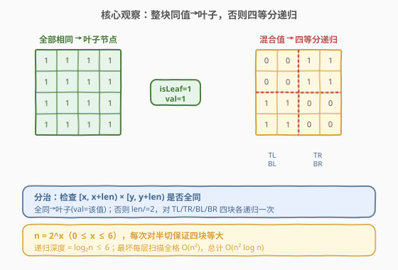
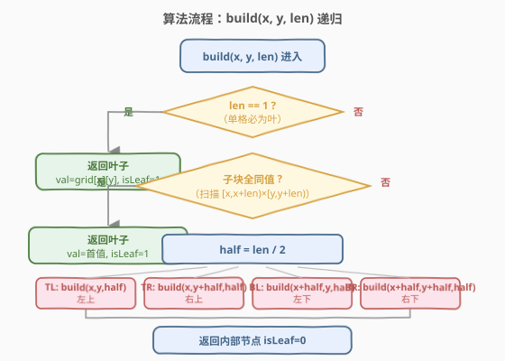
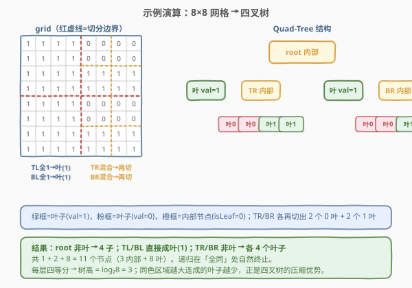

# 建立四叉树

- **题目名称**：建立四叉树
- **链接**：[427. 建立四叉树](https://leetcode.cn/problems/construct-quad-tree/)
- **难度**：中等
- **标签**：分治、递归、树、二维矩阵

## 1. 题目概述

给定一个 $n \times n$ 的二维 `grid`，元素为 `0` 或 `1`。要求构造其**四叉树**（Quad-Tree）表示并返回根节点。

四叉树是一种每个内部节点**恰好有四个孩子**的树形结构。本题中每个节点的定义如下：

| 字段 | 类型 | 含义 |
|------|------|------|
| `val` | `bool` | 该节点所代表网格的值；`True` 表示全 `1`，`False` 表示全 `0` |
| `isLeaf` | `bool` | 是否为叶子节点（即当前网格所有值相同，无需再分） |
| `topLeft` / `topRight` / `bottomLeft` / `bottomRight` | `Node*` | 四个孩子（仅在非叶时有意义） |

构造规则：

- 若当前子网格内**所有值相同**，则构造一个**叶子节点**，`val` 取该值，`isLeaf = True`；
- 否则将网格**四等分**（沿行、列中点切开），对四个子块**分别递归**构造，当前节点为**内部节点**，`isLeaf = False`，`val` 可取任意值（惯例取 `True`）。

> ⚠️ **非叶节点的 `val`**：题目判定器对非叶节点的 `val` 不做要求，习惯上设为 `True` 或 `grid[x][y]`，不影响正确性。

**示例 1**：

```text
输入：grid = [[0,1],[1,0]]
输出：root
解释：四格两两不同，root 为内部节点，4 个孩子均为叶子（TL=0, TR=1, BL=1, BR=0）。
```

**示例 2**：

```text
输入：grid = [[1,1,1,1,0,0,0,0],
              [1,1,1,1,0,0,0,0],
              [1,1,1,1,1,1,1,1],
              [1,1,1,1,1,1,1,1],
              [1,1,1,1,0,0,0,0],
              [1,1,1,1,0,0,0,0],
              [1,1,1,1,1,1,1,1],
              [1,1,1,1,1,1,1,1]]
输出：root
解释：root 非叶；左上/左下 4×4 全 1 → 叶(1)；右上/右下 4×4 又各需再切，详见 2.4 演算。
```

**约束条件**：

- $n = \text{grid.length} = \text{grid}[i].\text{length}$
- $n = 2^x$，其中 $0 \leq x \leq 6$（即 $1 \leq n \leq 64$，且 $n$ 恒为 2 的幂）
- $\text{grid}[i][j] \in \{0, 1\}$

> 💡 $n$ 恒为 2 的幂是本题的关键前提——它保证每次「对半切」都能得到**四个等大的子块**，递归自然终止于 $1 \times 1$ 的单格（单格必为叶子）。

---

## 2. 解题思路

### 2.1 暴力思路

对整个网格做一次「是否全同」判定；若全同直接成叶，否则切成四块各做同样处理。这其实**就是**正解——分治递归。本题不存在「更暴力」的退化做法，难点不在算法选择，而在**如何干净地切分坐标**和**判定全同**。

### 2.2 核心观察：分治——同值即叶，否则四等分



关键观察有三点：

1. **同值终止**：若子网格内所有单元格的值相同，就没有继续切分的必要，直接封装成一个叶子节点。这是递归的**收敛条件**。
2. **四等分切分**：因为 $n$ 是 2 的幂，任意子块边长 $\text{len}$ 也是 2 的幂，$\text{half} = \text{len} / 2$ 必为整数，且四块**完全等大**。切分坐标为：
   - **左上 TL**：起点 $(x, y)$，边长 $\text{half}$
   - **右上 TR**：起点 $(x,\, y + \text{half})$，边长 $\text{half}$
   - **左下 BL**：起点 $(x + \text{half},\, y)$，边长 $\text{half}$
   - **右下 BR**：起点 $(x + \text{half},\, y + \text{half})$，边长 $\text{half}$
3. **叶子值即网格值**：叶子节点的 `val` 直接取该同值区域的值（`1 → True`，`0 → False`）。

> 💡 **为什么四叉树能压缩？** 大片同色区域只需一个叶子表示，不必逐格存储。图像压缩、地理数据（如 GeoQuadTree）正是利用这一性质。最坏情况（棋盘格）退化为满四叉树，节点数 $O(n^2)$；最好情况（全同）只有 1 个节点。

### 2.3 算法流程图



递归函数 `build(x, y, len)` 处理「以 $(x, y)$ 为左上角、边长 $\text{len}$ 的子网格」：

1. **基准**：$\text{len} = 1$，单格必为叶，返回 `Node(val=grid[x][y]==1, isLeaf=True)`。
2. **同值判定**：扫描 $[x, x+\text{len}) \times [y, y+\text{len})$ 的所有格，看是否都等于 `grid[x][y]`。
   - **全同**：返回叶子 `Node(val=首值, isLeaf=True)`。
   - **不全同**：$\text{half} = \text{len}/2$，递归构造四个孩子，返回内部节点 `Node(val=True, isLeaf=False, TL, TR, BL, BR)`。

> ⚠️ **同值判定的早停**：扫描时一旦发现不同值立刻 `break`，避免无谓遍历。用 `same` 布尔标志在两层循环条件里短路退出。

### 2.4 示例演算

以示例 2 的 $8 \times 8$ 网格为例：



递归执行过程（$\text{len}$ 从 $8 \to 4 \to 2$）：

| 步骤 | 子块（行,列,边长） | 内容 | 判定 | 结果 |
|------|---------------------|------|------|------|
| 1 | $(0,0,8)$ 整块 | 含 0 含 1 | 不全同 | 内部节点，切四块 |
| 2 | TL $(0,0,4)$ | 全 1 | 全同 | 叶(val=1) |
| 3 | TR $(0,4,4)$ | 上 0 下 1 | 不全同 | 内部节点，再切 |
| 4 | TR-TL $(0,4,2)$ | 全 0 | 全同 | 叶(val=0) |
| 5 | TR-TR $(0,6,2)$ | 全 0 | 全同 | 叶(val=0) |
| 6 | TR-BL $(2,4,2)$ | 全 1 | 全同 | 叶(val=1) |
| 7 | TR-BR $(2,6,2)$ | 全 1 | 全同 | 叶(val=1) |
| 8 | BL $(4,0,4)$ | 全 1 | 全同 | 叶(val=1) |
| 9 | BR $(4,4,4)$ | 上 0 下 1 | 不全同 | 内部节点，再切 |
| 10–13 | BR 四个 $2 \times 2$ | 0/0/1/1 | 全同 | 4 个叶子 |

最终共 **3 个内部节点 + 8 个叶子 = 11 个节点**。树高 $\log_2 8 = 3$。

---

## 3. 参考代码

### C++

```cpp
/*
// Definition for a QuadTree node.
class Node {
public:
    bool val;
    bool isLeaf;
    Node* topLeft;
    Node* topRight;
    Node* bottomLeft;
    Node* bottomRight;

    Node() : val(false), isLeaf(false),
             topLeft(nullptr), topRight(nullptr),
             bottomLeft(nullptr), bottomRight(nullptr) {}

    Node(bool _val, bool _leaf)
        : val(_val), isLeaf(_leaf),
          topLeft(nullptr), topRight(nullptr),
          bottomLeft(nullptr), bottomRight(nullptr) {}

    Node(bool _val, bool _leaf,
         Node* _topLeft, Node* _topRight,
         Node* _bottomLeft, Node* _bottomRight)
        : val(_val), isLeaf(_leaf),
          topLeft(_topLeft), topRight(_topRight),
          bottomLeft(_bottomLeft), bottomRight(_bottomRight) {}
};
*/
class Solution {
  public:
    Node* construct(vector<vector<int>>& grid) {
        return build(grid, 0, 0, grid.size());
    }

  private:
    // 处理以 (x, y) 为左上角、边长 len 的子网格
    Node* build(vector<vector<int>>& grid, int x, int y, int len) {
        if (len == 1) {                       // 单格必为叶
            return new Node(grid[x][y] == 1, true);
        }
        int first = grid[x][y];
        bool same = true;
        for (int i = x; i < x + len && same; ++i) {
            for (int j = y; j < y + len && same; ++j) {
                if (grid[i][j] != first) {
                    same = false;             // 发现不同，早停
                    break;
                }
            }
        }
        if (same) {                           // 全同 → 叶子
            return new Node(first == 1, true);
        }
        // 不全同 → 四等分递归
        int half = len / 2;
        Node* tl = build(grid, x,           y,           half);   // 左上
        Node* tr = build(grid, x,           y + half,    half);   // 右上
        Node* bl = build(grid, x + half,    y,           half);   // 左下
        Node* br = build(grid, x + half,    y + half,    half);   // 右下
        return new Node(true, false, tl, tr, bl, br);              // 内部节点
    }
};
```

### Python

```python
"""
# Definition for a QuadTree node.
class Node:
    def __init__(self, val, isLeaf, topLeft, topRight, bottomLeft, bottomRight):
        self.val = val
        self.isLeaf = isLeaf
        self.topLeft = topLeft
        self.topRight = topRight
        self.bottomLeft = bottomLeft
        self.bottomRight = bottomRight
"""
class Solution:
    def construct(self, grid: List[List[int]]) -> 'Node':
        def build(x: int, y: int, length: int) -> 'Node':
            if length == 1:                    # 单格必为叶
                return Node(grid[x][y] == 1, True,
                            None, None, None, None)
            first = grid[x][y]
            same = all(
                grid[i][j] == first
                for i in range(x, x + length)
                for j in range(y, y + length)
            )
            if same:                           # 全同 → 叶子
                return Node(first == 1, True,
                            None, None, None, None)
            # 不全同 → 四等分递归
            half = length // 2
            tl = build(x,         y,         half)   # 左上
            tr = build(x,         y + half,  half)   # 右上
            bl = build(x + half,  y,         half)   # 左下
            br = build(x + half,  y + half,  half)   # 右下
            return Node(True, False, tl, tr, bl, br) # 内部节点

        return build(0, 0, len(grid))
```

> ⚠️ Python 版用 `all(...)` 写同值判定更简洁，但**不会早停于生成器**——`all` 配合生成器表达式其实会短路退出（遇首个 `False` 即停），与 C++ 的 `break` 等价。若改用 `set(...)` 收集整块值则不早停，$n=64$ 时性能略差但仍可通过。

---

## 4. 复杂度分析

| 维度 | 复杂度 | 说明 |
|------|--------|------|
| 时间复杂度 | $O(n^2 \log n)$ | 每层递归最坏需扫描整块 $O(n^2)$；递归深度 $\log_2 n$；总计 $O(n^2 \log n)$ |
| 空间复杂度 | $O(\log n)$ | 递归调用栈深度 $\log_2 n$；输出树不计入额外空间 |

> 💡 **时间复杂度推导**：设 $T(n)$ 为边长 $n$ 的子问题耗时。若全同，$T(n) = O(n^2)$（扫描一次）即止；若不全同，$T(n) = 4T(n/2) + O(n^2)$。最坏情况（棋盘格，每层都不全同）由主定理得 $T(n) = O(n^2 \log n)$。$n \leq 64$ 时约 $64^2 \times 6 \approx 2.5 \times 10^4$ 次操作，绰绰有余。

---

## 5. 扩展：前缀和优化同值判定到 $O(1)$

朴素同值判定需 $O(\text{len}^2)$ 扫描。可用**二维前缀和**将其降到 $O(1)$：

预处理 $S[i][j]$ = 子矩阵 $(0,0) \sim (i-1,j-1)$ 的元素和（$S$ 形状 $(n+1)\times(n+1)$，边界补零）。则任意子块 $[x, x+\text{len}) \times [y, y+\text{len})$ 的元素和为：

$$
\text{sum} = S[x+\text{len}][y+\text{len}] - S[x][y+\text{len}] - S[x+\text{len}][y] + S[x][y]
$$

判定全同：
- $\text{sum} == 0$ → 全 `0`；
- $\text{sum} == \text{len}^2$ → 全 `1`；
- 否则混合。

```cpp
class Solution {
  public:
    Node* construct(vector<vector<int>>& grid) {
        int n = grid.size();
        // 二维前缀和，S 大小 (n+1)×(n+1)，S[0][*]=S[*][0]=0
        vector<vector<int>> S(n + 1, vector<int>(n + 1, 0));
        for (int i = 0; i < n; ++i)
            for (int j = 0; j < n; ++j)
                S[i + 1][j + 1] = grid[i][j]
                                + S[i][j + 1] + S[i + 1][j] - S[i][j];
        return build(grid, S, 0, 0, n);
    }

  private:
    Node* build(vector<vector<int>>& grid, vector<vector<int>>& S,
                int x, int y, int len) {
        // O(1) 查询子块和
        int sum = S[x + len][y + len] - S[x][y + len]
                - S[x + len][y] + S[x][y];
        if (sum == 0) {                       // 全 0
            return new Node(false, true);
        }
        if (sum == len * len) {               // 全 1
            return new Node(true, true);
        }
        int half = len / 2;
        Node* tl = build(grid, S, x,        y,        half);
        Node* tr = build(grid, S, x,        y + half, half);
        Node* bl = build(grid, S, x + half, y,        half);
        Node* br = build(grid, S, x + half, y + half, half);
        return new Node(true, false, tl, tr, bl, br);
    }
};
```

优化后时间复杂度降到 $O(n^2)$（预处理 $O(n^2)$ + 递归判定 $O(1) \times$ 节点数，节点数 $\leq O(n^2)$）。空间增加 $O(n^2)$ 存前缀和。$n \leq 64$ 时朴素法已足够，前缀和更适合 $n$ 更大的变种题。

> 💡 参考 [304. 二维区域和检索 - 数组不可变](../0301-0400/304_二维区域和检索 - 数组不可变.md) 系统掌握二维前缀和的「四角容斥」模板。

---

## 6. 面试要点

1. **为什么要求 $n$ 是 2 的幂？**
   - 保证每次「对半切」得到四个**等大**整数边长子块，递归能自然终止于 $1\times1$。若 $n$ 不是 2 的幂，需改用「向上取整/向下取整」的不等分策略或补零，复杂度分析也会变化。

2. **非叶节点的 `val` 该填什么？**
   - 题目对非叶 `val` 不做判定，惯例填 `True`。也可填 `grid[x][y]`，两者均被接受。叶子的 `val` 才有意义，必须等于该同值区域的值。

3. **同值判定为什么要早停？**
   - 最坏（棋盘格）每层都扫满整块，朴素法 $O(n^2 \log n)$。早停（`same` 标志 + 循环条件短路）在「块较大但很快发现不同」时显著节省比较次数；对随机数据平均更优。

4. **四叉树和线段树 / 二叉索引树的区别？**
   - 四叉树是对**二维区域**的四等分递归；线段树是对**一维区间**的二等分；二维线段树则是「线段树套线段树」。四叉树不要求区间可合并操作，只关心「同值压缩」；线段树强调区间聚合（求和/最值）。

5. **能否用迭代（BFS/栈）代替递归？**
   - 可以。用栈保存待处理的 `(x, y, len, parent, quadrant)` 任务，自底向上回填孩子指针。但递归写法更清晰，且深度 $\leq 6$ 无栈溢出风险，面试中递归是首选。

---

## 7. 同类练习题

- [558. 四叉树交集](https://leetcode.cn/problems/logical-or-of-two-binary-grids-represented-as-quad-trees/)：在已建好的两棵四叉树上做逻辑或，递归合并同套路（叶-叶直接定值，叶-内继承内部，内-内递归四子）
- [304. 二维区域和检索 - 数组不可变](https://leetcode.cn/problems/range-sum-query-2d-immutable/)（[题解](../0301-0400/304_二维区域和检索 - 数组不可变.md)）：二维前缀和四角容斥模板，本题前缀和优化的直接来源
- [108. 将有序数组转换为二叉搜索树](https://leetcode.cn/problems/convert-sorted-array-to-binary-search-tree/)（[题解](../0101-0200/108_将有序数组转换为二叉搜索树.md)）：一维版的「取中点二分递归建树」，与四叉树的二维四等分同属分治建树家族
- [79. 单词搜索](https://leetcode.cn/problems/word-search/)：二维网格 + 递归回溯，同样以 $(x,y)$ 为坐标的矩阵分治思维
- [200. 岛屿数量](https://leetcode.cn/problems/number-of-islands/)（[题解](../0101-0200/200_岛屿数量.md)）：二维网格 DFS，对比四叉树「按值切分」与连通块「按连通遍历」的两种矩阵处理范式
