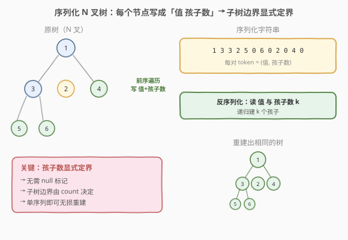
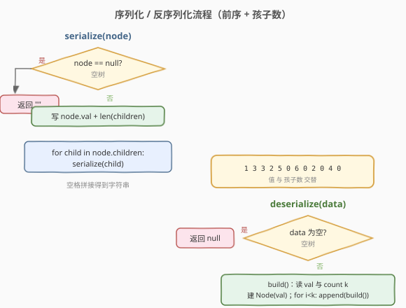
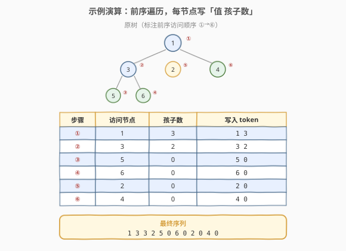

# LeetCode 序列化和反序列化 N 叉树 题解

## 1. 题目概述

- **标题 / 题号**：序列化和反序列化 N 叉树（#428，hard）
- **链接**：https://leetcode.cn/problems/serialize-and-deserialize-n-ary-tree/
- **难度**：困难
- **标签**：树、N 叉树、深度优先搜索、设计

**题意**：设计一个算法来序列化与反序列化一棵 **N 叉树**。序列化是把一棵树转为**字符串**，反序列化是从该字符串**重建**出原来的树。不限制具体的序列化格式，但要求能无损往返。

N 叉树节点定义如下（每个节点有一个值和一个**变长的孩子列表**）：

```cpp
class Node {
public:
    int val;
    vector<Node*> children;
    Node() {}
    Node(int _val) : val(_val) {}
    Node(int _val, vector<Node*> _children) : val(_val), children(_children) {}
};
```

**示例 1**：

```text
输入：root = [1,null,3,2,4,null,5,6]
        1
      / | \
     3  2  4
    / \
   5   6
输出：序列化后再反序列化，应得到与原树相同的结构。
```

**示例 2**：

```text
输入：root = []
输出：[]
```

**约束**：

- 树中节点数目范围 `[0, 10^4]`
- `0 <= Node.val <= 10^4`
- 节点值互不相同

## 2. 解题思路

### 2.1 暴力思路：只存值或只存层序

如果像二叉树那样只记录前序的值序列，反序列化时**无法确定每个节点有几个孩子**——N 叉树的孩子数量不固定（不再是恒定的「左、右」两个），结构信息丢失得更彻底。即使照搬 297 题的 `null` 标记，也无法表达「这一组孩子到哪里结束」。

### 2.2 核心观察：显式记录孩子数



关键：**把每个节点编码为「值 + 孩子数量」两个 token**。孩子数 `k` 显式地划定了该节点的子树边界——反序列化时读到 `k`，就明确知道接下来要递归构建 `k` 棵子树，不多不少。

这样得到的序列是**带孩子数的前序遍历**，它**唯一确定**一棵 N 叉树：

- **序列化**：前序遍历，访问节点时先写 `val`，再写 `children.size()`，然后递归每个孩子。
- **反序列化**：按前序顺序消费 token，读 `val` 建节点，读 `k`，再递归构建 `k` 个孩子挂到当前节点。

> 💡 **为什么「值 + 孩子数」能唯一确定 N 叉树？** 二叉树里每个非空节点恰好有「左、右」两个槽位，所以 297 用 `#` 标记空槽即可定界。N 叉树的孩子数是**变长**的，`#` 无法表达「第几个孩子之后结束」；而显式写一个整数 `k`，就把变长的孩子列表**长度**编码进了序列，子树边界被完全锁定。本质上是用「计数」替代了二叉树里「固定的两个槽位」。

### 2.3 算法流程图



### 2.4 示例演算

以示例 1 的树为例，前序访问顺序为 `1 → 3 → 5 → 6 → 2 → 4`：



每访问一个节点，就写出一对 `(值, 孩子数)`：

```text
访问 1（3 个孩子）→ 写 "1 3"
  访问 3（2 个孩子）→ 写 "3 2"
    访问 5（叶子）→ 写 "5 0"
    访问 6（叶子）→ 写 "6 0"
  访问 2（叶子）→ 写 "2 0"
  访问 4（叶子）→ 写 "4 0"
最终序列：1 3 3 2 5 0 6 0 2 0 4 0
```

**反序列化**：按序消费 `1 3 3 2 5 0 6 0 2 0 4 0`：

| 步骤 | 读到 | 动作 |
|------|------|------|
| 1 | 1 3 | 建节点 1，它有 3 个孩子，递归 3 次构建孩子 |
| 2 | 3 2 | 建节点 3，作为 1 的第 1 个孩子，它有 2 个孩子 |
| 3 | 5 0 | 建节点 5，作为 3 的第 1 个孩子，叶子（0 个孩子） |
| 4 | 6 0 | 建节点 6，作为 3 的第 2 个孩子，叶子 |
| 5 | 2 0 | 建节点 2，作为 1 的第 2 个孩子，叶子 |
| 6 | 4 0 | 建节点 4，作为 1 的第 3 个孩子，叶子 |

重建出与原树完全相同的结构。

## 3. 参考代码

### C++

```cpp
class Codec {
  public:
    // 序列化：前序遍历，每个节点写「值 孩子数」
    string serialize(Node* root) {
        string out;
        serializeHelper(root, out);
        return out;
    }

    // 反序列化：按序消费 token
    Node* deserialize(string data) {
        if (data.empty()) return nullptr;
        istringstream iss(data);
        return build(iss);
    }

  private:
    void serializeHelper(Node* node, string& out) {
        if (!node) return;
        out += to_string(node->val) + " " +
               to_string(node->children.size()) + " ";
        for (Node* child : node->children) {
            serializeHelper(child, out);
        }
    }

    Node* build(istringstream& iss) {
        string token;
        if (!(iss >> token)) return nullptr;
        int val = stoi(token);
        Node* node = new Node(val);
        int k;
        iss >> k;
        for (int i = 0; i < k; i++) {
            node->children.push_back(build(iss));
        }
        return node;
    }
};
```

### Python

```python
class Codec:
    def serialize(self, root: 'Node') -> str:
        if root is None:
            return ""
        parts = [str(root.val), str(len(root.children))]
        for child in root.children:
            parts.append(self.serialize(child))
        return " ".join(parts)

    def deserialize(self, data: str) -> 'Node':
        if not data:
            return None
        it = iter(data.split())

        def build() -> 'Node':
            val = int(next(it))
            k = int(next(it))
            node = Node(val)
            for _ in range(k):
                node.children.append(build())
            return node

        return build()
```

> 💡 两种语言本质相同：**一个全局读取指针 + 前序递归**。C++ 用 `istringstream` 按空格切分 token；Python 用 `iter(data.split())` + `next` 消费。序列化时孩子数 `k` 把每个子树的边界显式编码，反序列化按 `k` 精确递归，无需任何额外参数。

## 4. 复杂度分析

| 维度 | 复杂度 | 说明 |
|------|--------|------|
| 时间复杂度 | O(n) | 序列化访问每个节点一次；反序列化消费每对 token 一次，共 n 对 |
| 空间复杂度 | O(n) | 序列化字符串长度 O(n)；递归栈 O(h)，最坏退化为「链状」（每节点 1 个孩子）O(n) |

> 💡 这里的 `n` 是节点数。每个节点恰好贡献 2 个 token（值 + 孩子数），所以序列长度为 `2n`，仍是 O(n)。空树序列化为空串，反序列化时直接返回 `null`。

## 5. 扩展：哨兵标记法（呼应 297）

除了「值 + 孩子数」，还可以用**哨兵标记**划分孩子列表的结束，更贴近 297 的 `#` 思路：

- **序列化**：写 `val`，然后递归序列化每个孩子，最后写一个哨兵 `#` 表示「该节点的孩子列表到此结束」。
- **反序列化**：读 `val` 建节点，随后不断递归构建孩子，直到读到 `#` 才返回。

对示例树，哨兵法序列为：

```text
1 3 5 # 6 # # 2 # 4 # #
```

其中每个 `#` 收尾一个节点的孩子列表（叶子节点紧跟一个 `#`）。

```python
class Codec:
    def serialize(self, root: 'Node') -> str:
        if root is None:
            return "#"
        parts = [str(root.val)]
        for child in root.children:
            parts.append(self.serialize(child))
        parts.append("#")
        return " ".join(parts)

    def deserialize(self, data: str) -> 'Node':
        it = iter(data.split())

        def build() -> Optional['Node']:
            token = next(it)
            if token == "#":
                return None
            node = Node(int(token))
            while True:
                child = build()
                if child is None:
                    break
                node.children.append(child)
            return node

        first = next(it)
        if first == "#":
            return None
        # 回退：把首个 token 重新塞回，复用 build
        node = Node(int(first))
        while True:
            child = build()
            if child is None:
                break
            node.children.append(child)
        return node
```

> 💡 **两种格式对比**：「值 + 孩子数」用**计数**定界，token 数 `2n`，反序列化用 `for` 循环按 `k` 精确递归；哨兵法用**结束标记**定界，token 数 `2n+1`（多一个根的收尾 `#`），反序列化用 `while` 循环直到 `#`。两者都是 O(n)，面试推荐「值 + 孩子数」——代码更简洁、无需特判根节点的空树情况。

## 6. 面试要点

1. **N 叉树序列化和二叉树（297）的核心区别是什么？**
   - 二叉树每个节点有**固定**的左右两个槽位，用 `#` 标记空槽就能定界；N 叉树孩子数**变长**，单靠 `#` 无法表达「孩子列表何时结束」。解决方案有两种：显式写**孩子数 `k`**（计数定界），或在孩子列表末尾加**哨兵 `#`**（结束标记定界）。

2. **为什么「值 + 孩子数」不需要像 297 那样记录 null？**
   - 二叉树必须显式记录空孩子，是因为左右槽位的存在性需要被编码（否则无法区分「左空右非空」等结构）。N 叉树里，孩子数 `k=0` 就等价于「没有孩子」，`k` 本身已经完整表达了孩子列表的长度，不存在「空槽位」的概念，因此无需 null 标记。

3. **反序列化时怎么知道一个子树在哪里结束？**
   - 不需要显式判断。读到 `val` 和 `k` 后，递归调用 `build()` 恰好 `k` 次，这 `k` 次调用各自消费掉自己子树的所有 token。调用结束后，当前节点的孩子列表自然填满，控制权返回上层。子树的边界**隐含在 `k` 与递归结构中**，由 token 流的顺序自动确定。

4. **空树怎么处理？**
   - 序列化时 `root == null` 返回空串；反序列化时若 `data` 为空则返回 `null`。注意不要把空串和「值为 0 的单节点树」混淆——后者序列化为 `"0 0"`（值为 0、0 个孩子），是非空字符串。

5. **序列化格式必须用空格分隔吗？**
   - 不必。任何能区分 token 的格式都行（逗号、JSON、定长二进制编码等）。面试中字符串格式最常见；可进一步讨论更紧凑的二进制编码（值用定长 int，孩子数用变长编码压缩小 `k`）。

## 同类练习题

| # | 题目 | 与本题的关联 |
|---|------|-------------|
| 297 | [二叉树的序列化与反序列化](https://leetcode.cn/problems/serialize-and-deserialize-binary-tree/)（[题解](../0201-0300/297_二叉树的序列化与反序列化.md)） | 二叉树版，用 `#` 标记固定左右空槽；本题是其变长孩子列表的泛化 |
| 449 | [序列化和反序列化 BST](https://leetcode.cn/problems/serialize-and-deserialize-bst/) | 利用 BST 中序有序性质可压缩空位标记 |
| 430 | [扁平化多级双向链表](https://leetcode.cn/problems/flatten-a-multilevel-doubly-linked-tree/)（[题解](430_扁平化多级双向链表.md)） | 同样处理「变长子结构」的多级树形数据 |
| 105 | [从前序与中序遍历序列构造二叉树](https://leetcode.cn/problems/construct-binary-tree-from-preorder-and-inorder-traversal/)（[题解](../0101-0200/105_从前序与中序遍历序列构造二叉树.md)） | 单序列定界 vs 双遍历重建的对比 |
