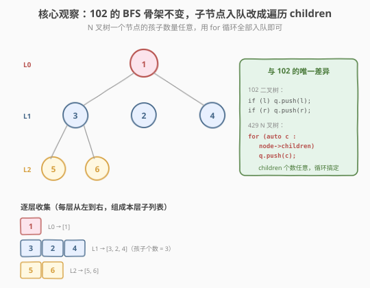
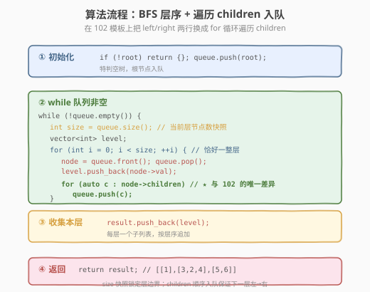
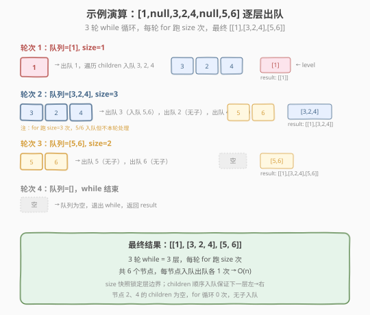

# LeetCode N 叉树的层序遍历 题解

## 1. 题目概述

- **标题 / 题号**：N 叉树的层序遍历（#429，medium）
- **链接**：https://leetcode.cn/problems/n-ary-tree-level-order-traversal/
- **难度**：中等
- **标签**：树、N 叉树、广度优先搜索（BFS）

**题意**：给定一个 **N 叉树**的根节点 `root`，返回其节点值的**层序遍历**。即从左到右，逐层遍历，把同一层的节点值组成一个子列表，最后返回外层列表。

N 叉树的节点定义：每个节点有一个值 `val` 和一个**孩子列表** `children`（孩子个数任意，0 个到 N 个），不再像二叉树那样固定 `left`/`right` 两个指针。

```cpp
class Node {
public:
    int val;
    vector<Node*> children;   // 孩子列表，个数任意
    Node() {}
    Node(int _val) : val(_val) {}
    Node(int _val, vector<Node*> _children) : val(_val), children(_children) {}
};
```

序列化约定：N 叉树按层序序列化，**每一组孩子之间用 `null` 分隔**。

**示例 1**：

```text
输入：root = [1,null,3,2,4,null,5,6]
            1
          / | \
         3  2  4
        / \
       5   6
输出：[[1],[3,2,4],[5,6]]
解释：第 0 层 [1]；第 1 层从左到右 [3,2,4]；第 2 层 [5,6]。
```

**示例 2**：

```text
输入：root = [1,null,2,3,4,5,null,null,6,7,null,8,null,9,10,null,null,11,null,12,null,13,null,null,14]
输出：[[1],[2,3,4,5],[6,7,8,9,10],[11,12,13,14]]
```

**约束**：

- 树的高度小于等于 `1000`
- 节点总数在范围 `[0, 10^4]` 内
- `-1000 <= Node.val <= 1000`

> 💡 这是 [102. 二叉树的层序遍历](../0101-0200/102_二叉树的层序遍历.md) 的「换皮」题——BFS 队列骨架纹丝不动，**唯一改动**是把入队那两行 `if left/right push` 换成 `for (auto c : node->children) push(c)`。二叉树是「左、右两个孩子」，N 叉树是「一个孩子列表」，本质都是「把当前节点的所有孩子依次入队」。掌握 102 的 `while + for(size)` 模板，429 就是改一行的事。

## 2. 解题思路

### 2.1 暴力思路：DFS 记录层数

用 DFS 递归，传入层数 `depth`，把节点值存入 `result[depth]`，递归遍历该节点的**所有孩子**：

```text
dfs(node, depth):
    if node == null: return
    result[depth].append(node.val)
    for child in node.children:        // 遍历所有孩子，而非 left/right
        dfs(child, depth+1)
```

DFS 能得到正确结果，但有两个问题：① 同一层节点的访问顺序不连续（先走第一个孩子的整棵子树再回来），不符合「层序」直觉；② 需要额外维护 `depth` 参数，且要动态扩展 `result` 数组。更自然的方式仍是 **BFS 队列**——它天然按层扩散，且能无缝迁移到「最短步数」类问题。

> ⚠️ DFS 方案能过本题，但面试官通常期望你直接用 BFS——因为这是「层序遍历家族」的标准解法，能复用 102 的模板，改动最小、最不易错，且便于追问「右视图」「层均值」「锯齿」等变体。

### 2.2 核心观察：BFS 队列 + 遍历 children 入队

**关键洞察**：二叉树和 N 叉树的层序遍历在「按层处理」这件事上完全一致——都是「当前层节点全部出队，同时把它们的孩子全部入队」。区别只在于**「怎么找孩子」**：

| 树类型 | 找孩子的方式 | 入队代码 |
|--------|-------------|---------|
| 二叉树（102） | 固定的 `left`、`right` 两个指针 | `if (l) q.push(l); if (r) q.push(r);` |
| N 叉树（429） | 一个 `children` 列表，个数任意 | `for (auto c : node->children) q.push(c);` |

`children` 在序列化时是按「从左到右」顺序给出的，所以**顺序遍历 `children` 入队**就天然保证了下一层的「左→右」顺序——和二叉树「先 `left` 后 `right`」完全等价。



> 💡 **为什么不区分 `children` 为空的情况？** `for (auto c : node->children)` 在 `children` 为空时循环体执行 0 次，天然跳过——无需像二叉树那样写两个 `if` 判空。叶子节点（如示例中的 2、4）的 `children` 为空，循环 0 次，无孩子入队，逻辑自洽。

### 2.3 算法流程图



**完整步骤**：

1. **特判**：`root == null` 返回空列表
2. **初始化**：队列 `queue = [root]`，结果 `result = []`
3. **while 队列非空**（与 102 完全一致）：
   - `size = queue.size()`（当前层节点数快照）
   - `level = []`
   - `for i in 0..size`：
     - `node = queue.pop_front()`
     - `level.append(node.val)`
     - **遍历 children 入队** ⭐：`for child in node.children: queue.push_back(child)`（与 102 的唯一差异）
   - `result.append(level)`
4. 返回 `result`

### 2.4 示例演算

以示例 1 的树 `[1,null,3,2,4,null,5,6]` 为例：



| 轮次 | 队列初始 | size | 出队 / 入队 | level | result |
|------|---------|------|------------|-------|--------|
| 1 | [1] | 1 | 出 1 → 入 3, 2, 4 | [1] | [[1]] |
| 2 | [3, 2, 4] | 3 | 出 3 → 入 5, 6；出 2 → ∅；出 4 → ∅ | [3, 2, 4] | [[1],[3,2,4]] |
| 3 | [5, 6] | 2 | 出 5 → ∅；出 6 → ∅ | [5, 6] | [[1],[3,2,4],[5,6]] |
| 4 | [] | — | 队列空，BFS 结束 | — | — |

最终 `result = [[1],[3,2,4],[5,6]]`。

> 💡 注意第 2 轮：队列里有 `[3, 2, 4]`，`size=3`。for 循环跑 3 次，依次出队 3、2、4。出 3 时把它的孩子 5、6 入队，但 5、6 **不会**在本轮处理——它们留到第 3 轮。这正是 `size` 快照的「层边界锁定」作用。节点 2、4 的 `children` 为空，循环 0 次，无孩子入队，逻辑自洽。

## 3. 参考代码

### C++

```cpp
// N叉树的层序遍历.cpp —— BFS 队列 + 遍历 children 入队
// 编译: g++ -O2 -std=c++17 N叉树的层序遍历.cpp -o ntree_levelorder
#include <vector>
#include <queue>
using namespace std;

class Node {
  public:
    int val;
    vector<Node*> children;
    Node() {
    }
    Node(int _val) : val(_val) {
    }
    Node(int _val, vector<Node*> _children) : val(_val), children(_children) {
    }
};

class Solution {
  public:
    vector<vector<int>> levelOrder(Node* root) {
        vector<vector<int>> result;
        if (root == nullptr)
            return result; // 特判空树

        queue<Node*> q;
        q.push(root);

        while (!q.empty()) {
            int size = q.size(); // ① 当前层节点数快照
            vector<int> level;
            for (int i = 0; i < size; ++i) { // ② 恰好处理一整层
                Node* node = q.front();
                q.pop();
                level.push_back(node->val);
                for (Node* child : node->children) { // ③ 遍历 children 入队（与 102 唯一差异）
                    if (child)
                        q.push(child);
                }
            }
            result.push_back(level); // ④ 收集本层
        }
        return result;
    }
};
```

### Python

```python
from collections import deque

class Solution:
    def levelOrder(self, root: 'Node') -> list[list[int]]:
        result = []
        if not root:
            return result

        queue = deque([root])

        while queue:
            size = len(queue)            # 当前层节点数
            level = []
            for _ in range(size):        # 恰好处理一整层
                node = queue.popleft()
                level.append(node.val)
                for child in node.children:   # 遍历 children 入队（与 102 唯一差异）
                    if child:
                        queue.append(child)
            result.append(level)

        return result
```

> 💡 **`if child:` 的意义**：LeetCode 的 N 叉树序列化约定中，`children` 列表理论上不应包含 `None`，但部分测试用例或本地构造时可能出现空指针。加一道 `if child:` 是防御性写法，几乎零开销，避免 `None` 入队后访问 `node.val` 崩溃。若确信 `children` 不含空指针，可省略该判断。

## 4. 复杂度分析

| 维度 | 复杂度 | 说明 |
|------|--------|------|
| **时间复杂度** | `O(n)` | 每个节点入队/出队 1 次 `O(n)`；遍历 `children` 的总次数等于所有「父子边」数 = `n - 1`（除根外每个节点恰好被父节点入队一次），合计 `O(n)` |
| **空间复杂度** | `O(n)` | 队列最多存一层节点（最宽层可达 `O(n)`，如根的 `children` 有 `n-1` 个）；结果列表存全部 `n` 个值 |

> ⚠️ **`children` 遍历的总开销不是 `O(n²)`**：有人担心「每个节点都遍历一次 `children`」会叠加成 `O(n²)`。实际上，所有节点的 `children` 长度之和 = 树的边数 = `n - 1`（每个非根节点恰好出现在它父节点的 `children` 列表里一次）。所以遍历 `children` 的总迭代次数是 `n - 1`，与 BFS 本身的 `O(n)` 同阶。

> ⚠️ **空间复杂度的 `O(n)` 有两部分**：① BFS 队列 `O(n)`（最宽层可达 `n-1`，这是 N 叉树比二叉树更「宽」的极端情况）；② 结果列表 `O(n)`（存所有节点值）。两者都是不可避免的开销——队列是 BFS 固有，结果是题目要求返回。

## 5. 扩展：层序遍历家族的「最小增量」改法

429 是层序遍历家族的一员，所有成员都共享 102 的 BFS 骨架，差异只在「找孩子」和「输出阶段」的一两行：

| 题目 | 输出要求 | 与 102 的差异 | 改动点 |
|------|---------|--------------|--------|
| 102 二叉树层序 | 自顶向下，每层左→右 | — | 母题 |
| 107 层序遍历 II | 自底向上，每层左→右 | 整体翻转 | 末尾 `reverse(result)` |
| 103 锯齿形层序 | 之字形，奇正偶反 | 每层方向交替 | 偶数层 `reverse(level)` |
| 199 二叉树右视图 | 每层最右节点 | 只取最右 | 每层 for 最后记录的 `node.val` |
| **429 N 叉树层序** | **N 叉树，每层左→右** | **找孩子方式不同** | **`for (c : node->children) push(c)`** |
| 637 二叉树层均值 | 每层平均值 | 求均值而非列表 | 每层 `sum/size` |

> 💡 **核心心法：遍历与输出解耦**。BFS 队列永远按「根→下层、左→右」收集，这是遍历的天然方向；N 叉树只需把「左/右两个指针」泛化为「一个孩子列表」。把「怎么找孩子」和「怎么输出」分开想，所有变体都是 102 改一两行。

**429 + 107 的结合**：若要求「N 叉树的自底向上层序」，只需在 429 的基础上末尾加一行 `result.reverse()`——找孩子的方式不变，只翻转外层顺序。

**429 + 199 的结合**：若要求「N 叉树的右视图」，每层 for 循环结束后取 `level` 的最后一个元素（或直接记录每次出队的 `node.val`，for 结束时的值即该层最右节点）。N 叉树的「最右」就是 `children` 列表的最后一个孩子不断往下走。

## 6. 面试要点

1. **429 和 102 的区别是什么？**

   - 唯一区别：**树的结构不同，找孩子的方式不同**。102 是二叉树，固定 `left`/`right` 两个指针；429 是 N 叉树，每个节点有一个 `children` 列表，个数任意。
   - 代码层面：把 102 的 `if (left) push; if (right) push;` 两行换成 `for (auto c : node->children) push(c);` 一行循环。BFS 骨架、`size` 快照、结果收集全部不变。

2. **N 叉树的 `children` 顺序如何保证层序的「左→右」？**

   - 题目序列化时 `children` 就是按从左到右的顺序给出的。我们**顺序遍历 `children` 入队**，队列里下一层的排列就天然是左→右。
   - 这和二叉树「先 `left` 后 `right`」入队完全等价——本质都是「按给定顺序入队」。

3. **`children` 为空时循环会出错吗？**

   - 不会。`for (auto c : node->children)` 在 `children` 为空时循环体执行 0 次，天然跳过。
   - 叶子节点的 `children` 为空列表，循环 0 次，无孩子入队，逻辑自洽。无需像二叉树那样写两个 `if` 判空。

4. **`size = queue.size()` 这行为什么不能省？**

   - for 循环体里会 `push` 孩子，队列长度动态变化。若不固定 `size`，for 会跨层处理，把下一层节点混入当前层。
   - `size` 是「当前层节点数快照」，锁定本层边界。这是 102/103/107/199/429 全家共享的关键技巧。

5. **遍历 `children` 会不会让时间复杂度变成 `O(n²)`？**

   - 不会。所有节点的 `children` 长度之和 = 树的边数 = `n - 1`（每个非根节点恰好被父节点入队一次）。
   - 所以遍历 `children` 的总迭代次数是 `n - 1`，与 BFS 的 `O(n)` 同阶，整体仍是 `O(n)`。

> 💡 **一句话总结**：429 是 102 层序遍历的「最小增量」变体——BFS 队列骨架纹丝不动，只把入队那两行 `if left/right` 换成 `for c : children`。核心心法是**把「找孩子」泛化**：二叉树是「左右两个指针」，N 叉树是「一个孩子列表」，本质都是「把当前节点的所有孩子依次入队」。掌握这一点，整个层序遍历家族（102/103/107/199/429）都是同一套模板加一两行调整。

## 同类练习题

| # | 题目 | 与本题的关联 |
|---|------|-------------|
| 102 | [二叉树的层序遍历](https://leetcode.cn/problems/binary-tree-level-order-traversal/)（[题解](../0101-0200/102_二叉树的层序遍历.md)） | 429 的母模板，`while + for(size)` 骨架的来源 |
| 107 | [二叉树的层序遍历 II](https://leetcode.cn/problems/binary-tree-level-order-traversal-ii/)（[题解](../0101-0200/107_二叉树的层序遍历II.md)） | 自底向上层序，末尾 `reverse(result)`，可与 429 叠加 |
| 103 | [二叉树的锯齿形层序遍历](https://leetcode.cn/problems/binary-tree-zigzag-level-order-traversal/)（[题解](../0101-0200/103_二叉树的锯齿形层序遍历.md)） | 每层方向交替，BFS 骨架共享 |
| 199 | [二叉树的右视图](https://leetcode.cn/problems/binary-tree-right-side-view/) | 每层只取最右节点，复用同一 BFS 骨架，可与 429 叠加成「N 叉树右视图」 |
| 637 | [二叉树的层平均值](https://leetcode.cn/problems/average-of-levels-in-binary-tree/) | 同一套 BFS 模板，每层求均值而非收集列表 |
