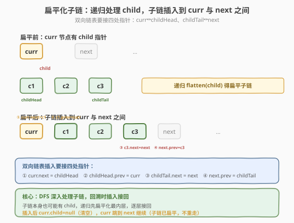
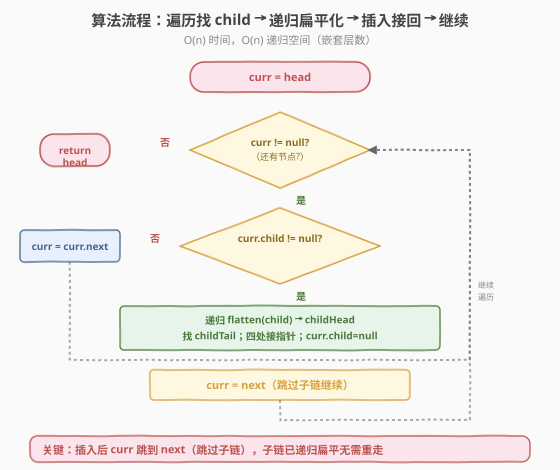
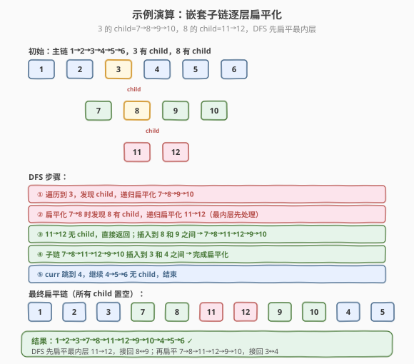

# 扁平化多级双向链表

- **题目名称**：扁平化多级双向链表
- **链接**：[430. 扁平化多级双向链表](https://leetcode.cn/problems/flatten-a-multilevel-doubly-linked-list/)
- **难度**：中等
- **标签**：链表、DFS

## 1. 题目概述

给定一个**多级双向链表**的头节点 `head`。链表中每个节点除了 `prev` 和 `next` 指针外，还可能有 **`child` 指针**，指向另一条双向链表（子链）的头节点。子链本身也可能有 `child`，形成**多级嵌套**结构。

请将链表**扁平化**：所有子链都插入到对应节点的 `next` 位置，并把 `child` 指针置空。扁平化后是一条**没有 child**的双向链表，子链整体插在父节点与其原 `next` 之间。

**示例 1**：

```text
输入：head = [1,2,3,4,5,6,null,null,null,7,8,9,10,null,null,11,12]
输出：[1,2,3,7,8,11,12,9,10,4,5,6]
解释：节点 3 的 child 指向 7→8→9→10，节点 8 的 child 又指向 11→12。
     扁平化后：3 的 next 接子链 7→8→11→12→9→10，再接回原 4。
```

**示例 2**：

```text
输入：head = [1,2,null,3]
输出：[1,3,2]
解释：节点 1 的 child 指向 3，扁平化后 1→3→2。
```

**约束条件**：

- 节点数目范围 `[0, 1000]`
- `1 <= Node.val <= 10^5`
- `Node.val` 互不相同

> 💡 这是链表与 **DFS（深度优先）** 的结合题。核心是：遍历主链时遇到 `child` 非空的节点，**递归扁平化子链**，然后把扁平化后的子链插入到当前节点和 `next` 之间，接好双向指针。本质是"遇到子链就先深入处理、再接回主链"的 DFS 思路——和二叉树的前序遍历、[114. 二叉树展开为链表](https://leetcode.cn/problems/flatten-binary-tree-to-linked-list/) 异曲同工。

---

## 2. 解题思路

### 2.1 暴力思路：用栈模拟 DFS 显式记录

可以用显式栈把所有"待处理的节点"压入，按 DFS 顺序逐个取出重新链接。能过但：

- 需要 `O(n)` 额外空间存栈。
- 逻辑分散：压栈、弹栈、重链分三步，容易出错。
- 没体现"递归天然处理嵌套"的优雅。

> ⚠️ 显式栈法是迭代版 DFS，正确但繁琐。本题的嵌套结构天生适合**递归**——每条子链的处理逻辑完全相同（遇到 child 就递归），递归版代码更简洁、思路更清晰。面试时优先写递归，迭代作为"避免栈溢出"的备选。

### 2.2 核心观察：递归扁平化 + 插入接回

**整体思路**：遍历当前链表，遇到 `child` 非空的节点 `curr`，递归扁平化它的子链，得到一条扁平子链（头 `childHead`、尾 `childTail`），然后把这条子链插入到 `curr` 和 `curr.next` 之间：



**插入操作**（设 `curr` 有 child，`next = curr.next`，子链扁平化后头 `childHead`、尾 `childTail`）：

1. `curr.next = childHead`（curr 接子链头）
2. `childHead.prev = curr`（子链头接回 curr）
3. `childTail.next = next`（子链尾接回原 next）
4. 若 `next` 非空：`next.prev = childTail`（原 next 接回子链尾）
5. `curr.child = null`（清空 child 指针）

> 💡 **双向链表要接两根指针**：单向链表只接 `next`，双向还要接 `prev`。插入子链时，子链头的 `prev` 指向 curr，子链尾的 `next` 指向原 next，原 next 的 `prev` 指向子链尾——**四处都要改**，漏一处就断链。这是双向链表题的核心难点，画图确认每个方向都接上。

### 2.3 算法流程图



**完整步骤**（递归函数 `flatten(head)` 返回扁平化后的链表头）：

1. **初始化**：`curr = head`
2. **遍历**：当 `curr` 非空：
   - 若 `curr.child` 非空：
     - `next = curr.next`（暂存原 next）
     - `childHead = flatten(curr.child)`（递归扁平化子链，返回子链头）
     - 找子链尾 `childTail`：从 `childHead` 沿 `next` 走到末尾
     - 插入：`curr.next = childHead`；`childHead.prev = curr`
     - `childTail.next = next`；若 `next` 非空 `next.prev = childTail`
     - `curr.child = null`（清空）
     - `curr = next`（跳过整个子链，继续遍历原主链）
   - 否则：`curr = curr.next`（无 child，直接前进）
3. **返回** `head`

> ⚠️ 递归扁平化子链后，必须**找到子链的尾**才能接回原 next。可以从 `childHead` 沿 `next` 走到末尾（`O(子链长度)`）。优化：让 `flatten` 同时返回**头和尾**，避免重复遍历。下面代码用单返回头 + 找尾的写法，思路直观；面试可提"返回头尾对"的优化。

### 2.4 示例演算

以示例 1 为例，主链 `1→2→3→4→5→6`，节点 3 有 child 指向 `7→8→9→10`，节点 8 有 child 指向 `11→12`：



| 步骤 | 操作 | 当前链表状态（扁平部分） |
|------|------|----------------------|
| 1 | 遍历到节点 3，发现 child | 1→2→3↘ 4→5→6（3.child=7） |
| 2 | 递归扁平化子链 `7→8→9→10` | 8 有 child，递归扁平化 `11→12` |
| 3 | 扁平化 `11→12`（无 child）返回 | 子链变 `11→12` |
| 4 | `11→12` 插入到 8 和 9 之间 | 子链变 `7→8→11→12→9→10` |
| 5 | 子链插入到 3 和 4 之间 | 1→2→3→7→8→11→12→9→10→4→5→6 |
| 6 | 继续 4→5→6，无 child，结束 | 最终扁平链 |

最终链表 `1→2→3→7→8→11→12→9→10→4→5→6`，与示例 1 一致。

> 💡 注意递归的**嵌套性**：扁平化 3 的 child 时，发现 8 也有 child，**先递归扁平化 8 的 child**（11→12），把它插入到 8 和 9 之间，再继续。这正是 DFS"深入到底再回溯"的特性——遇到嵌套子链就先处理最内层，逐层接回。和二叉树展开为链表的递归逻辑完全一致。

---

## 3. 参考代码

### C++

```cpp
/*
// Definition for a Node.
class Node {
  public:
    int val;
    Node* prev;
    Node* next;
    Node* child;
};
*/
class Solution {
  public:
    Node* flatten(Node* head) {
        if (head == nullptr) return nullptr;
        Node* curr = head;
        while (curr != nullptr) {
            if (curr->child != nullptr) {
                Node* next = curr->next;                  // 暂存原 next
                Node* childHead = flatten(curr->child);   // 递归扁平化子链
                // 找子链尾
                Node* childTail = childHead;
                while (childTail->next != nullptr) {
                    childTail = childTail->next;
                }
                // 插入子链：curr ↔ childHead ... childTail ↔ next
                curr->next = childHead;
                childHead->prev = curr;
                childTail->next = next;
                if (next != nullptr) next->prev = childTail;
                curr->child = nullptr;                    // 清空 child
                curr = next;                              // 跳过子链继续
            } else {
                curr = curr->next;
            }
        }
        return head;
    }
};
```

### Python

```python
"""
# Definition for a Node.
class Node:
    def __init__(self, val, prev, next, child):
        self.val = val
        self.prev = prev
        self.next = next
        self.child = child
"""
class Solution:
    def flatten(self, head: 'Optional[Node]') -> 'Optional[Node]':
        if not head:
            return None
        curr = head
        while curr:
            if curr.child:
                nxt = curr.next                         # 暂存原 next
                child_head = self.flatten(curr.child)   # 递归扁平化子链
                # 找子链尾
                child_tail = child_head
                while child_tail.next:
                    child_tail = child_tail.next
                # 插入子链：curr ↔ child_head ... child_tail ↔ nxt
                curr.next = child_head
                child_head.prev = curr
                child_tail.next = nxt
                if nxt:
                    nxt.prev = child_tail
                curr.child = None                       # 清空 child
                curr = nxt                              # 跳过子链继续
            else:
                curr = curr.next
        return head
```

> 💡 两版代码逻辑完全一致。核心是"**遇到 child 就递归扁平化、插入接回、清 child、跳过子链**"。找子链尾用沿 `next` 走的方式，简单直观。双向链表四处接指针（curr→childHead、childHead→curr、childTail→next、next→childTail）一个都不能漏，画图对照最稳妥。

---

## 4. 复杂度分析

| 维度 | 复杂度 | 说明 |
|------|--------|------|
| **时间复杂度** | `O(n)` | 每个节点被访问一次（遍历 + 找子链尾的总步数 ≤ `n`），递归处理所有子链，整体 `O(n)` |
| **空间复杂度** | `O(n)` | 递归调用栈深度，最坏等于嵌套层数 `O(n)`（链表退化为纯嵌套时） |

> ⚠️ 找子链尾的循环看似让每个节点被多次访问，但**均摊**：每个节点至多被"找尾"遍历一次（它所在的子链只被插入一次），加上主遍历一次，总访问 `O(n)`。递归深度最坏 `O(n)`（纯嵌套如 1→child 2→child 3...），但题目约束节点 ≤ 1000，不会栈溢出。

---

## 5. 扩展：迭代法与头尾同时返回优化

### 5.1 迭代法（显式栈）

递归改迭代用栈模拟：遇到 child 把"当前节点和原 next"压栈，先处理 child；child 处理完弹栈接回。代码：

```python
def flatten(self, head):
    if not head:
        return None
    dummy = Node(0, None, head, None)
    prev = dummy
    stack = [head]
    while stack:
        curr = stack.pop()
        prev.next = curr
        curr.prev = prev
        if curr.next:
            stack.append(curr.next)
        if curr.child:
            stack.append(curr.child)
            curr.child = None
        prev = curr
    dummy.next.prev = None
    return dummy.next
```

栈法按"next 先压、child 后压"（child 先弹出）实现 DFS 顺序。空间 `O(n)`，但避免递归栈溢出。

### 5.2 头尾同时返回优化

让 `flatten` 返回 `(head, tail)` 而非只返回 head，省去"沿 next 找尾"的循环：

```python
def flatten(self, head):
    if not head:
        return None, None
    curr = head
    tail = head
    while curr:
        if curr.child:
            nxt = curr.next
            child_head, child_tail = self.flatten(curr.child)
            curr.next = child_head
            child_head.prev = curr
            child_tail.next = nxt
            if nxt:
                nxt.prev = child_tail
            else:
                tail = child_tail
            curr.child = None
            curr = nxt
            if curr:
                tail = curr
        else:
            tail = curr
            curr = curr.next
    return head, tail
```

> 💡 头尾返回法把"找尾"的成本省掉，每个节点严格访问一次，时间仍 `O(n)` 但常数更优。面试时先写单返回头版（思路清晰），再提"返回头尾对"的优化，体现对效率的考量。

---

## 6. 面试要点

1. **为什么用递归？**

   - 多级链表的嵌套结构天然适合递归：每条子链的处理逻辑和主链完全相同（遍历、遇 child 递归、插入）。递归把"处理任意层嵌套"简化为"处理当前层"，代码简洁。
   - 迭代用栈也能做，但要手动维护栈和接回逻辑，繁琐易错。递归是这类嵌套结构的首选。

2. **插入子链时为什么要改四处指针？**

   - 双向链表每个节点有 `prev` 和 `next` 两根指针。子链插入到 `curr` 和 `next` 之间，要保证：`curr.next` 指子链头、子链头.prev 指 curr、子链尾.next 指 next、next.prev 指子链尾。
   - 漏掉 `prev` 方向的连接会导致反向遍历断链。双向链表题必须**两个方向都接**，画图逐个确认。

3. **插入后 `curr` 跳到哪里？为什么跳过子链？**

   - `curr = next`（原 next），跳过整个刚插入的子链。因为子链已经扁平化（递归处理过它内部的 child），无需再遍历。
   - 若 `curr` 走到子链内部，会重复处理已扁平化的节点，逻辑错乱。子链是"打包好"的整体，跳过它直接继续主链。

4. **为什么要清空 `curr.child`？**

   - 题目要求扁平化后所有 `child` 指针置空。若不清空，扁平链表里还有 child 指针，结构不合法。
   - 清空也是"标记已处理"：防止后续误判这个节点还有子链要处理。

5. **和二叉树展开为链表（114）的关系？**

   - 114 题：二叉树的每个节点有 `left`（类比 child）和 `right`（类比 next），展开成右链表。
   - 本题：多级双向链表的每个节点有 `child` 和 `next`，扁平化成单级双向链表。
   - 两者本质相同——**遇到 child/left 就递归处理、插入接回**，都是 DFS 遍历加指针重连。掌握一题另一题秒杀。

> 💡 **一句话总结**：430 是链表与 DFS 的结合题——遍历主链，遇 `child` 非空就**递归扁平化子链**，把扁平子链（头+尾）插入到 curr 与 next 之间，接好**四处双向指针**（curr↔childHead、childTail↔next），清 child 后跳过子链继续。`O(n)` 时间、`O(n)` 递归空间。核心是"**遇到子链先深入处理再接回**"的 DFS 思路，和二叉树展开为链表异曲同工，是嵌套结构扁平化的通用模板。

---

## 7. 同类练习题

- [114. 二叉树展开为链表](https://leetcode.cn/problems/flatten-binary-tree-to-linked-list/)（[题解](../../week9/day5/二叉树展开为链表.md)）：树的 right 展开，本题的"树版"，同 DFS 思路
- [138. 复制带随机指针的链表](https://leetcode.cn/problems/copy-list-with-random-pointer/)（[题解](../../week5/day4/复制带随机指针的链表.md)）：链表 + 多指针，哈希/拼接拆分
- [146. LRU 缓存](https://leetcode.cn/problems/lru-cache/)（[题解](../../week6/day3/LRU缓存.md)）：双向链表 + 哈希，双向指针操作综合题
- [92. 反转链表 II](https://leetcode.cn/problems/reverse-linked-list-ii/)（[题解](../day4/反转链表 II.md)）：链表区间指针操作，头插法重连
- [426. 将二叉搜索树转化为排序的双向链表](https://leetcode.cn/problems/convert-binary-search-tree-to-sorted-doubly-linked-list/)：树转双向链表，中序 + 指针重连
