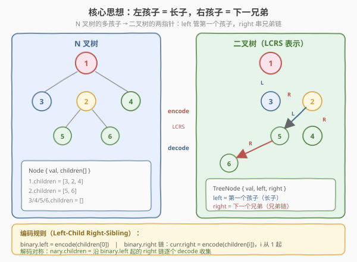
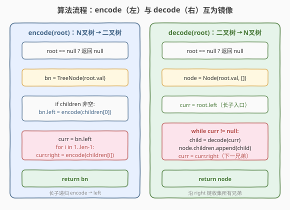

# 将N叉树编码为二叉树

- **题目名称**：将 N 叉树编码为二叉树
- **链接**：[431. Encode N-ary Tree to Binary Tree](https://leetcode.cn/problems/encode-n-ary-tree-to-binary-tree/)
- **难度**：困难
- **标签**：树、设计、DFS

## 1. 题目概述

设计一个编码算法，将一棵 **N 叉树**编码成一棵**二叉树**；再设计对应的解码算法，把这棵二叉树还原成原来的 N 叉树。要求 `decode(encode(root))` 与原树**结构完全一致**。

- **N 叉树节点**：`val` + `children`（子节点列表，长度任意）
- **二叉树节点**：`val` + `left` + `right`（最多两个子节点）

题目不限制编码方式，只要求**可逆**——即编码无损、解码还原。

**示例 1**：

```text
输入 N 叉树：
        1
      / | \
     3  2  4
       / \
      5   6

编码为二叉树（一种可行方案）：
        1
       /
      3
       \
        2
       /  \
      5    4
       \
        6

对该二叉树 decode 后得到的 N 叉树与输入完全相同。
```

**示例 2**：

```text
输入 N 叉树：root = [1,null,2,3,4,5,null,null,6,7,null,8,null,9,10,null,null,11,null,12,null,13,null,null,14]
编码再解码后应得到同一棵树。
```

**约束条件**：

- 节点总数 `[0, 10^4]`
- `0 <= Node.val <= 10^5`
- 节点值互不相同
- 树高不超过 `1000`

> 💡 这是一道**设计题**，核心是找一种 N 叉树与二叉树之间的**双射**（一一对应且可逆）。经典解法是 **左孩子右兄弟表示法（Left-Child Right-Sibling, LCRS）**——把「多孩子」用「长子 + 兄弟链」表达，一个 `left` 管第一个孩子，一个 `right` 串后续兄弟，两个指针恰好覆盖任意多孩子。这是数据结构教材里的经典技巧，面试中也常作为「N 叉树 ↔ 二叉树」转换的标准答案。

---

## 2. 解题思路

### 2.1 暴力思路：序列化为字符串再重建

一种朴素做法：把 N 叉树**前序序列化**成字符串（类似 [297. 二叉树的序列化与反序列化](https://leetcode.cn/problems/serialize-and-deserialize-binary-tree/)，只是每层记录孩子数量），再把字符串**反序列化成二叉树**结构（比如按前序建一棵退化的右链）。能过但：

- 需要 `O(n)` 额外空间存字符串。
- 两步转换（序列化 + 建树）绕了一圈，没有直接利用「二叉树恰好两指针」的结构优势。
- 解码时还要再反序列化一次，常数大、易错。

> ⚠️ 序列化法能保证可逆，但没体现「N 叉树多孩子」与「二叉树两指针」之间的天然映射。最优解是**直接重连指针**，让二叉树的 `left`/`right` 各司其职——一个管长子、一个管兄弟，一步到位。

### 2.2 核心观察：左孩子右兄弟表示（LCRS）

N 叉树每个节点有任意多个孩子，二叉树每个节点只有两个指针。关键在于：**一个指针管「向下」（长子），另一个指针管「向右」（兄弟）**，两个维度就能表达任意多个孩子。



**编码规则**（`encode`，N 叉 → 二叉）：

- `binary.left = encode(children[0])`：**第一个孩子**（长子）挂在二叉树的 **left**。
- **后续孩子**沿 right 链串接：`curr = binary.left`，遍历 `children[1..]`，逐个 `curr.right = encode(children[i])`。

**解码规则**（`decode`，二叉 → N 叉），与编码**完全对称**：

- `nary.children` 收集：从 `binary.left` 出发，**沿 right 链**逐个 `decode` 后加入列表。

> 💡 **为什么这样可逆？** N 叉树里「孩子」是横向列表 `children[0..k]`，LCRS 把它拆成「纵向长子（left）+ 横向兄弟链（right）」——长子是入口，兄弟链是展开。解码时沿 `left` 进入长子、沿 `right` 收集所有兄弟，恰好还原原列表。这种「一拆两维」的双射在森林转二叉树、表达式树转二叉树中都通用。

### 2.3 算法流程图



**`encode(root)` 完整步骤**（返回二叉树根）：

1. **特判**：`root == null` 返回 `null`
2. **建节点**：`bn = TreeNode(root.val)`
3. **长子**：若 `root.children` 非空，`bn.left = encode(children[0])`
4. **兄弟链**：`curr = bn.left`，遍历 `i` 从 1 到 `len-1`：`curr.right = encode(children[i])`，`curr = curr.right`
5. **返回** `bn`

**`decode(root)` 完整步骤**（返回 N 叉树根），与 encode 对称：

1. **特判**：`root == null` 返回 `null`
2. **建节点**：`node = Node(root.val, [])`
3. **收集孩子**：`curr = root.left`（长子入口），`while curr != null`：`node.children.append(decode(curr))`，`curr = curr.right`（下一兄弟）
4. **返回** `node`

> ⚠️ encode 的步骤 4 是**关键**：兄弟链要沿 right 逐个串接，不是一次性挂载。每个 `encode(children[i])` 返回的是一棵子二叉树，它的根挂在 `curr.right`，然后 `curr` 前进到这个新节点，继续串下一个。这和「链表尾插」同理。

### 2.4 示例演算

以示例 1 为例，N 叉树根 `1`，`children=[3, 2, 4]`，节点 `2` 的 `children=[5, 6]`，其余为叶子：


| 步骤 | 调用 | 操作 | 二叉树状态（相关部分） |
|------|------|------|----------------------|
| 1 | `encode(1)` | 建 `bn(1)`，长子 `bn(1).left = encode(3)` | `1 → left → 3` |
| 2 | `encode(3)` | `3` 无孩子，`bn(3).left = null`，返回 `bn(3)` | `1.left=3`，`3.left=null` |
| 3 | 回到 `encode(1)` | `curr=bn(3)`，串兄弟 `curr.right = encode(2)` | `1.left=3.right=2` |
| 4 | `encode(2)` | 建 `bn(2)`，长子 `bn(2).left = encode(5)` | `2.left=5` |
| 5 | `encode(5)` | `5` 无孩子，返回 `bn(5)` | `2.left=5`，`5.left=null` |
| 6 | 回到 `encode(2)` | `curr=bn(5)`，串兄弟 `curr.right = encode(6)` | `2.left=5.right=6` |
| 7 | `encode(6)` | `6` 无孩子，返回 `bn(6)` | `5.right=6` |
| 8 | 回到 `encode(1)` | `curr=bn(2)`，串兄弟 `curr.right = encode(4)` | `3.right=2.right=4` |
| 9 | `encode(4)` | `4` 无孩子，返回 `bn(4)` | `2.right=4` |

最终二叉树：`1.left=3`，`3.right=2`，`2.left=5`，`5.right=6`，`2.right=4`。与示例 1 一致。

**解码验证**（`decode`，对称还原）：

- `decode(1)`：`curr=1.left=3` → `decode(3)` 入列；`curr=3.right=2` → `decode(2)` 入列；`curr=2.right=4` → `decode(4)` 入列 → `1.children=[3,2,4]` ✓
- `decode(2)`：`curr=2.left=5` → `decode(5)` 入列；`curr=5.right=6` → `decode(6)` 入列 → `2.children=[5,6]` ✓

> 💡 注意 `decode(2)` 在还原 `2` 的孩子时，`2.right=4` **不被当作孩子**——因为 `decode` 只从 `root.left` 进入收集，`2.right` 属于 `1` 的兄弟链，由 `decode(1)` 的循环处理。这正是 LCRS 的精妙之处：**同一棵二叉树里，一个节点的 `right` 在「作为某人的长子」时是兄弟链，在「作为某人的兄弟」时由父层的循环遍历**——角色由调用层级决定，结构本身自洽。

---

## 3. 参考代码

### C++

```cpp
class Node {
  public:
    int val;
    vector<Node*> children;
    Node() {}
    Node(int _val) : val(_val) {}
    Node(int _val, vector<Node*> _children) : val(_val), children(move(_children)) {}
};

class TreeNode {
  public:
    int val;
    TreeNode* left;
    TreeNode* right;
    TreeNode(int x) : val(x), left(nullptr), right(nullptr) {}
};

class Codec {
  public:
    // N 叉树 → 二叉树（LCRS：left=长子，right=兄弟链）
    TreeNode* encode(Node* root) {
        if (!root) return nullptr;
        TreeNode* bn = new TreeNode(root.val);
        if (!root->children.empty()) {
            bn->left = encode(root->children[0]);        // 长子挂 left
            TreeNode* curr = bn->left;
            for (int i = 1; i < (int)root->children.size(); ++i) {
                curr->right = encode(root->children[i]); // 后续孩子串 right 链
                curr = curr->right;
            }
        }
        return bn;
    }

    // 二叉树 → N 叉树（沿 left 进入长子，沿 right 收集兄弟）
    Node* decode(TreeNode* root) {
        if (!root) return nullptr;
        Node* node = new Node(root->val);
        TreeNode* curr = root->left;                     // 长子入口
        while (curr) {
            node->children.push_back(decode(curr));      // 递归解码每个兄弟
            curr = curr->right;                          // 下一兄弟
        }
        return node;
    }
};
```

### Python

```python
class Node:
    def __init__(self, val=None, children=None):
        self.val = val
        self.children = children if children is not None else []

class TreeNode:
    def __init__(self, x):
        self.val = x
        self.left = None
        self.right = None

class Codec:
    def encode(self, root: 'Optional[Node]') -> 'Optional[TreeNode]':
        if not root:
            return None
        bn = TreeNode(root.val)
        if root.children:
            bn.left = self.encode(root.children[0])     # 长子挂 left
            curr = bn.left
            for i in range(1, len(root.children)):
                curr.right = self.encode(root.children[i])  # 后续孩子串 right 链
                curr = curr.right
        return bn

    def decode(self, root: 'Optional[TreeNode]') -> 'Optional[Node]':
        if not root:
            return None
        node = Node(root.val, [])
        curr = root.left                                 # 长子入口
        while curr:
            node.children.append(self.decode(curr))     # 递归解码每个兄弟
            curr = curr.right                            # 下一兄弟
        return node
```

> 💡 两版代码逻辑完全一致。`encode` 用递归处理长子，循环串接兄弟；`decode` 用循环遍历兄弟链，递归处理每个孩子。两者互为镜像：**递归的地方一个用循环、循环的地方一个用递归**——encode「长子递归 + 兄弟循环」，decode「兄弟循环 + 孩子递归」，对称且优雅。

---

## 4. 复杂度分析

| 维度 | 复杂度 | 说明 |
|------|--------|------|
| **时间复杂度** | `O(n)` | encode/decode 各访问每个节点一次，递归 + 循环总工作量 `O(n)` |
| **空间复杂度** | `O(h)` | 递归栈深度 = 树高 `h`；encode 最坏 `O(n)`（退化链），decode 同理 |

> ⚠️ encode 的兄弟链循环看似嵌在递归里，但**所有循环次数总和 = 所有非长子孩子数 = n − 1**（每个节点除了根，要么是某人的长子走递归、要么是兄弟走循环），加上根的一次，总访问严格 `O(n)`。decode 的 while 循环同理：所有 `curr.right` 推进次数总和 = 所有兄弟链长度总和 ≤ `n`。

---

## 5. 扩展：LCRS 的应用与变体

### 5.1 森林转二叉树

LCRS 天然支持**森林**（多棵树的集合）转二叉树：把各棵树的根视为「兄弟」，第一棵树的根作为二叉树根，其余树的根沿 right 链串接。即 `forest = [T1, T2, ...]` 编码为 `bn(T1)`，`bn(T1).right = bn(T2)`，依此类推。解码时 `decode(bn)` 沿 right 链收集每棵树即可。这是数据结构教材里「森林 ↔ 二叉树」转换的标准定理。

### 5.2 表达式树转二叉树

多叉表达式树（如 `+(a, b, c)` 三参数加法）可用 LCRS 转成二叉树：`+` 的长子是 `a`，`a` 的兄弟是 `b`，`b` 的兄弟是 `c`。编译原理里有时用这种表示简化代码生成。

### 5.3 其他编码方案

LCRS 不是唯一解。另一种思路是**层序编号法**：给 N 叉树每个节点编号，二叉树节点存编号 + 用 left/right 指向编号区间，类似[线段树](https://leetcode.cn/problems/range-sum-query-mutable/)。但 LCRS 最简洁——**不改 val、不引入额外信息、纯指针重连**，是面试首选。

> 💡 LCRS 的本质是「降维」：把「一个节点 k 个孩子」的**一维列表**，拆成「长子向下 + 兄弟向右」的**二维指针**。这种「降维映射」思想在数据结构里反复出现——[114. 二叉树展开为链表](https://leetcode.cn/problems/flatten-binary-tree-to-linked-list/) 把树降维成链表、[297. 序列化](https://leetcode.cn/problems/serialize-and-deserialize-binary-tree/) 把树降维成串，都是同源思想。

---

## 6. 面试要点

1. **为什么 LCRS 是可逆的？**

   - N 叉树的 `children` 是横向列表，LCRS 把它拆成「纵向长子（left）+ 横向兄弟链（right）」：长子是入口，兄弟链是展开。
   - 解码时从 `left` 进入长子、沿 `right` 收集所有兄弟，恰好还原原列表。这是一一对应的双射，严格可逆。

2. **encode 时兄弟链为什么不能用递归一次性挂载？**

   - 兄弟链是**横向**的（多个孩子同级），递归是**纵向**的（深入子树）。一个节点的 `right` 只能挂一个兄弟，多个兄弟必须逐个串接。
   - 正确做法：`curr = bn.left`，循环 `curr.right = encode(children[i])`，`curr = curr.right`。若误写成 `bn.right = encode(children[1..])` 会丢失后续兄弟或结构错乱。

3. **decode 时 `root.right` 为什么不被当前节点处理？**

   - `decode` 只从 `root.left` 进入收集孩子。`root.right` 属于**父层的兄弟链**，由调用 `decode(root)` 的那个循环处理（父层 `while curr` 里 `curr` 会走到 `root`）。
   - 即「兄弟关系」由父层管，「父子关系」由本层管，职责分明，不会重复或遗漏。

4. **LCRS 和二叉树展开为链表（114）有什么关系？**

   - 114 把二叉树按前序展成右链，相当于「去掉 left、全部挪到 right」。
   - LCRS 则是「多孩子挪到 left+right 两维」。两者都是**降维重连指针**，但 114 是一维（纯 right），LCRS 是二维（left+right）。

5. **如果 N 叉树的孩子顺序不固定呢？**

   - LCRS 的可逆性**依赖 `children` 列表的顺序**：encode 按列表顺序串兄弟链，decode 按链顺序还原列表。若原树 `children` 无序，还原后顺序可能不同，但树结构（父子关系）一致。
   - 面试中可提：若要求严格保序，需约定 `children` 顺序；若只要求结构等价（无序），LCRS 依然成立。

> 💡 **一句话总结**：431 的标准解是 **LCRS（左孩子右兄弟）**——`encode` 把 N 叉树每个节点的第一个孩子挂 `left`、后续孩子沿 `right` 串成兄弟链；`decode` 对称地沿 `left` 进入长子、沿 `right` 收集兄弟。两操作互为镜像，`O(n)` 时间、`O(h)` 空间，纯指针重连无损可逆。这是「多叉↔二叉」转换的通用模板，也体现了「降维映射」的数据结构设计思想。

---

## 7. 同类练习题

- [297. 二叉树的序列化与反序列化](https://leetcode.cn/problems/serialize-and-deserialize-binary-tree/)（[题解](../0201-0300/297_二叉树的序列化与反序列化.md)）：树↔字符串的双射，同属「无损可逆编码」家族
- [114. 二叉树展开为链表](https://leetcode.cn/problems/flatten-binary-tree-to-linked-list/)（[题解](../0101-0200/114_二叉树展开为链表.md)）：树降维成右链，与 LCRS 的「降维重连指针」同源
- [428. 序列化和反序列化 N 叉树](https://leetcode.cn/problems/serialize-and-deserialize-n-ary-tree/)：N 叉树的序列化，可结合 LCRS 先转二叉树再序列化
- [430. 扁平化多级双向链表](https://leetcode.cn/problems/flatten-a-multilevel-doubly-linked-list/)（[题解](../0401-0500/430_扁平化多级双向链表.md)）：嵌套结构扁平化，同属「多级→单级」指针重连
- [559. N 叉树的最大深度](https://leetcode.cn/problems/maximum-depth-of-n-ary-tree/)（[题解](../0501-0600/559_N叉树的最大深度.md)）：N 叉树基础操作，理解 `children` 列表遍历
