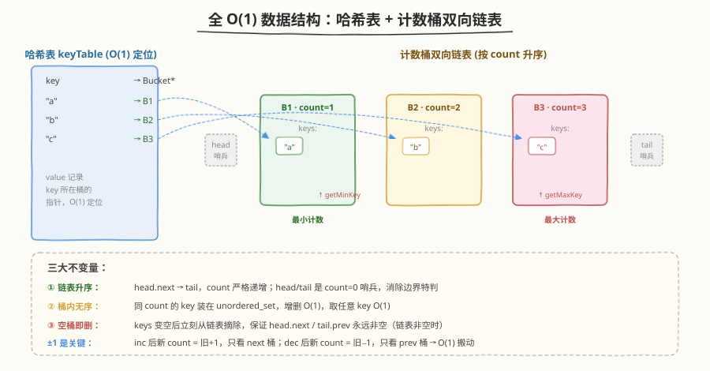
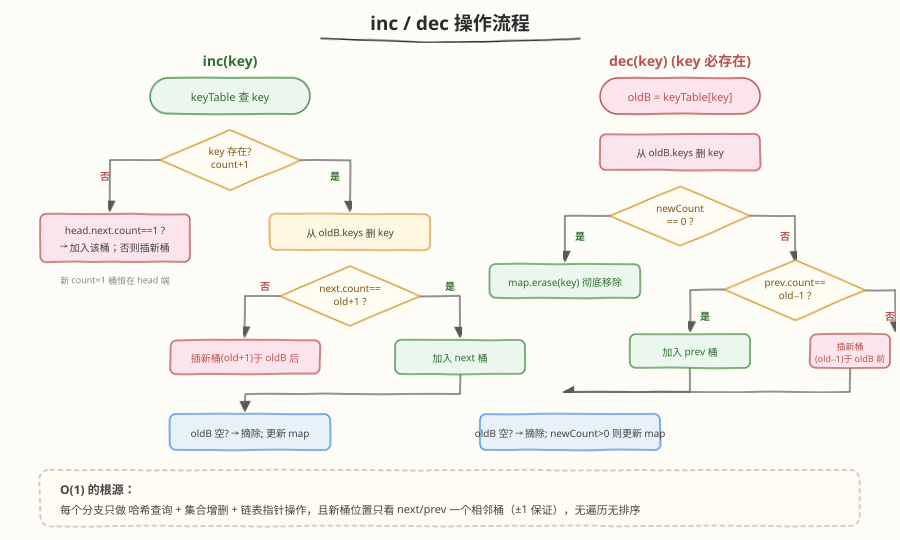
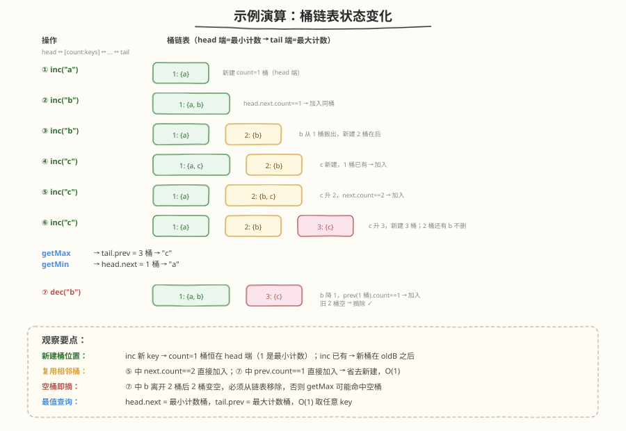

# LeetCode 全 O(1) 的数据结构 题解

## 1. 题目概述

- **标题 / 题号**：全 O(1) 的数据结构（#432，hard）
- **链接**：https://leetcode.cn/problems/all-oone-data-structure/
- **难度**：困难
- **标签**：设计、哈希表、双向链表

**题意**：请你设计一个用于存储字符串计数的数据结构，支持以下四种操作，每种操作**平均时间复杂度为 `O(1)`**：

- `inc(String key)`：若 `key` 不在数据结构中，插入它并将计数置为 `1`；若已存在，则将其计数 `+1`
- `dec(String key)`：若 `key` 存在，则将其计数 `-1`；若计数降到 `0`，则从数据结构中移除该 `key`。**保证调用 `dec` 时 `key` 一定存在**
- `getMaxKey()`：返回当前计数最大的任意一个 `key`；若数据结构为空，返回空字符串 `""`
- `getMinKey()`：返回当前计数最小的任意一个 `key`；若数据结构为空，返回空字符串 `""`

**示例 1**：

```text
输入：
AllOne allOne = new AllOne();
allOne.inc("hello");     // hello: 1
allOne.inc("hello");     // hello: 2
allOne.getMaxKey();      // 返回 "hello"
allOne.getMinKey();      // 返回 "hello"
allOne.inc("leet");      // leet: 1, hello: 2
allOne.getMaxKey();      // 返回 "hello"
allOne.getMinKey();      // 返回 "leet"
```

**示例 2**：

```text
输入：
AllOne allOne = new AllOne();
allOne.inc("a");         // a: 1
allOne.inc("b");         // b: 1
allOne.inc("b");         // b: 2
allOne.inc("c");         // c: 1
allOne.inc("c");         // c: 2
allOne.inc("c");         // c: 3
allOne.getMaxKey();      // 返回 "c"
allOne.getMinKey();      // 返回 "a"
allOne.dec("b");         // b: 1
allOne.getMinKey();      // 返回 "a" 或 "b"（均为 1）
```

**约束**：

- `1 <= key.length <= 10`
- `key` 仅由小写英文字母组成
- `inc` / `dec` / `getMaxKey` / `getMinKey` 的调用总次数不超过 `5 * 10^4`

## 2. 解题思路

### 2.1 暴力思路

最直观的做法是用一个哈希表 `key → count`：

- `inc` / `dec`：哈希表 `O(1)` 修改计数，可行
- `getMaxKey` / `getMinKey`：需要遍历整个哈希表找最大 / 最小计数，`O(n)`，**不满足 `O(1)`**

为了加速最值查询，可以再维护一个按计数排序的结构（有序数组 / 平衡树 / 堆）。但每次 `inc` / `dec` 改计数后要调整该结构，调整代价至少 `O(log n)`，依然不满足 `O(1)`。

> ⚠️ 关键矛盾在于：**计数会动态变化，而最值查询要 `O(1)`**。我们需要一个能把「相同计数的 key」分组、并且「组之间按计数有序」的结构，使得改计数时只需在相邻组之间搬动 key。

### 2.2 核心观察：哈希表 + 计数桶双向链表



把「计数相同」的 key 放进同一个**桶（bucket）**，桶内装一个 `key` 集合；桶之间用**双向链表**按计数从小到大串起来。再用一张哈希表 `key → 桶节点` 实现 `O(1)` 定位。

三个数据结构分工：

| 数据结构 | 职责 | 复杂度 |
|---------|------|--------|
| 哈希表 `keyTable` | `key → node`，`O(1)` 定位 key 所在桶 | `O(1)` 查找 |
| 桶双向链表 `head ↔ ... ↔ tail` | 按计数升序串桶；`head` = 最小计数桶，`tail` = 最大计数桶 | `O(1)` 取最值 |
| 桶内 `keySet` | 同计数 key 集合，`O(1)` 增删、`O(1)` 取任意 key | `O(1)` 增删查 |

> 💡 **为什么 `inc` / `dec` 仍能 `O(1)`？** 关键在于题目只 `±1`：`inc` 后新计数 = 旧计数 `+1`，新桶要么是旧桶的**后继**，要么需要在旧桶后**新建**一个桶；`dec` 对称地看**前驱**。因此「搬 key」只需查看**相邻一个桶**，链表插入 / 删除 `O(1)`，桶内集合增删 `O(1)`。

> 💡 **与 LFU（[460](../0401-0500/460_LFU缓存.md)）的对比**：LFU 用 `freq → 链表` 的哈希表存桶 + 一个 `min_freq` 指针找最小频率（因为只需要淘汰最小，不需要最大）；本题**同时要最大和最小**，所以把桶按计数**排序串成双向链表**，`head` / `tail` 各取一个端点，是最自然的设计。二者的桶内都按访问时序排（LFU 淘汰要 LRU），而本题桶内**无序**（只需返回任意 key 即可），更简单。

### 2.3 算法流程



**`inc(key)`**：

1. **key 不在哈希表中**（新插入，计数 = 1）
   - 看 `head` 桶：若存在且 `head.count == 1` → 把 `key` 加入 `head.keySet`
   - 否则 → 新建 `count=1` 的桶，插到链表 **`head` 前**（成为新 `head`）
   - 哈希表登记 `key → 新桶`
2. **key 已存在**（计数 `+1`）
   - `oldBucket = keyTable[key]`，`oldCount = oldBucket.count`
   - 从 `oldBucket.keySet` 删 `key`
   - `newCount = oldCount + 1`，看 `oldBucket.next`：
     - 若存在且 `next.count == newCount` → 把 `key` 加入 `next.keySet`
     - 否则 → 新建 `count=newCount` 的桶，插到 **`oldBucket` 之后**
   - 若 `oldBucket.keySet` 空了 → 从链表摘除 `oldBucket`
   - 哈希表更新 `key → 新桶`

**`dec(key)`**（保证 `key` 存在）：

1. `oldBucket = keyTable[key]`，`oldCount = oldBucket.count`
2. 从 `oldBucket.keySet` 删 `key`
3. `newCount = oldCount - 1`
   - 若 `newCount == 0` → 哈希表删 `key`（彻底移除）
   - 否则看 `oldBucket.prev`：
     - 若存在且 `prev.count == newCount` → 把 `key` 加入 `prev.keySet`
     - 否则 → 新建 `count=newCount` 的桶，插到 **`oldBucket` 之前**
4. 若 `oldBucket.keySet` 空了 → 从链表摘除 `oldBucket`
5. 若 `newCount > 0` → 哈希表更新 `key → 新桶`

**`getMaxKey()`**：`tail` 桶存在 → 返回 `tail.keySet` 中任意一个 key；否则返回 `""`

**`getMinKey()`**：`head` 桶存在 → 返回 `head.keySet` 中任意一个 key；否则返回 `""`

### 2.4 示例演算

以 `inc("a") → inc("b") → inc("b") → inc("c") → inc("c") → inc("c") → dec("b")` 为例，跟踪桶链表状态：



要点：

- **新 key 的 `count=1` 桶始终在 `head` 端**（1 是最小可能计数）
- **`inc("c")` 第三次**时，`c` 从 `count=2` 桶搬到 `count=3` 桶，旧 `count=2` 桶因 `b` 已离开而空 → 被摘除，于是 `count=3` 桶成为 `tail`（最大）
- **`dec("b")`** 时 `b` 从 `count=2` 降到 `count=1`，搬到 `head` 的 `count=1` 桶（与 `a` 同桶），旧 `count=2` 桶空 → 摘除
- 摘除空桶是**必须**的，否则 `getMax` / `getMin` 可能命中空桶

## 3. 参考代码

### C++

```cpp
class AllOne {
    struct Bucket {
        int count;
        unordered_set<string> keys;
        Bucket *prev, *next;
        Bucket(int c) : count(c), prev(nullptr), next(nullptr) {}
    };

    Bucket *head, *tail;                       // head=最小计数桶, tail=最大计数桶
    unordered_map<string, Bucket*> keyTable;   // key -> 所在桶

    // 在 pivot 之后插入新桶(count=c)，返回新桶
    Bucket* insertAfter(Bucket* pivot, int c) {
        Bucket* node = new Bucket(c);
        node->prev = pivot;
        node->next = pivot->next;
        pivot->next->prev = node;
        pivot->next = node;
        return node;
    }
    // 在 pivot 之前插入新桶(count=c)，返回新桶
    Bucket* insertBefore(Bucket* pivot, int c) {
        Bucket* node = new Bucket(c);
        node->next = pivot;
        node->prev = pivot->prev;
        pivot->prev->next = node;
        pivot->prev = node;
        return node;
    }
    void removeBucket(Bucket* b) {
        b->prev->next = b->next;
        b->next->prev = b->prev;
        delete b;
    }

  public:
    AllOne() {
        head = new Bucket(0);                  // 哨兵头(最小端)
        tail = new Bucket(0);                  // 哨兵尾(最大端)
        head->next = tail;
        tail->prev = head;
    }

    void inc(string key) {
        auto it = keyTable.find(key);
        if (it == keyTable.end()) {
            // 新 key，count=1
            Bucket* first = head->next;
            if (first != tail && first->count == 1) {
                first->keys.insert(key);
                keyTable[key] = first;
            } else {
                Bucket* b = insertAfter(head, 1);
                b->keys.insert(key);
                keyTable[key] = b;
            }
        } else {
            Bucket* oldB = it->second;
            int newCount = oldB->count + 1;
            Bucket* nxt = oldB->next;
            oldB->keys.erase(key);
            if (nxt != tail && nxt->count == newCount) {
                nxt->keys.insert(key);
                keyTable[key] = nxt;
            } else {
                Bucket* b = insertAfter(oldB, newCount);
                b->keys.insert(key);
                keyTable[key] = b;
            }
            if (oldB->keys.empty()) removeBucket(oldB);
        }
    }

    void dec(string key) {
        auto it = keyTable.find(key);
        if (it == keyTable.end()) return;
        Bucket* oldB = it->second;
        int newCount = oldB->count - 1;
        oldB->keys.erase(key);
        if (newCount == 0) {
            keyTable.erase(key);
        } else {
            Bucket* prv = oldB->prev;
            if (prv != head && prv->count == newCount) {
                prv->keys.insert(key);
                keyTable[key] = prv;
            } else {
                Bucket* b = insertBefore(oldB, newCount);
                b->keys.insert(key);
                keyTable[key] = b;
            }
        }
        if (oldB->keys.empty()) removeBucket(oldB);
    }

    string getMaxKey() {
        if (tail->prev == head) return "";
        return *tail->prev->keys.begin();
    }

    string getMinKey() {
        if (head->next == tail) return "";
        return *head->next->keys.begin();
    }
};
```

### Python

```python
class Node:
    __slots__ = ("count", "keys", "prev", "next")
    def __init__(self, count: int):
        self.count = count
        self.keys = set()
        self.prev = None
        self.next = None


class AllOne:
    def __init__(self):
        self.head = Node(0)          # 哨兵头(最小端)
        self.tail = Node(0)          # 哨兵尾(最大端)
        self.head.next = self.tail
        self.tail.prev = self.head
        self.key_table = {}          # key -> Node

    def _insert_after(self, pivot: Node, count: int) -> Node:
        node = Node(count)
        node.prev = pivot
        node.next = pivot.next
        pivot.next.prev = node
        pivot.next = node
        return node

    def _remove(self, node: Node) -> None:
        node.prev.next = node.next
        node.next.prev = node.prev

    def inc(self, key: str) -> None:
        node = self.key_table.get(key)
        if node is None:
            first = self.head.next
            if first is not self.tail and first.count == 1:
                first.keys.add(key)
                self.key_table[key] = first
            else:
                new_node = self._insert_after(self.head, 1)
                new_node.keys.add(key)
                self.key_table[key] = new_node
        else:
            new_count = node.count + 1
            nxt = node.next
            node.keys.discard(key)
            if nxt is not self.tail and nxt.count == new_count:
                nxt.keys.add(key)
                self.key_table[key] = nxt
            else:
                new_node = self._insert_after(node, new_count)
                new_node.keys.add(key)
                self.key_table[key] = new_node
            if not node.keys:
                self._remove(node)

    def dec(self, key: str) -> None:
        node = self.key_table.get(key)
        if node is None:
            return
        new_count = node.count - 1
        node.keys.discard(key)
        if new_count == 0:
            del self.key_table[key]
        else:
            prv = node.prev
            if prv is not self.head and prv.count == new_count:
                prv.keys.add(key)
                self.key_table[key] = prv
            else:
                new_node = self._insert_after(prv, new_count)
                new_node.keys.add(key)
                self.key_table[key] = new_node
        if not node.keys:
            self._remove(node)

    def getMaxKey(self) -> str:
        if self.tail.prev is self.head:
            return ""
        return next(iter(self.tail.prev.keys))

    def getMinKey(self) -> str:
        if self.head.next is self.tail:
            return ""
        return next(iter(self.head.next.keys))
```

## 4. 复杂度分析

| 维度 | 复杂度 | 说明 |
|------|--------|------|
| 时间复杂度 | `O(1)` | `inc`/`dec` 仅哈希表查询 + 桶内集合增删 + 链表指针操作，全部常数时间；`getMax`/`getMin` 直接读 `tail.prev`/`head.next` |
| 空间复杂度 | `O(n)` | `n` 为不同 key 数量；哈希表 `key → 桶` 与链表桶内集合总共存 `n` 个 key，桶节点数 ≤ `n` |

## 5. 扩展：与 LFU / LRU 的设计对比

| 维度 | LRU（146） | LFU（460） | AllOne（432） |
|------|-----------|-----------|--------------|
| 维护维度 | 访问时序 | 频率 + 同频时序 | 计数 |
| 桶/链表条数 | 1 条全局链表 | 每个频率一条（哈希表索引） | 一条排序双向链表（桶按计数串） |
| 最值查询 | 无 | 仅最小（`min_freq`） | 最大 + 最小（`head`/`tail`） |
| 桶内排序 | — | LRU 时序 | 无序（任意 key 即可） |
| `±1` 假设 | 无频率 | 频率只 `+1` | 计数只 `±1` |
| 复杂度 | `O(1)` | `O(1)` | `O(1)` |

> ⚠️ **若 `inc` / `dec` 允许 `±k`（而非 `±1`）**：新计数桶不再是旧桶的相邻位置，需要在链表中查找正确插入点，`O(桶数)` 退化。此时需改用**跳表**或**平衡树**维护桶顺序，单次 `O(log n)`。本题之所以能 `O(1)`，正是利用了 `±1` 的约束。

## 6. 面试要点

1. **为什么用双向链表串桶，而不是像 LFU 那样用 `freq → 链表` 哈希表？**

   - 本题**同时**要 `getMaxKey` 和 `getMinKey`。哈希表索引的桶无法 `O(1)` 取最大频率桶（除非再维护 `max_freq`，但 `max_freq` 的维护比 `min_freq` 更难：`dec` 可能拆掉最大桶，新最大频率未知）。把桶按计数**排序串成双向链表**后，`head`/`tail` 天然就是最小 / 最大计数桶，`O(1)` 取最值，且 `±1` 的搬动只需看相邻桶。

2. **为什么要及时摘除空桶？**

   - 若不摘除，空桶会留在链表中。后续 `getMax`/`getMin` 可能命中空桶（如 `tail.prev` 是空桶），返回错误结果；且空桶堆积会让链表变长、影响常数。`oldBucket.keys.empty()` 后立即 `removeBucket` 是正确性 + 性能的双重保证。

3. **`inc` 时如何保证新桶插入位置正确？**

   - `inc` 已有 key 时，新计数 = 旧 `+1`。旧桶的 `next` 要么是 `count=旧+1` 的桶（直接加入），要么更大或不存在（在旧桶后**紧挨着**插一个新桶，`count=旧+1`，仍保持升序）。因为新 `count` 严格大于旧桶、严格小于 `next.count`（若 `next` 存在且 `next.count != 新count`），所以插在旧桶之后必然有序。`dec` 对称：新 `count = 旧-1`，插在旧桶之前。

4. **哨兵节点 `head` / `tail` 的作用？**

   - 消除边界特判。没有哨兵的话，插入新桶到链表头 / 尾、判断链表是否为空都要写额外分支。引入 `count=0` 的 `head`/`tail` 哨兵后，`head.next == tail` 即空，插入 / 删除永远是统一的指针操作。

5. **桶内为什么用 `unordered_set` 而不是 `list`？**

   - `dec` / `inc` 搬 key 时需要 `O(1)` 从旧桶删 key，`unordered_set` 的 `erase` 是 `O(1)`；`getMax`/`getMin` 只需任意一个 key，`*keys.begin()` / `next(iter(keys))` `O(1)`。若用 `list`，删指定 key 需 `O(桶内元素数)`。题目不要求同计数 key 有顺序，`set` 最合适。

## 同类练习题

| # | 题目 | 与本题的关联 |
|---|------|-------------|
| 460 | [LFU 缓存](https://leetcode.cn/problems/lfu-cache/)（[题解](../0401-0500/460_LFU缓存.md)） | 姐妹题，频率桶 + 哈希表，桶内还要 LRU，只取最小频率 |
| 146 | [LRU 缓存](https://leetcode.cn/problems/lru-cache/)（[题解](../0101-0200/146_LRU缓存.md)) | 哈希 + 双向链表的入门设计题，建议先做 |
| 380 | [O(1) 时间插入、删除和获取随机元素](https://leetcode.cn/problems/insert-delete-getrandom-o1/) | 哈希表 + 动态数组的另一类 `O(1)` 设计套路 |
| 295 | [数据流的中位数](https://leetcode.cn/problems/find-median-from-data-stream/)（[题解](../0201-0300/295_数据流的中位数.md)） | 双堆维护中位数，`O(log n)` 设计题对照 |
