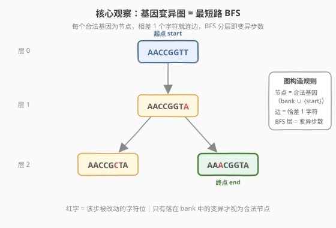
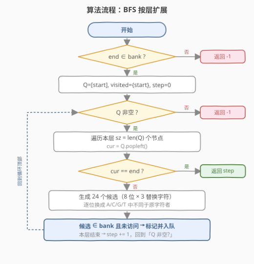
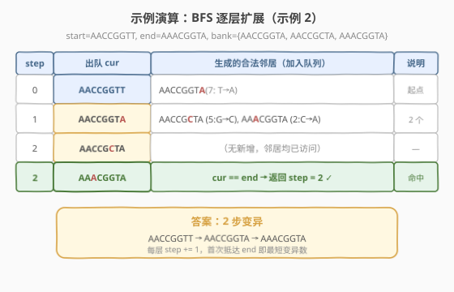

# LeetCode 最小基因变化 题解

## 1. 题目概述

- **标题 / 题号**：最小基因变化（#433，medium）
- **链接**：https://leetcode.cn/problems/minimum-genetic-mutation/
- **难度**：中等
- **标签**：图、BFS、最短路、哈希

**题意**：基因序列用长度为 `8` 的字符串表示，字符取自集合 `{'A', 'C', 'G', 'T'}`。一次**变异**指将序列中**某一个字符**替换为集合中的另一个字符，且变异后的序列必须出现在**基因库 `bank`** 中才算合法。

给定起始序列 `start`、目标序列 `end` 和基因库 `bank`，求从 `start` 变异到 `end` 的**最少变异次数**；若无法变异到 `end`，返回 `-1`。

> ⚠️ **注意两点**：`start` 视为合法（**不一定在 `bank` 中**）；`end` **必须**在 `bank` 中，否则一定无解返回 `-1`。

**示例 1**：

```text
输入：start = "AACCGGTT", end = "AACCGGTA", bank = ["AACCGGTA"]
输出：1
解释：AACCGGTT → AACCGGTA，最后一位 T→A，1 步即达。
```

**示例 2**：

```text
输入：start = "AACCGGTT", end = "AAACGGTA", bank = ["AACCGGTA","AACCGCTA","AAACGGTA"]
输出：2
解释：AACCGGTT → AACCGGTA → AAACGGTA，共 2 步。
```

**示例 3**：

```text
输入：start = "AACCGGTT", end = "AACCGGTT", bank = []
输出：0（注：题目约束保证 start != end，此为退化情况）
```

**约束**：

- `0 <= bank.length <= 10`
- `start.length == end.length == bank[i].length == 8`
- `start`、`end`、`bank[i]` 仅由 `['A', 'C', 'G', 'T']` 组成
- `start != end`

## 2. 解题思路

### 2.1 暴力思路

把每条**合法基因**（`bank` 中的序列，外加 `start`）看成图节点。如果两个序列**恰好相差一个字符**，就在它们之间连一条无向边。于是问题等价于：在无权无向图中求 `start` 到 `end` 的最短路（边数最少）。

"暴力"体现在**建图方式**：对每个节点，扫描整个 `bank`，逐一判断 Hamming 距离是否为 `1` 来连边。每节点建边 `O(N)`，建完图再跑 BFS。`bank ≤ 10` 时这完全可行，但写起来啰嗦，且当 `bank` 变大（如词接龙 `wordList` 上千）时 `O(N²)` 建图会拖慢。

### 2.2 核心观察：BFS + 就地生成候选邻居



> 💡 **关键转换**：与其"对每两个序列比 Hamming 距离"建图，不如**从当前序列就地生成所有可能的一步变异**——长度 `8`、字母表 `4`，每位可换成另外 `3` 个字符，共 `8 × 3 = 24` 个候选。再判断每个候选**是否落在 `bank`** 中，落中者即合法邻居。

这样做有三个好处：

1. **邻居生成与 `bank` 大小无关**：每节点固定生成 `24` 个候选，复杂度 `O(L·|Σ|)` 而非 `O(N)`，`bank` 再大也不影响单点扩展开销。
2. **天然契合 BFS**：BFS 出队一个节点时即时生成其邻居、即时入队，无需显式预建图。
3. **`bank` 退化为哈希集合**：把 `bank` 转成 `unordered_set`，候选"是否合法"查询 `O(1)`，充当**变异闸门**——只有落在 `bank` 里的候选才被放行。

BFS 在无权图中**首次抵达终点即最短路**：按层扩展，`step` 记录当前层数，出队节点 `cur == end` 时直接返回 `step`。

### 2.3 算法流程图



**阶段一：前置校验**

1. 将 `bank` 转为哈希集合 `bankSet`；若 `end ∉ bankSet`，直接返回 `-1`。

**阶段二：BFS 按层扩展**

2. 队列 `Q = [start]`，访问集 `visited = {start}`，步数 `step = 0`。
3. 当 `Q` 非空，重复：
   - 取当前层规模 `sz = len(Q)`，逐个出队 `cur`：
     - 若 `cur == end`，返回 `step`。
     - 否则对 `cur` 的每个位置 `p`（共 `8` 个），尝试换成 `A/C/G/T` 中**不同于原字符**的 `3` 个字符，得到候选 `nxt`：
       - 若 `nxt ∈ bankSet` 且 `nxt ∉ visited`：标记访问并入队 `Q`。
   - 本层处理完毕后 `step += 1`。
4. 队列耗尽仍未抵达 `end`，返回 `-1`。

> ⚠️ **按层扩展的写法**：用 `for _ in range(len(Q))` 把"当前层"一次性消费完再 `step += 1`，是 BFS 数最短路边数的标准模板。若改成"每个节点自带距离"也能做，但分层写法更简洁且不易错。

### 2.4 示例演算



以示例 2 为例，`start = "AACCGGTT"`，`end = "AAACGGTA"`，`bank = {AACCGGTA, AACCGCTA, AAACGGTA}`：

| step | 出队 `cur` | 生成的合法邻居（加入队列） | 说明 |
|------|------------|------------------------------|------|
| 0 | `AACCGGTT` | `AACCGGTA`（第 7 位 T→A） | 起点层 |
| 1 | `AACCGGTA` | `AACCGCTA`（第 5 位 G→C）、`AAACGGTA`（第 2 位 C→A） | 2 个邻居入队 |
| 2 | `AACCGCTA` | （无新增，邻居均已访问） | 继续出队 |
| 2 | `AAACGGTA` | — | `cur == end` → 返回 `step = 2` ✓ |

最终答案 `2`，变异链：`AACCGGTT → AACCGGTA → AAACGGTA`。注意第 2 层先出队 `AACCGCTA`（非终点，且其邻居 `AACCGGTA` 已访问），再出队 `AAACGGTA` 命中终点——`step` 仍为 `2`，因为它们同属一层。

## 3. 参考代码

### C++

```cpp
class Solution {
public:
    int minMutation(string start, string end, vector<string>& bank) {
        unordered_set<string> bankSet(bank.begin(), bank.end());
        if (!bankSet.count(end)) return -1;          // 终点必须在 bank 中

        const string bases = "ACGT";
        unordered_set<string> visited;
        queue<string> q;
        q.push(start);
        visited.insert(start);
        int step = 0;

        while (!q.empty()) {
            int sz = q.size();                        // 当前层节点数
            for (int i = 0; i < sz; i++) {
                string cur = q.front(); q.pop();
                if (cur == end) return step;          // 首次抵达即最短
                string nxt = cur;
                for (int p = 0; p < (int)cur.size(); p++) {
                    char origin = nxt[p];
                    for (char c : bases) {
                        if (c == origin) continue;
                        nxt[p] = c;                   // 改第 p 位
                        if (bankSet.count(nxt) && !visited.count(nxt)) {
                            visited.insert(nxt);
                            q.push(nxt);
                        }
                    }
                    nxt[p] = origin;                  // 复位，供下一位使用
                }
            }
            step++;                                   // 本层结束，进入下一层
        }
        return -1;
    }
};
```

### Python

```python
class Solution:
    def minMutation(self, start: str, end: str, bank: List[str]) -> int:
        bank_set = set(bank)
        if end not in bank_set:
            return -1

        bases = "ACGT"
        visited = {start}
        q = collections.deque([start])
        step = 0

        while q:
            for _ in range(len(q)):                   # 消费当前层
                cur = q.popleft()
                if cur == end:
                    return step
                for p in range(len(cur)):
                    for c in bases:
                        if c == cur[p]:
                            continue
                        nxt = cur[:p] + c + cur[p + 1:]
                        if nxt in bank_set and nxt not in visited:
                            visited.add(nxt)
                            q.append(nxt)
            step += 1
        return -1
```

## 4. 复杂度分析

| 维度 | 复杂度 | 说明 |
|------|--------|------|
| 时间复杂度 | `O(N · L · |Σ|)` | 最多访问 `N+1` 个节点（`N = bank.size`）；每节点生成 `L·(|Σ|-1) = 8×3 = 24` 个候选，每个候选切片/哈希查表 `O(L)`。`L=8`、`|Σ|=4` 均为常数，实际等价 `O(N)`，`N≤10` 时几乎瞬时 |
| 空间复杂度 | `O(N)` | `bankSet`、`visited`、队列 `Q` 各存不超过 `N+1` 个长度为 `8` 的字符串 |

> 💡 **与"扫描 bank 建图"对比**：若改为对每节点遍历 `bank` 判 Hamming 距离 `1`，单点扩展 `O(N·L)`，总 `O(N²·L)`。`N≤10` 时两者都行；但当 `bank` 规模上升（如 [127. 词接龙](https://leetcode.cn/problems/word-ladder/) 的 `wordList` 可达 5000）时，"就地生成 `L·|Σ|` 候选 + 哈希查表"的 `O(N·L·|Σ|)` 明显优于 `O(N²·L)`，是更通用的写法。

## 5. 扩展：双向 BFS 与 bank-scan 变体

- **bank-scan 变体**：把邻居生成换成"遍历 `bank`，对每个序列算与 `cur` 的字符差异数，恰为 `1` 即邻居"。`bank` 极小时代码更短、无需切片字符串，但 `bank` 变大即退化。两者逻辑等价，按场景择优。
- **双向 BFS**：当搜索空间变大（`bank` 上千、或字母表/序列更长如词接龙），从 `start` 和 `end` **同时**扩展，每次扩展较小的一端，相遇即返回。可将复杂度从 `O(b^d)` 降到 `O(b^(d/2))`，`b` 为分支因子、`d` 为答案步数。本题 `bank ≤ 10` 无必要，但掌握此优化对词接龙类大空间题很关键。
- **状态空间搜索视角**：把每个序列视为"状态"，一次变异即"状态转移"，`bank` 是合法状态集。这与 [752. 打开转盘锁](https://leetcode.cn/problems/open-the-lock/)（4 位数字状态）、[773. 滑动谜题](https://leetcode.cn/problems/sliding-puzzle/)（棋盘状态编码为字符串）同属"状态图 BFS 最短路"家族。

## 6. 面试要点

1. **为什么用 BFS 而不是 DFS？**

   - 无权图最短路必用 BFS：按层扩展，首次抵达终点即最短边数。DFS 找到的路径未必最短，且需枚举所有路径取最小，复杂度指数级。

2. **邻居生成有哪两种方式？各自何时更优？**

   - ① 就地生成：枚举 `L` 个位置 × `(|Σ|-1)` 个替换字符，查 `bankSet`。单点 `O(L·|Σ|)`，与 `bank` 大小无关，`bank` 大时优。
   - ② 扫描 `bank`：逐个算 Hamming 距离是否为 `1`。单点 `O(N·L)`，`bank` 极小时代码更短。本题 `N≤10` 两者皆可，面试讲清 trade-off 即可。

3. **为什么要 `visited` 去重？不去重会怎样？**

   - BFS 中每个节点首次入队即对应最短层；若重复入队会导致同一节点被多次扩展、队列膨胀甚至死循环（存在环时）。`visited` 保证每节点只处理一次，是 BFS 正确性与效率的基石。

4. **`end` 不在 `bank` 为什么直接返回 `-1`？**

   - 题目要求每次变异结果都必须在 `bank` 中。`end` 是最终变异结果，若不在 `bank` 则永远无法合法抵达，无解。这一前置校验能避免无意义的 BFS。

5. **本题与 [127. 词接龙](https://leetcode.cn/problems/word-ladder/) 几乎同构，差异在哪？**

   - 算法完全相同：序列/单词为节点，一步变换为边，`bank`/`wordList` 为合法集，BFS 求最短路。差异仅在规模——基因长度固定 `8`、字母表 `4`（候选 `24`/节点）；词接龙单词可更长、字母表 `26`，搜索空间大得多，因此双向 BFS 在词接龙中更常考。

## 同类练习题

| # | 题目 | 与本题的关联 |
|---|------|-------------|
| 127 | [词接龙](https://leetcode.cn/problems/word-ladder/) | 本题的"原型"，把基因换成单词、`bank` 换成 `wordList`，完全同构的 BFS 最短路；规模更大，双向 BFS 优化更值得练 |
| 752 | [打开转盘锁](https://leetcode.cn/problems/open-the-lock/) | 4 位数字状态图 BFS，每位拨动 `±1` 生成候选，与本题"就地生成邻居 + 哈希查重"同模板，含死锁表对应 `bank` 闸门 |
| 773 | [滑动谜题](https://leetcode.cn/problems/sliding-puzzle/) | 把棋盘状态编码为字符串节点，BFS 求最少移动步数，状态空间搜索进阶 |
| 994 | [腐烂的橘子](https://leetcode.cn/problems/rotting-oranges/) | 多源 BFS 按层扩展、`step` 计数，与本题"分层 + `step+1`"同构（本题单源，该题多源） |
