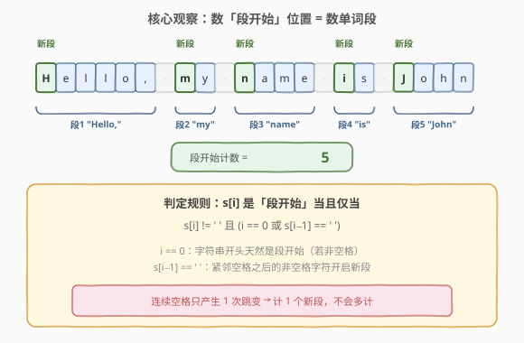
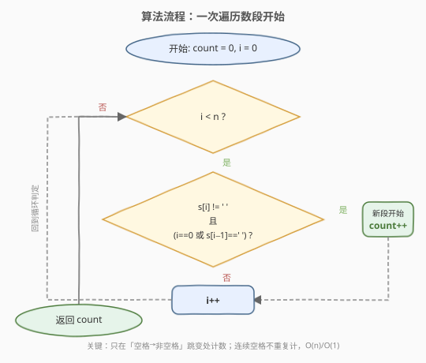
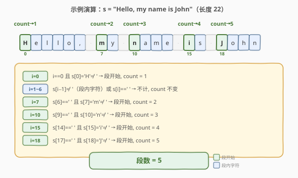

# 字符串中的单词数

- **题目名称**：字符串中的单词数
- **链接**：[434. 字符串中的单词数](https://leetcode.cn/problems/number-of-segments-in-a-string/)
- **难度**：简单
- **标签**：字符串

## 1. 题目概述

给你一个字符串 `s`，请你返回并统计 `s` 中**单词段**的数目。

**单词段**定义为：字符串中**连续的非空格字符组成的最大子串**（一个或多个空格分隔的连续非空格字符序列）。

**示例 1**：

```text
输入：s = "Hello, my name is John"
输出：5
解释：共有 5 个单词段："Hello,"、"my"、"name"、"is"、"John"。
```

**示例 2**：

```text
输入：s = "Hello"
输出：1
```

**示例 3**：

```text
输入：s = "   Hello,   my   name  is John   "
输出：5
解释：前导/尾随/连续空格不影响段数，仍为 5 段。
```

**约束条件**：

- `0 <= s.length <= 300`
- `s` 仅由大小写英文字母、数字和空格 `' '` 组成
- `s` 中至少存在一个非空格字符

> 💡 本题的陷阱在于：字符串可能含**前导空格、尾随空格、连续多个空格**。若逐字模拟「遇空格就断段」，会被连续空格误导而多计。关键观察是：**一个新段只在「空格 → 非空格」的跳变处开始**——只需数这种跳变次数，即可一次遍历 $O(1)$ 空间求解。

---

## 2. 解题思路

### 2.1 暴力思路

最直觉的做法是「按空格切分字符串，数切出来的非空片段数」：

- **Python**：`len(s.split())`，`split()` 无参时会自动合并连续空格、去除首尾空格，直接得到单词列表，取长度即答案。
- **C++**：用 `istringstream >> word` 逐词读取，每读到一个 `word` 计数加一；或手动按空格切分存入 `vector` 再数大小。

这种写法正确且简洁，但会**创建中间字符串列表**，空间复杂度为 $O(n)$（存储所有单词）。对于本题数据量（$n \le 300$）完全可行，但若面试追问「能否 $O(1)$ 空间」，需要更优解法。

### 2.2 核心观察：数「段开始」位置



一个单词段总是在某个**特定位置**开始：该位置是非空格字符，且它的前一个字符是空格（或它就是字符串首字符）。形式化地，位置 $i$ 是「段开始」当且仅当：

$$s[i] \neq \text{'\ '} \quad \text{且} \quad \big(i = 0 \;\text{或}\; s[i-1] = \text{'\ '}\big)$$

**数所有满足该条件的位置数，即为段数。** 这样做的好处是：

1. **一次遍历**：从左到右扫一遍，无需回头。
2. **$O(1)$ 空间**：只需一个计数器和一个索引。
3. **天然处理连续空格**：连续多个空格中，只有第一个空格之后的非空格字符才是「段开始」；其余空格的后续字符若仍是空格，不满足 $s[i] \neq \text{'\ '}$，不会计数。前导空格同理——首个非空格字符之前都是空格，只有它本身触发一次计数。

> 💡 关键直觉：**段数 = 「空格 → 非空格」跳变次数**（把字符串首部视为一个虚拟空格）。这与「数上升沿」的信号检测思路完全一致——只在跳变瞬间计数，电平保持期间不计数。

**时间复杂度**：$O(n)$（遍历整个字符串一次）；**空间复杂度**：$O(1)$（仅用索引 `i` 和计数 `count`）。

### 2.3 算法流程图



流程为一个主循环：每轮先判定 `i < n`，再判定当前位置是否为「段开始」——是则 `count++`，无论是否计数都执行 `i++` 推进。循环结束后返回 `count`。

### 2.4 示例演算



以 `s = "Hello, my name is John"`（长度 22）为例，只列出关键步：

- **i = 0**：`i == 0` 且 `s[0] = 'H' ≠ ' '` → 段开始，`count = 1`。
- **i = 1~6**：`s[i−1] ≠ ' '`（段内字符）或 `s[i] == ' '` → 不计，`count` 不变。
- **i = 7**：`s[6] == ' '` 且 `s[7] = 'm' ≠ ' '` → 段开始，`count = 2`。
- **i = 10**：`s[9] == ' '` 且 `s[10] = 'n' ≠ ' '` → 段开始，`count = 3`。
- **i = 15**：`s[14] == ' '` 且 `s[15] = 'i' ≠ ' '` → 段开始，`count = 4`。
- **i = 18**：`s[17] == ' '` 且 `s[18] = 'J' ≠ ' '` → 段开始，`count = 5`。
- **i = 22**：`i >= n`，循环结束，**返回 `count = 5`**。

> 💡 注意：i = 1~6 中虽然 `i = 6` 是空格，但它**不触发计数**（`s[6] == ' '` 不满足段开始条件）。这正是「只在跳变处计数」的体现——空格本身从不计数，只有其后的首个非空格字符才计数。

---

## 3. 参考代码

### C++（一次遍历数段开始）

```cpp
class Solution {
  public:
    int countSegments(string s) {
        int count = 0;
        for (int i = 0; i < s.size(); i++) {
            if (s[i] != ' ' && (i == 0 || s[i - 1] == ' ')) {
                count++;
            }
        }
        return count;
    }
};
```

### Python（一次遍历数段开始）

```python
class Solution:
    def countSegments(self, s: str) -> int:
        count = 0
        for i, ch in enumerate(s):
            if ch != ' ' and (i == 0 or s[i - 1] == ' '):
                count += 1
        return count
```

### Python（API 一行流，对比用）

```python
class Solution:
    def countSegments(self, s: str) -> int:
        return len(s.split())
```

> ⚠️ **两种写法的对比**：`split()` 写法简洁且不易出错，适合工程脚本；但一次遍历数段开始是面试中期望的「原地 $O(1)$ 空间」解法，能展示对字符串边界和状态跳变的精确控制。面试时建议先写一次遍历解法，再提及 `split()` 作为对照。

---

## 4. 复杂度分析

| 维度 | 复杂度 | 说明 |
|------|--------|------|
| 时间复杂度 | $O(n)$ | 遍历整个字符串一次，每个字符只访问一次 |
| 空间复杂度 | $O(1)$ | 仅使用索引 `i` 和计数 `count` 两个变量，原地扫描 |

> 与 `split()` 写法的对比：`split()` 时间同为 $O(n)$，但空间为 $O(n)$（存储单词列表）；一次遍历数段开始空间为 $O(1)$，无需任何中间容器。

---

## 5. 扩展：其他实现方式

### 5.1 前驱字符状态机

另一种等价写法是维护一个「前一个字符是否为空格」的布尔状态，避免索引 `i-1` 的越界特判：

```cpp
class Solution {
  public:
    int countSegments(string s) {
        int count = 0;
        bool prevSpace = true;            // 首部视为虚拟空格
        for (char c : s) {
            if (c != ' ' && prevSpace) {  // 空格→非空格跳变
                count++;
            }
            prevSpace = (c == ' ');
        }
        return count;
    }
};
```

> 💡 `prevSpace` 初始为 `true`，相当于在字符串首部前面「虚拟」一个空格——这样首个非空格字符天然满足跳变条件，与 `i == 0` 的特判殊途同归。状态机视角下，本题就是「数 `space → non-space` 的状态转移次数」。

### 5.2 与 58. 最后一个单词的长度 的关系

[58. 最后一个单词的长度](https://leetcode.cn/problems/length-of-last-word/)（[站内题解](../0001-0100/58_最后一个单词的长度.md)）是本题的「姊妹题」：

- **58 题**：从右向左扫描，只关心**最后一个**单词——先跳过尾随空格，再数连续非空格字符。
- **434 题**：从左向右扫描，关心**所有**单词段——数「空格 → 非空格」跳变次数。

两者都是字符串扫描题，核心都是**识别单词边界**。58 题只需定位一次边界（末尾），434 题需定位所有边界并计数。掌握 434 的跳变计数法后，可自然推广到「统计所有单词长度」「找出最长单词」等变体。

---

## 6. 面试要点

1. **为什么不用 `split()`？**

   - `split()` 功能完全正确，且能自动处理连续空格和首尾空格。但它创建了单词列表，空间 $O(n)$。面试中若只写 `split()` 可能被追问「能否 $O(1)$ 空间」，因此建议先写一次遍历数段开始的解法，再提 `split()` 作为对照。

2. **如何处理前导空格和连续空格？**

   - 判定条件 `s[i] != ' ' && (i == 0 || s[i-1] == ' ')` 天然处理：前导空格本身不满足 `s[i] != ' '` 不计数；连续空格中只有「最后一个空格后的首个非空格字符」满足跳变条件，只计一次。无需任何特判。

3. **`i == 0` 的特判能否避免？**

   - 可以。把字符串首部视为一个「虚拟空格」，用 `prevSpace = true` 初始化状态机（见 5.1），即可统一为「`c != ' ' && prevSpace`」，无需索引特判。两种写法等价，状态机版更优雅。

4. **空字符串或全空格字符串怎么办？**

   - 本题约束保证至少有一个非空格字符，故无需处理。但即便输入全空格，本算法也会返回 `0`（没有任何位置满足 `s[i] != ' '`），逻辑健壮。

5. **本题与 58 题的扫描方向为何不同？**

   - 58 题只要最后一个单词，从右向左可只触及尾部、跳过前面所有内容；434 题要数所有段，必须遍历全串，从左向右最自然。两者都利用「空格与非空格的边界」，但 58 定位单一边界、434 计数所有边界。

---

## 7. 同类练习题

- [58. 最后一个单词的长度](https://leetcode.cn/problems/length-of-last-word/)（[站内题解](../0001-0100/58_最后一个单词的长度.md)）：本题姊妹题——从右向左定位最后一个单词边界，与本题「数所有边界」对照
- [151. 反转字符串中的单词](https://leetcode.cn/problems/reverse-words-in-a-string/)：本题升级版——需识别每个单词段并反转顺序、去除多余空格，核心子操作仍是「跳过空格 → 定位单词」
- [14. 最长公共前缀](https://leetcode.cn/problems/longest-common-prefix/)（[站内题解](../0001-0100/14_最长公共前缀.md)）：字符串纵向 / 横向扫描，同属字符串基础扫描题
- [8. 字符串转换整数 (atoi)](https://leetcode.cn/problems/string-to-integer-atoi/)（[站内题解](../0001-0100/8_字符串转换整数atoi.md)）：字符串扫描 + 状态机 + 边界处理，更复杂的字符串扫描题
- [415. 字符串相加](https://leetcode.cn/problems/add-strings/)（[站内题解](../0401-0500/415_字符串相加.md)）：从右向左逐位处理字符串，同属字符串扫描家族
