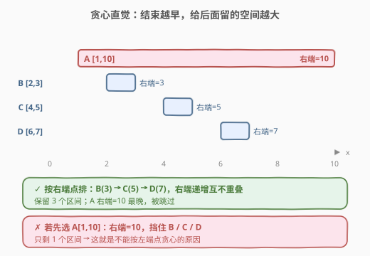

# 无重叠区间

- **题目名称**：无重叠区间
- **链接**：[435. 无重叠区间](https://leetcode.cn/problems/non-overlapping-intervals/)
- **难度**：中等
- **标签**：贪心、区间调度、排序、动态规划

## 1. 题目概述

给定一个区间集合 `intervals`，其中 `intervals[i] = [start_i, end_i]`。返回需要移除的**最少区间数**，使剩余区间**互不重叠**。

> ⚠️ 只在 `start_i < end_j` 且 `start_j < end_i` 时两区间才算重叠；**端点相触不算重叠**，即 `[1,2]` 与 `[2,3]` 视为不重叠。

**示例 1**：

```text
输入：intervals = [[1,2],[2,3],[3,4],[1,3]]
输出：1
解释：移除 [1,3] 后，剩余 [1,2],[2,3],[3,4] 互不重叠。
```

**示例 2**：

```text
输入：intervals = [[1,2],[1,2],[1,2]]
输出：2
解释：需移除两个 [1,2]，只留一个。
```

**示例 3**：

```text
输入：intervals = [[1,2],[2,3]]
输出：0
解释：两区间端点相触，本就不重叠。
```

**约束条件**：

- $1 \leq n = \text{intervals.length} \leq 10^5$
- $\text{intervals}[i].\text{length} = 2$
- $-5 \times 10^4 \leq \text{start}_i < \text{end}_i \leq 5 \times 10^4$

> 💡 「移除最少」等价于「保留最多」。把问题翻转为「选出最多互不重叠的区间」，答案就是 $n - \text{保留数}$。这正是经典的**区间调度问题**（Interval Scheduling），有 $O(n \log n)$ 的贪心最优解。

---

## 2. 解题思路

### 2.1 暴力思路

枚举每个区间「留 / 删」的子集，判断剩余是否互不重叠，取满足条件的最小删除数。共 $2^n$ 个子集，$n=10^5$ 时完全不可行。

> 💡 暴力的指数爆炸说明需要利用**贪心选择性质**——是否存在一个「先选谁一定不亏」的策略？答案是：**先结束的先选**。

### 2.2 核心观察：按「右端点」排序，结束早的先选



直觉是：每个被保留的区间都会「占用」一段右端空间，**右端点越靠左**，对后续区间的影响越小，能容纳的后续区间就越多。

- 若选了一个**结束很晚**的区间（如 `[1,10]`），它会挡住所有起始在 $1\sim 10$ 之间的区间；
- 若选一个**结束早**的区间（如 `[1,2]`），后面 `[2,3]`、`[3,4]` 都还能选。

> 💡 **关键转化**：把所有区间按**右端点升序**排序，然后从左到右扫描，只要当前区间与上一个保留区间不重叠就**保留**它并更新右边界；否则**移除**它。这样保留下来的一定是「最多的互不重叠区间」。

> ⚠️ 为什么不按左端点排序？按左端点贪心会被「长区间」骗：`[1,10]` 左端点最小，但选它会把 `[2,3]`、`[4,5]` 全挡掉。按**右端点**排序才能保证「每一步都给未来留出最大余地」。

### 2.3 算法流程图


维护状态：

- `end`：当前已保留区间的最大右端点（初始为排序后第一个区间的右端点）；
- `remove`：累计移除数（初始为 0）。

从第 2 个区间起逐个判断 `intervals[i][0] >= end` 是否成立：

- **成立**（不重叠）：保留它，`end = intervals[i][1]`；
- **不成立**（重叠）：移除它，`remove += 1`。

> 💡 注意「移除谁」：当发生重叠时，我们移除的是**当前扫描到的**区间（它的右端点 ≥ `end`）。因为 `end` 已是当前最小右端点，保留 `end` 那个、丢掉当前这个对后续最优——这正是「早结束优先」的体现。

### 2.4 示例演算

以 `intervals = [[1,2],[2,3],[3,4],[1,3]]` 为例，按右端点排序后为 `[[1,2],[2,3],[1,3],[3,4]]`：


| 步骤 | 区间 | start 与 end 比较 | 决策 | end 更新 | remove |
|------|------|-------------------|------|----------|--------|
| 0 | [1,2] | —（首个，直接保留） | 保留 | 2 | 0 |
| 1 | [2,3] | 2 >= 2 ✓ | 保留 | 3 | 0 |
| 2 | [1,3] | 1 < 3 ✗ | 移除 | 3（不变） | 1 |
| 3 | [3,4] | 3 >= 3 ✓ | 保留 | 4 | 1 |

最终 `remove = 1`，即最少移除 1 个区间 ✓。保留的 `[1,2]、[2,3]、[3,4]` 互不重叠。

---

## 3. 参考代码

### C++

```cpp
class Solution {
  public:
    int eraseOverlapIntervals(vector<vector<int>>& intervals) {
        if (intervals.empty()) return 0;
        // 按右端点升序排序
        sort(intervals.begin(), intervals.end(),
             [](const auto& a, const auto& b) { return a[1] < b[1]; });
        int end = intervals[0][1];   // 当前保留区间的右端点
        int remove = 0;
        for (int i = 1; i < intervals.size(); ++i) {
            if (intervals[i][0] >= end) {
                end = intervals[i][1];   // 不重叠，保留并推进右边界
            } else {
                ++remove;                // 重叠，移除当前区间
            }
        }
        return remove;
    }
};
```

### Python

```python
class Solution:
    def eraseOverlapIntervals(self, intervals: List[List[int]]) -> int:
        if not intervals:
            return 0
        # 按右端点升序排序
        intervals.sort(key=lambda x: x[1])
        end = intervals[0][1]      # 当前保留区间的右端点
        remove = 0
        for i in range(1, len(intervals)):
            if intervals[i][0] >= end:
                end = intervals[i][1]   # 不重叠，保留并推进右边界
            else:
                remove += 1             # 重叠，移除当前区间
        return remove
```

> ⚠️ 比较条件是 `>=` 而非 `>`：端点相触（`[1,2]` 与 `[2,3]`）视为**不重叠**，必须用 `>=` 才会保留后者。写成 `>` 会导致把合法的相触区间误判为重叠而多删。

---

## 4. 复杂度分析

| 维度 | 复杂度 | 说明 |
|------|--------|------|
| 时间复杂度 | $O(n \log n)$ | 排序主导；扫描部分为 $O(n)$ |
| 空间复杂度 | $O(\log n)$ | 排序的递归调用栈（快排）；额外仅常数变量 |

> 💡 这是该题的最优解：排序下界 $O(n \log n)$ 已无法突破，扫描线性已是下界，空间为原地排序的常数级。

---

## 5. 扩展：为什么「按右端点」贪心是正确的

用**交换论证**（Exchange Argument）证明：设排序后第一个区间为 $I_1$（右端点最小），任取一个最优解 $S$，若 $I_1 \notin S$，把 $S$ 中右端点最小的区间换成 $I_1$：

- $I_1$ 的右端点 $\le$ 被换出的区间右端点，因此 $I_1$ 不会与 $S$ 中其他任何区间产生新的重叠（结束更早只会更「安全」）；
- 替换后区间数不变，仍是最优解，且包含 $I_1$。

于是「选右端点最小的区间」一定属于某个最优解。对剩余区间（左端点 $\ge I_1$ 右端点的那些）重复该论证，即得贪心的全局最优性。

> 💡 **DP 视角**：先按左端点排序，设 $dp[i]$ 为「前 $i$ 个区间中选了第 $i$ 个时的最大保留数」，转移为 $dp[i] = \max(dp[j]) + 1$（$j$ 的右端点 $\le i$ 的左端点），可用二分优化到 $O(n \log n)$。贪心是该 DP 的「压缩版」：每步只保留当前最优，无需回看所有 $j$。

---

## 6. 面试要点

1. **为什么按右端点排序，而不是左端点？**
   - 按左端点会被「长区间」欺骗：`[1,10]` 左端点最小却挡住一切。按右端点排序保证每一步选的都是「对后续影响最小的区间」，留出最大剩余空间，这是贪心选择性质的来源。

2. **重叠时为什么移除「当前区间」而不是「上一个保留区间」？**
   - 上一个保留区间的右端点 `end` 已是当前最小，它的存在对后续最有利；当前区间右端点 $\ge$ `end`，移除它对后续的影响更小。所以「丢当前、留 end」每步都是最优选择。

3. **端点相触 `[1,2]` 与 `[2,3]` 算重叠吗？**
   - 不算。题目要求严格重叠才需移除，故判断条件用 `start >= end` 表示「不重叠」。若误用 `start > end`，会把相触的合法区间误删，导致答案偏大。

4. **这题和「合并区间 / 用箭引爆气球」的区别？**
   - [56. 合并区间](https://leetcode.cn/problems/merge-intervals/)（[题解](../0001-0100/56_合并区间.md)）：求合并后的区间集，按左端点排序后**合并相交的**；[452. 用最少数量的箭引爆气球](https://leetcode.cn/problems/minimum-number-of-arrows-to-burst-balloons/)：求最少点数覆盖所有区间，按左端点排序后**找重叠公共段**；本题求**最多互不重叠**，按右端点排序后**贪心保留**。三者同源但目标不同，排序键也不同。

5. **若区间端点可相等且相触也算重叠，代码要怎么改？**
   - 把不重叠条件从 `start >= end` 改为 `start > end` 即可（相触也判为重叠、需移除）。本质是「开 / 闭区间」约定不同。

---

## 7. 同类练习题

- [452. 用最少数量的箭引爆气球](https://leetcode.cn/problems/minimum-number-of-arrows-to-burst-balloons/)：同一区间贪心家族，按起点排序找「最大重叠公共段」，对比排序键差异
- [56. 合并区间](https://leetcode.cn/problems/merge-intervals/)（[题解](../0001-0100/56_合并区间.md)）：区间排序 + 合并的祖师题，按左端点排序
- [252. 会议室](https://leetcode.cn/problems/meeting-rooms/)：判断区间是否互不重叠，本题的判定版（去掉了「最小移除」计数）
- [253. 会议室 II](https://leetcode.cn/problems/meeting-rooms-ii/)：求同时进行的最多会议数（最小会议室），改用「最小堆 / 差分」而非贪心保留
- [1288. 删除被覆盖区间](https://leetcode.cn/problems/remove-covered-intervals/)：区间排序后判断「被完全包含」，与本题同为「排序 + 单遍扫描」套路
