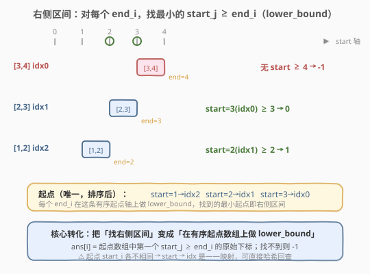
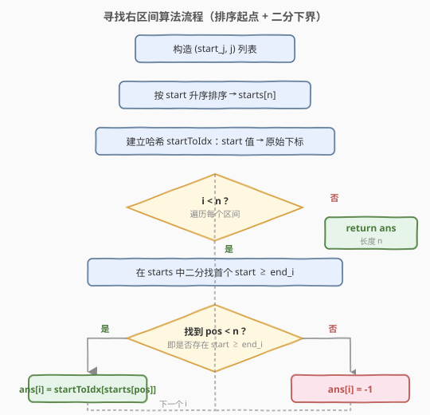
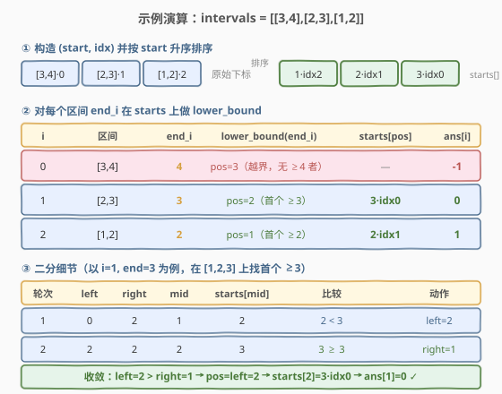

# LeetCode 寻找右区间 题解

## 1. 题目概述

- **标题 / 题号**：寻找右区间（#436，medium）
- **链接**：https://leetcode.cn/problems/find-right-interval/
- **难度**：中等
- **标签**：数组、二分查找、排序、区间

**题意**：给定一个区间数组 `intervals`，其中 `intervals[i] = [start_i, end_i]`，且每个 `start_i` **互不相同**。区间 `i` 的**右侧区间**是满足 `start_j >= end_i` 且 `start_j` **最小**的区间 `j`（注意 `i` 可能等于 `j`）。返回一个数组 `ans`，`ans[i]` 为区间 `i` 对应右侧区间的下标；若不存在则设为 `-1`。

**示例 1**：

```text
输入：intervals = [[1,2]]
输出：[-1]
解释：集合中只有一个区间，找不到任何 start_j ≥ 2。
```

**示例 2**：

```text
输入：intervals = [[3,4],[2,3],[1,2]]
输出：[-1,0,1]
解释：
  [3,4]：无 start ≥ 4 → -1
  [2,3]：start=3(idx0) 是首个 ≥ 3 的 → 0
  [1,2]：start=2(idx1) 是首个 ≥ 2 的 → 1
```

**示例 3**：

```text
输入：intervals = [[1,4],[2,3],[3,4]]
输出：[-1,2,-1]
解释：
  [1,4] 与 [3,4]：均无 start ≥ 4 → -1
  [2,3]：start=3(idx2) 是首个 ≥ 3 的 → 2
```

**约束**：

- $1 \leq n = \text{intervals.length} \leq 2 \times 10^4$
- $\text{intervals}[i].\text{length} = 2$
- $-10^6 \leq \text{start}_i \leq \text{end}_i \leq 10^6$
- 每个 `start_i` **互不相同**

> 💡 三个关键约束决定了解法形态：**起点唯一**（`start → idx` 是一一映射，可哈希回查）、**只问最小起点**（等价于「找下界」`lower_bound`）、**数据规模 $n \leq 2\times 10^4$**（允许 $O(n \log n)$ 排序 + 每个区间一次二分）。题目还特别声明 **`i` 可能等于 `j`**——当出现零长度区间 `start_i == end_i` 时，区间 `i` 的右侧区间可能是它自己，处理时无需刻意排除。

## 2. 解题思路

### 2.1 暴力思路

对每个区间 `i`，遍历所有区间 `j`，收集满足 `start_j >= end_i` 的候选，取其中 `start_j` 最小者的下标。两层循环 $O(n^2)$，$n = 2\times 10^4$ 时约 $4\times 10^8$ 次比较，超时风险高。

> 💡 暴力的浪费在于：**每个 `end_i` 都从头扫一遍起点**，没有利用「起点集合对全体 `end_i` 共享」这一结构。把所有起点**排序一次**，之后每个 `end_i` 的查询就能用二分压缩到 $O(\log n)$。

### 2.2 核心观察：排序起点 + 二分找下界



题目要的是「`start_j >= end_i` 且 `start_j` 最小」——这恰好是 **`lower_bound`** 的定义：在升序数组中找**第一个大于等于** `end_i` 的元素。于是：

1. 把所有 `(start_j, j)` 配对，按 `start_j` **升序排序**，得到有序起点数组 `starts`；
2. 建立哈希 `startToIdx`：`start` 值 → 原始下标 `j`（起点唯一，故双射）；
3. 对每个区间 `i`，在 `starts` 上对 `end_i` 做 `lower_bound`：
   - 命中（`pos < n`）：`ans[i] = startToIdx[starts[pos]]`；
   - 未命中（`pos == n`）：`ans[i] = -1`。

> ⚠️ **为何 `start` 唯一如此关键？** 若起点有重复，「最小 `start_j >= end_i`」可能对应多个下标，题目就需进一步约定（如取最左下标）。本题保证唯一，使 `start → idx` 成双射，二分定位起点后即可 $O(1)$ 哈希回查到唯一原始下标，无需额外去歧义。

> 💡 **关于 `i` 可能等于 `j`**：约束是 `start_i <= end_i`（注意非严格小于），故存在零长度区间 `start_i == end_i`。此时 `start_i >= end_i` 成立，区间 `i` 可能成为它自己的右侧区间。我们的算法对**全体起点**（含 `i` 自己）做二分，自然覆盖这一情形，无需特判排除。若题面改为 `start_i < end_i`（严格），则 `i == j` 永不可能发生。

### 2.3 算法流程图



三步走：**预处理**（配对 + 排序 + 建哈希）→ **逐区间查询**（`lower_bound`）→ **回填原始下标**。预处理一次性 $O(n \log n)$，查询共 $n$ 次二分 $O(n \log n)$，总体仍为 $O(n \log n)$。

### 2.4 示例演算

以 `intervals = [[3,4],[2,3],[1,2]]` 为例。



**预处理**：配对 `(start, idx)` 后按 `start` 升序排序，得到 `starts = [(1,idx2), (2,idx1), (3,idx0)]`，哈希 `startToIdx = {1:2, 2:1, 3:0}`。

| 步骤 | i | 区间 | end_i | lower_bound 在 starts 上 | 命中 starts[pos] | ans[i] |
|------|---|------|-------|--------------------------|------------------|--------|
| 1 | 0 | [3,4] | 4 | pos=3（越界，无 ≥4 者） | — | -1 |
| 2 | 1 | [2,3] | 3 | pos=2（首个 ≥3） | (3, idx0) | 0 |
| 3 | 2 | [1,2] | 2 | pos=1（首个 ≥2） | (2, idx1) | 1 |

最终 `ans = [-1, 0, 1]` ✓。

**二分细节**（以 `i=1, end=3` 为例，在起点值序列 `[1,2,3]` 上找首个 `≥3`）：

| 轮次 | left | right | mid | starts[mid] | 比较 | 动作 |
|------|------|-------|-----|-------------|------|------|
| 1 | 0 | 2 | 1 | 2 | 2 < 3 | left = mid+1 = 2 |
| 2 | 2 | 2 | 2 | 3 | 3 ≥ 3 | right = mid-1 = 1 |
| 收敛 | 2 | 1 | — | — | left > right，结束 | pos = left = 2 |

`pos=2 < n=3`，命中 `starts[2]=(3, idx0)`，`ans[1] = startToIdx[3] = 0` ✓。

## 3. 参考代码

### C++

```cpp
class Solution {
  public:
    vector<int> findRightInterval(vector<vector<int>>& intervals) {
        int n = intervals.size();
        // 配对 (start, idx) 并按 start 升序排序
        vector<pair<int, int>> starts(n);
        for (int i = 0; i < n; ++i) {
            starts[i] = {intervals[i][0], i};
        }
        sort(starts.begin(), starts.end());

        // 起点 -> 原始下标（起点唯一，双射）
        unordered_map<int, int> startToIdx;
        for (auto& [s, idx] : starts) {
            startToIdx[s] = idx;
        }

        vector<int> ans(n, -1);
        for (int i = 0; i < n; ++i) {
            int endi = intervals[i][1];
            // lower_bound：首个 start >= endi
            int left = 0, right = n - 1, pos = n;
            while (left <= right) {
                int mid = left + (right - left) / 2;
                if (starts[mid].first >= endi) {
                    pos = mid;          // 记为候选，继续往左找更早的
                    right = mid - 1;
                } else {
                    left = mid + 1;     // mid 偏小，去右半
                }
            }
            if (pos < n) {
                ans[i] = startToIdx[starts[pos].first];
            } // else 保持 -1
        }
        return ans;
    }
};
```

### Python

```python
class Solution:
    def findRightInterval(self, intervals: List[List[int]]) -> List[int]:
        n = len(intervals)
        # 配对 (start, idx) 并按 start 升序排序
        starts = sorted((iv[0], i) for i, iv in enumerate(intervals))
        sorted_starts = [s for s, _ in starts]

        # 起点 -> 原始下标（起点唯一，双射）
        start_to_idx = {s: i for s, i in starts}

        ans = [-1] * n
        for i, (_s, e) in enumerate(intervals):
            # lower_bound：首个 start >= end_i
            pos = bisect.bisect_left(sorted_starts, e)
            if pos < n:
                ans[i] = start_to_idx[sorted_starts[pos]]
            # else 保持 -1
        return ans
```

> ⚠️ **两个易错点**：
> 1. **回填时要用「排序后数组里的起点值」去查哈希**，而不是直接拿 `pos` 当答案下标——`pos` 是排序后数组中的位置，与原始下标 `i` 不同序。正是因为起点唯一，我们才能从「排序后位置 `pos`」读出「起点值」，再哈希回到「原始下标」。
> 2. **判断未命中的条件是 `pos == n`**（即所有起点都 `< end_i`），而非 `pos == -1`。`lower_bound` 找不到时返回的是数组长度 `n`，表示「插入到末尾」。这与 [35. 搜索插入位置](../0001-0100/35_搜索插入位置.md) 的 `return left` 完全同构。

## 4. 复杂度分析

| 维度 | 复杂度 | 说明 |
|------|--------|------|
| 时间复杂度 | $O(n \log n)$ | 排序 $O(n \log n)$；$n$ 次二分每次 $O(\log n)$，合计 $O(n \log n)$；建哈希与回填均为 $O(n)$ |
| 空间复杂度 | $O(n)$ | `starts` 数组与 `startToIdx` 哈希各 $O(n)$；输出数组不计 |

> 💡 这是该题的最优解：查询 $n$ 个 `end_i` 的下界，在比较模型下需要 $\Omega(n \log n)$ 次比较（排序下界），无法突破。若起点范围较小（如 $[-10^6, 10^6]$），也可用值域数组 + 前缀「最近起点」做到 $O(n + V)$，但常数与空间在 $n \leq 2\times10^4$ 下不如排序 + 二分实用。

## 5. 扩展：不用哈希，直接存原始下标

上面的写法把 `start` 与 `idx` 配对排序后，又用哈希回查，略绕。更简洁的做法是**在二分命中后直接从 `starts[pos]` 读出原始下标**——因为 `starts` 元素本身就是 `(start, idx)` 二元组：

```cpp
class Solution {
  public:
    vector<int> findRightInterval(vector<vector<int>>& intervals) {
        int n = intervals.size();
        vector<pair<int, int>> starts(n);   // (start, 原始下标)
        for (int i = 0; i < n; ++i) {
            starts[i] = {intervals[i][0], i};
        }
        sort(starts.begin(), starts.end());

        vector<int> ans(n, -1);
        for (int i = 0; i < n; ++i) {
            int endi = intervals[i][1];
            auto it = lower_bound(starts.begin(), starts.end(),
                                  make_pair(endi, INT_MIN));
            if (it != starts.end()) {
                ans[i] = it->second;        // 直接取原始下标
            }
        }
        return ans;
    }
};
```

> 💡 关键技巧：`lower_bound` 比较的是 `pair`，默认按 `first` 后 `second` 字典序。传 `make_pair(endi, INT_MIN)` 作为下界，保证「`first == endi` 时也能命中」（因为 `INT_MIN` 是最小的 `second`，任何 `idx` 都不会比它更小）。这样省去哈希表，逻辑更紧凑，常数更优。

对应 Python 版本可直接对 `(start, idx)` 元组列表用 `bisect_left` 配键 `(endi, -1)`：

```python
class Solution:
    def findRightInterval(self, intervals: List[List[int]]) -> List[int]:
        n = len(intervals)
        starts = sorted((iv[0], i) for i, iv in enumerate(intervals))
        ans = [-1] * n
        for i, (_s, e) in enumerate(intervals):
            pos = bisect.bisect_left(starts, (e, -1))
            if pos < n:
                ans[i] = starts[pos][1]
        return ans
```

两种写法等价，后者更推荐——少一张哈希表、少一次间接寻址，是面试中「一步到位」的写法。

## 6. 面试要点

1. **为什么这题是 `lower_bound` 而非普通二分？**
   - 题目要「`start_j >= end_i` 且 `start_j` 最小」，正是「升序数组中首个 `≥ end_i`」的定义，即 `lower_bound`。普通二分只判「在不在」，无法回答「最小满足条件者」，必须用找下界的写法（命中后继续往左收缩）。

2. **「起点唯一」这条件用在哪？**
   - 唯一性保证 `start → idx` 是双射：二分定位到「最小 `start >= end_i`」后，该 `start` 唯一对应一个原始下标，无需在多个同值起点间消歧。若起点可重复，题目需额外约定（如取最左/最右下标），算法要相应调整。

3. **题目说 `i` 可能等于 `j`，需要特判排除自身吗？**
   - 不需要。我们对**全体起点**（含 `i` 自己的 `start_i`）做二分。当 `start_i < end_i`（正常区间）时，`start_i < end_i` 不满足 `≥ end_i`，自然不会被选中；当 `start_i == end_i`（零长度区间）时，区间 `i` 自指是合法解，正应保留。算法天然覆盖两种情形。

4. **`pos == n` 与 `pos == -1` 哪个表示「未找到」？**
   - `lower_bound` 找不到时返回的是数组长度 `n`（「应插入到末尾」），而非 `-1`。所以判断未命中用 `pos == n`（或 `it == end()`）。若误用 `pos == -1`，永远不成立，会把所有「找不到」误判为「找到」导致越界。

5. **能否不排序、直接用值域数组？**
   - 可以。起点范围 $[-10^6, 10^6]$，建大小 $2\times10^6$ 的数组 `nxt[v]` 表示「`>= v` 的最小起点对应的下标」，从右往左扫一遍填充，之后每个 `end_i` 查询 $O(1)$，总体 $O(n + V)$。但空间 $O(V)$ 在 $V = 2\times10^6$ 下约 8MB，且 $n$ 仅 $2\times10^4$，排序+二分更省空间、更通用，是首选。

6. **这题和「合并区间 / 用箭引爆气球 / 无重叠区间」的关系？**
   - 同属区间家族，但目标不同：[56. 合并区间](https://leetcode.cn/problems/merge-intervals/)（[题解](../0001-0100/56_合并区间.md)）按左端点排序后**合并相交**；[452. 用最少数量的箭引爆气球](https://leetcode.cn/problems/minimum-number-of-arrows-to-burst-balloons/)按起点排序后**找重叠公共段**；[435. 无重叠区间](../0401-0500/435_无重叠区间.md)按右端点排序后**贪心保留**；本题按起点排序后对每个 `end_i` **二分找下界**。排序键与扫描方式都随目标而变，但「排序 + 单遍扫描 / 二分」的骨架相通。

## 同类练习题

| # | 题目 | 与本题的关联 |
|---|------|-------------|
| 35 | [搜索插入位置](https://leetcode.cn/problems/search-insert-position/)（[题解](../0001-0100/35_搜索插入位置.md)） | `lower_bound` 母题，把 `return -1` 改成 `return left` 即从「判存在」升级为「定位下界」，本题直接复用 |
| 704 | [二分查找](https://leetcode.cn/problems/binary-search/) | 闭区间二分模板的纯净版，理解 `lower_bound` 写法的前提 |
| 34 | [在排序数组中查找元素的第一个和最后一个位置](https://leetcode.cn/problems/find-first-and-last-position-of-element-in-sorted-array/) | `lower_bound` + `upper_bound` 双侧收缩，本题只用左侧下界 |
| 435 | [无重叠区间](https://leetcode.cn/problems/non-overlapping-intervals/)（[题解](../0401-0500/435_无重叠区间.md)） | 同属区间家族，按右端点贪心保留，对比排序键与扫描方式的差异 |
| 981 | [基于时间的键值存储](https://leetcode.cn/problems/time-based-key-value-store/) | HashMap + 有序数组二分找右界，与本题「排序 + 哈希 + 二分」结构同构 |
