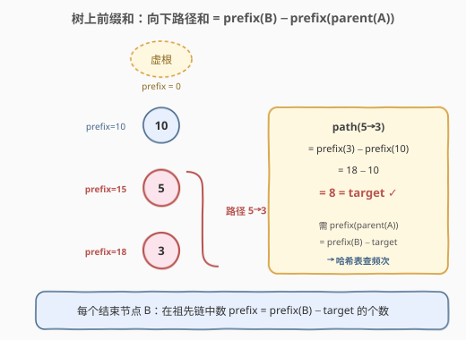
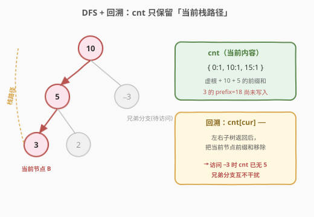
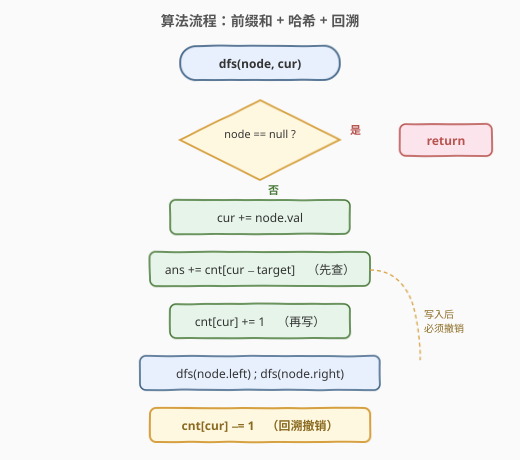
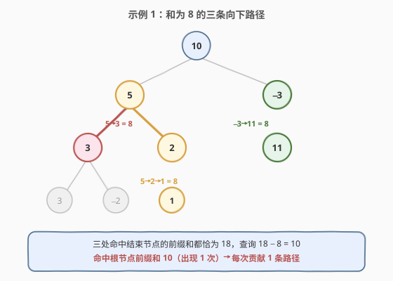

# 路径总和 III

- **题目名称**：路径总和 III
- **链接**：[437. 路径总和 III](https://leetcode.cn/problems/path-sum-iii/)
- **难度**：中等
- **标签**：树、深度优先搜索、前缀和、哈希表

## 1. 题目概述

给定一棵二叉树的根节点 `root` 和一个整数 `targetSum`，求该树中**节点值之和等于 `targetSum`** 的**向下路径**的数目。

> 💡 **向下路径**：从某个节点出发，沿着父→子方向一路向下（可只含一个节点），不需要从根出发，也不需要到叶子结束。

**示例 1**：

```text
输入：root = [10,5,-3,3,2,null,11,3,-2,null,1], targetSum = 8
输出：3
解释：和等于 8 的路径如下图，共有 3 条。
```

**示例 2**：

```text
输入：root = [5,4,8,11,null,13,4,7,2,null,null,5,1], targetSum = 22
输出：3
```

**约束条件**：

- 树中节点数目在范围 `[0, 1000]` 内
- $-10^9 \le \text{Node.val} \le 10^9$
- $-1000 \le \text{targetSum} \le 1000$
- 答案保证可以存入 32 位整数

> ⚠️ 注意：节点值可能为**负数**，因此不能在递归中用「剩余和为负就剪枝」来提前终止；同时根到节点的路径和可达 $\pm 10^{12}$，**超过 32 位整型范围**，C++ 须用 `long long`。

---

## 2. 解题思路

### 2.1 暴力思路

对**每个节点**作为路径起点，做一次 DFS 累加向下路径和，统计等于 `targetSum` 的条数。整体递归为：

$$
\text{pathSum}(node) = \text{from}(node) + \text{pathSum}(node.left) + \text{pathSum}(node.right)
$$

其中 `from(node, rest)` 表示从 `node` 出发、剩余目标和为 `rest` 的路径数。每个节点被重复访问多次，最坏情况（退化成链）为 $O(n^2)$，`n = 1000` 时勉强可过，但完全没利用「路径和可由前缀和相减得到」的结构。

### 2.2 核心观察：树上前缀和 + 哈希表



把「根到节点的路径和」类比为数组的前缀和。定义：

$$
\text{prefix}(node) = \text{从根到 node（含）的节点值之和}
$$

那么从祖先 $A$ 到后代 $B$ 的向下路径之和为：

$$
\text{path}(A \to B) = \text{prefix}(B) - \text{prefix}(\text{parent}(A))
$$

其中 $A$ 为根时 $\text{parent}(A)$ 视作一个「虚根」，其前缀和为 $0$。要让该路径和等于 `targetSum`：

$$
\text{prefix}(\text{parent}(A)) = \text{prefix}(B) - \text{targetSum}
$$

> 💡 **关键转化**：对每个结束节点 $B$，问题变成——**在从根到 $B$ 的祖先链上，有多少个「前缀和」恰好等于 $\text{prefix}(B) - \text{targetSum}$**。这与 [560. 和为 K 的子数组](../0501-0600/560_和为K的子数组.md) 的思路完全同构，只是把「数组前缀和」搬到了「树上前缀和」。

### 2.3 DFS + 回溯：一次遍历



数组是一条直线，前缀和天然只增不减；而树是分叉的，**不同分支共享的前缀和必须互不干扰**。因此我们用 DFS 沿「根→当前节点」这条唯一路径维护一个哈希表 `cnt`：

1. `cnt` 记录**当前 DFS 栈上**（即从虚根到当前节点父节点）各前缀和出现的次数，初始 `cnt = {0: 1}`（虚根前缀和 0 出现一次）。
2. 进入节点 `node` 时，更新当前前缀和 `cur += node.val`，先查 `ans += cnt[cur - targetSum]`，再把 `cnt[cur] += 1`，然后递归左右子树。
3. **回溯**：左右子树递归返回后，执行 `cnt[cur] -= 1`，把当前节点的前缀和从哈希表移除，保证它不会污染兄弟分支的统计。

> ⚠️ **顺序很重要**：必须「先查再写」——用旧 `cnt` 查询 `cur - targetSum`，再把 `cur` 写入；回溯时「最后撤销」。这样 `cnt` 始终只反映「从虚根到当前节点父节点」这条链，分叉之间天然隔离。

### 2.4 算法流程图



### 2.5 示例演算

以示例 1 的树、`targetSum = 8` 为例，三条满足条件的路径分别为 `5→3`、`5→2→1`、`-3→11`，它们结束节点的前缀和都恰好是 $18$，查询 $18-8=10$ 命中根节点前缀和 $10$：



| 步骤 | 节点 | cur（前缀和） | 查询 cur−8 | 命中数 | 累计 ans | 说明 |
|------|------|---------------|-----------|--------|----------|------|
| 入 | 10 | 10 | 2 | 0 | 0 | +{10} |
| 入 | 5 | 15 | 7 | 0 | 0 | +{15} |
| 入 | 3 | 18 | 10 | 1 | 1 | 命中根前缀和 10 → 路径 5→3 |
| 入 | 3 | 21 | 13 | 0 | 1 | +{21} |
| 回 | — | — | — | — | — | −{21} |
| 入 | −2 | 16 | 8 | 0 | 1 | +{16} |
| 回 | — | — | — | — | — | −{16}、−{18} |
| 入 | 2 | 17 | 9 | 0 | 1 | +{17} |
| 入 | 1 | 18 | 10 | 1 | 2 | 命中根前缀和 10 → 路径 5→2→1 |
| 回 | — | — | — | — | — | 撤销 1、2、5 链 |
| 入 | −3 | 7 | −1 | 0 | 2 | +{7} |
| 入 | 11 | 18 | 10 | 1 | 3 | 命中根前缀和 10 → 路径 −3→11 |

最终答案为 `3`。

---

## 3. 参考代码

### C++

```cpp
class Solution {
  public:
    int pathSum(TreeNode* root, int targetSum) {
        unordered_map<long long, int> cnt;
        cnt[0] = 1;              // 虚根前缀和 0
        int ans = 0;
        dfs(root, 0LL, targetSum, cnt, ans);
        return ans;
    }
  private:
    void dfs(TreeNode* node, long long cur, long long target,
             unordered_map<long long, int>& cnt, int& ans) {
        if (!node) return;
        cur += node->val;                          // 根到当前节点的前缀和
        ans += cnt.count(cur - target) ? cnt[cur - target] : 0;
        cnt[cur]++;                                // 写入当前前缀和
        dfs(node->left,  cur, target, cnt, ans);
        dfs(node->right, cur, target, cnt, ans);
        cnt[cur]--;                                // 回溯：撤销当前前缀和
    }
};
```

### Python

```python
class Solution:
    def pathSum(self, root: Optional[TreeNode], targetSum: int) -> int:
        from collections import defaultdict
        cnt = defaultdict(int)
        cnt[0] = 1                # 虚根前缀和 0
        self.ans = 0

        def dfs(node: Optional[TreeNode], cur: int) -> None:
            if not node:
                return
            cur += node.val                         # 根到当前节点的前缀和
            self.ans += cnt[cur - targetSum]
            cnt[cur] += 1                            # 写入当前前缀和
            dfs(node.left, cur)
            dfs(node.right, cur)
            cnt[cur] -= 1                            # 回溯：撤销当前前缀和

        dfs(root, 0)
        return self.ans
```

---

## 4. 复杂度分析

| 维度 | 复杂度 | 说明 |
|------|--------|------|
| 时间复杂度 | $O(n)$ | 每个节点访问一次，每次哈希表查询/写入均摊 $O(1)$ |
| 空间复杂度 | $O(n)$ | 递归栈最深 $O(n)$（链状），哈希表最多存 $n+1$ 个前缀和 |

---

## 5. 扩展：为什么回溯不可省

若进入节点后只增不减 `cnt`，则一条分支上积累的前缀和会「漏」到另一条分支，导致统计偏多。回溯保证了 `cnt` 始终只描述「从虚根到当前节点父节点」这条唯一栈路径，兄弟分支之间互不干扰。

> 💡 本题与 [560. 和为 K 的子数组](../0501-0600/560_和为K的子数组.md) 的本质差异就在这里：数组的「前缀和路径」是唯一且永存的，无需撤销；树的「前缀和路径」会分叉，必须用回溯来回收。

---

## 6. 面试要点

1. **为什么 `cnt` 要初始化 `{0: 1}`？**
   - 当某条从根出发的路径和恰为 `targetSum` 时，需要虚根前缀和 `0` 作为可匹配的 `parent(A)`。若不初始化，这类路径会被漏算。

2. **为什么要「先查再写、最后撤销」？**
   - 查询 `cur - targetSum` 用的是当前节点**之前**的祖先链；若先写后查，会把「以当前节点为单点路径」之外的语义混入；回溯撤销则保证兄弟分支不被污染。

3. **节点值为负会有什么影响？**
   - 前缀和不再单调，同一前缀和值可能在栈上多次出现（对应多个祖先起点），这正是 `cnt` 要存「频次」而非单个节点的原因；同时不能据正负剪枝。

4. **为什么 C++ 用 `long long`？**
   - 节点值范围 $\pm 10^9$、最多 $1000$ 个节点，根到节点路径和可达 $\pm 10^{12}$，超出 32 位 `int` 上界 $\approx 2.1 \times 10^9$，须用 64 位整型避免溢出。

5. **能否返回所有满足条件的路径？**
   - 可以。把 `cnt` 的值从「频次」改为「节点列表」，命中时遍历列表即可还原每条 `[起点, 终点]`；时间复杂度仍为 $O(n + \text{输出大小})$。

---

## 7. 同类练习题

- [560. 和为 K 的子数组](https://leetcode.cn/problems/subarray-sum-equals-k/)：数组版前缀和 + 哈希，本题的「直线版」原型
- [112. 路径总和](https://leetcode.cn/problems/path-sum/)：判定是否存在根到叶路径，DFS 基础模板
- [113. 路径总和 II](https://leetcode.cn/problems/path-sum-ii/)：枚举所有根到叶路径，回溯收集结果
- [666. 路径总和 IV](https://leetcode.cn/problems/path-sum-iv/)：用三位数编码表示的二叉树路径统计，前缀和思路可迁移
- [124. 二叉树中的最大路径和](https://leetcode.cn/problems/binary-tree-maximum-path-sum/)：树形 DFS + 后序返回值的另一经典应用
