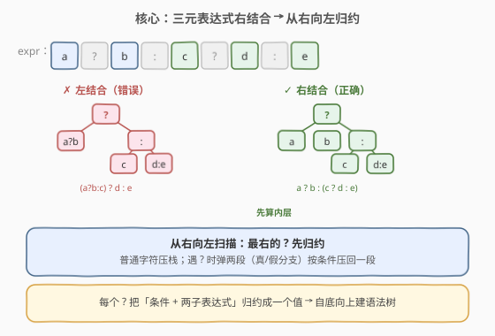
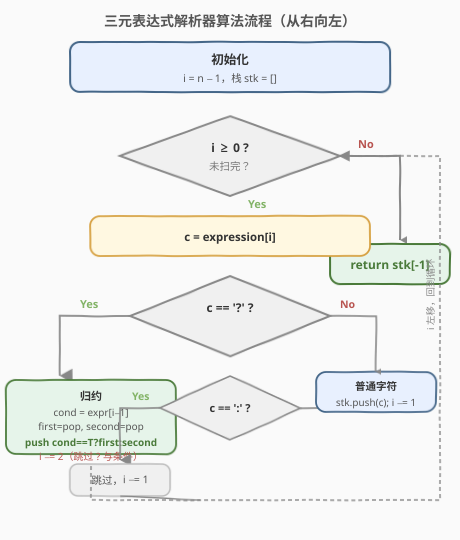
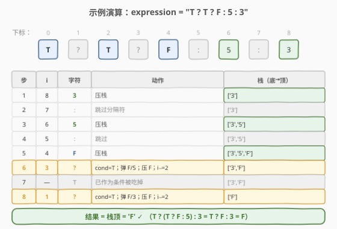

# 三元表达式解析器

- **题目名称**：三元表达式解析器
- **链接**：[439. 三元表达式解析器](https://leetcode.cn/problems/ternary-expression-parser/)
- **难度**：中等
- **标签**：栈、递归、字符串

## 1. 题目概述

给定一个表示**任意嵌套三元表达式**的字符串 `expression`，求该表达式的结果。

三元表达式语法：

- `'T'` 和 `'F'` 分别表示真和假。
- `'0'`–`'9'` 为单数字字面量。
- 形如 `条件 ? 表达式1 : 表达式2`：`条件` 为 `'T'` 或 `'F'`；当条件为真取 `表达式1`，否则取 `表达式2`。
- 三元表达式**右结合**：`a ? b : c ? d : e` 解析为 `a ? b : (c ? d : e)`，而非 `(a ? b : c) ? d : e`。

**示例 1**：

```text
输入：expression = "T?2:3"
输出："2"
```

**示例 2**：

```text
输入：expression = "F?1:T?4:5"
输出："4"
解释：右结合为 F ? 1 : (T ? 4 : 5)；内层 T?4:5=4，外层 F?1:4=4。
```

**示例 3**：

```text
输入：expression = "T?T?F:5:3"
输出："F"
解释：右结合为 T ? (T ? F : 5) : 3；内层 T?F:5=F，外层 T?F:3=F。
```

**约束条件**：

- `5 <= expression.length <= 10^4`
- 表达式保证合法；所有数字均为单字符；`'T'`/`'F'` 仅作为条件出现（或单独作为结果）。

> ⚠️ **关键性质**：三元表达式**右结合**，意味着**最右边的 `'?'` 最先被求解**。这与「从右向左扫描 + 栈」天然契合——右边的子表达式先入栈、先被归约，外层条件后取值。

---

## 2. 解题思路

### 2.1 暴力思路：递归 + 配对冒号

对整个表达式递归：若不含 `'?'`，则它是单字符结果，直接返回。否则取首字符为条件，跳过 `'?'`，从其后开始扫描配对的 `':'`：遇 `'?'` 深度+1，遇 `':'` 深度−1，深度归零即匹配冒号。按冒号切分得到 `expr1` 与 `expr2`，依条件递归其一。

配对冒号需 `O(n)` 扫描，递归深度 `O(树高)`，整体最坏 `O(n²)`（链式嵌套如 `T?T?T?...:1:1:1` 时每层都重扫一遍前缀）。能过但不够优雅，且对长串有栈溢出风险。

### 2.2 核心观察：从右向左 + 栈归约



由于三元表达式**右结合**，最右的 `'?'` 总是绑定**最近的**条件与两个最右的子表达式。如果我们**从右向左**扫描：

- 普通字符（数字/`T`/`F`）直接压栈。
- 遇到 `':'` 跳过（仅作分隔符）。
- 遇到 `'?'` 时，**左侧紧邻字符**就是当前条件；此时栈顶正是 `表达式1`（真分支），次栈顶是 `表达式2`（假分支）——因为它们更靠右、已经被压入。弹出两个，按条件选一个压回。

这样每个 `'?'` 把三个片段（条件、真分支、假分支）归约成一个结果，相当于在栈上做**自底向上的语法树归约**。

> 💡 **为何从右向左？** 右结合 `a ? b : (c ? d : e)` 中内层 `(c?d:e)` 在右侧、要先算；从右向左扫描时，`c?d:e` 先被压栈并归约成一个值，再交给外层 `a?b:_` 使用——天然符合求值顺序，无需先找配对冒号。

### 2.3 算法流程图



### 2.4 示例演算

以 `expression = "T?T?F:5:3"`（下标 `0..8`，`T ? T ? F : 5 : 3`）为例，从右向左扫描：



| 步骤 | i | 字符 | 动作 | 栈（底→顶） |
|------|---|------|------|--------------|
| 1 | 8 | `3` | 压栈 | `['3']` |
| 2 | 7 | `:` | 跳过 | `['3']` |
| 3 | 6 | `5` | 压栈 | `['3','5']` |
| 4 | 5 | `:` | 跳过 | `['3','5']` |
| 5 | 4 | `F` | 压栈 | `['3','5','F']` |
| 6 | 3 | `?` | `cond=expr[2]='T'`；弹 `F`(真)、`5`(假)；压 `F`；`i−=2` | `['3','F']` |
| 7 | 2 | `T` | 已作为条件被吃掉 | `['3','F']` |
| 8 | 1 | `?` | `cond=expr[0]='T'`；弹 `F`(真)、`3`(假)；压 `F`；`i−=2` | `['F']` |
| 9 | 0 | `T` | 已作为条件被吃掉 | `['F']` |

返回 `'F'` ✓。

> ⚠️ 注意步骤 6/8：处理 `'?'` 时同时**吃掉左侧的条件字符**（`i -= 2`），避免它被当作普通字面量再次压栈。

---

## 3. 参考代码

### C++

```cpp
class Solution {
public:
    string parseTernary(string expression) {
        vector<char> stk;
        for (int i = (int)expression.size() - 1; i >= 0; ) {
            char c = expression[i];
            if (c == ':') { i--; continue; }
            if (c == '?') {
                char cond   = expression[i - 1];
                char first  = stk.back(); stk.pop_back();  // 真分支
                char second = stk.back(); stk.pop_back();  // 假分支
                stk.push_back(cond == 'T' ? first : second);
                i -= 2;  // 跳过 '?' 和左侧条件字符
                continue;
            }
            stk.push_back(c);
            i--;
        }
        return string(1, stk.back());
    }
};
```

### Python

```python
class Solution:
    def parseTernary(self, expression: str) -> str:
        stk = []
        i = len(expression) - 1
        while i >= 0:
            c = expression[i]
            if c == ':':
                i -= 1
                continue
            if c == '?':
                cond   = expression[i - 1]
                first  = stk.pop()  # 真分支
                second = stk.pop()  # 假分支
                stk.append(first if cond == 'T' else second)
                i -= 2  # 跳过 '?' 和左侧条件字符
                continue
            stk.append(c)
            i -= 1
        return stk[-1]
```

---

## 4. 复杂度分析

| 维度 | 复杂度 | 说明 |
|------|--------|------|
| 时间复杂度 | $O(n)$ | 每个字符最多访问一次：`':'` 跳过、普通字符压栈、`'?'` 触发一次 $O(1)$ 归约并跳过条件字符 |
| 空间复杂度 | $O(n)$ | 栈存所有未归约字符；链式嵌套 `T?T?T?...:1:1:1` 时栈深 $O(n)$ |

> 💡 时间已是下界 $O(n)$（必读全串）。空间下界为语法树高 $O(\log n)$（平衡嵌套），但最坏链式嵌套下树高仍为 $O(n)$，与栈法持平。

---

## 5. 扩展：递归 + 配对冒号（不开显式栈）

若面试官要求**不开显式栈**或限制空间为 $O(\text{树高})$，可用递归。配对冒号用**深度计数**而非简单找第一个 `':'`——因为 `':'` 可能属于内层嵌套（如 `T ? T ? F : 5 : 3` 中第一个 `':'` 属于内层），深度归零的 `':'` 才是与首 `'?'` 配对的外层冒号。

```python
def parseTernary(self, expression: str) -> str:
    def dfs(s: str) -> str:
        if '?' not in s:
            return s                       # 单字符：数字/T/F
        cond = s[0]
        depth = 0
        colon = -1
        for i, ch in enumerate(s):
            if ch == '?':
                depth += 1
            elif ch == ':':
                depth -= 1
                if depth == 0:             # 与首 '?' 配对的外层冒号
                    colon = i
                    break
        # s = cond ? s[2:colon] : s[colon+1:]
        return dfs(s[2:colon]) if cond == 'T' else dfs(s[colon + 1:])
    return dfs(expression)
```

> ⚠️ 递归版在链式嵌套下递归深度 $O(n)$，Python 默认递归上限 1000，对 $n = 10^4$ 的长串需 `sys.setrecursionlimit` 或改用栈法。

---

## 6. 面试要点

1. **为什么从右向左扫描而不是从左向右？**
   - 三元表达式右结合：`a?b:c?d:e` = `a?b:(c?d:e)`。从右向左时，内层（右侧）的 `c?d:e` 先被压栈并归约成一个值，外层 `a?b:_` 才能取到完整子表达式结果。若从左向右遇到 `a?` 时还无法知道 `b` 和 `c` 是什么——必须先找配对冒号，复杂度更高。

2. **遇到 `'?'` 时为何要 `i -= 2`？**
   - `'?'` 左侧紧邻字符是当前条件（`'T'`/`'F'`），它已在本次归约中被消费；若不跳过，会被当作普通字面量再次压栈导致错误。`i -= 2` 同时跳过 `'?'` 与条件字符。

3. **`':'` 为何直接跳过？**
   - `':'` 只是分隔符，结构信息已由「`'?'` 触发归约 + 栈顶两个元素恰好是真/假分支」隐含承担。从右向左时假分支先压栈、真分支后压栈，故弹出顺序天然正确。

4. **栈中元素何时是真分支、何时是假分支？**
   - 从右向左扫描 `? expr1 : expr2`：先遇 `expr2`（假分支）压栈，再遇 `:`（跳过），再遇 `expr1`（真分支）压栈。故**栈顶=真分支**、**次栈顶=假分支**，弹出顺序为 `first=真, second=假`。

5. **若输入允许数字作为条件怎么办？**
   - 题面限定条件只能是 `'T'`/`'F'`；若放宽为「非零数字即真」，只需把 `cond == 'T'` 换成相应真值判定即可，算法骨架不变。

---

## 7. 同类练习题

- [224. 基本计算器](https://leetcode.cn/problems/basic-calculator/)：栈处理括号与一元符号，同样是「扫描 + 栈归约」表达式求值范式
- [150. 逆波兰表达式求值](https://leetcode.cn/problems/evaluate-reverse-polish-notation/)：后缀表达式栈求值，对比三元表达式「自右向左归约」与后缀「自左向右归约」
- [394. 字符串解码](https://leetcode.cn/problems/decode-string/)：嵌套结构 + 栈展开，处理 `[...]` 嵌套的典型栈题
- [726. 原子的数量](https://leetcode.cn/problems/number-of-atoms/)：嵌套括号 + 栈归约，递归/栈均可，难度更高的同类型
- [1096. 花括号展开 II](https://leetcode.cn/problems/brace-expansion-ii/)：嵌套表达式语法解析，栈归约的另一变体
