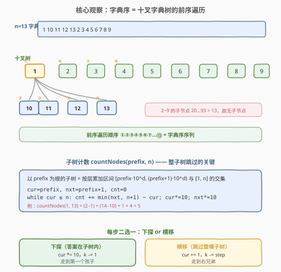
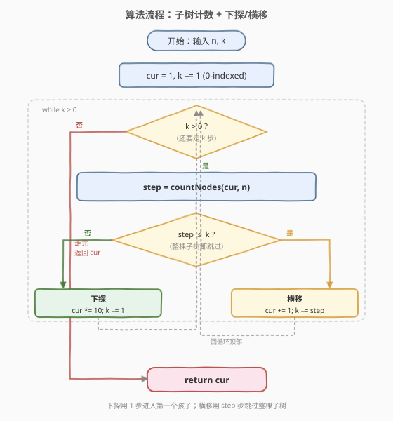
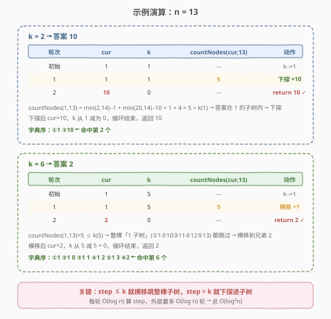

# LeetCode 字典序的第 K 小数字 题解

## 1. 题目概述

- **标题 / 题号**：字典序的第 K 小数字（#440，hard）
- **链接**：https://leetcode.cn/problems/k-th-smallest-in-lexicographical-order/
- **难度**：困难
- **标签**：字典树、贪心、数学

**题意**：给定整数 $n$ 和 $k$，返回 $[1, n]$ 中字典序第 $k$ 小的数字。

**示例 1**：

```text
输入：n = 13, k = 2
输出：10
解释：字典序排列是 [1, 10, 11, 12, 13, 2, 3, 4, 5, 6, 7, 8, 9]，所以第二小的数字是 10。
```

**示例 2**：

```text
输入：n = 1, k = 1
输出：1
```

**约束**：

- $1 \le k \le n \le 10^9$

> ⚠️ $n$ 可达 $10^9$。任何"把 $1\sim n$ 全部转字符串排序"或"逐个走字典序序列"的做法都会在时间或内存上爆掉。必须利用字典序的**树形结构**，整棵子树地跳过。

## 2. 解题思路

### 2.1 暴力思路：字符串排序

最直白的做法：把 $1\sim n$ 全部转成字符串，按字典序排序，取第 $k$ 个。

```text
nums = [str(i) for i in range(1, n+1)]
nums.sort()
return int(nums[k-1])
```

问题：$n=10^9$ 时，仅存储就需要 $\sim 10$ GB 内存；排序 $O(n \log n)$ 也远超时限。即使不排序、用 `sorted(range(1,n+1), key=str)` 也是 $O(n)$ 空间。

> 💡 暴力法的浪费在于：它把所有数字**平铺**成线性序列，丢失了"字典序天然构成一棵十叉树"的结构。换视角：不必构造序列，而是**在树上整子树地跳**，用 $O(\log n)$ 算出每棵子树的大小，决定下探还是横移。

### 2.2 核心观察：十叉字典树 + 前序遍历



把每个数字看成字符串，$1\sim n$ 的字典序等价于一棵**十叉字典树**（Trie）的前序遍历：

- **根的儿子**：$1, 2, \dots, 9$（最高位）
- **节点 $x$ 的儿子**：$x\cdot10,\ x\cdot10+1,\ \dots,\ x\cdot10+9$（在末位追加一个数字），但只保留 $\le n$ 的
- **前序遍历**这棵树 = 字典序序列

因此"找第 $k$ 小" = "在前序遍历中从根走到第 $k$ 个节点"。但树太大（$n=10^9$ 时节点数 $10^9$），不能一步步走。

**关键加速**：对任意前缀 $\text{prefix}$，可以 $O(\log n)$ 算出"以 $\text{prefix}$ 为根的子树中 $\le n$ 的节点数" $\text{countNodes}(\text{prefix}, n)$。于是每一步不必逐节点走，而是**整棵子树地跳过**。

#### countNodes 怎么算

以 $\text{prefix}$ 为根的子树，在十叉树里对应一段**连续区间**。按"层"（即位数）累加，每层取与 $[1, n]$ 的交集：

| 层 $d$ | 该层区间 | 与 $[1,n]$ 交集贡献 |
|--------|----------|---------------------|
| 0 | $[\text{prefix},\ \text{prefix}]$ | $\min(\text{prefix}+1,\ n+1) - \text{prefix}$ |
| 1 | $[\text{prefix}\cdot10,\ \text{prefix}\cdot10+10)$ | $\min((\text{prefix}+1)\cdot10,\ n+1) - \text{prefix}\cdot10$ |
| $d$ | $[\text{prefix}\cdot10^d,\ (\text{prefix}+1)\cdot10^d)$ | $\min((\text{prefix}+1)\cdot10^d,\ n+1) - \text{prefix}\cdot10^d$ |

迭代实现：

```text
cnt = 0
cur = prefix,  nxt = prefix + 1
while cur <= n:
    cnt += min(nxt, n + 1) - cur
    cur *= 10
    nxt *= 10
```

> 💡 用 `nxt = prefix + 1` 同步乘 10，避免单独算 $10^d$；用 $\min(\text{nxt}, n+1)$ 自然处理"最后一层被 $n$ 截断"的边界。

### 2.3 算法流程图



迭代流程：

1. **初始化**：`cur = 1`（字典序第一个），`k -= 1`（转 0-indexed：还需走 $k$ 步）。
2. **循环** `while k > 0`：
   - `step = countNodes(cur, n)` —— 以 `cur` 为根的子树大小。
   - **若 `step <= k`**：答案不在 `cur` 子树内 → **横移** `cur += 1`（跳到右兄弟），`k -= step`（一次跳过整棵子树）。
   - **否则**：答案在 `cur` 子树内 → **下探** `cur *= 10`（走到第一个孩子），`k -= 1`（走了一步）。
3. 返回 `cur`。

> 💡 **两种走法的步数语义**：下探只走 **1 步**（从父到第一个孩子，恰是前序的下一个节点）；横移走 **step 步**（整棵子树的大小）。这正是 `k` 分别减 1 与减 `step` 的原因。

### 2.4 示例演算



**例 1：$n=13,\ k=2$ → 答案 10**

| 轮次 | cur | k | countNodes(cur, 13) | 动作 |
|------|-----|---|---------------------|------|
| 初始 | 1 | 1 | — | `k -= 1` |
| 1 | 1 | 1 | $5$ | $5 > 1$ → **下探** `cur *= 10` |
| 2 | 10 | 0 | — | 循环结束，返回 **10** ✓ |

$\text{countNodes}(1,13) = \min(2,14)-1 + \min(20,14)-10 = 1 + 4 = 5$。$5 > k=1$，说明答案在 1 的子树内，下探到 10，$k$ 减 1 归零，返回 10。

**例 2：$n=13,\ k=6$ → 答案 2**

| 轮次 | cur | k | countNodes(cur, 13) | 动作 |
|------|-----|---|---------------------|------|
| 初始 | 1 | 5 | — | `k -= 1` |
| 1 | 1 | 5 | $5$ | $5 \le 5$ → **横移** `cur += 1` |
| 2 | 2 | 0 | — | 循环结束，返回 **2** ✓ |

$\text{countNodes}(1,13)=5 \le k=5$，整棵「1 子树」（①1 ②10 ③11 ④12 ⑤13）一次跳过，横移到兄弟 2，$k$ 减 5 归零，返回 2。

## 3. 参考代码

### C++

```cpp
class Solution {
  public:
    long long countNodes(long long prefix, long long n) {
        long long cnt = 0;
        long long cur = prefix, nxt = prefix + 1;
        while (cur <= n) {
            cnt += min(nxt, n + 1) - cur;
            cur *= 10;
            nxt *= 10;
        }
        return cnt;
    }
    int findKthNumber(int n, int k) {
        int cur = 1;
        k -= 1;
        while (k > 0) {
            long long step = countNodes(cur, n);
            if (step <= k) {
                cur += 1;
                k -= step;
            } else {
                cur *= 10;
                k -= 1;
            }
        }
        return cur;
    }
};
```

### Python

```python
class Solution:
    def findKthNumber(self, n: int, k: int) -> int:
        def count_nodes(prefix: int) -> int:
            cnt = 0
            cur, nxt = prefix, prefix + 1
            while cur <= n:
                cnt += min(nxt, n + 1) - cur
                cur *= 10
                nxt *= 10
            return cnt

        cur = 1
        k -= 1
        while k > 0:
            step = count_nodes(cur)
            if step <= k:
                cur += 1
                k -= step
            else:
                cur *= 10
                k -= 1
        return cur
```

> 💡 两版逻辑完全一致。`count_nodes` 用闭包捕获 `n`，写法更简洁。注意 `k -= 1` 把 1-indexed 转成"还需走几步"，与 [400. 第 N 位数字](../0301-0400/400_第N位数字.md) 用 $(n-1)/d$ 统一边界的思路同源。

## 4. 复杂度分析

| 维度 | 复杂度 | 说明 |
|------|--------|------|
| 时间复杂度 | $O(\log^2 n)$ | 外层 `while` 每轮要么下探一层（`cur *= 10`，至多 $\log_{10} n$ 次），要么横移到兄弟（每层至多 9 次）；外层迭代 $O(\log n)$ 次，每次 `countNodes` 内层 `while` 也是 $O(\log n)$ |
| 空间复杂度 | $O(1)$ | 仅几个整型变量，无递归栈、无额外数组 |

> 💡 严格说外层迭代数 $\le 10 \cdot \log_{10} n$（深度 $\log_{10} n$，每层至多 9 次横移 + 1 次下探），故总时间 $O(\log^2 n)$。$n=10^9$ 时 $\log_{10} n = 9$，总操作数仅约 $10 \times 9 \times 9 \approx 810$ 次，远低于时限。

## 5. 扩展：为什么是前序遍历与溢出分析

### 5.1 为什么字典序 = 字典树前序遍历

字典序比较字符串时**从左到右逐位比较**，先看最高位。十叉字典树按"最高位 → 次高位 → …"分层，每个节点的儿子按 $0\sim 9$ 排列。前序遍历"先访问根，再从左到右访问儿子"恰好等价于：

1. 先输出当前前缀本身（更短的前缀字典序更小，如 `1` < `10`）；
2. 再按 $0\sim 9$ 顺序输出所有更长的前缀（`10` < `11` < … < `19`）。

这与字符串排序的逐位比较完全一致，故前序遍历序列 = 字典序序列。

### 5.2 C++ 溢出点：必须用 `long long`

`countNodes` 中 `cur`、`nxt` 每轮乘 10。即便 $\text{prefix}$ 很小，循环也会让 `cur` 一路乘到超过 $n$ 才停。例如 $\text{prefix}=1,\ n=10^9$ 时，`cur` 会经过 $1 \to 10 \to \dots \to 10^9 \to 10^{10}$ 才终止——$10^{10}$ 已远超 `int` 上界 $2^{31}-1 \approx 2.15\times10^9$。

**解法**：把 `countNodes` 的参数与局部变量都声明为 `long long`，乘法自动提升为 64 位运算。`findKthNumber` 的 `cur` 用 `int` 即可（答案 $\le n \le 10^9$ 不溢出），但传参时 `cur` 隐式提升到 `long long`，安全。

> ⚠️ `min(nxt, n + 1)` 中的 `n + 1` 在 $n=10^9$ 时为 $10^9+1$，仍在 `int` 范围内（$< 2^{31}-1$），但若 `nxt` 是 `long long` 而 `n+1` 是 `int`，`min` 需类型一致——所以 `countNodes` 接收 `long long n` 最稳妥。

## 6. 面试要点

1. **为什么字典序等价于十叉字典树的前序遍历？**

   > 字典序逐位从左到右比较，十叉树按"最高位→次高位"分层、儿子按 $0\sim 9$ 排列。前序遍历"先根后子、子从左到右"正好等价于"短前缀优先、同长按字典序"，与字符串排序结果一致。

2. **`countNodes` 如何 $O(\log n)$ 算子树大小？**

   > 子树是一段连续区间，按位数分层：第 $d$ 层区间 $[\text{prefix}\cdot10^d,\ (\text{prefix}+1)\cdot10^d)$，与 $[1,n]$ 取交集贡献 $\min((\text{prefix}+1)\cdot10^d,\ n+1) - \text{prefix}\cdot10^d$。用 `cur`、`nxt` 同步乘 10 迭代，至多 $\log_{10} n$ 轮。

3. **外层循环的两种分支分别什么含义？**

   > `step <= k`：整棵 `cur` 子树都在前 $k$ 个之内 → **横移**到右兄弟，`k -= step` 一次跳过；否则答案在子树内 → **下探**到第一个孩子，`k -= 1` 走一步。

4. **为什么 `k` 要先减 1？**

   > 起始 `cur=1` 已经是第 1 个，还要再走 $k-1$ 步才到第 $k$ 个。减 1 后 `k` 表示"剩余步数"，循环条件 `k > 0` 与"走一步 `k -= 1`"语义自洽，避免边界特判。

5. **时间复杂度为什么是 $O(\log^2 n)$？**

   > 外层至多 $O(\log n)$ 次（深度 $\log_{10} n$ + 每层至多 9 次横移），每次 `countNodes` 是 $O(\log n)$，相乘得 $O(\log^2 n)$。$n=10^9$ 时约 810 次操作。

6. **C++ 的溢出点在哪？**

   > `countNodes` 中 `cur *= 10` 会乘到 $10^{10}$ 超过 `int` 上界。把 `prefix`、`cur`、`nxt`、`n` 都声明为 `long long` 即可；`findKthNumber` 的 `cur` 用 `int`（答案 $\le n$），传参时自动提升。

> 💡 **一句话总结**：440 是"字典树前序遍历 + 子树计数跳步"的招牌题——把字典序建模成十叉树前序，用 $O(\log n)$ 的 `countNodes` 整子树跳过，每步二选一（下探走 1 步 / 横移走 step 步），$O(\log^2 n)$ 搞定。与 [400. 第 N 位数字](../0301-0400/400_第N位数字.md) 的"按位数分层定位"同属"不构造序列、按结构降维"一族。

## 同类练习题

| # | 题目 | 与本题的关联 |
|---|------|-------------|
| 400 | [第 N 位数字](https://leetcode.cn/problems/nth-digit/)（[站内题解](../0301-0400/400_第N位数字.md)） | 姊妹题，按位数分层定位第 $n$ 位，同为"不构造序列、按结构降维" |
| 386 | [字典序排数](https://leetcode.cn/problems/lexicographical-numbers/) | 把 $1\sim n$ 按字典序输出，正是 440 的"全集版"，同样的十叉树前序迭代 |
| 172 | [阶乘后的零](https://leetcode.cn/problems/factorial-trailing-zeroes/)（[站内题解](../0101-0200/172_阶乘后的零.md)） | 按 $5$ 的幂次分层累加，同属"按结构分层计数"的数学降维题 |
| 233 | [数字 1 的个数](https://leetcode.cn/problems/number-of-digit-one/) | 按数位分层统计 $[1,n]$ 中 1 出现次数，同为"按位数/前缀分层"的计数题 |
| 208 | [实现 Trie](https://leetcode.cn/problems/implement-trie-prefix-tree/)（[站内题解](../0201-0300/208_实现Trie.md)） | 字典树模板，440 的十叉字典树是其特例（固定 10 叉、键为数字位） |
