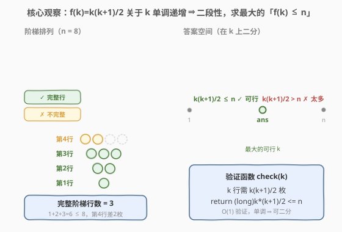
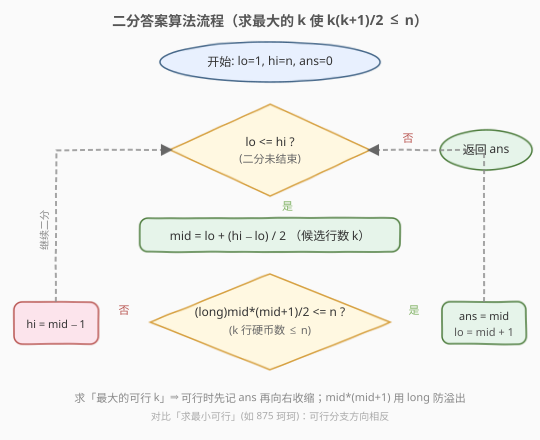
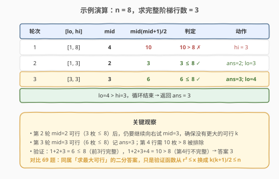

# 排列硬币

- **题目名称**：排列硬币
- **链接**：[441. 排列硬币](https://leetcode.cn/problems/arranging-coins/)
- **难度**：简单
- **标签**：数学、二分查找

## 1. 题目概述

你有 `n` 枚硬币，并计划将它们按阶梯状排列。对于一个由 `k` 行组成的阶梯，其第 `i` 行必须正好有 `i` 枚硬币。阶梯的最后一行**可能**是不完整的。

给你一个数字 `n`，计算并返回可形成**完整阶梯行**的总行数。

**示例 1**：

```text
输入：n = 5
输出：2
解释：因为第三行不完整，所以返回 2 。
     第1行: 1 枚（完整）
     第2行: 2 枚（完整）  → 累计 3 枚
     第3行: 需 3 枚，但只剩 2 枚（不完整）
```

**示例 2**：

```text
输入：n = 8
输出：3
解释：因为第四行不完整，所以返回 3 。
     第1行: 1 枚（完整）
     第2行: 2 枚（完整）
     第3行: 3 枚（完整）  → 累计 6 枚
     第4行: 需 4 枚，但只剩 2 枚（不完整）
```

**约束条件**：

- `1 <= n <= 2^31 - 1`

---

## 2. 解题思路

### 2.1 暴力思路

从第 `1` 行开始逐行模拟：每填满一行 `i`，就从 `n` 中扣掉 `i` 枚硬币，直到剩余硬币不足以填满下一行（`n < i+1`）即停止，返回当前行数。

`k` 行阶梯共需 $\sum_{i=1}^{k} i = \frac{k(k+1)}{2}$ 枚硬币，因此完整行数 $k \approx \sqrt{2n}$。当 `n = 2^31 - 1` 时 $k \approx 65536$，暴力需枚举六万多轮，虽不至于超时，但效率低、且不够通用（换更大的数据范围就崩）。

> 💡 暴力法之所以慢，是因为它在「线性地」扫描答案空间。注意到答案满足单调性后，可用二分把 $O(\sqrt{n})$ 降到 $O(\log n)$。

### 2.2 核心观察：二分答案



关键直觉是：**函数 $f(k) = \frac{k(k+1)}{2}$（前 `k` 行所需硬币数）关于 `k` 单调递增**。

- `k` 越大，前 `k` 行需要的硬币越多。
- 当 `k` 小到一定程度时 $f(k) \le n$（**可行**：硬币够填满前 `k` 行）；当 `k` 大到一定程度时 $f(k) > n$（**太多**：硬币不够）。

于是存在一个**分界点** `ans`：

```text
k <= ans → f(k) ≤ n   (可行：前 k 行能填满)
k >  ans → f(k) >  n   (太多：硬币不够填满前 k 行)
```

这正是二分查找所需的**二段性**。所求完整行数就是「**最大的可行 `k`**」——可行区间的右端点。把问题转化为：在有序区间 `[1, n]` 上二分，每次 `O(1)` 验证 $\frac{k(k+1)}{2} \le n$ 是否成立，可行则记下 `ans = k` 并向右继续找更大的，不可行则向左收缩。

> 💡 **识别信号**：题目求「最大的满足某单调条件的值」，且能 `O(1)` 验证候选值是否合法 → 想「二分答案」。这是与「在有序数组里二分找下标」不同的另一类二分：**二分的是答案本身**。

> ⚠️ **与 69 题同构**：本系列 [69. x 的平方根](../0001-0100/69_x的平方根.md) 求「最大的 `r` 使 $r^2 \le x$」，**本题求「最大的 `k` 使 $\frac{k(k+1)}{2} \le n$」**——同属「求最大可行」的二分答案，只是验证函数从 $r^2$ 换成等差求和 $\frac{k(k+1)}{2}$，模板完全一致。

> ⚠️ **溢出**：`n` 可达 $2^{31}-1$，答案 $k \approx 65536$，而 $k(k+1) \approx 4.3 \times 10^9$ **超过 32 位 `int` 上界**（约 $2.1 \times 10^9$）。C++ 中 `mid * (mid + 1)` 必须用 `long long`，否则溢出后可能变成负数，导致 `<= n` 误判为 `true`，答案偏大。

### 2.3 算法流程图



注意判定为「可行」时**先记录 `ans = mid` 再收缩左界**（`lo = mid + 1`），保证最终保留的是「最大的可行值」——这是与「求最小可行」相反的收缩方向。

### 2.4 示例演算



以 `n = 8` 为例（初始 `lo=1, hi=8, ans=0`）：

- **第 1 轮** `[1,8]`，`mid=4`，$\frac{4 \times 5}{2}=10 > 8$ ✗ → 太多，`hi=3`。
- **第 2 轮** `[1,3]`，`mid=2`，$\frac{2 \times 3}{2}=3 \le 8$ ✓ → 可行，记 `ans=2`，`lo=3`。
- **第 3 轮** `[3,3]`，`mid=3`，$\frac{3 \times 4}{2}=6 \le 8$ ✓ → 可行，记 `ans=3`，`lo=4`。
- `lo=4 > hi=3`，循环结束，返回 `ans=3`。

> 💡 第 2 轮已经得到 `ans=2`，但仍需第 3 轮验证 `mid=3` 可行——这正是「求最大可行」必须向右试探的原因，确保没有更大的合法 `k` 被遗漏。

---

## 3. 参考代码

### C++

```cpp
class Solution {
  public:
    int arrangeCoins(int n) {
        int lo = 1, hi = n, ans = 0;
        while (lo <= hi) {
            int mid = lo + (hi - lo) / 2;
            if ((long long)mid * (mid + 1) / 2 <= n) { // long long 防 mid*(mid+1) 溢出
                ans = mid;      // 可行，尝试更大的 k
                lo = mid + 1;
            } else {
                hi = mid - 1;   // 太多，向左收缩
            }
        }
        return ans;
    }
};
```

### Python

```python
class Solution:
    def arrangeCoins(self, n: int) -> int:
        lo, hi, ans = 1, n, 0
        while lo <= hi:
            mid = (lo + hi) // 2
            if mid * (mid + 1) // 2 <= n:   # Python 大整数无溢出问题
                ans = mid        # 可行，尝试更大的 k
                lo = mid + 1
            else:
                hi = mid - 1     # 太多，向左收缩
        return ans
```

> ⚠️ **两个易错点**：
> 1. **溢出**：C++ 中 `mid * (mid + 1)` 在 `mid ≈ 65536` 时约为 $4.3 \times 10^9$，溢出 32 位 `int`。解法是用 `(long long)mid * (mid + 1)` 提升类型后再除 2。注意除 2 在 `long long` 域内进行，结果再与 `n` 比较安全。
> 2. **下界取 1 而非 0**：`n >= 1` 时至少能填满第 1 行，`lo = 1` 更贴合题意；若取 `lo = 0` 也可（`f(0) = 0 <= n` 恒真），但 `ans` 初始值需保证不被 0 干扰，统一从 `1` 起更直观。

---

## 4. 复杂度分析

| 维度 | 复杂度 | 说明 |
|------|--------|------|
| 时间复杂度 | $O(\log n)$ | 在 `[1, n]` 上二分，每次 `O(1)` 验证 $\frac{k(k+1)}{2} \le n$ |
| 空间复杂度 | $O(1)$ | 仅用常数额外变量 |

---

## 5. 扩展：数学公式法（O(1) 直解）

二分答案已足够通过本题，但既然前 `k` 行硬币数有闭式公式，便可直接求解不等式：

$$
\frac{k(k+1)}{2} \le n \quad \Longleftrightarrow \quad k^2 + k - 2n \le 0
$$

这是关于 `k` 的一元二次不等式。方程 $k^2 + k - 2n = 0$ 的正根为：

$$
k = \frac{-1 + \sqrt{1 + 8n}}{2}
$$

由于 $k$ 必须**为整数且向下取整**，最终答案为：

$$
\text{ans} = \left\lfloor \frac{-1 + \sqrt{1 + 8n}}{2} \right\rfloor
$$

```cpp
class Solution {
  public:
    int arrangeCoins(int n) {
        return (int)((sqrt(1.0 + 8.0 * n) - 1) / 2);
    }
};
```

> ⚠️ **浮点精度**：`8.0 * n` 在 `n` 很时是 `double` 运算（53 位尾数约可精确表示到 $9 \times 10^{15}$，远大于 $8n \approx 1.7 \times 10^{10}$），精度充足。但为规避极端边界（如 $\sqrt{1+8n}$ 恰好略小于某个整数导致向下取整出错），工程上常对结果微调：先算 `k`，若 $\frac{(k+1)(k+2)}{2} \le n$ 则 `k++`，确保答案正确。

> 💡 **二分 vs 数学**：二分答案逻辑直观、不依赖浮点、面试中不易写错，是首选；数学法 $O(1)$ 最优，但需处理浮点精度边界，适合作为「进阶优化」展示。

---

## 6. 面试要点

1. **为什么能二分？二段性体现在哪？**

   - $f(k) = \frac{k(k+1)}{2}$ 关于 `k` 单调递增。存在分界点 `ans`，使 `k <= ans` 时 $f(k) \le n$（可行）、`k > ans` 时 $f(k) > n$（太多）。这种「左可行 / 右太多」的结构就是二段性，可用二分定位 `ans`。

2. **本题求「最大可行」，与求「最小可行」的二分写法有何不同？**

   - 求最大可行时，可行分支要**向右收缩**：`ans = mid; lo = mid + 1`，继续试探更大的 `k`；求最小可行（如 875 珂珂）则相反，可行分支 `ans = mid; hi = mid - 1` 向左收缩。两者只是收缩方向不同，模板一致。

3. **`mid * (mid + 1)` 为什么会溢出？怎么处理？**

   - `n` 可达 $2^{31}-1$，答案 $k \approx 65536$，而 $k(k+1) \approx 4.3 \times 10^9$ 超过 32 位 `int` 上界。C++ 用 `(long long)mid * (mid + 1)` 提升类型后除 2 再比较；Python 整数无上限无此问题。

4. **上界为什么取 `n` 而不是更紧的 $\sqrt{2n}$？**

   - 对 `n >= 1`，答案 $k \le n$ 恒成立（最坏 1 枚硬币只能填 1 行），`hi = n` 是合法上界，逻辑最简单不易错。进一步可用数学估出 `hi = (int)sqrt(2.0 * n) + 1` 缩小范围，减少几次二分，但属锦上添花，面试中写出正确版即可。

5. **数学公式法和二分法各有什么取舍？**

   - 数学法 $O(1)$ 最优但依赖浮点 `sqrt`，需注意 `double` 精度边界（本题 `8n` 在 `double` 精确范围内，安全）；二分法 $O(\log n)$ 不依赖浮点、模板通用、可迁移到「无法闭式求解」的同类题。面试推荐先写二分，再口头补充数学法作为优化。

---

## 7. 同类练习题

- [69. x 的平方根](https://leetcode.cn/problems/sqrtx/)：同属「二分答案求最大可行」，验证函数从 $\frac{k(k+1)}{2} \le n$ 换成 $r^2 \le x$，模板完全一致，对照练习
- [875. 爱吃香蕉的珂珂](https://leetcode.cn/problems/koko-eating-bananas/)：同属「二分答案」，但求**最小**可行速度，可行时向左收缩——与本题方向相反，对照练习
- [367. 有效的完全平方数](https://leetcode.cn/problems/valid-perfect-square/)：同模板判断 `num` 是否为完全平方数，二分找 `r` 使 `r² == num`
- [1011. 在 D 天内送达包裹的能力](https://leetcode.cn/problems/capacity-to-ship-packages-within-d-days/)：二分答案求最小可行，`check` 用贪心按天装货，进阶练习
