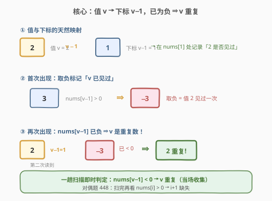
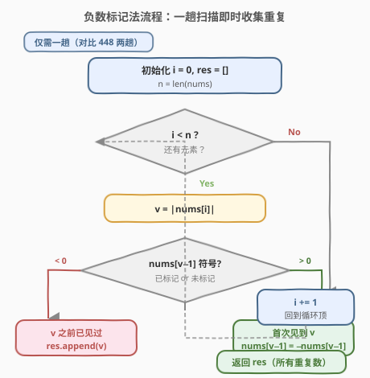
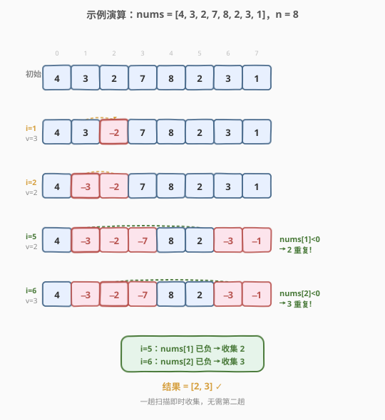

# LeetCode 数组中重复的数据 题解

## 1. 题目概述

- **标题 / 题号**：数组中重复的数据（#442，medium）
- **链接**：https://leetcode.cn/problems/find-all-duplicates-in-an-array/
- **难度**：中等
- **标签**：数组、原地哈希、原地标记

**题意**：给你一个长度为 `n` 的整数数组 `nums`，其中 `nums[i] ∈ [1, n]`，每个整数**出现一次或两次**。请你找出所有在 `nums` 中**出现两次**的整数，并以数组形式返回。

要求：$O(n)$ 时间且**不使用额外空间**（返回的输出列表不计入额外空间）。

**示例 1**：

```text
输入：nums = [4,3,2,7,8,2,3,1]
输出：[2,3]
解释：n = 8，2 和 3 各出现两次，其余各一次。
```

**示例 2**：

```text
输入：nums = [1,1,2]
输出：[1]
解释：n = 3，1 出现了两次。
```

**约束**：

- $n = \text{nums.length}$
- $1 \le n \le 10^5$
- $1 \le \text{nums}[i] \le n$
- 每个元素出现一次或两次

> 💡 **与 448 的对偶关系**：本题和 [448. 找到所有数组中消失的数字](./448_找到所有数组中消失的数字.md) 是同一模板的正反两面——同样的值域 $[1, n]$、同样的 $O(n)$/$O(1)$ 要求，只是一个问「谁没来」，一个问「谁来了两次」。一行判据之差，同一套负数标记法通杀。

## 2. 解题思路

### 2.1 暴力思路

- **哈希集合**：遍历时查 `set`，已在集合中即为重复。时间 $O(n)$ 达标，但集合占 $O(n)$ 额外空间，**不满足空间要求**。
- **计数数组**：开长度 $n+1$ 的 `count[]`，扫两遍取 `count[i] == 2`。同样 $O(n)$ 空间超标。
- **排序**：排序后相邻相等即重复。时间 $O(n \log n)$、空间看实现，但修改原数组且时间不达标。

> ⚠️ 三种朴素做法都败在「外部容器占 $O(n)$ 空间」。突破口与 448 完全一致：既然值域恰好是 $[1, n]$，一个值 $v$ 天然对应下标 $v-1$，可以在原数组上「打标记」记录是否见过。

### 2.2 核心观察：用下标当哈希键，已为负 ⇒ 重复



关键观察有两点：

1. **值与下标的天然映射**：`nums[i]` 的值 $v \in [1, n]$，对应下标 $v - 1$。「值 $v$ 是否见过」可以记录在下标 $v-1$ 处。
2. **用正负号编码「见过」**：遍历时对每个 $v = |\text{nums}[i]|$ 查看下标 $v-1$ 处的符号：
   - **仍为正** → $v$ 是**首次**出现，把 `nums[v-1]` 取负（标记为已见过）；
   - **已为负** → $v$ **之前已被标记**，说明 $v$ 出现过一次，此次是第二次 → **$v$ 是重复数**，当场加入结果。

> 💡 **与 448 的判据对比**：448 是「扫完所有标记后，再查谁仍为正→缺失」（需要两趟）；本题是「打标记的瞬间就能判定重复」（只需一趟）。因为「重复」的本质就是「第二次碰到同一个值」，而第一次碰到的痕迹（取负）正好留在下标 $v-1$ 处等它。

### 2.3 算法流程图



算法**只需一趟**（对比 448 的两趟）：

1. `i` 从 $0$ 扫到 $n-1$。
2. 令 $v = |\text{nums}[i]|$（取绝对值还原原始值）。
3. 判断 `nums[v - 1]` 的符号：
   - 若 **`< 0`**（已标记）：$v$ 是重复数，`res.append(v)`；
   - 若 **`> 0`**（未标记）：`nums[v - 1] = -nums[v - 1]`，记录 $v$ 已见过。
4. 返回 `res`。

> ⚠️ 为什么只需一趟？重复数的判定条件（`nums[v-1] < 0`）在**遍历到第二次出现时即刻成立**，无需等到全部标记完成。这正是本题比 448 少一趟的原因——448 问的是「谁从没被标记」，必须等所有标记打完才能下结论。

### 2.4 示例演算

以 `nums = [4,3,2,7,8,2,3,1]`，$n = 8$ 为例（重复数为 2、3）：



| 步骤 | i | \|nums[i]\| | nums[v−1] | 动作 | 数组状态 | 说明 |
|------|---|-------------|-----------|------|----------|------|
| 1 | 0 | 4 | 7 > 0 | 标记取负 | [4, 3, 2, **−7**, 8, 2, 3, 1] | 值 4 首见 |
| 2 | 1 | 3 | 2 > 0 | 标记取负 | [4, 3, **−2**, −7, 8, 2, 3, 1] | 值 3 首见 |
| 3 | 2 | 2 | 3 > 0 | 标记取负 | [4, **−3**, −2, −7, 8, 2, 3, 1] | 值 2 首见 |
| 4 | 3 | 7 | 3 > 0 | 标记取负 | [4, −3, −2, −7, 8, 2, **−3**, 1] | 值 7 首见 |
| 5 | 4 | 8 | 1 > 0 | 标记取负 | [4, −3, −2, −7, 8, 2, −3, **−1**] | 值 8 首见 |
| 6 | 5 | 2 | **−3 < 0** | **收集 2** | [4, −3, −2, −7, 8, 2, −3, −1] | 值 2 已见 → **重复!** |
| 7 | 6 | 3 | **−2 < 0** | **收集 3** | [4, −3, −2, −7, 8, 2, −3, −1] | 值 3 已见 → **重复!** |
| 8 | 7 | 1 | 4 > 0 | 标记取负 | [**−4**, −3, −2, −7, 8, 2, −3, −1] | 值 1 首见 |

最终结果为 **[2, 3]** ✓。注意第 6、7 步**不修改数组**（已为负不再取负），只把重复数收进结果。

## 3. 参考代码

### C++

```cpp
class Solution {
  public:
    vector<int> findDuplicates(vector<int>& nums) {
        int n = nums.size();
        vector<int> res;
        for (int i = 0; i < n; ++i) {
            int v = abs(nums[i]);
            if (nums[v - 1] < 0) {
                res.push_back(v);
            } else {
                nums[v - 1] = -nums[v - 1];
            }
        }
        return res;
    }
};
```

### Python

```python
class Solution:
    def findDuplicates(self, nums: List[int]) -> List[int]:
        res = []
        for x in nums:
            v = abs(x)
            if nums[v - 1] < 0:
                res.append(v)
            else:
                nums[v - 1] = -nums[v - 1]
        return res
```

> 💡 Python 版直接 `for x in nums` 遍历值而非下标，更简洁。`abs` 不可省——`nums[i]` 可能在前几轮被标记成负数，直接用会越界或错位。注意已为负时**只收集不取负**，避免「负负得正」抹掉标记（虽有 `< 0` 守卫本就不会进 else 分支，但显式分离两个分支更清晰）。

## 4. 复杂度分析

| 维度 | 复杂度 | 说明 |
|------|--------|------|
| 时间复杂度 | $O(n)$ | 单趟遍历 $n$ 次，每次 $O(1)$ 操作 |
| 空间复杂度 | $O(1)$ | 仅常数变量，原地修改输入数组；返回列表不计入额外空间 |

> 💡 这是该题的最优解：时间已达下界 $O(n)$（必须至少看一遍所有元素），空间为常数。相比 448 还少一趟扫描——因为「重复」在第二次出现时即可当场判定，不必等全局标记完成。

## 5. 扩展：加 n 标记法与对偶题对比

### 5.1 另一种原地写法：加 n 编码

若不想用负号（例如值可能为 0 的变体题），可用**加 $n$** 编码存在性：首次见 $v$ 时把 `nums[v-1]` 加上 $n$，判定重复时检查 `nums[v-1] > n`（已被加过一次）。读取原始值用 `(nums[i] - 1) % n + 1` 还原。

```python
class Solution:
    def findDuplicates(self, nums: List[int]) -> List[int]:
        n = len(nums)
        res = []
        for x in nums:
            v = (x - 1) % n + 1
            if nums[v - 1] > n:
                res.append(v)
            else:
                nums[v - 1] += n
        return res
```

两种编码同构，都是「用下标作 key、用数值的某个维度作 mark」。负号法更直观，加 $n$ 法在值域含 0 时更稳。

### 5.2 对偶题：找缺失

[448. 找到所有数组中消失的数字](./448_找到所有数组中消失的数字.md) 与本题互为对偶——同一标记法，判据一正一反：

| 题 | 目标 | 判据 | 趟数 |
|----|------|------|------|
| 448 | 找**缺失**（谁没来） | 标记全部打完后，`nums[i] > 0` → $i+1$ 缺失 | 两趟 |
| 442 | 找**重复**（谁来了两次） | 标记瞬间，`nums[v-1] < 0` → $v$ 重复 | 一趟 |

> 💡 一行判据之差：448 的「缺失」是**全局属性**（必须等所有标记完成才能判断谁从没被碰过），故需两趟；442 的「重复」是**局部事件**（第二次出现时立刻可判），故只需一趟。这种「同一模板、判据决定趟数」的对比，是理解原地标记法本质的好抓手。

## 6. 面试要点

1. **为什么取绝对值 `abs(nums[i])`？不取会怎样？**
   - 遍历时 `nums[i]` 可能已被前一轮标记成负数（如值 3 标记了 `nums[2]`，之后遍历到下标 2 时读到 $-2$）。直接用负数索引会越界。取 `abs` 还原原始值才能正确定位标记位置。

2. **为什么本题只需一趟，而 448 需要两趟？**
   - 「重复」的判定是局部的：第二次遇到同一个 $v$ 时，`nums[v-1]` 已被第一次取负，当场即可判定，无需等待。「缺失」是全局属性：必须等所有标记打完，才能知道哪个位置从没被碰过（仍为正）。所以 448 多一趟收集。

3. **已为负时为什么不再取负？会不会「负负得正」误取消标记？**
   - 代码用 `if/else` 分支：`< 0` 走收集分支，`> 0` 才取负。已为负的不会再进取负分支，故不会「负负得正」。即便误取负，由于同值只出现两次，第二次取负会抹掉标记——所以**分支隔离**是关键，不能写成无条件取负后再判断。

4. **如果题目改为「值域含 0 或允许负数」怎么办？**
   - 负号法依赖「原始值恒正」才能用符号位编码。若值可能为 0 或负，改用**加 $n$ 编码**（见 5.1）：用是否超过 $n$ 判定存在性，原始值用模运算还原，对值域无符号限制。

5. **本题与 287（寻找重复数）有何异同？**
   - 同：都是 $[1, n]$ 范围找重复。异：本题**允许修改数组**且只要求 $O(n)$ 时间，故用原地标记最直接；287 有「不能修改数组」的进阶限制，逼出 **Floyd 快慢指针**（把数组当链表找环入口）或 $O(n \log n)$ 二分答案。面试时讲清「限制不同→解法不同」体现深度。

## 同类练习题

| # | 题目 | 与本题的关联 |
|---|------|-------------|
| 448 | [找到所有数组中消失的数字](https://leetcode.cn/problems/find-all-numbers-disappeared-in-an-array/)（[题解](./448_找到所有数组中消失的数字.md)） | 本题的正面对偶——同一标记法找缺失，两趟收集，体会判据与趟数的关系 |
| 287 | [寻找重复数](https://leetcode.cn/problems/find-the-duplicate-number/)（[题解](../0201-0300/287_寻找重复数.md)） | 同样找重复但不允许修改数组，Floyd 快慢指针的招牌题，对比两种思路 |
| 41 | [缺失的第一个正数](https://leetcode.cn/problems/first-missing-positive/)（[题解](../0001-0100/41_缺失的第一个正数.md)） | 困难版，值域为任意整数，需先缩小范围再原地哈希，循环交换法 |
| 645 | [错误的集合](https://leetcode.cn/problems/set-mismatch/) | 找重复 + 找缺失的综合题，标记法一次扫描同时解决两个问题 |
| 268 | [丢失的数字](https://leetcode.cn/problems/missing-number/) | 值域 $[0, n]$，异或法或求和法均可，简单版热身 |
