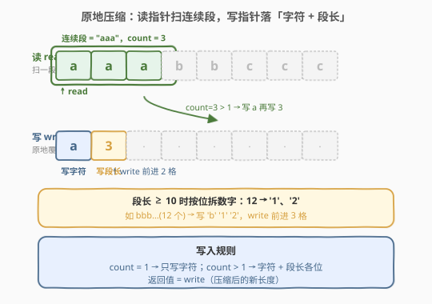
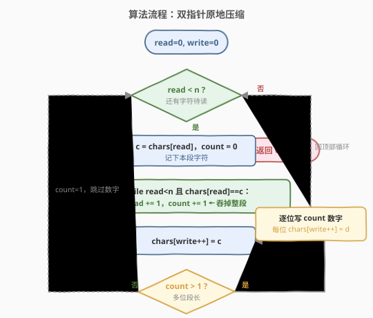
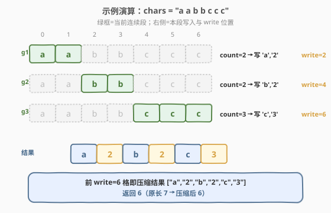

# 压缩字符串

- **题目名称**：压缩字符串
- **链接**：[443. 压缩字符串](https://leetcode.cn/problems/string-compression/)
- **难度**：中等
- **标签**：双指针、字符串、数组、原地算法

## 1. 题目概述

给定一个字符数组 `chars`，使用下述算法对其做**原地**压缩：

- 从左到右扫描，把**连续相同字符**作为一组；
- 对每一组，先写**字符本身**，若组长度 $>1$ 则再跟上**组长度的十进制各位数字**；
- 长度为 $1$ 的组**只写字符、不写数字**。

修改必须在输入数组上**原地**完成，函数返回压缩后的**新长度**。数组前 `新长度` 个位置存放压缩结果，其后内容忽略。

> ⚠️ 必须用 $O(1)$ 额外空间（输出不计入额外空间，但不得开辟新数组承载结果）。组长的数字是按十进制位拆开存入的，例如长度 $12$ 要写成字符 `'1'`、`'2'` 两个格子，而非单个字符。

**示例 1**：

```text
输入：chars = ["a","a","b","b","c","c","c"]
输出：6
解释：3 组连续段 "aa"/"bb"/"ccc" → 压缩为 "a2b2c3"。
      返回 6，数组前 6 个变为 ["a","2","b","2","c","3"]。
```

**示例 2**：

```text
输入：chars = ["a"]
输出：1
解释：单个字符，组长度为 1，只写字符不写数字。返回 1，数组前 1 个为 ["a"]。
```

**示例 3**：

```text
输入：chars = ["a","b","b","b","b","b","b","b","b","b","b","b","b"]
输出：4
解释："a"(1 个) + "b"×12 → 压缩为 "ab12"。12 按位拆为 '1','2'。
      返回 4，数组前 4 个变为 ["a","b","1","2"]。
```

**约束条件**：

- $1 \leq \text{chars.length} \leq 2000$
- `chars[i]` 为小写/大写英文字母、数字或符号
- 必须原地修改，返回新长度

> 💡 关键观察：压缩后的长度**永远不会超过**原长度（每段至少被压成「字符」一格，最多再补几位数字，但同段字符数 $\geq$ 数字位数）。因此**原地覆写是安全的**——写指针永远追不上读指针，不会覆盖尚未读取的字符。这正是「双指针原地压缩」可行的根基。

---

## 2. 解题思路

### 2.1 暴力思路

扫描统计每段长度，把结果写进一个**新数组**，最后再拷回 `chars`。逻辑正确，但用了 $O(n)$ 额外空间，违反题目「原地」要求（虽然 LeetCode 不严格检查空间，但面试中会被追问）。

> 💡 暴力的浪费在于：把「读」和「写」割裂成两块存储。其实压缩输出更短，可以**直接在原数组前面覆写**，用一个写指针记录落点即可。这引出双指针原地算法。

### 2.2 核心观察：双指针原地覆写



设两个指针：

- **读指针 `read`**：从头到尾扫描，识别「连续相同字符」组成的段；
- **写指针 `write`**：在数组头部依次落写压缩结果。

对每一段：

1. 记下当前字符 `c = chars[read]`，开始计数 `count = 0`；
2. **内层循环**：只要 `read < n` 且 `chars[read] == c`，就 `read++`、`count++`，把整段连续字符「吞掉」；
3. `chars[write++] = c`（写字符）；
4. 若 `count > 1`，把 `count` 的十进制各位数字转成字符依次写入（如 `12 → '1','2'`）。

处理完一段后 `read` 已指向下一段首字符，外层循环继续，直到 `read == n`。最终 `write` 即为新长度。

> ⚠️ **为什么覆写是安全的？** 每段至少贡献 $1$ 个读字符却至少占 $1$ 个写格子（字符本身）；段长 $\geq 2$ 时写「字符 + 数字位」，而数字位数 $\leq$ 段长 $-1$（例如 $12$ 段长写 $1+2=3$ 格 $\leq 12$）。因此**写指针始终 $\leq$ 读指针**，覆写位置永远在已读区域，不会破坏未读数据。

### 2.3 算法流程图



状态与变量：

- `read`：读指针，初始 $0$；
- `write`：写指针，初始 $0$；
- `n = len(chars)`。

每轮迭代：

1. 若 `read == n`：结束，返回 `write`；
2. 取 `c = chars[read]`，`count = 0`；
3. `while read < n and chars[read] == c: read += 1; count += 1`；
4. `chars[write++] = c`；
5. 若 `count > 1`：遍历 `str(count)` 的每个数字字符 `d`，执行 `chars[write++] = d`；
6. 回到第 1 步。

> 💡 第 5 步用 `to_string(count)` 把段长转字符串后逐字符写入，是最简洁的写法；也可手动逐位剥离（`while count: digits.push_front(count % 10); count /= 10`），但 `to_string` 已是 $O(\log \text{count})$ 且不增加渐近空间（数字长度 $\leq 4$，常数级）。

### 2.4 示例演算

以 `chars = ["a","a","b","b","c","c","c"]` 为例（下标 $0\sim6$）：



| 段 | 起始 read | 字符 | count | read 推进到 | 写入内容 | write 推进到 |
|----|-----------|------|-------|-------------|----------|--------------|
| g1 | 0 | a | 2 | 2 | `'a'`,`'2'` | 2 |
| g2 | 2 | b | 2 | 4 | `'b'`,`'2'` | 4 |
| g3 | 4 | c | 3 | 7（=n） | `'c'`,`'3'` | 6 |

`read == 7 == n`，返回 `write = 6`。前 6 格为 `["a","2","b","2","c","3"]` ✓。

> 💡 留意示例 3 的 `12`：段长两位数时第 5 步写入 `'1'`、`'2'` 两格，`write` 推进 $3$（字符 `b` + 两位数字）。这正是流程图「逐位写 count 数字」分支的作用。

---

## 3. 参考代码

### C++

```cpp
class Solution {
  public:
    int compress(vector<char>& chars) {
        int n = chars.size();
        int write = 0, read = 0;
        while (read < n) {
            char c = chars[read];
            int count = 0;
            while (read < n && chars[read] == c) {
                ++read;
                ++count;
            }
            chars[write++] = c;                 // 写字符
            if (count > 1) {
                for (char d : to_string(count)) // 逐位写段长
                    chars[write++] = d;
            }
        }
        return write;
    }
};
```

### Python

```python
class Solution:
    def compress(self, chars: list[str]) -> int:
        n = len(chars)
        write = read = 0
        while read < n:
            c = chars[read]
            count = 0
            while read < n and chars[read] == c:
                read += 1
                count += 1
            chars[write] = c                    # 写字符
            write += 1
            if count > 1:
                for d in str(count):            # 逐位写段长
                    chars[write] = d
                    write += 1
        return write
```

> ⚠️ Python 注意：`chars` 是 `list[str]`，写入的数字也必须是**单字符字符串**（`str(count)` 的逐字符迭代正好满足）。不要写成 `chars[write] = count`（整数）。

---

## 4. 复杂度分析

| 维度 | 复杂度 | 说明 |
|------|--------|------|
| 时间复杂度 | $O(n)$ | `read` 从 $0$ 单调推进到 $n$，每个字符被读一次；写指针总写入量 $\leq n$，故整体线性 |
| 空间复杂度 | $O(1)$ | 仅 `read`/`write`/`count` 等常数变量；`to_string(count)` 产生至多 $4$ 字符（$n \leq 2000$），常数级，不计入额外空间 |

> 💡 这是该题的最优解：线性时间、常数空间，且满足「原地」要求。

---

## 5. 扩展：手动按位拆数字（不用 to_string）

某些面试场景要求完全不依赖 `to_string`，可手动从低位到高位剥离再翻转写入：

```cpp
if (count > 1) {
    int start = write;
    int t = count;
    while (t) {                       // 低位 → 高位
        chars[write++] = '0' + t % 10;
        t /= 10;
    }
    reverse(chars.begin() + start, chars.begin() + write); // 翻回高位在前
}
```

逻辑等价，只是把 `to_string` 拆成「逐位取余 + 反转」。时间仍 $O(\log \text{count})$，空间 $O(1)$。

> 💡 另一常见问法：「能否用 `std::to_string`？」可以——它返回的临时 `string` 长度 $\leq 4$，是常数级临时对象，不违反 $O(1)$ 额外空间的渐近含义。若面试官坚持要严格 $O(1)$ 字节级，再用上面的手动拆位版本。

---

## 6. 面试要点

1. **为什么原地覆写不会覆盖未读字符？**
   - 因为压缩输出**不比原串长**：每段至少 $1$ 个读字符对应至少 $1$ 个写格子（字符本身），段长 $\geq 2$ 时数字位数 $\leq$ 段长 $-1$。归纳可知 `write <= read` 恒成立，覆写永远落在已读区域。

2. **段长为 1 时为什么不写数字？**
   - 题目规定：组长度为 $1$ 时只写字符。若也写 `'1'`，反而把单个字符撑成两格，压缩变「膨胀」。例如 `"a"` 应为 `["a"]` 而非 `["a","1"]`。

3. **段长是多位数（如 12）怎么处理？**
   - 把段长转成字符串，**逐个字符**写入：`12 → '1','2'`。不能用单个字符存 `12`（一个格子只能放一个字符）。流程图中 `count > 1` 分支正是做这件事。

4. **这题和「移除元素」(27) 的双指针有何异同？**
   - [27. 移除元素](https://leetcode.cn/problems/remove-element/)（[题解](../0001-0100/27_移除元素.md)）也是读/写双指针原地覆写，但写指针只是「筛选保留」原字符，每读一格写最多一格。本题写指针要**扩展**写出字符 + 数字，且写量随段长变化。两者同属「读写双指针原地修改」家族，但本题多了「按位拆数字」这一步。

5. **如果允许 O(n) 额外空间，思路能否更简单？**
   - 可以：扫一遍把压缩结果存进新 `vector`，最后 `chars = newVec` 返回长度。逻辑直观但失去原地性，面试中应主动提「可优化为原地双指针」展示对空间复杂度的敏感度。

---

## 7. 同类练习题

- [27. 移除元素](https://leetcode.cn/problems/remove-element/)（[题解](../0001-0100/27_移除元素.md)）：读写双指针原地筛选保留，对比「每读一格写最多一格」与本题「写量随段长扩展」
- [80. 删除有序数组中的重复项 II](https://leetcode.cn/problems/remove-duplicates-from-sorted-array-ii/)（[题解](../0001-0100/80_删除有序数组中的重复项II.md)）：读写双指针 + 计数判定，同为原地覆写家族
- [186. 反转字符串中的单词 II](https://leetcode.cn/problems/reverse-words-in-a-string-ii/)：原地字符数组操作，双指针/反转技巧综合
- [394. 字符串解码](https://leetcode.cn/problems/decode-string/)：本题的「逆操作」——把压缩形式 `a2[b3[c]]` 展开成原串，栈模拟
- [271. 字符串的编码与解码](https://leetcode.cn/problems/encode-and-decode-strings/)：另一类字符串压缩编码（长度前缀法），对比不同的压缩策略
