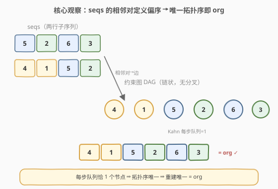

# 序列重建

- **题目名称**：序列重建
- **链接**：[444. 序列重建](https://leetcode.cn/problems/sequence-reconstruction/)
- **难度**：中等
- **标签**：图、拓扑排序、广度优先搜索

## 1. 题目概述

给定一个长度为 `n` 的序列 `org`，它是 `1` 到 `n` 的一个**排列**。再给定一组子序列 `seqs`，请判断 `org` 是否是**唯一**能由 `seqs`「重建」出来的序列。

「重建」指构造 `seqs` 中所有序列的**最短公共超序列**（即最短的、把 `seqs` 里每条序列都作为子序列包含在内的序列）。若这样的序列**存在且唯一**，并且恰好等于 `org`，返回 `true`；否则返回 `false`。

**示例 1**：

```text
输入：org = [1,2,3], seqs = [[1,2],[1,3]]
输出：false
解释：[1,2,3] 和 [1,3,2] 都能作为最短公共超序列，重建不唯一。
```

**示例 2**：

```text
输入：org = [1,2,3], seqs = [[1,2]]
输出：false
解释：seqs 只能约束出 [1,2]，数字 3 从未出现，无法重建出 [1,2,3]。
```

**示例 3**：

```text
输入：org = [1,2,3], seqs = [[1,2],[1,3],[2,3]]
输出：true
解释：1<2、1<3、2<3 三条约束合起来强制 1→2→3 唯一顺序，恰好等于 org。
```

**示例 4**：

```text
输入：org = [4,1,5,2,6,3], seqs = [[5,2,6,3],[4,1,5,2]]
输出：true
解释：两条子序列的相邻对拼出链 4→1→5→2→6→3，拓扑序唯一且等于 org。
```

**约束条件**：

- `n == org.length`
- `1 <= n <= 10^4`
- `1 <= sum(seqs[i].length) <= 10^5`
- `1 <= seqs[i][j] <= n`

> 💡 本题本质是 [207. 课程表](../0201-0300/207_课程表.md) 的进阶：不再只问"能不能排（有无环）"，而是问"**能不能唯一排**，且结果恰为 `org`"。关键在于 Kahn 拓扑排序过程中，**每一步队列里只能有一个入度为 0 的节点**——多一个就意味着此处顺序可互换，重建不唯一。

---

## 2. 解题思路

### 2.1 暴力思路：枚举所有排列

最直白的做法：枚举 `1..n` 的所有排列（共 $n!$ 个），对每个排列检查它是否是 `seqs` 的公共超序列（即每条 `seq` 是否为它的子序列），统计合法排列个数。若合法排列**恰有 1 个**且等于 `org`，返回 `true`。

致命缺陷：$n \le 10^4$ 时 $n!$ 是天文数字，单次枚举都做不到。而且即便 $n$ 很小，"逐排列检查所有 `seq`"也极其浪费——它没有利用 `seqs` 提供的**偏序结构**。

> ⚠️ 暴力法在 $n \ge 10$ 时就已经不可行。本题考的是把"唯一性"转化为**拓扑排序的唯一性判定**，而不是搜索。

### 2.2 核心观察：相邻对建图 + 拓扑序唯一性

**两个关键洞察**：

1. **相邻对即充分约束**：一条子序列 `[a, b, c, d]` 要求 $a$ 在 $b$ 前、$b$ 在 $c$ 前、$c$ 在 $d$ 前。只需对**相邻元素**加有向边 `a→b`、`b→c`、`c→d`，传递性会自动覆盖 $a \prec c$、$a \prec d$ 等长程约束。所以建图只需扫相邻对，无需对每对元素加边——这正是 [269. 火星词典](../0201-0300/269_火星词典.md) 同款套路。

2. **唯一拓扑序 ⟺ 每步队列恰 1 个节点**：Kahn 算法每轮把所有入度归零的节点一起入队。若某轮队列里有 $\ge 2$ 个节点，说明它们之间无任何先后约束，**可以互换**，重建不唯一。反之，若整个流程中**每轮队列大小都恰为 1**，则拓扑序被完全钉死，重建唯一。



**判定流程**：

- 把 `seqs` 的所有相邻对 `(a, b)` 转成有向边 `a→b`（**去重**，避免重复边把入度算多），计算各点入度。
- Kahn BFS：初始把入度 0 的节点入队。
- 每轮要求 `queue.size() == 1`；否则返回 `false`。
- 弹出唯一的 `u`，必须等于 `org[idx]`（否则即使唯一也不是 `org`）；`idx++`，把 `u` 的出边删掉、邻点入度归零者入队。
- 流程结束后 `idx == n` 则返回 `true`。

> 💡 **为什么相邻对就够了？** 子序列约束 "$a$ 在 $b$ 前" 由相邻对的传递闭包完全表达：长序列 `[a,b,c]` 拆成 `a→b`、`b→c`，由传递性自动得到 `a→c`。所以只需加相邻边，图既稀疏又完备。这也是为什么复杂度是 $O(V+E)$ 而非 $O(V^2)$。

### 2.3 算法流程图

![算法流程：建图 → 入度入队 → 循环校验队列大小为 1 且弹出值等于 org[i]](../images/seqrecon_algorithm_flow.svg)

**完整步骤**：

1. **建图**：遍历 `seqs`，对每条 `seq` 的相邻对 `(a, b)` 加边 `a→b`；用集合去重；顺带校验所有元素值在 `[1, n]` 内、无自环 `a == b`。
2. **覆盖性校验**：`org` 中的 `1..n` 每个节点都必须在 `seqs` 中出现过——否则那个节点无任何约束，重建必然不唯一（漏号）。
3. **Kahn BFS**：入度 0 者入队；循环中要求 `queue.size() == 1`，弹出 `u` 必须 `== org[idx]`，`idx++`，松弛邻点入度。
4. **终止**：`idx == n` 返回 `true`；中途任何一步违反约束即 `false`。

> ⚠️ 三类必须提前判 `false` 的边界：① `seqs` 里出现 `[1, n]` 范围外的值；② `org` 某个编号在 `seqs` 中从未出现（如示例 2 的 `3`）；③ 出现自环 `a→a` 或成环（Kahn 流程结束时 `idx < n`）。其中成环会被"队列提前变空但 `idx < n`"自然捕获，无需单独 DFS 判环。

### 2.4 示例演算

以示例 3 为例：`org = [1,2,3]`，`seqs = [[1,2],[1,3],[2,3]]`。

![示例演算：每步队列恰 1 节点，弹出顺序 [1,2,3] = org](../images/seqrecon_walkthrough.svg)

相邻对建图得到 `1→2`、`1→3`、`2→3`，入度 `1:0, 2:1, 3:2`。

| 步骤 | 队列 | 弹出 u | org[i] | 入度变化 | idx |
|------|------|--------|--------|----------|-----|
| 初始 | `[1]` | — | — | 1:0 2:1 3:2 | 0 |
| 1 | `[1]` | 1 | 1 ✓ | 2:0↓ 3:1↓ | 1 |
| 2 | `[2]` | 2 | 2 ✓ | 3:0↓ | 2 |
| 3 | `[3]` | 3 | 3 ✓ | — | 3 |

每步队列大小都为 1，弹出顺序 `[1,2,3]` 恰为 `org`，`idx = 3 = n`，返回 `true`。

> 💡 **对照示例 1**（`seqs = [[1,2],[1,3]]`，无 `2→3` 边）：弹出 `1` 后，`2` 和 `3` 的入度**同时**归零，队列变成 `[2, 3]` 大小为 2 → 立即返回 `false`。这正是"少了 `2<3` 这条约束，2 和 3 可互换"的直观体现。补上 `[2,3]`（示例 3）就把 2 钉在 3 前面，队列重归单节点，唯一性恢复。

---

## 3. 参考代码

### C++

```cpp
class Solution {
  public:
    bool sequenceReconstruction(vector<int>& org, vector<vector<int>>& seqs) {
        int n = org.size();
        vector<vector<int>> adj(n + 1);
        vector<int> indegree(n + 1, 0);
        set<pair<int, int>> edges;                 // 去重边
        vector<char> seen(n + 1, 0);               // seqs 中出现过的节点
        bool anySeq = false;

        for (auto& seq : seqs) {
            anySeq = true;
            for (int x : seq) {                    // 值域校验
                if (x < 1 || x > n) return false;
                seen[x] = 1;
            }
            for (int i = 0; i + 1 < (int)seq.size(); ++i) {
                int a = seq[i], b = seq[i + 1];
                if (a == b) return false;          // 自环非法
                if (edges.insert({a, b}).second) { // 仅新边才计入
                    adj[a].push_back(b);
                    indegree[b]++;
                }
            }
        }
        if (!anySeq) return n == 0;                // seqs 全空
        for (int i = 1; i <= n; ++i)               // org 每个点必须被 seqs 覆盖
            if (!seen[i]) return false;

        queue<int> q;
        for (int i = 1; i <= n; ++i)
            if (indegree[i] == 0) q.push(i);

        int idx = 0;
        while (!q.empty()) {
            if (q.size() != 1) return false;       // 拓扑序不唯一
            int u = q.front(); q.pop();
            if (u != org[idx]) return false;       // 顺序不符 org
            ++idx;
            for (int v : adj[u])
                if (--indegree[v] == 0) q.push(v);
        }
        return idx == n;                           // idx<n 说明成环
    }
};
```

### Python

```python
from collections import deque

class Solution:
    def sequenceReconstruction(self, org: List[int], seqs: List[List[int]]) -> bool:
        n = len(org)
        adj = [[] for _ in range(n + 1)]
        indegree = [0] * (n + 1)
        edges = set()                              # 去重边
        seen = [False] * (n + 1)
        any_seq = False

        for seq in seqs:
            any_seq = True
            for x in seq:                          # 值域校验
                if x < 1 or x > n:
                    return False
                seen[x] = True
            for a, b in zip(seq, seq[1:]):
                if a == b:                         # 自环非法
                    return False
                if (a, b) not in edges:            # 仅新边才计入
                    edges.add((a, b))
                    adj[a].append(b)
                    indegree[b] += 1

        if not any_seq:
            return n == 0
        for i in range(1, n + 1):                  # org 每个点必须被 seqs 覆盖
            if not seen[i]:
                return False

        q = deque([i for i in range(1, n + 1) if indegree[i] == 0])
        idx = 0
        while q:
            if len(q) != 1:                        # 拓扑序不唯一
                return False
            u = q.popleft()
            if u != org[idx]:                      # 顺序不符 org
                return False
            idx += 1
            for v in adj[u]:
                indegree[v] -= 1
                if indegree[v] == 0:
                    q.append(v)
        return idx == n
```

> 💡 **两个易错点**：① **边必须去重**——同一条 `(a,b)` 在多个 `seq` 里重复出现时，入度只能 +1 一次，否则 `b` 永远归不了零误判成环。C++ 用 `set<pair>`、Python 用 `set` of 元组。② **覆盖性校验**——`org` 里的每个 `1..n` 都必须在 `seqs` 中出现过，否则该节点毫无约束、可放在任意位置，重建必然不唯一（示例 2 的 `3`）。

---

## 4. 复杂度分析

| 维度 | 复杂度 | 说明 |
|------|--------|------|
| **时间复杂度** | $O(V + E)$ | 建图遍历所有相邻对 $O(E)$（去重用 `set` 单次 $O(\log E)$，总 $O(E \log E)$，但 $E \le 10^5$ 可接受）；Kahn 每点入队出队各一次、每条边松弛一次 $O(V+E)$；覆盖校验 $O(V)$ |
| **空间复杂度** | $O(V + E)$ | 邻接表 $O(V+E)$、入度数组 $O(V)$、去重边集合 $O(E)$、队列 $O(V)$ |

> ⚠️ 若追求严格 $O(V+E)$ 时间，可用邻接矩阵/哈希集合代替 `set<pair>` 去重（如给每个节点的出边挂一个 `unordered_set`），但题目 $E \le 10^5$，`set` 的 $O(E \log E)$ 完全在时限内，代码更简洁。$V = n \le 10^4$、$E \le \sum \text{len} \le 10^5$，整体内存几十 MB 量级，安全。

---

## 5. 扩展：最短公共超序列视角与唯一性

### 5.1 为什么"唯一拓扑序"等价于"唯一最短公共超序列"

`seqs` 的相邻对构成偏序 $\prec$。任意一个合法的公共超序列必定是 $\prec$ 的一个**线性扩展**（拓扑排序）。反之，$\prec$ 的任一线性扩展都满足所有相邻对约束，从而是 `seqs` 的公共超序列；又因为它恰好包含 `1..n` 各一次、长度为 $n$，已是最短可能长度。

因此："最短公共超序列的集合" = "偏序 $\prec$ 的所有线性扩展"。**唯一**最短公共超序列 ⟺ 偏序是**全序** ⟺ 拓扑序唯一 ⟺ Kahn 每步队列大小为 1。

> 💡 这条等价把一个看似需要搜索的"超序列枚举"问题，转化为一次 $O(V+E)$ 的拓扑排序，是本题的核心降维。

### 5.2 三类失败情形速查

| 失败情形 | 触发位置 | 对应示例 |
|----------|----------|----------|
| 值越界 / 自环 | 建图阶段 | `org=[1]`, `seqs=[[1,2]]`（2 越界） |
| 节点未被 `seqs` 覆盖 | 覆盖校验 | 示例 2：`3` 从未出现 |
| 拓扑序不唯一 | `queue.size() != 1` | 示例 1：`2`、`3` 同时归零 |
| 顺序不符 `org` | `u != org[idx]` | 唯一但顺序错 |
| 成环 | 结束时 `idx < n` | `[1,2],[2,1]` 形成环 |

---

## 6. 面试要点

1. **为什么相邻对建图就够了？**

   - 子序列约束的**传递性**会自动覆盖长程关系：`[a,b,c]` 拆成 `a→b`、`b→c` 后，`a≺c` 由传递闭包自然成立，无需显式加 `a→c`。这样图只有 $O(E)$ 条边（$E$ = 所有 `seq` 相邻对总数），而非 $O(V^2)$。与 [269. 火星词典](../0201-0300/269_火星词典.md) 完全同构。

2. **如何判断"重建唯一"？**

   - Kahn 流程中**每一轮**队列大小都必须恰为 1。某轮 $\ge 2$ 说明这些节点之间无先后约束、可互换，重建不唯一。等价地，偏序必须是**全序**（任意两点可比）。

3. **为什么还要校验 `u == org[idx]`？**

   - "唯一"只保证拓扑序被钉死，但不保证它就是 `org`。例如 `org=[1,2,3]`、`seqs=[[2,1],[1,3],[3,2]`（假设无环且唯一）顺序可能是 `[2,1,3]`，唯一但不等于 `org`，仍应返回 `false`。两道闸门（唯一性 + 等于 `org`）缺一不可。

4. **为什么要去重边？**

   - 同一对 `(a,b)` 可能在多条 `seq` 中重复出现。若不去重，`b` 的入度会被多算，永远归不了零，误判成环。用 `set` 记录已加的边，只在首次出现时 `indegree[b]++`。

5. **`seqs` 里的节点没覆盖 `org` 全部编号怎么办？**

   - 那个编号毫无约束，可插在任意位置，重建必然不唯一，直接 `false`（示例 2 的 `3`）。所以必须做覆盖性校验：`seen[i]` 对所有 `i ∈ [1,n]` 为真。

> 💡 **一句话总结**：444 = [207. 课程表](../0201-0300/207_课程表.md) 的"唯一性 + 等于指定序"双闸门版。相邻对建图 → Kahn 拓扑排序 → 每步**队列大小为 1**（唯一性）且**弹出值等于 `org[idx]`**（等于指定序）→ `idx == n` 即 `true`。$O(V+E)$ 时间空间，去重边 + 覆盖校验是两个必踩的坑。

---

## 7. 同类练习题

- [207. 课程表](https://leetcode.cn/problems/course-schedule/)（[题解](../0201-0300/207_课程表.md)）：Kahn 拓扑排序判环的母题，本题的判环部分直接复用
- [210. 课程表 II](https://leetcode.cn/problems/course-schedule-ii/)（[题解](../0201-0300/210_课程表II.md)）：Kahn 出队顺序即拓扑序，本题把"出队顺序"拿来和 `org` 逐位比对
- [269. 火星词典](https://leetcode.cn/problems/alien-dictionary/)（[题解](../0201-0300/269_火星词典.md)）：同样是"相邻对建图 + 拓扑排序"，本题的建图套路直接迁移自火星词典
- [1136. 平行课程](https://leetcode.cn/problems/parallel-courses/)：Kahn 按层 BFS，求最长链层数，拓扑序的另一种应用
- [802. 找到最终的安全状态](https://leetcode.cn/problems/find-eventual-safe-states/)：DFS 三色判环变体，对照 Kahn 的另一种判环思路
