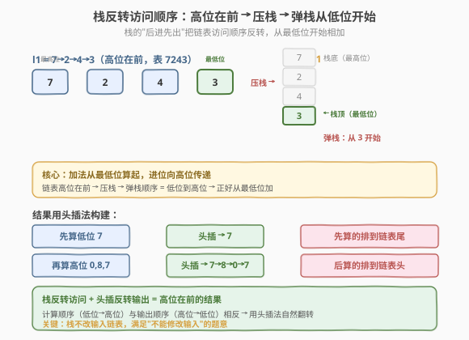
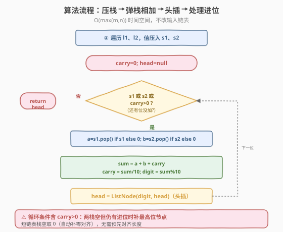
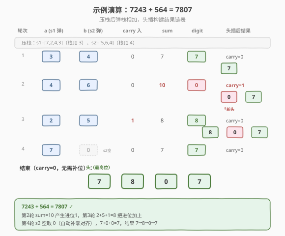

# LeetCode 两数相加 II 题解

## 1. 题目概述

- **标题 / 题号**：两数相加 II（#445，medium）
- **链接**：https://leetcode.cn/problems/add-two-numbers-ii/
- **难度**：中等
- **标签**：链表、栈

**题意**：给定两个**非空**链表，分别表示两个**非负整数**。链表的每个节点存储一位数字，且**按最高位在前**的顺序排列（即链表头是最高位）。请将这两个数相加，返回一个**同样按最高位在前**表示和的链表。**不能修改输入链表**（除非是返回的链表本身）。

**示例 1**：

```text
输入：l1 = [7,2,4,3], l2 = [5,6,4]
输出：[7,8,0,7]
解释：7243 + 564 = 7807，按高位在前返回 7→8→0→7。
```

**示例 2**：

```text
输入：l1 = [2,4,3], l2 = [5,6,4]
输出：[8,0,7]
解释：243 + 564 = 807，返回 8→0→7。
```

**示例 3**：

```text
输入：l1 = [0], l2 = [0]
输出：[0]
```

**约束**：

- 链表长度范围 `[1, 100]`
- `0 <= Node.val <= 9`
- 题目数据保证链表表示的数字无前导零，但数字 `0` 本身除外

> 💡 这是 [两数相加（2）](../0001-0100/2_两数相加.md) 的姊妹题：2 题链表是**低位在前**（头是最低位），可以直接从头顺序加进位；445 题链表是**高位在前**（头是最高位），无法顺序加——必须从最低位算起。两种解法：① **栈**反转访问顺序（推荐，不改输入）；② 反转链表后按 2 题做（但要改输入，违反题意）。栈法天然满足"不改输入"，是正解。

## 2. 解题思路

### 2.1 暴力思路：转成数字相加再转回链表

遍历两个链表把数字拼出来（`7243` 和 `564`），相加得 `7807`，再逐位拆成链表。看起来直观，但有致命缺陷：

- 链表最长 100 位，而 `long` 最多 ~19 位，**整数溢出**——大数无法用内置整数类型表示。
- 即使用大整数（Python 的 `int` 无限精度可以，但 C++ 没原生大整数），也违背"链表操作"的考察意图。

> ⚠️ 暴力法在链表较长时直接失效（溢出）。本题考的是**链表 + 栈**的组合，必须用栈或反转来从低位开始加。不要被"数字相加"的表象迷惑。

### 2.2 核心观察：栈反转访问顺序

**问题本质**：加法要从**最低位**算起，进位向高位传递。但链表是高位在前，从头遍历先访问高位。**栈**的"后进先出"特性正好把链表顺序反转——把所有节点值压栈，弹栈时就是从最低位到最高位。



**算法骨架**：

1. 分别遍历 `l1`、`l2`，把每个节点值压入栈 `s1`、`s2`
2. 同时弹两个栈顶（低位对齐），加上进位 `carry`，求和 `sum = a + b + carry`
3. 当前位 `digit = sum % 10`，新进位 `carry = sum / 10`
4. **头插法**构建结果链表：每次把 `digit` 插到结果头（因为是从低位往高位算，先算出的是低位，要放后面）
5. 两个栈都空后若 `carry > 0`，最高位补 1
6. 返回结果头

> 💡 **为什么用头插法？** 加法从低位算起，先算出的是低位数字，但结果链表要高位在前。若用尾插法，先算的低位会排前面（错成低位在前）。头插法让先算的低位排到链表尾，后算的高位排到链表头，天然得到高位在前的结果。这是"**计算顺序与输出顺序相反时用头插**"的典型场景。

### 2.3 算法流程图



**完整步骤**：

1. **压栈**：`s1`、`s2` 分别装入 `l1`、`l2` 所有节点值
2. **初始化**：`carry = 0`，`head = null`（结果链表头，初始空）
3. **循环**：当 `s1` 非空 或 `s2` 非空 或 `carry > 0`：
   - `a = s1` 非空则弹栈顶，否则 0
   - `b = s2` 非空则弹栈顶，否则 0
   - `sum = a + b + carry`
   - `digit = sum % 10`，`carry = sum / 10`
   - 新建节点 `node(digit)`，`node.next = head`，`head = node`（头插）
4. **返回** `head`

> ⚠️ 循环条件必须包含 `carry > 0`：两个栈都空但还有进位时（如 `9+9=18`，最高位进 1），要补一个值为 1 的节点作为最高位。漏掉这个条件会丢失最高位进位，结果错。

### 2.4 示例演算

以 `l1 = [7,2,4,3]`（7243），`l2 = [5,6,4]`（564）为例：



**压栈**：`s1 = [7,2,4,3]`（栈顶 3），`s2 = [5,6,4]`（栈顶 4）

| 轮次 | a（s1 弹） | b（s2 弹） | carry 入 | sum | digit | carry 出 | 头插后结果链表 |
|------|-----------|-----------|---------|-----|-------|---------|--------------|
| 1 | 3 | 4 | 0 | 7 | 7 | 0 | 7 |
| 2 | 4 | 6 | 0 | 10 | 0 | 1 | 0→7 |
| 3 | 2 | 5 | 1 | 8 | 8 | 0 | 8→0→7 |
| 4 | 7 | （s2 空，取 0） | 0 | 7 | 7 | 0 | 7→8→0→7 |
| 结束 | — | — | 0 | — | — | — | 7→8→0→7 |

循环结束时 `carry=0` 无需补位，返回 `7→8→0→7`，与示例 1 一致。

> 💡 注意第 4 轮：`s2` 已空，`b` 取 0，相当于在 564 高位补零变 0564，与 7243 对齐。这是"**栈长度不等时短的补零**"的天然实现——栈空就取 0，无需预先对齐长度。第 2 轮 `sum=10` 产生进位 1，第 3 轮 `2+5+1=8` 把进位加上，正是"进位向高位传递"的过程。

## 3. 参考代码

### C++

```cpp
/**
 * Definition for singly-linked list.
 * struct ListNode {
 *     int val;
 *     ListNode *next;
 *     ListNode() : val(0), next(nullptr) {}
 *     ListNode(int x) : val(x), next(nullptr) {}
 *     ListNode(int x, ListNode *next) : val(x), next(next) {}
 * };
 */
class Solution {
  public:
    ListNode* addTwoNumbers(ListNode* l1, ListNode* l2) {
        stack<int> s1, s2;
        // ① 压栈
        while (l1) { s1.push(l1->val); l1 = l1->next; }
        while (l2) { s2.push(l2->val); l2 = l2->next; }
        // ② 弹栈相加 + 头插
        int carry = 0;
        ListNode* head = nullptr;
        while (!s1.empty() || !s2.empty() || carry > 0) {
            int a = s1.empty() ? 0 : s1.top(); s1.pop();
            int b = s2.empty() ? 0 : s2.top(); s2.pop();
            int sum = a + b + carry;
            carry = sum / 10;                          // 进位
            int digit = sum % 10;                      // 当前位
            ListNode* node = new ListNode(digit);
            node->next = head;                         // 头插：新节点指旧头
            head = node;                               // 更新头
        }
        return head;
    }
};
```

### Python

```python
# Definition for singly-linked list.
# class ListNode:
#     def __init__(self, val=0, next=None):
#         self.val = val
#         self.next = next
class Solution:
    def addTwoNumbers(self, l1: Optional[ListNode], l2: Optional[ListNode]) -> Optional[ListNode]:
        s1, s2 = [], []
        # ① 压栈
        while l1:
            s1.append(l1.val)
            l1 = l1.next
        while l2:
            s2.append(l2.val)
            l2 = l2.next
        # ② 弹栈相加 + 头插
        carry = 0
        head = None
        while s1 or s2 or carry > 0:
            a = s1.pop() if s1 else 0
            b = s2.pop() if s2 else 0
            s = a + b + carry
            carry = s // 10                            # 进位
            digit = s % 10                             # 当前位
            head = ListNode(digit, head)               # 头插：新节点 next 指旧 head
        return head
```

> 💡 Python 用 `list` 当栈，`append`/`pop` 操作栈顶。头插法在 Python 里极简：`ListNode(digit, head)` 一行完成"新建节点 + next 指旧 head + 更新 head"。C++ 要分三步写。注意 `carry = s // 10` 用整除，`digit = s % 10` 取余——这是处理进位的标准写法，和 [两数相加（2）](../0001-0100/2_两数相加.md) 完全一致。

## 4. 复杂度分析

| 维度 | 复杂度 | 说明 |
|------|--------|------|
| **时间复杂度** | `O(max(m, n))` | `m`、`n` 分别是两链表长度。压栈遍历两链表 `O(m+n)`，弹栈循环至多 `max(m,n)+1` 次，整体 `O(max(m,n))` |
| **空间复杂度** | `O(max(m, n))` | 两个栈分别存 `m`、`n` 个值，结果链表 `max(m,n)+1` 个节点（含最高位进位），整体 `O(max(m,n))` |

> ⚠️ 本题空间 `O(max(m,n))` 来自栈，无法优化到 `O(1)`——因为要从低位访问，栈是必须的。对比 [两数相加（2）](../0001-0100/2_两数相加.md) 低位在前可顺序加、空间 `O(1)`（结果不计），本题高位在前必须借栈或反转，空间换正确性。

## 5. 扩展：反转链表法与栈法对比

### 5.1 反转链表法

如果不要求"不改输入"，可以反转 `l1`、`l2` 变成低位在前，按 2 题方法相加，最后反转结果。但题目明确"不能修改输入链表"，所以此法违规。若面试官放宽限制，反转法代码：

```python
def reverse(head):
    prev = None
    while head:
        nxt = head.next
        head.next = prev
        prev = head
        head = nxt
    return prev

r1, r2 = reverse(l1), reverse(l2)
# 按 2 题方法顺序相加 r1、r2，得到低位在前的结果
# 再反转结果变高位在前
```

### 5.2 栈法 vs 反转法

| 维度 | 栈法（本题解） | 反转法 |
|------|--------------|--------|
| **是否改输入** | 不改 ✓ | 改（违反题意）✗ |
| **空间** | `O(max(m,n))`（栈） | `O(1)`（反转就地，结果不计） |
| **代码量** | 一遍压栈 + 一遍弹栈 | 三次反转 + 一次相加 |
| **思路** | 栈反转访问顺序 | 反转链表结构 |

> 💡 本题明确"不改输入"，**栈法是正解**。反转法空间更优但违规，除非面试官放宽。栈法的精髓是"**用栈模拟反转的访问顺序，而不真的反转结构**"——这是处理"顺序访问受限"问题的通用技巧，如二叉树后序遍历用栈、表达式求值用栈。

## 6. 面试要点

1. **为什么要用栈？**

   - 链表高位在前，加法要从低位算起，顺序矛盾。栈"后进先出"把链表反转访问——压栈时按高位到低位，弹栈时按低位到高位，正好从最低位开始加。
   - 栈法不改输入链表，满足题意。反转链表法虽空间更优但改输入，违规。

2. **为什么用头插法构建结果？**

   - 计算顺序是从低位到高位（先算低位），但结果链表要高位在前。头插法让先算的低位排到链表尾、后算的高位排到链表头，天然得到高位在前。
   - 若用尾插法，先算的低位会排前面，错成低位在前。**计算顺序与输出顺序相反时用头插**。

3. **两个栈长度不等怎么办？**

   - 不用预先对齐。循环中 `a = s1.pop() if s1 else 0`——栈空就取 0，相当于短链表高位补零。这是栈法的天然优势：**补零由"栈空取 0"自动实现**，无需额外处理。
   - 对比 [两数相加（2）](../0001-0100/2_两数相加.md) 顺序加时，短链表先到尾要判 `null`，栈法用"栈空取 0"更统一。

4. **最高位进位如何处理？**

   - 循环条件 `while s1 or s2 or carry > 0` 包含 `carry > 0`：两栈都空但还有进位时，再循环一次，`a=b=0`，`sum=carry`，新建值为 1 的节点作为最高位。
   - 漏掉 `carry > 0` 会丢失最高位进位，如 `9+9=18` 应得 `1→8`，漏条件只得 `8`。

5. **和两数相加（2）的核心差异？**

   - 2 题低位在前，可顺序加，空间 `O(1)`（结果不计）；445 题高位在前，必须栈或反转，空间 `O(max(m,n))`（栈）。
   - 2 题用尾插法（先算低位先放前面，正好低位在前）；445 题用头插法（先算低位放后面，得到高位在前）。**链表顺序决定加法方向和插入方式**。

> 💡 **一句话总结**：445 是 [两数相加（2）](../0001-0100/2_两数相加.md) 的高位在前版——用**栈**反转访问顺序，从最低位开始加；用**头插法**构建结果，让先算的低位排尾、后算的高位排头。循环条件 `s1 or s2 or carry>0` 处理短链表补零和最高位进位。`O(max(m,n))` 时间和空间，不改输入满足题意。核心是"**栈反转访问 + 头插反转输出**"，是链表与栈组合的经典题。

## 同类练习题

| # | 题目 | 与本题的关联 |
|---|------|-------------|
| 2 | [两数相加](https://leetcode.cn/problems/add-two-numbers/)（[题解](../0001-0100/2_两数相加.md)） | 低位在前版，顺序加 + 尾插，本题的姊妹题 |
| 206 | [反转链表](https://leetcode.cn/problems/reverse-linked-list/)（[题解](../0201-0300/206_反转链表.md)） | 反转法的核心操作，理解头插法的基础 |
| 92 | [反转链表 II](https://leetcode.cn/problems/reverse-linked-list-ii/)（[题解](../0001-0100/92_反转链表 II.md)） | 区间头插法，本题头插思路的进阶应用 |
| 143 | [重排链表](https://leetcode.cn/problems/reorder-list/) | 栈/反转 + 双指针，链表综合操作 |
