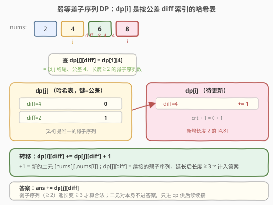
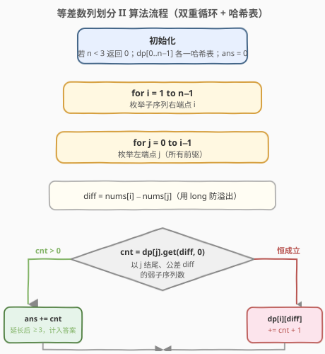
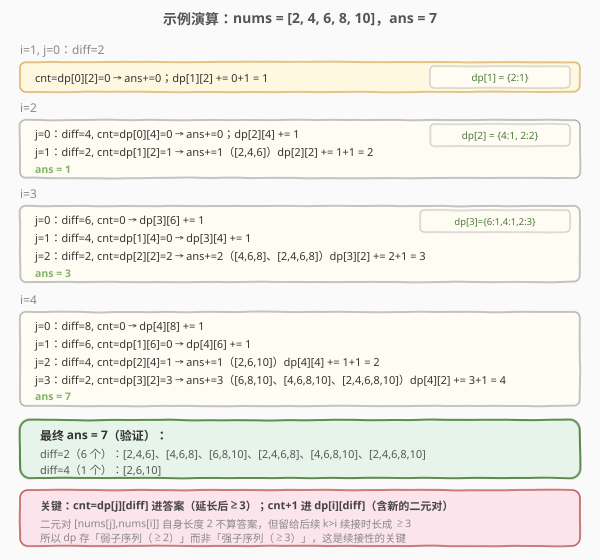

# 等差数列划分 II - 子序列

- **题目名称**：等差数列划分 II - 子序列
- **链接**：[446. 等差数列划分 II - 子序列](https://leetcode.cn/problems/arithmetic-slices-ii-subsequence/)
- **难度**：困难
- **标签**：数组、动态规划

## 1. 题目概述

给定一个整数数组 `nums`，返回数组中**等差子序列**的数目。子序列**不要求连续**，但需保持原数组中的相对顺序。等差子序列是指长度**至少为 3**、且任意相邻两元素差值（公差）恒定的子序列。

**示例 1**：

```text
输入：nums = [2,4,6,8,10]
输出：7
解释：所有等差子序列为：
  [2,4,6]、[4,6,8]、[6,8,10]、[2,4,6,8]、[4,6,8,10]、[2,4,6,8,10]（公差 2）
  [2,6,10]（公差 4）
```

**示例 2**：

```text
输入：nums = [7,7,7,7,7]
输出：16
解释：任意 3 个及以上的下标组合都构成公差 0 的等差子序列，共 C(5,3)+C(5,4)+C(5,5)=10+5+1=16 个。
```

**约束条件**：

- `1 <= nums.length <= 1000`
- $-2^{31} <= \text{nums}[i] <= 2^{31} - 1$

> ⚠️ **三个关键点**：① 子序列**不要求连续**（区别于 [413. 等差数列划分](../0401-0500/413_等差数列划分.md) 的子数组）；② 长度**至少为 3**；③ `nums[i]` 取值达 `int` 边界，公差 `diff = nums[i] - nums[j]` 可能**溢出 `int`**，必须用 `long long`。

---

## 2. 解题思路

### 2.1 暴力思路

枚举所有长度 $\ge 3$ 的子序列（共 $O(2^n)$ 个），逐个验证是否等差。`n=1000` 时完全不可行。

### 2.2 核心观察：弱子序列 DP + 哈希表



**定义**：`dp[i]` 是一个**哈希表**，`dp[i][diff]` = 以 `nums[i]` 结尾、公差为 `diff`、长度 **≥ 2** 的子序列个数（称为**弱等差子序列**，下文简称弱子序列）。

> 💡 **为什么存「长度 ≥ 2」而不是「≥ 3」？** 因为续接性。一个二元对 `[nums[j], nums[i]]`（长度 2）本身不算答案，但当后续某个 `nums[k]` 满足 `nums[k] - nums[i] == diff` 时，这个二元对就能延长成长度 3 的合法子序列。若 `dp` 只存 ≥ 3 的，就无法记录这些「尚未成熟」的二元对，续接就断了。所以 `dp` 必须存**弱**子序列（≥ 2），让它们有成长空间。

**转移**：对每个右端点 `i`，枚举所有前驱 `j < i`：

$$
\text{diff} = \text{nums}[i] - \text{nums}[j]
$$

令 $\text{cnt} = \text{dp}[j][\text{diff}]$（以 `j` 结尾、同公差的弱子序列数），则：

- **计入答案**：`ans += cnt`——这 `cnt` 个弱子序列（长度 ≥ 2）追加 `nums[i]` 后长度变 ≥ 3，成为合法等差子序列。
- **更新状态**：`dp[i][diff] += cnt + 1`——其中 `cnt` 是被续接过来的弱子序列（延长后仍 ≥ 2，留在弱子序列池里供后续续接）；`+1` 是全新的二元对 `[nums[j], nums[i]]`。

> ⚠️ **答案只加 `cnt`，不加 `+1`**：那个 `+1` 代表的二元对长度才 2，不满足「≥ 3」，不能计入答案。它只进 `dp[i]` 等待未来被延长。

### 2.3 算法流程图



双重循环 `i` 从 1 到 `n-1`，内层 `j` 从 0 到 `i-1`，每对 `(j, i)` 做「查 cnt → 累加答案 → 更新 dp[i]」三步。

### 2.4 示例演算



以 `nums = [2, 4, 6, 8, 10]` 为例，逐步追踪 `dp` 表与答案：

| i | j | diff | cnt=dp[j][diff] | ans 累加 | dp[i][diff] 更新 |
|---|---|------|-----------------|----------|-------------------|
| 1 | 0 | 2 | 0 | 0 | dp[1][2] = 1 |
| 2 | 0 | 4 | 0 | 0 | dp[2][4] = 1 |
| 2 | 1 | 2 | 1 | +1（[2,4,6]） | dp[2][2] = 2 |
| 3 | 0 | 6 | 0 | 0 | dp[3][6] = 1 |
| 3 | 1 | 4 | 0 | 0 | dp[3][4] = 1 |
| 3 | 2 | 2 | 2 | +2（[4,6,8]、[2,4,6,8]） | dp[3][2] = 3 |
| 4 | 0 | 8 | 0 | 0 | dp[4][8] = 1 |
| 4 | 1 | 6 | 0 | 0 | dp[4][6] = 1 |
| 4 | 2 | 4 | 1 | +1（[2,6,10]） | dp[4][4] = 2 |
| 4 | 3 | 2 | 3 | +3（[6,8,10]、[4,6,8,10]、[2,4,6,8,10]） | dp[4][2] = 4 |

最终 `ans = 0+0+1+0+0+2+0+0+1+3 = 7` ✓。

---

## 3. 参考代码

### C++

```cpp
// DP + 哈希表，O(n^2) / O(n^2)
class Solution {
public:
    int numberOfArithmeticSlices(vector<int>& nums) {
        int n = nums.size();
        if (n < 3) return 0;
        vector<unordered_map<long long, int>> dp(n);
        int ans = 0;
        for (int i = 1; i < n; i++) {
            for (int j = 0; j < i; j++) {
                long long diff = (long long)nums[i] - nums[j];
                int cnt = dp[j].count(diff) ? dp[j][diff] : 0;
                ans += cnt;
                dp[i][diff] += cnt + 1;
            }
        }
        return ans;
    }
};
```

### Python

```python
# DP + 哈希表，O(n^2) / O(n^2)
def numberOfArithmeticSlices(nums):
    n = len(nums)
    if n < 3:
        return 0
    dp = [defaultdict(int) for _ in range(n)]
    ans = 0
    for i in range(1, n):
        for j in range(i):
            diff = nums[i] - nums[j]
            cnt = dp[j][diff]
            ans += cnt
            dp[i][diff] += cnt + 1
    return ans
```

> 💡 **溢出处理**：C++ 中 `nums[i]` 与 `nums[j]` 都是 `int`，直接相减可能溢出（如 `INT_MAX - (-INT_MAX)`）。先强转为 `long long` 再相减即可。Python 的整数无限精度，无需处理。

---

## 4. 复杂度分析

| 维度 | 复杂度 | 说明 |
|------|--------|------|
| **时间** | $O(n^2)$ | 双重循环枚举所有 $(j, i)$ 对，每对哈希操作 $O(1)$ 均摊 |
| **空间** | $O(n^2)$ | 最坏情况每个 `dp[i]` 存 $i$ 个不同公差，总条目数 $\sum_{i=1}^{n-1} i = O(n^2)$ |
| **常数** | 较大 | 哈希表存 `long long` 键，有哈希开销；`n=1000` 时约 $5\times10^5$ 次操作，可接受 |

> ⚠️ **为何不能像 413 那样优化到 $O(n)$？** 413 要求**连续**子数组，公差只由相邻三元决定，`dp[i]` 只依赖 `dp[i-1]`。本题允许**不连续**，`nums[i]` 可接在任意 `j < i` 后面，公差随 `j` 变化，必须枚举所有前驱并用哈希表按公差分组。

---

## 5. 扩展：与 413 的对比

| 维度 | 413 等差数列划分 | 446 等差数列划分 II |
|------|------------------|---------------------|
| **子结构** | 连续子数组 | 子序列（可不连续） |
| **状态** | `dp[i]` = 以 `i` 结尾的等差子数组数（标量） | `dp[i][diff]` = 以 `i` 结尾、公差 `diff` 的弱子序列数（哈希表） |
| **依赖** | 仅 `dp[i-1]`（相邻三元定公差） | 所有 `j < i`（每个前驱贡献一个公差） |
| **时间** | $O(n)$ | $O(n^2)$ |
| **空间** | $O(1)$（滚动变量） | $O(n^2)$ |
| **计数对象** | 直接数 ≥ 3 的子数组 | 数弱子序列（≥ 2），延长后才计答案 |

> 💡 **一句话总结**：连续→局部传递→一维标量 DP；不连续→全前驱枚举→哈希表存多公差。问题的「连续性」决定了 DP 状态是标量还是映射。

---

## 6. 面试要点

1. **为什么 `dp` 存弱子序列（≥ 2）而不是直接存 ≥ 3？**

   - 续接性。二元对 `[nums[j], nums[i]]` 长度 2，本身不算答案，但它是未来长度 3 子序列的「胚芽」。若 `dp` 只存 ≥ 3，二元对无处安放，后续 `nums[k]` 就无法把它延长成合法子序列。存弱子序列让胚芽留在池子里等成长。

2. **答案为什么加 `cnt` 而不是 `cnt + 1`？**

   - `cnt = dp[j][diff]`：这些弱子序列长度 ≥ 2，追加 `nums[i]` 后长度 ≥ 3，合法，计入答案。`+1` 是新的二元对，长度才 2，不合法，只进 `dp[i]` 不进答案。

3. **为什么不会重复计数？**

   - 每个合法子序列按其**末两个元素** `(j, i)` 唯一归属：长度 ≥ 3 的子序列末尾两元素确定后，它在 `ans += cnt` 时恰好被数一次（作为某个 `dp[j][diff]` 中的一条弱子序列被 `nums[i]` 延长）。不同的 `(j, i)` 对枚举不重不漏。

4. **为什么 `diff` 必须用 `long long`？**

   - `nums[i] ∈ [-2^31, 2^31-1]`，两 `int` 相减结果范围 `[-2^32+1, 2^32-1]`，超出 `int` 范围 `[-2^31, 2^31-1]`。用 `long long`（64 位）安全。Python 无此问题。

5. **空间能优化吗？**

   - `dp[i]` 依赖所有 `dp[j]`（`j < i`），无法滚动降维到 $O(n)$。但实测 `n=1000` 时 $O(n^2)$ 空间约几百 MB 内可控（哈希表条目数上限 $n(n-1)/2 \approx 5\times10^5$）。若值域较小，可用数组替代哈希表降低常数。

---

## 7. 同类练习题

- [413. 等差数列划分](https://leetcode.cn/problems/arithmetic-slices/)（[题解](../0401-0500/413_等差数列划分.md)）：连续版，一维标量 DP，`O(n)`，本题的基础对照
- [300. 最长递增子序列](https://leetcode.cn/problems/longest-increasing-subsequence/)（[题解](../0201-0300/300_最长递增子序列.md)）：同样枚举所有前驱 `j < i` 的 DP，只是求最长而非计数
- [1027. 最长等差数列](https://leetcode.cn/problems/longest-arithmetic-subsequence/)：与本题同结构（`dp[i][diff]` 哈希表），但求最长长度而非个数，可作变体练习
- [1630. 等差子数组](https://leetcode.cn/problems/arithmetic-subarrays/)：子数组等差判定，排序后查相邻差，与本题思路不同但主题相关
