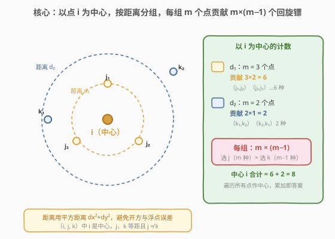
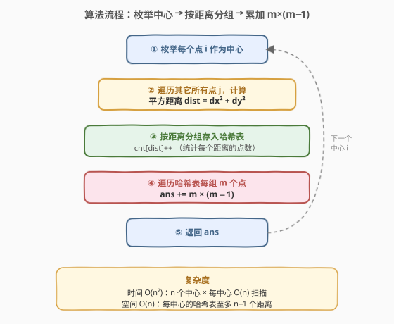
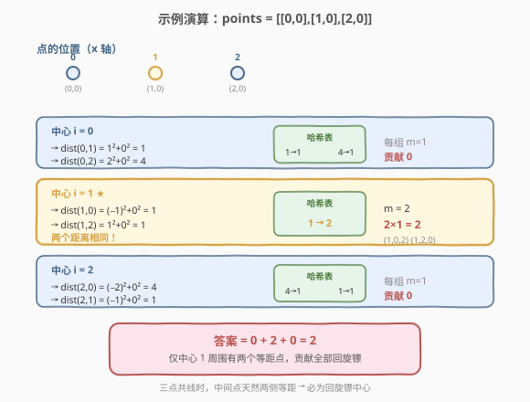

# LeetCode 回旋镖的数量 题解

## 1. 题目概述

- **标题 / 题号**：回旋镖的数量（#447，medium）
- **链接**：https://leetcode.cn/problems/number-of-boomerangs/
- **难度**：中等
- **标签**：数组、哈希表、数学

**题意**：给定平面上 `n` 个**两两不同**的点，定义「回旋镖」为一个点三元组 `(i, j, k)`，满足 `dist(i, j) == dist(i, k)`，其中 `i` 是「中心」，`j` 与 `k` 到 `i` 的距离相等。**三元组的顺序 matters**——`(i, j, k)` 与 `(i, k, j)` 是两个不同的回旋镖。要求返回回旋镖的总数。

**示例 1**：

```text
输入：points = [[0,0],[1,0],[2,0]]
输出：2
解释：两个回旋镖为 [[1,0],[0,0],[2,0]] 与 [[1,0],[2,0],[0,0]]
      即以点 1 为中心，点 0 和点 2 到它的距离都是 1。
```

**示例 2**：

```text
输入：points = [[1,1],[2,2],[3,3]]
输出：2
```

**示例 3**：

```text
输入：points = [[0,0],[1,0],[-1,0],[0,1],[0,-1]]
输出：20
```

**约束**：

- $n = \text{points.length}$
- $1 \le n \le 500$
- $\text{points}[i].\text{length} = 2$
- $-10^4 \le x_i, y_i \le 10^4$
- 所有点两两不同

> 💡 本题的关键词是「**等距 + 有序对**」：固定中心 `i` 后，问题退化为「在其余点中找两个到 `i` 等距的点，并考虑顺序」。这与 [149. 直线上最多的点数](../0101-0200/149_直线上最多的点数.md)（按斜率分组）异曲同工，只是分组键从「斜率」换成了「距离」。

## 2. 解题思路

### 2.1 暴力思路：三重循环枚举

最直接的做法：三重循环枚举所有 `(i, j, k)`（三者互不相同），判断 `dist(i, j)` 是否等于 `dist(i, k)`。

```text
for i in 0..n:
    for j in 0..n:
        if j == i: continue
        for k in 0..n:
            if k == i or k == j: continue
            if dist(i,j) == dist(i,k): ans++
```

时间复杂度 $O(n^3)$，`n=500` 时约 $1.25 \times 10^8$ 次运算，**勉强能过但效率低**。问题在于：固定 `i` 后，`j` 和 `k` 的枚举是「**两两独立**」的——只要它们到 `i` 的距离相等即可，并不需要真的配对枚举。

> ⚠️ 暴力法把「找等距对」做成了 $O(n^2)$ 的双层搜索，但其实固定 `i` 后，所有点到 `i` 的距离可以**一次性算完**，再按距离值分组——同组内任意两个点都构成一个回旋镖对，无需逐对验证。

### 2.2 核心观察：以每个点为中心，按距离分组



**关键转换**：把三元组 `(i, j, k)` 拆成「**中心 i** + **等距对 (j, k)**」两部分。

固定中心 `i` 后，计算所有其它点到 `i` 的距离，按距离值分组：

- 距离为 $d$ 的组里有 $m$ 个点，则这 $m$ 个点中任取**有序对** $(j, k)$（$j \neq k$）都满足 $\text{dist}(i, j) = \text{dist}(i, k) = d$。
- 有序对的个数为 $m \times (m - 1)$（选 $j$ 有 $m$ 种，再选 $k$ 有 $m - 1$ 种）。

> 💡 **为什么是 $m \times (m-1)$ 而非 $\binom{m}{2}$？** 题目规定 `(i, j, k)` 与 `(i, k, j)` 是**不同**的回旋镖，即 $(j, k)$ 是**有序对**。组合数 $\binom{m}{2} = \frac{m(m-1)}{2}$ 只计无序对，需再乘 2，等价于直接用排列数 $A_m^2 = m(m-1)$。

**距离用平方距离**：两点 $(x_1, y_1)$、$(x_2, y_2)$ 的距离平方为

$$
\text{dist}^2 = (x_1 - x_2)^2 + (y_1 - y_2)^2
$$

用平方距离代替真实距离有两点好处：① 避免开方带来的**浮点误差**（哈希表的 key 必须精确匹配）；② 省去 `sqrt` 运算。由于「距离相等」⇔「距离平方相等」，这样做完全等价。

> ⚠️ 坐标范围 $[-10^4, 10^4]$，最大平方距离 $= (2 \times 10^4)^2 \times 2 = 8 \times 10^8$，在 32 位 `int`（上限约 $2.1 \times 10^9$）范围内，C++ 无需用 `long`。

### 2.3 算法流程图



**完整步骤**：

1. **枚举中心**：外层循环遍历每个点 `i` 作为回旋镖的中心。
2. **计算距离**：内层循环遍历所有其它点 `j`（$j \neq i$），计算平方距离 $\text{dist} = dx^2 + dy^2$。
3. **哈希分组**：用哈希表 `cnt` 统计当前中心下每个距离出现的次数，`cnt[dist]++`。
4. **累加答案**：遍历哈希表，对每组 $m$ 个点，`ans += m * (m - 1)`。
5. 返回 `ans`。

> 💡 哈希表在**每个中心 `i` 的循环开始时新建**（或清空），因为不同中心的距离分组互不相关。这样每个中心的空间是 $O(n)$，用完即释放，总空间仍为 $O(n)$。

### 2.4 示例演算

以 `points = [[0,0],[1,0],[2,0]]` 为例，三个点共线分布于 x 轴上：



| 中心 i | 到各点距离平方 | 哈希表 | 各组贡献 | 小计 |
|--------|---------------|--------|----------|------|
| 0 | dist(0,1)=1, dist(0,2)=4 | {1:1, 4:1} | 每组 m=1 → 0 | 0 |
| **1** | dist(1,0)=1, dist(1,2)=1 | {**1:2**} | m=2 → 2×1=2 | **2** |
| 2 | dist(2,0)=4, dist(2,1)=1 | {4:1, 1:1} | 每组 m=1 → 0 | 0 |

最终答案为 $0 + 2 + 0 = \mathbf{2}$ ✓。仅中心 1 周围有两个等距点（点 0 和点 2），贡献了全部回旋镖 `(1,0,2)` 与 `(1,2,0)`。

> 💡 **三点共线的直觉**：当三点等距共线（如 `0—1—2`，间距相等）时，中间点天然两侧等距，必为回旋镖中心。但一般情况点分布任意，不能靠几何直觉，必须逐点枚举。

## 3. 参考代码

### C++

```cpp
class Solution {
  public:
    int numberOfBoomerangs(vector<vector<int>>& points) {
        int n = points.size();
        int ans = 0;
        for (int i = 0; i < n; ++i) {
            unordered_map<int, int> cnt;
            for (int j = 0; j < n; ++j) {
                if (j == i) continue;
                int dx = points[i][0] - points[j][0];
                int dy = points[i][1] - points[j][1];
                int d = dx * dx + dy * dy;
                cnt[d]++;
            }
            for (auto& [d, m] : cnt) {
                ans += m * (m - 1);
            }
        }
        return ans;
    }
};
```

### Python

```python
class Solution:
    def numberOfBoomerangs(self, points: List[List[int]]) -> int:
        ans = 0
        for xi, yi in points:
            cnt = {}
            for xj, yj in points:
                if (xj, yj) == (xi, yi):
                    continue
                d = (xi - xj) ** 2 + (yi - yj) ** 2
                cnt[d] = cnt.get(d, 0) + 1
            for m in cnt.values():
                ans += m * (m - 1)
        return ans
```

> 💡 **边遍历边累加的写法**：也可以在内层循环中**边统计边累加**——每遇到一个新距离 `d`，若已有 `cnt[d] = m`，则当前点与之前的 `m` 个点可形成 `m` 个新回旋镖（当前点作 `j`，之前每个作 `k`），直接 `ans += cnt[d]` 再 `cnt[d]++`。这样省去第二趟遍历，常数更优：
>
> ```python
> for xj, yj in points:
>     if (xj, yj) == (xi, yi): continue
>     d = (xi - xj) ** 2 + (yi - yj) ** 2
>     ans += cnt.get(d, 0)        # 当前点与已有点配成有序对
>     cnt[d] = cnt.get(d, 0) + 1
> ```
>
> 思路与 [1. 两数之和](../0001-0100/1_两数之和.md) 的「边查边存」一脉相承。

## 4. 复杂度分析

| 维度 | 复杂度 | 说明 |
|------|--------|------|
| 时间复杂度 | $O(n^2)$ | 外层 $n$ 个中心，每中心内层扫 $n$ 个点算距离 $O(n)$，哈希操作均摊 $O(1)$ |
| 空间复杂度 | $O(n)$ | 每个中心的哈希表至多存 $n-1$ 个距离值，用完即释放 |

> 💡 `n=500` 时 $n^2 = 2.5 \times 10^5$，远低于暴力 $O(n^3) = 1.25 \times 10^8$。哈希表每中心最多 499 条目，空间在舒适区。相比 [149. 直线上最多的点数](../0101-0200/149_直线上最多的点数.md) 的 GCD 化简分数键，本题用整数平方距离作键更简单、无精度问题。

## 5. 扩展：有序对计数与组合计数

本题的 $m \times (m-1)$ 本质是**排列数** $A_m^2 = P(m, 2)$——从 $m$ 个元素中取 2 个的有序排列数。理解这一点可推广到更一般的「**k 元等距组**」问题：

| 问题 | 中心固定后 | 每组 m 个点的贡献 | 本质 |
|------|-----------|------------------|------|
| 447. 回旋镖（三元组，有序） | 取 2 个有序点 | $m(m-1) = A_m^2$ | 排列数 |
| 若改为无序三元组 | 取 2 个无序点 | $\binom{m}{2} = \frac{m(m-1)}{2}$ | 组合数 |
| 若推广为「等距 k 元组」 | 取 $k-1$ 个有序点 | $A_m^{k-1} = \frac{m!}{(m-k+1)!}$ | 排列数 |

> ⚠️ 当题目问「**有序**还是**无序**」是区分排列与组合的关键。本题明确「`(i,j,k)` 与 `(i,k,j)` 不同」，故用排列数。若题意模糊，应主动向面试官确认。

## 6. 面试要点

1. **为什么固定中心 `i` 后只需按距离分组，不用枚举 (j, k) 对？**

   - 回旋镖的判定条件是 `dist(i,j) == dist(i,k)`，`j` 和 `k` 各自独立地满足「到 `i` 等距」。固定 `i` 后，所有点到 `i` 的距离可一次性算完，按距离值分组后，**同组内任意两点**都满足条件，无需逐对验证。分组把 $O(n^2)$ 的配对搜索降为 $O(n)$ 的统计。

2. **为什么用平方距离而非真实距离？**

   - 两个原因：① 哈希表的 key 必须精确相等才能命中，`sqrt` 会引入浮点误差，两个本应相等的距离可能算出微小差异导致漏配；② 省去 `sqrt` 运算，常数更优。「距离相等」⇔「距离平方相等」，数学上完全等价。

3. **$m \times (m-1)$ 是怎么来的？为什么不是 $\binom{m}{2}$？**

   - 题目规定 `(i,j,k)` 与 `(i,k,j)` 是**不同**的回旋镖，即 $(j, k)$ 是**有序对**。从 $m$ 个点中选有序对：选 $j$ 有 $m$ 种，选 $k$（不能与 $j$ 相同）有 $m-1$ 种，共 $m(m-1)$。若题目改为无序，则用 $\binom{m}{2} = \frac{m(m-1)}{2}$。

4. **哈希表为什么每个中心新建一次，不能全局复用？**

   - 距离是**相对于中心 `i`** 的，不同中心的距离值含义不同（中心 0 的距离 1 与中心 1 的距离 1 是完全不同的分组）。若全局复用，会把不同中心的距离混在一起，导致错误计数。每个中心新建（或清空）哈希表，逻辑清晰且空间仍为 $O(n)$。

5. **与 149 题（直线上最多的点数）的异同？**

   - 同：都是「固定一个点，按某种几何量分组用哈希表统计」。异：149 按斜率分组，键是化简后的分数（需 GCD），目标是找**最大组**（取 max）；447 按距离分组，键是整数平方距离，目标是**所有组的排列数之和**（取 sum）。两者都是「枚举基准点 + 哈希分组」范式的经典应用。

## 同类练习题

| # | 题目 | 与本题的关联 |
|---|------|-------------|
| 1 | [两数之和](https://leetcode.cn/problems/two-sum/)（[题解](../0001-0100/1_两数之和.md)） | 哈希查补数的母题，本题「边查边存」优化的思路起点 |
| 149 | [直线上最多的点数](https://leetcode.cn/problems/max-points-on-a-line/)（[题解](../0101-0200/149_直线上最多的点数.md)） | 同属「固定点 + 哈希分组」范式，分组键是斜率（GCD 化简分数），对比整数距离键的简洁性 |
| 454 | [四数相加 II](https://leetcode.cn/problems/4sum-ii/)（[题解](../0401-0500/454_四数相加II.md)） | 哈希表存计数而非下标，同样是「预计算 + 查询累加」思路 |
| 356 | [直线镜像](https://leetcode.cn/problems/line-reflection/) | 给定一组点判断是否存在一条竖直对称轴，需按 x 坐标分组后验证 y 镜像，同属几何 + 哈希分组 |
| 2283 | [货架上摆放的数字](https://leetcode.cn/problems/equal-digit-count-and-value/) | 哈希计数判断条件的简单练习，巩固「哈希表存频次」的基本功 |
