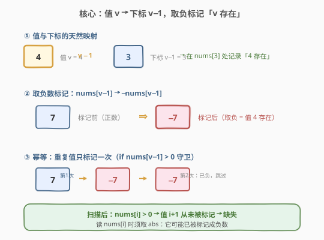
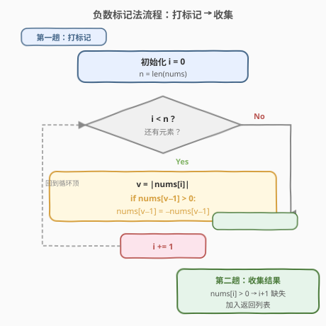
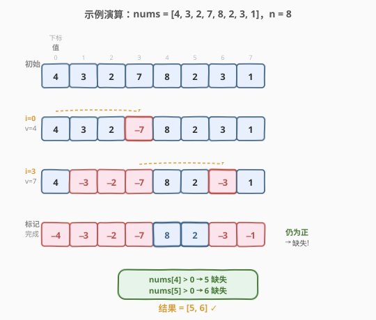

# 找到所有数组中消失的数字

- **题目名称**：找到所有数组中消失的数字
- **链接**：[448. 找到所有数组中消失的数字](https://leetcode.cn/problems/find-all-numbers-disappeared-in-an-array/)
- **难度**：简单
- **标签**：数组、原地哈希、原地标记

## 1. 题目概述

给你一个含 `n` 个整数的数组 `nums`，其中 `nums[i] ∈ [1, n]`。每个整数**出现一次或两次**。请你找出所有在 `[1, n]` 范围内**没有出现在 `nums` 中的数字**，并以数组形式返回。

要求：$O(n)$ 时间且**不使用额外空间**（返回的输出列表不计入额外空间）。

**示例 1**：

```text
输入：nums = [4,3,2,7,8,2,3,1]
输出：[5,6]
解释：n = 8，1~8 中 5 和 6 没有出现。
```

**示例 2**：

```text
输入：nums = [1,1]
输出：[2]
解释：n = 2，1 出现了两次，2 缺失。
```

**约束条件**：

- $n = \text{nums.length}$
- $1 \le n \le 10^5$
- $1 \le \text{nums}[i] \le n$

> 💡 **关键前提**：`nums[i]` 取值恰好落在 $[1, n]$，即「值域」与「下标域」长度相同——这正是能用**下标当哈希键**的根本原因。若值域远大于 $n$（如 [41. 缺失的第一个正数](../0001-0100/41_缺失的第一个正数.md) 中值可为任意整数），需先把越界值排除再标记。

---

## 2. 解题思路

### 2.1 暴力思路

- **哈希集合**：把所有数放进 `set`，再遍历 $1 \sim n$ 查谁不在集合中。时间 $O(n)$ 达标，但集合占 $O(n)$ 额外空间，**不满足空间要求**。
- **计数数组**：开长度 $n+1$ 的 `count[]` 统计出现次数，再扫一遍取 `count[i] == 0` 的。同样 $O(n)$ 空间超标。

> ⚠️ 两种朴素做法都败在「外部容器占 $O(n)$ 空间」。突破口是利用数组自身当哈希表——既然值域恰好是 $[1, n]$，一个值 $v$ 天然对应下标 $v-1$，可以在原数组上「打标记」记录存在性。

### 2.2 核心观察：用下标当哈希键，打负数标记



关键观察有两点：

1. **值与下标的天然映射**：`nums[i]` 的值 $v \in [1, n]$，对应下标 $v - 1$。因此「值 $v$ 是否出现过」可以记录在下标 $v-1$ 处。
2. **用正负号编码存在性**：遍历数组时，对每个值 $v = |\text{nums}[i]|$，把下标 $v - 1$ 处的数**取负**（若已为负则保持）。扫完后再查一遍：下标 $i$ 处若仍为正数，说明值 $i+1$ **从未被标记**，即缺失。

> 💡 **为什么取绝对值**：一个位置可能被多次标记（因为有重复值），取负是幂等操作（负的再取负仍为负）。但遍历时读到的 `nums[i]` 可能已被前一轮标记成负数，所以必须用 $|\text{nums}[i]|$ 还原原始值才能正确索引。

### 2.3 算法流程图



算法分两趟：

**第一趟——打标记**：

1. `i` 从 $0$ 扫到 $n-1$。
2. 令 $v = |\text{nums}[i]|$（取绝对值还原原始值）。
3. 若 `nums[v - 1] > 0`：把它取负（`nums[v - 1] = -nums[v - 1]`）；若已为负则跳过。

**第二趟——收集结果**：

4. `i` 从 $0$ 扫到 $n-1$。
5. 若 `nums[i] > 0`：说明值 $i+1$ 未被标记，加入结果列表。

> ⚠️ 第一趟的标记是**幂等**的：对同一位置取负多次等价于取负一次，重复值不会造成误判。第二趟只看正负号，不看具体数值——因为原始值的信息已在第一趟通过「取负哪个下标」用完了。

### 2.4 示例演算

以 `nums = [4,3,2,7,8,2,3,1]`，$n = 8$ 为例：



| 步骤 | i | \|nums[i]\| | 标记位置 | 数组状态 | 说明 |
|------|---|-------------|----------|----------|------|
| 初始 | — | — | — | [4, 3, 2, 7, 8, 2, 3, 1] | 全正 |
| 1 | 0 | 4 | nums[3] 取负 | [4, 3, 2, **−7**, 8, 2, 3, 1] | 值 4 存在 |
| 2 | 1 | 3 | nums[2] 取负 | [4, 3, **−2**, −7, 8, 2, 3, 1] | 值 3 存在 |
| 3 | 2 | 2 | nums[1] 取负 | [4, **−3**, −2, −7, 8, 2, 3, 1] | 值 2 存在 |
| 4 | 3 | 7 | nums[6] 取负 | [4, −3, −2, −7, 8, 2, **−3**, 1] | 值 7 存在 |
| 5 | 4 | 8 | nums[7] 取负 | [4, −3, −2, −7, 8, 2, −3, **−1**] | 值 8 存在 |
| 6 | 5 | 2 | nums[1] 已负 | [4, −3, −2, −7, 8, 2, −3, −1] | 跳过（幂等） |
| 7 | 6 | 3 | nums[2] 已负 | [4, −3, −2, −7, 8, 2, −3, −1] | 跳过（幂等） |
| 8 | 7 | 1 | nums[0] 取负 | [**−4**, −3, −2, −7, 8, 2, −3, −1] | 值 1 存在 |
| 收集 | — | — | — | — | nums[4] > 0 → **5**；nums[5] > 0 → **6** |

最终结果为 **[5, 6]** ✓。下标 4、5 仍为正数，对应值 5、6 从未出现。

---

## 3. 参考代码

### C++

```cpp
class Solution {
  public:
    vector<int> findDisappearedNumbers(vector<int>& nums) {
        int n = nums.size();
        for (int i = 0; i < n; ++i) {
            int v = abs(nums[i]);
            if (nums[v - 1] > 0) {
                nums[v - 1] = -nums[v - 1];
            }
        }
        vector<int> res;
        for (int i = 0; i < n; ++i) {
            if (nums[i] > 0) {
                res.push_back(i + 1);
            }
        }
        return res;
    }
};
```

### Python

```python
class Solution:
    def findDisappearedNumbers(self, nums: List[int]) -> List[int]:
        n = len(nums)
        for i in range(n):
            v = abs(nums[i])
            if nums[v - 1] > 0:
                nums[v - 1] = -nums[v - 1]
        return [i + 1 for i in range(n) if nums[i] > 0]
```

> 💡 Python 的列表推导式让第二趟收集一行搞定。注意 `abs` 不可省——`nums[i]` 可能在前几轮被标记成负数，直接用会越界。

---

## 4. 复杂度分析

| 维度 | 复杂度 | 说明 |
|------|--------|------|
| 时间复杂度 | $O(n)$ | 两趟遍历，各 $n$ 次，每次 $O(1)$ 操作，合计 $2n$ |
| 空间复杂度 | $O(1)$ | 仅用常数变量，原地修改输入数组；返回列表不计入额外空间 |

> 💡 这是该题的最优解：时间已达下界 $O(n)$（必须至少看一遍所有元素），空间为常数。与 [41. 缺失的第一个正数](../0001-0100/41_缺失的第一个正数.md) 的循环交换法相比，负数标记法无需 while 循环归位，实现更简洁，但会破坏原数组值（仅保留正负号信息）。

---

## 5. 扩展：循环交换法与对偶题

### 5.1 另一种原地写法：循环归位

与 41 类似，也可用**循环交换**把值 $v$ 归位到下标 $v-1$，归位后扫一遍找 `nums[i] != i+1` 的位置：

```python
class Solution:
    def findDisappearedNumbers(self, nums: List[int]) -> List[int]:
        n = len(nums)
        for i in range(n):
            while nums[i] != nums[nums[i] - 1]:
                j = nums[i] - 1
                nums[i], nums[j] = nums[j], nums[i]
        return [i + 1 for i in range(n) if nums[i] != i + 1]
```

归位法保留原数值（交换不改值），但实现稍复杂（需 while + 防重复条件）。两种写法同构，都是「用下标作 key」的原地哈希。

### 5.2 对偶题：找重复

[442. 数组中重复的数据](https://leetcode.cn/problems/find-all-duplicates-in-an-array/) 与本题互为对偶——同样的约束（值域 $[1,n]$、$O(n)$ 时间 $O(1)$ 空间），但目标是找**出现两次**的数。直接套用负数标记法：遍历时若 `nums[v-1]` 已为负，说明 $v$ 之前出现过，即重复。一行判据之差，同一模板解决正反两面。

---

## 6. 面试要点

1. **为什么取绝对值 `abs(nums[i])`？不取会怎样？**
   - 遍历时 `nums[i]` 可能已被前一轮标记成负数（如值 3 标记了 `nums[2]`，之后遍历到下标 2 时读到负数）。直接用负数索引会越界。取 `abs` 还原原始值才能正确定位标记位置。

2. **标记为什么是幂等的？重复值会不会误判？**
   - 取负是幂等的：`-(-x) = x` 但代码中有 `if nums[v-1] > 0` 守卫，已为负时直接跳过。因此同一值出现两次只会标记一次，不会「负负得正」误取消标记。

3. **为什么输出列表不计入额外空间？**
   - 题目明确规定返回的输出列表不计入额外空间复杂度。这是 LeetCode 对「要求 $O(1)$ 额外空间」类题目的通用约定——输出本身是结果载体，不算辅助空间。

4. **负数标记法与循环交换法（41 题解法）有何异同？**
   - 同：都利用「值 $v$ 对应下标 $v-1$」的天然映射，原地修改数组充当哈希表。异：标记法用正负号编码存在性，一趟遍历即可，实现简洁，但破坏原值；交换法把值物理归位，保留原值信息，但需 while 循环且要防重复死循环。面试时两种都讲得出即可展示深度。

5. **如果值域不是 $[1, n]$ 而是任意整数怎么办？**
   - 本题的前提是值域恰好等于下标域。若值域更大（如 41 题允许负数和超过 $n$ 的值），需先过滤越界值（把 $\leq 0$ 或 $> n$ 的改为 $n+1$ 等哨兵），再套用标记法。这也是 41 比 448 难一档的原因。

---

## 7. 同类练习题

- [41. 缺失的第一个正数](https://leetcode.cn/problems/first-missing-positive/)（[题解](../0001-0100/41_缺失的第一个正数.md)）：困难版，值域为任意整数，需先缩小范围再原地哈希，循环交换法的招牌题
- [442. 数组中重复的数据](https://leetcode.cn/problems/find-all-duplicates-in-an-array/)：本题的对偶——用同一标记法找出现两次的数，一行判据之差
- [287. 寻找重复数](https://leetcode.cn/problems/find-the-duplicate-number/)（[题解](../0201-0300/287_寻找重复数.md)）：只找一个重复数，可用快慢指针（Floyd）不修改数组，对比两种思路
- [268. 丢失的数字](https://leetcode.cn/problems/missing-number/)：值域 $[0, n]$，异或法或求和法均可，简单版热身
- [645. 错误的集合](https://leetcode.cn/problems/set-mismatch/)：找重复 + 找缺失的综合题，标记法一次扫描同时解决两个问题
