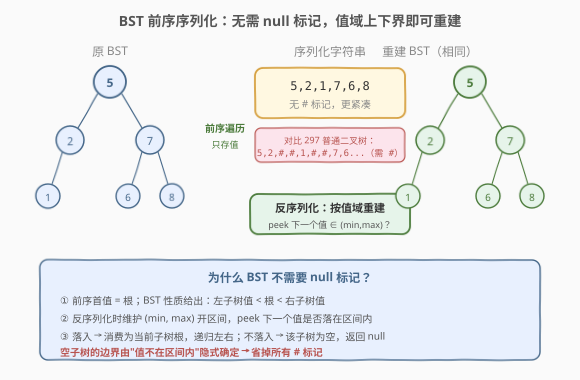
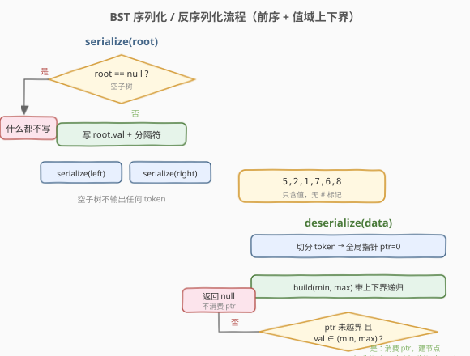
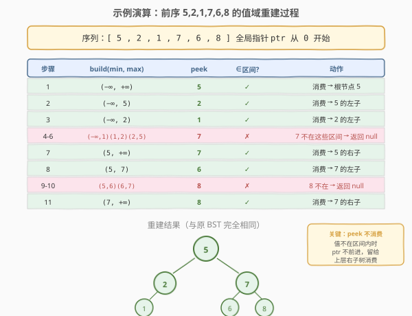

# 序列化和反序列化二叉搜索树

- **题目名称**：序列化和反序列化二叉搜索树
- **链接**：[449. 序列化和反序列化二叉搜索树](https://leetcode.cn/problems/serialize-and-deserialize-bst/)
- **难度**：中等
- **标签**：树、二叉搜索树、深度优先搜索、设计

## 1. 题目概述

设计一个算法来**序列化**与**反序列化**一棵**二叉搜索树（BST）**。序列化是把 BST 转为字符串，反序列化是从该字符串重建出原来的 BST。要求对空树也能正确处理。

与 [297. 二叉树的序列化与反序列化](../0201-0300/297_二叉树的序列化与反序列化.md) 的区别：本题的树是 **BST**，可以利用 BST 的有序性质得到**更紧凑**的序列化方案——**不需要记录 `null` 标记**。

**示例 1**：

```text
输入：root = [2,1,3]
输出：[2,1,3]
即序列化后再反序列化，应得到与原 BST 相同的结构。

    2
   / \
  1   3
```

**示例 2**：

```text
输入：root = []
输出：[]
```

**约束条件**：

- 树中节点数目范围 $[0, 10^4]$
- $0 \le \text{Node.val} \le 10^4$
- 题目保证输入树是合法的 BST

---

## 2. 解题思路

### 2.1 暴力思路：照搬 297 的前序 + null 标记

297 题的做法是前序遍历，把 `null` 也写进序列（用 `#` 标记）。这套方案对 BST 同样可行——毕竟 BST 也是二叉树。但问题是：**每个空子树都要写一个 `#`**。一棵 $m$ 个节点的二叉树有 $m+1$ 个空指针，所以 token 总数约 $2m+1$，其中近一半是 `#` 标记。BST 的有序信息完全没有被利用，序列化结果偏冗余。

### 2.2 核心观察：BST 前序序列无需 null 标记



关键洞察：**BST 的前序遍历序列本身就唯一确定了这棵树**，无需任何 `null` 标记。原因在于 BST 的有序性给出了值域约束：

- **前序首值是根**——前序遍历「根-左-右」，第一个值一定是整棵树的根。
- **BST 性质给出左右子树的值域**——左子树所有值 $<$ 根值，右子树所有值 $>$ 根值。
- **递归收紧上下界**——反序列化时维护开区间 $(\text{min}, \text{max})$，左子树用 $(\text{min}, \text{root})$，右子树用 $(\text{root}, \text{max})$。下一个值是否落入当前区间，决定了该子树是否为空。

> 💡 **为什么不需要 `#`？** 空子树的边界由「下一个值不在区间内」**隐式确定**。当 `peek` 发现下一个值超出当前 $(\text{min}, \text{max})$，说明当前子树为空，直接返回 `null`——**值不消费，留给上层右子树使用**。这正是 BST 相比普通二叉树的优势：有序性把结构信息编码进了值的大小关系里。

### 2.3 算法流程图



**序列化**极简：前序遍历，遇到 `null` 什么都不写（不输出 `#`），否则输出值 + 分隔符。

**反序列化**稍复杂：用全局指针 `ptr` 扫描 token 序列，递归 `build(min, max)`：
1. `peek` 下一个 token（不消费），转成数值 `val`。
2. 若 `ptr` 已越界 **或** `val` 不在 $(\text{min}, \text{max})$ 内 → 返回 `null`（不消费 `ptr`）。
3. 否则消费 `ptr`，建节点 `val`，递归 `build(min, val)` 建左子树、`build(val, max)` 建右子树。

> ⚠️ **peek 与 consume 的区别**：步骤 1 只是「看一眼」下一个值是否属于当前子树，不移动指针。只有步骤 3 确认值属于当前子树后才消费（`ptr++`）。这个设计保证了被拒绝的值能正确留给上层使用。

### 2.4 示例演算



以 BST `root = [5,2,1,7,6,8]`（前序为 `5,2,1,7,6,8`）为例：

```
        5
       / \
      2   7
     /   / \
    1   6   8
```

**序列化**（前序，只存值）：

```text
访问顺序：5 → 2 → 1 → (null不输出) → (null不输出) → (null不输出) → 7 → 6 → (null) → (null) → 8 → (null) → (null)
序列：5,2,1,7,6,8
```

**反序列化**（`ptr` 从 0 开始，递归 `build(min, max)`）：

| 步骤 | `build(min, max)` | peek | ∈区间? | 动作 |
|------|-------------------|------|--------|------|
| 1 | $(-\infty, +\infty)$ | 5 | ✓ | 消费 5 → 根节点 |
| 2 | $(-\infty, 5)$ | 2 | ✓ | 消费 2 → 5 的左子 |
| 3 | $(-\infty, 2)$ | 1 | ✓ | 消费 1 → 2 的左子 |
| 4-6 | $(-\infty,1)$, $(1,2)$, $(2,5)$ | 7 | ✗ | 7 不在这些区间 → 连续返回 null |
| 7 | $(5, +\infty)$ | 7 | ✓ | 消费 7 → 5 的右子 |
| 8 | $(5, 7)$ | 6 | ✓ | 消费 6 → 7 的左子 |
| 9-10 | $(5,6)$, $(6,7)$ | 8 | ✗ | 8 不在 → 返回 null |
| 11 | $(7, +\infty)$ | 8 | ✓ | 消费 8 → 7 的右子 |

> 💡 **步骤 4-6 是关键**：节点 1 建完后，`ptr` 指向 7。递归回到 `build(-∞,1)`、`build(1,2)`、`build(2,5)` 时，每次 `peek` 都看到 7，但 7 不属于这些区间，于是连续返回 null——**但 7 始终没被消费**，直到 `build(5,+∞)` 时才被正确消费为 5 的右子树根。这就是「peek 不消费」的精髓。

---

## 3. 参考代码

### C++

```cpp
class Codec {
public:
    // 序列化：前序遍历，只存值，不存 null 标记
    string serialize(TreeNode* root) {
        string out;
        serializeHelper(root, out);
        return out;
    }

    // 反序列化：按前序消费 + 值域上下界
    TreeNode* deserialize(string data) {
        if (data.empty()) return nullptr;
        istringstream iss(data);
        vector<int> vals;
        int v;
        while (iss >> v) vals.push_back(v);
        int ptr = 0;
        return build(vals, ptr, INT_MIN, INT_MAX);
    }

private:
    void serializeHelper(TreeNode* node, string& out) {
        if (!node) return;                         // 空子树不输出任何 token
        out += to_string(node->val) + " ";
        serializeHelper(node->left, out);
        serializeHelper(node->right, out);
    }

    TreeNode* build(vector<int>& vals, int& ptr, int lo, int hi) {
        if (ptr >= (int)vals.size()) return nullptr;
        int val = vals[ptr];
        if (val < lo || val > hi) return nullptr;  // 不在区间 → 空子树，不消费 ptr
        ptr++;                                      // 消费当前值
        TreeNode* node = new TreeNode(val);
        node->left  = build(vals, ptr, lo, val);   // 左子树上界收紧到 val
        node->right = build(vals, ptr, val, hi);   // 右子树下界收紧到 val
        return node;
    }
};
```

### Python

```python
class Codec:
    def serialize(self, root: Optional[TreeNode]) -> str:
        if root is None:
            return ""
        left = self.serialize(root.left)
        right = self.serialize(root.right)
        parts = [str(root.val)]
        if left:
            parts.append(left)
        if right:
            parts.append(right)
        return " ".join(parts)

    def deserialize(self, data: str) -> Optional[TreeNode]:
        if not data:
            return None
        vals = list(map(int, data.split()))
        ptr = 0

        def build(lo: int, hi: int) -> Optional[TreeNode]:
            nonlocal ptr
            if ptr >= len(vals):
                return None
            val = vals[ptr]
            if val < lo or val > hi:          # 不在区间 → 空子树，不消费 ptr
                return None
            ptr += 1                           # 消费当前值
            node = TreeNode(val)
            node.left = build(lo, val)         # 左子树上界收紧到 val
            node.right = build(val, hi)        # 右子树下界收紧到 val
            return node

        return build(float("-inf"), float("inf"))
```

> 💡 **两个实现细节**：
> 1. **空树**：序列化返回空字符串，反序列化对空字符串直接返回 `null`。
> 2. **`ptr` 用引用传递**：C++ 用 `int& ptr`，Python 用 `nonlocal ptr`，保证递归各层共享同一个指针——消费一个值后，所有层都看到 `ptr` 前进。

---

## 4. 复杂度分析

| 维度 | 复杂度 | 说明 |
|------|--------|------|
| 时间复杂度 | $O(n)$ | 序列化访问每个节点一次；反序列化消费每个值一次，`peek` 但拒绝的次数合计 $O(n)$（每个值最多被 peek 拒绝 $O(h)$ 次，但总量仍 $O(n)$） |
| 空间复杂度 | $O(n)$ | 序列化字符串长度 $O(n)$（无 `#` 标记，比 297 更省）；反序列化递归栈 $O(h)$，最坏链状 $O(n)$ |

> 💡 **与 297 的空间对比**：297 序列化含 `#` 标记，token 数约 $2n+1$；449 只存值，token 数恰好 $n$。BST 的有序性让序列化结果**减半**——这正是本题相比 297 的核心优势。

---

## 5. 扩展：后序序列化也能工作

前序并非唯一选择。**后序遍历**同样可以无需 `null` 标记序列化 BST，但反序列化时需要**从右往左**消费序列（后序是「左右根」，逆序即「根右左」）：

```cpp
// 后序序列化
void serializeHelper(TreeNode* node, string& out) {
    if (!node) return;
    serializeHelper(node->left, out);
    serializeHelper(node->right, out);
    out += to_string(node->val) + " ";
}

// 后序反序列化：从末尾向前消费，先建根再右子树再左子树
TreeNode* build(vector<int>& vals, int& ptr, int lo, int hi) {
    if (ptr < 0) return nullptr;
    int val = vals[ptr];
    if (val < lo || val > hi) return nullptr;
    ptr--;
    TreeNode* node = new TreeNode(val);
    node->right = build(vals, ptr, val, hi);   // 先右后左
    node->left  = build(vals, ptr, lo, val);
    return node;
}
```

面试中推荐**前序**，因为「根-左-右」的自然顺序更直观、代码更易写对。后序作为思路扩展了解即可。

> ⚠️ **层序（BFS）不适合**：层序序列无法直接利用 BST 的值域递归重建——同一层的节点没有明确的「谁是谁的子树」信息，需要额外的索引对齐。前序/后序之所以可行，是因为递归结构天然嵌入了父子关系。

---

## 6. 面试要点

1. **为什么 BST 不需要 `null` 标记？**
   - BST 的有序性把结构信息编码进了值的大小关系。反序列化时维护 $(\text{min}, \text{max})$ 开区间，下一个值是否落入区间决定了子树是否为空——空子树的边界由「值不在区间内」隐式确定，无需显式 `#` 标记。

2. **`peek` 和 `consume` 为什么要分开？**
   - `peek` 只读取下一个值判断是否属于当前子树，不移动指针。若不属于，该值留给上层右子树消费。如果 `peek` 时就消费，会导致属于父节点右子树的值被错误地挂到当前子树下，破坏 BST 结构。

3. **这道题和 297 的核心区别是什么？**
   - 297 是普通二叉树，必须用 `#` 标记空子树才能无损重建，token 数约 $2n$；449 是 BST，利用值域上下界隐式确定空子树边界，token 数恰好 $n$，序列化结果**减半**。代价是反序列化多了一层 `(min, max)` 区间判断。

4. **上下界为什么用开区间？**
   - BST 定义中左子树值**严格小于**根、右子树值**严格大于**根（题目保证无重复值）。开区间 $(\text{min}, \text{max})$ 精确匹配这一约束，避免边界值歧义。若允许重复值，需调整为半开区间并明确约定重复值归属。

5. **前序和后序都能工作，中序行不行？**
   - 中序不行。BST 的中序遍历是**升序序列**，丢失了根的位置信息——任何节点都可能是根，无法从单一中序序列重建树结构。前序/后序的根在序列首/尾，配合值域才能递归切分左右子树。

---

## 7. 同类练习题

- [297. 二叉树的序列化与反序列化](https://leetcode.cn/problems/serialize-and-deserialize-binary-tree/)（[站内题解](../0201-0300/297_二叉树的序列化与反序列化.md)）：普通二叉树版，需 `null` 标记，本题的前置与对照
- [105. 从前序与中序遍历序列构造二叉树](https://leetcode.cn/problems/construct-binary-tree-from-preorder-and-inorder-traversal/)（[站内题解](../0101-0200/105_从前序与中序遍历序列构造二叉树.md)）：双遍历重建，对比本题单遍历 + BST 性质
- [1008. 前序遍历构造二叉搜索树](https://leetcode.cn/problems/construct-binary-search-tree-from-preorder-traversal/)：本题反序列化的核心子问题——从前序序列重建 BST
- [450. 删除二叉搜索树中的节点](https://leetcode.cn/problems/delete-node-in-a-bst/)（[站内题解](../0401-0500/450_删除二叉搜索树中的节点.md)）：BST CRUD 操作，值域约束的另一种应用
- [98. 验证二叉搜索树](https://leetcode.cn/problems/validate-binary-search-tree/)（[站内题解](../0001-0100/98_验证二叉搜索树.md)）：上下界递归判定的经典题，与本题反序列化的区间思路同源
