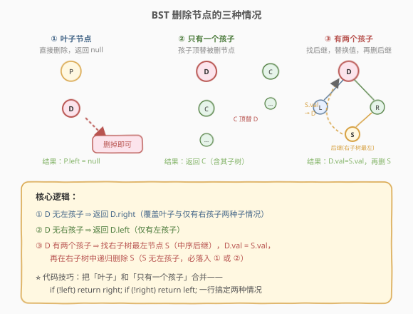
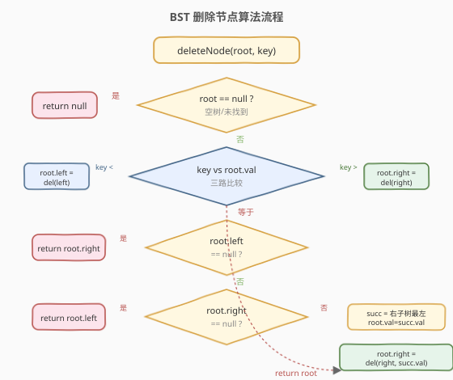
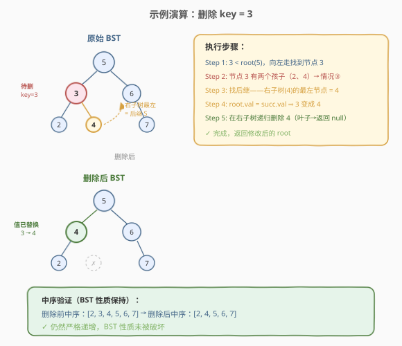

# 删除二叉搜索树中的节点

- **题目名称**：删除二叉搜索树中的节点
- **链接**：[450. 删除二叉搜索树中的节点](https://leetcode.cn/problems/delete-node-in-a-bst/)
- **难度**：中等
- **标签**：树、二叉搜索树、递归

## 1. 题目概述

给定一棵**二叉搜索树（BST）**的根节点 `root` 和一个整数 `key`，删除树中值为 `key` 的节点，并保持 BST 的性质不变。返回删除后的树根节点。

**BST 性质回顾**：对任意节点，左子树所有值 $<$ 根值 $<$ 右子树所有值；左右子树也各自是 BST。

**示例 1**：

```text
输入：root = [5,3,6,2,4,null,7], key = 3
输出：[5,4,6,2,null,null,7]

       5                   5
      / \                 / \
     3   6      →        4   6
    / \   \             /     \
   2   4   7           2       7
```

**示例 2**：

```text
输入：root = [5,3,6,2,4,null,7], key = 0
输出：[5,3,6,2,4,null,7]
解释：树中不含值为 0 的节点，原样返回
```

**约束条件**：

- 树中节点数在 $[0, 10^4]$ 范围内
- 每个节点的值互不相同
- $0 \le \text{Node.val} \le 10^8$
- `root` 是合法的 BST
- 题目保证 `key` 在树中存在或不存在都需正确处理

---

## 2. 解题思路

### 2.1 暴力思路：重建法

先中序遍历收集所有节点值（得到升序数组），从中删除 `key`，再用剩余值重新构造一棵平衡 BST。简单粗暴，但需要 $O(n)$ 空间且**完全重建**——每次删除都重构整棵树，效率低下，且破坏了原有树结构。

### 2.2 核心观察：BST 删除的三种情况



BST 的删除比插入复杂得多，因为被删节点可能有 0、1 或 2 个孩子。关键在于**分情况处理**：

**情况 ①：被删节点是叶子**（无孩子）—— 直接删除，父节点对应指针置空。

**情况 ②：被删节点只有一个孩子** —— 让孩子**顶替**被删节点的位置。父节点原本指向被删节点，现在改指向它的唯一孩子，子树结构完整保留。

**情况 ③：被删节点有两个孩子** —— 不能直接删除（会丢失一个子树），需要找一个"替身"来接替它的位置。这个替身就是**中序后继**（inorder successor）：右子树中值最小的节点。

> 💡 **为什么选右子树的最小值？** BST 中序遍历是升序序列。删除一个节点后，用一个比它大的最小值（后继）替换，能保证：新值仍然大于左子树所有值、小于右子树所有值——BST 性质不被破坏。同样也可以选**中序前驱**（左子树的最大值），效果对称。

**后继的关键性质**：右子树的最左节点一定**没有左孩子**（否则它就不是最左的）。因此删除后继时必然落入情况 ① 或 ②，不会再次陷入情况 ③——递归最多深一层就终止。

> ⚠️ **代码技巧**：把「叶子」和「只有一个孩子」合并。叶子节点的 `left` 和 `right` 都为 `null`，所以先判 `if (!left) return right` 就同时覆盖了「叶子」和「只有右孩子」两种子情况；再判 `if (!right) return left` 覆盖「只有左孩子」。两行搞定前两种情况，简洁且正确。

### 2.3 算法流程图



### 2.4 示例演算



以 `root = [5,3,6,2,4,null,7]`，`key = 3` 为例：

| 步骤 | 当前节点 | 操作 | 说明 |
|------|----------|------|------|
| 1 | 5 | `3 < 5`，向左走 | BST 搜索定位 |
| 2 | 3 | 找到目标，有两个孩子 | 进入情况 ③ |
| 3 | 3 的右子树 | 找最左节点 → 4 | 4 无左孩子，即为后继 S |
| 4 | 3 | `3.val = 4.val`，节点值变为 4 | 值替换 |
| 5 | 右子树中的 4 | 递归删除 4（叶子）→ 返回 `null` | 后继无左孩子，落入情况 ① |
| 6 | 返回 root | 树结构修改完成 | 中序仍为 `[2,4,5,6,7]` |

> 💡 注意第 4 步：替换的是**值**而非节点对象。节点 3 的物理位置不变，只是 `val` 被改成 4，然后从右子树中把"原来的 4"删掉。这样避免了修改父节点指针的麻烦——递归天然处理了父子关系。

---

## 3. 参考代码

### C++

```cpp
class Solution {
public:
    TreeNode* deleteNode(TreeNode* root, int key) {
        if (!root) return nullptr;                       // 空树或未找到

        if (key < root->val) {
            root->left = deleteNode(root->left, key);    // 去左子树找
        } else if (key > root->val) {
            root->right = deleteNode(root->right, key);  // 去右子树找
        } else {
            // 找到目标节点，分三种情况
            if (!root->left)  return root->right;        // ①② 无左孩子（叶子或仅有右孩子）
            if (!root->right) return root->left;          // ② 仅有左孩子
            // ③ 有两个孩子：找右子树最左节点（中序后继）
            TreeNode* succ = root->right;
            while (succ->left) succ = succ->left;
            root->val = succ->val;                                       // 值替换
            root->right = deleteNode(root->right, succ->val);            // 删后继
        }
        return root;
    }
};
```

### Python

```python
class Solution:
    def deleteNode(self, root: Optional[TreeNode], key: int) -> Optional[TreeNode]:
        if not root:
            return None                          # 空树或未找到

        if key < root.val:
            root.left = self.deleteNode(root.left, key)
        elif key > root.val:
            root.right = self.deleteNode(root.right, key)
        else:
            # 找到目标节点，分三种情况
            if not root.left:
                return root.right               # ①② 无左孩子
            if not root.right:
                return root.left                # ② 仅有左孩子
            # ③ 有两个孩子：找右子树最左节点（中序后继）
            succ = root.right
            while succ.left:
                succ = succ.left
            root.val = succ.val                 # 值替换
            root.right = self.deleteNode(root.right, succ.val)  # 删后继
        return root
```

> 💡 **递归的精髓**：`root->left = deleteNode(root->left, key)` 这一行同时完成了「搜索」和「重连」——递归返回的是删除后的子树根，直接赋给父节点指针，无需单独处理父节点指向。这是树递归的通用范式。

---

## 4. 复杂度分析

| 维度 | 复杂度 | 说明 |
|------|--------|------|
| 时间复杂度 | $O(H)$ | 搜索目标 $O(H)$ + 找后继 $O(H)$ + 删后继 $O(H)$，总计 $O(H)$；$H$ 为树高 |
| 空间复杂度 | $O(H)$ | 递归栈深度等于树高；平衡 BST 为 $O(\log n)$，链状退化为 $O(n)$ |

> 💡 $H$ 的范围：平衡 BST 时 $H = O(\log n)$，最坏（链状）$H = O(n)$。若需保证 $O(\log n)$ 最坏复杂度，应使用**自平衡 BST**（AVL 树、红黑树），它们在删除后通过旋转重新平衡。

---

## 5. 扩展：用前驱替代后继

除了「右子树最左」（中序后继），也可以用「**左子树最右**」（中序前驱）来做替换。两者完全对称：

```cpp
// 用前驱替换：左子树的最大值（最右节点）
TreeNode* pred = root->left;
while (pred->right) pred = pred->right;
root->val = pred->val;
root->left = deleteNode(root->left, pred->val);
```

选择前驱还是后继不影响正确性，面试中两种写法均可。一个细节差异：**频繁删除同一侧会让树逐渐失衡**——总用后继（删右子树）会让左子树越来越大。自平衡 BST 的做法是交替使用前驱和后继，或根据两子树高度选择，以保持平衡。

---

## 6. 面试要点

1. **为什么有两个孩子时不能直接删除？**
   - 直接删除会丢失被删节点的两个子树。必须找一个替身接替它的位置，让两棵子树都有处可归。替身必须是中序序列中紧邻的节点（前驱或后继），这样才能保持 BST 性质。

2. **为什么后继一定没有左孩子？**
   - 后继是右子树的最左节点。如果它有左孩子，那左孩子比它更小、更靠左——与"最左"矛盾。因此后继最多只有一个右孩子，删除它时必落入情况 ① 或 ②，递归一层即终止。

3. **代码里 `if (!left) return right` 为什么能同时处理叶子和只有右孩子？**
   - 叶子节点的 `right` 也是 `null`，所以 `return right` 返回 `null`，等价于"删除后该位置为空"。只有右孩子时返回右孩子，等价于"右孩子顶替"。两种子情况被同一行代码自然合并。

4. **替换的是值还是节点？为什么不用指针操作直接替换节点？**
   - 替换值更简洁——只需改 `root->val`，然后用递归删后继。如果替换节点对象，需要修改父节点指针、处理后继的右孩子悬挂等，代码复杂且容易出错。值替换的代价是做一次额外递归，但后继删除是 $O(H)$ 且只走一层，不影响总复杂度。

5. **时间复杂度为什么是 $O(H)$ 而非 $O(H^2)$？**
   - 虽然有"找后继 $O(H)$ + 递归删后继 $O(H)$"两次操作，但它们是**串行**的，加起来仍是 $O(H)$。且删后继时后继无左孩子，递归不会再次进入情况 ③，最多再走一步就终止。

---

## 7. 同类练习题

- [700. 二叉搜索树中的搜索](https://leetcode.cn/problems/search-in-a-binary-search-tree/)：BST 搜索基础，删除的前置技能
- [701. 二叉搜索树中的插入操作](https://leetcode.cn/problems/insert-into-a-binary-search-tree/)：BST 插入，与删除对称的 CRUD 操作
- [98. 验证二叉搜索树](https://leetcode.cn/problems/validate-binary-search-tree/)（[站内题解](../0001-0100/98_验证二叉搜索树.md)）：验证删除后 BST 性质是否保持
- [230. 二叉搜索树中第 K 小的元素](https://leetcode.cn/problems/kth-smallest-element-in-a-bst/)（[站内题解](230_二叉搜索树中第K小的元素.md)）：中序遍历与后继概念的联系
- [108. 将有序数组转换为二叉搜索树](https://leetcode.cn/problems/convert-sorted-array-to-binary-search-tree/)（[站内题解](../0101-0200/108_将有序数组转换为二叉搜索树.md)）：BST 构造，与删除互补
