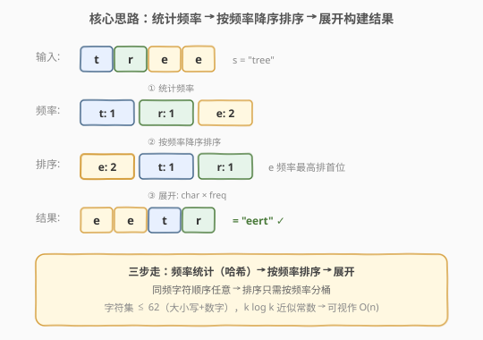
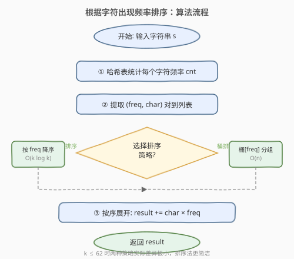
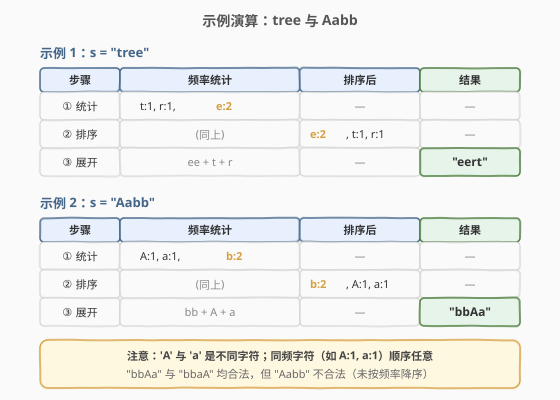

# LeetCode 根据字符出现频率排序 题解

## 1. 题目概述

- **标题 / 题号**：根据字符出现频率排序（#451，medium）
- **链接**：https://leetcode.cn/problems/sort-characters-by-frequency/
- **难度**：中等
- **标签**：哈希表、字符串、排序、桶排序

**题意**：给定一个字符串 `s`，根据字符出现的**频率**对其进行**降序排序**。一个字符出现的频率是它在字符串中出现的次数。返回已排序的字符串——相同字符必须聚在一起，频率高的在前。若有多种合法排列，返回任一即可。

**示例 1**：

```text
输入：s = "tree"
输出："eert"
解释：'e' 出现两次，'r' 和 't' 各一次。'e' 必须在 'r' 和 't' 之前。"eetr" 同样合法。
```

**示例 2**：

```text
输入：s = "cccaaa"
输出："cccaaa"
解释：'c' 和 'a' 各出现三次，顺序任意。"aaaccc" 同样合法。注意 "cacaca" 不正确——相同字母必须放在一起。
```

**示例 3**：

```text
输入：s = "Aabb"
输出："bbAa"
解释：'A' 与 'a' 是两种不同字符。"bbaA" 同样合法，但 "Aabb" 不正确（频率未降序）。
```

**约束**：

- $1 \le s.length \le 5 \times 10^5$
- `s` 由大小写英文字母和数字组成

> 💡 本题是「频率排序」的入门模板：统计频率 → 按频率排序 → 展开。它与 [767. 重构字符串](../0701-0800/767_重构字符串.md)（频率排序 + 不相邻约束）、[692. 前 K 个高频单词](../0601-0700/692_前K个高频单词.md)（Top-K 频率）同属「哈希计数 + 排序」家族，但本题**无额外约束**——只要频率降序、同字符聚拢即可，是最纯粹的频率排序。

## 2. 解题思路

### 2.1 暴力思路

直接对字符串的每个字符排序，自定义比较器「先比频率，频率相同则比字符值」。但这样做有两个问题：① `std::sort` 对 $n$ 个字符排序是 $O(n \log n)$ 次比较，每次比较都查哈希表，常数大；② 频率相同的字符顺序任意，但排序比较器可能引入不必要的字符序约束。

退一步：**只对不同字符排序**。字符串中不同字符数 $k$ 远小于 $n$（本题 $k \le 62$），先统计频率，再对 $k$ 个字符按频率排序，最后展开。这就是最优解。

### 2.2 核心观察：频率统计 + 按频率排序



**关键转化**：题目要求「按频率降序排列字符，同字符聚在一起」，等价于：

1. **统计**每个字符的出现频率（哈希表，$O(n)$）。
2. **排序** $k$ 个不同字符按频率降序（$O(k \log k)$，$k \le 62$）。
3. **展开**：按排序顺序，每个字符重复自身频率次拼接到结果（$O(n)$）。

> 💡 **为什么只排 $k$ 个字符而非 $n$ 个？** 字符串长度 $n$ 可达 $5 \times 10^5$，但不同字符 $k \le 62$（26 大写 + 26 小写 + 10 数字）。对 $k$ 个字符排序只需 $O(k \log k) \le O(62 \log 62) \approx O(360)$，近乎常数；而展开阶段恰好生成 $n$ 个字符，无法省略。因此总时间由展开阶段的 $O(n)$ 主导。

> ⚠️ **「相同字符必须放在一起」是天然满足的**：展开时每个字符一次性重复 `freq` 次，不存在同一字符被拆散的可能。这与示例 2 中 "cacaca" 不合法形成对比——交错放置虽频率正确但字符未聚拢。

### 2.3 算法流程图



**完整步骤**：

1. **统计频率**：遍历 `s`，用哈希表 `cnt` 记录每个字符的出现次数。
2. **提取键值对**：将 `cnt` 中的 `(char, freq)` 转为 `(freq, char)` 列表，便于按频率排序。
3. **排序**：按 `freq` 降序排列（频率相同则任意顺序）。
4. **展开**：遍历排序后的列表，将每个 `char` 重复 `freq` 次追加到 `result`。
5. **返回** `result`。

> 💡 **排序 vs 桶排序**：排序法 $O(k \log k)$；若用桶排序（按频率分桶，从高到低收集）可做到 $O(n)$。由于 $k \le 62$，两者实际差异极小，排序法更简洁直观。桶排序变体见第 5 节扩展。

### 2.4 示例演算

以 `s = "tree"` 和 `s = "Aabb"` 为例：



**`s = "tree"`**：

- 统计：`t:1, r:1, e:2`
- 排序（频率降序）：`e:2, t:1, r:1`（`t` 与 `r` 同频，顺序任意）
- 展开：`"ee" + "t" + "r" = "eert"`

**`s = "Aabb"`**：

- 统计：`A:1, a:1, b:2`（注意 `A` 与 `a` 不同）
- 排序：`b:2, A:1, a:1`
- 展开：`"bb" + "A" + "a" = "bbAa"`

## 3. 参考代码

### C++

```cpp
// 根据字符出现频率排序.cpp —— 哈希计数 + 按频率排序
// 编译: g++ -O2 -std=c++17 根据字符出现频率排序.cpp -o sortcharfreq
class Solution {
public:
    string frequencySort(string s) {
        unordered_map<char, int> cnt;
        for (char c : s) cnt[c]++;

        // 提取 (freq, char) 对
        vector<pair<int, char>> items;
        for (auto& [ch, f] : cnt) items.push_back({f, ch});

        // 按频率降序排序
        sort(items.begin(), items.end(), [](const auto& a, const auto& b) {
            return a.first > b.first;
        });

        // 展开构建结果
        string result;
        for (auto& [f, ch] : items) result.append(f, ch);
        return result;
    }
};
```

### Python

```python
class Solution:
    def frequencySort(self, s: str) -> str:
        cnt = Counter(s)
        # 按频率降序排序字符
        sorted_chars = sorted(cnt, key=lambda c: cnt[c], reverse=True)
        # 展开构建结果
        return ''.join(c * cnt[c] for c in sorted_chars)
```

> 💡 **实现细节**：① C++ 中 `result.append(f, ch)` 一次性追加 `f` 个 `ch`，比逐个 `+=` 高效。② Python 用 `Counter` + `sorted` 一行搞定，`sorted(cnt)` 默认按键（字符）排序，`key=lambda c: cnt[c], reverse=True` 改为按频率降序。③ 频率相同的字符顺序不影响正确性，无需二级排序键。

## 4. 复杂度分析

| 维度 | 复杂度 | 说明 |
|------|--------|------|
| 时间复杂度 | $O(n + k \log k)$ | 频率统计 $O(n)$ + 排序 $k$ 个字符 $O(k \log k)$ + 展开 $O(n)$；$k \le 62$ 时 $\log k$ 近似常数 |
| 空间复杂度 | $O(n)$ | 哈希表 $O(k)$ + 排序数组 $O(k)$ + 结果字符串 $O(n)$ |

> ⚠️ $n \le 5 \times 10^5$，$k \le 62$，$k \log k \approx 360$ 可忽略，总时间由 $O(n)$ 主导。结果字符串的 $O(n)$ 空间不可避免（需返回长度为 $n$ 的字符串）。

## 5. 扩展：桶排序 O(n) 解法

当字符集较大或追求严格 $O(n)$ 时，可用**桶排序**替代比较排序：以频率为桶下标，将字符投入对应频率桶，再从高到低收集。

### C++

```cpp
class Solution {
public:
    string frequencySort(string s) {
        unordered_map<char, int> cnt;
        for (char c : s) cnt[c]++;
        int maxFreq = 0;
        for (auto& [ch, f] : cnt) maxFreq = max(maxFreq, f);

        // 桶[freq] 存放频率为 freq 的所有字符
        vector<vector<char>> buckets(maxFreq + 1);
        for (auto& [ch, f] : cnt) buckets[f].push_back(ch);

        string result;
        for (int f = maxFreq; f >= 1; f--) {
            for (char ch : buckets[f]) result.append(f, ch);
        }
        return result;
    }
};
```

### Python

```python
class Solution:
    def frequencySort(self, s: str) -> str:
        cnt = Counter(s)
        max_freq = max(cnt.values()) if cnt else 0
        buckets = [[] for _ in range(max_freq + 1)]
        for ch, f in cnt.items():
            buckets[f].append(ch)

        result = []
        for f in range(max_freq, 0, -1):
            for ch in buckets[f]:
                result.append(ch * f)
        return ''.join(result)
```

**为什么桶排序是 $O(n)$？**

- 统计频率 $O(n)$。
- 建桶：$k$ 个字符各入桶一次 $O(k)$。
- 收集：从 `maxFreq` 到 1 遍历桶，每个字符展开 `freq` 次，总计 $O(n)$。
- 桶数组大小 $O(\max\_freq) \le O(n)$。

> 💡 **排序法 vs 桶排序法**：本题 $k \le 62$，排序法的 $k \log k$ 近似常数，两种方法实际性能几乎相同。桶排序的优势在字符集较大时才显现（如 Unicode 字符串）。面试中先讲排序法（简洁直观），再提桶排序（展示 $O(n)$ 优化意识）即可。

## 6. 面试要点

1. **为什么对 $k$ 个字符排序而非对 $n$ 个字符排序？**

   > 字符串有 $n$ 个字符但只有 $k \le 62$ 种不同字符。对 $n$ 个字符排序是 $O(n \log n)$ 次比较；对 $k$ 个字符排序仅 $O(k \log k)$，再展开 $O(n)$。后者将排序规模从 $n$ 降到 $k$，利用了「字符集有限」的性质。

2. **相同字符为什么会自然聚在一起？**

   > 展开阶段每个字符一次性重复 `freq` 次，不存在同一字符被拆散到不同位置的可能。这是「按频率排序 + 展开」天然保证的，无需额外处理。

3. **频率相同的字符顺序重要吗？**

   > 不重要。题目允许任意合法排列，同频字符谁先谁后都正确。因此排序比较器无需二级排序键（如字典序），`a.first > b.first` 即可。

4. **桶排序相比比较排序有什么优势？**

   > 桶排序将 $O(k \log k)$ 的排序降为 $O(n)$（建桶 $O(k)$ + 收集 $O(n)$）。本题 $k \le 62$ 差异不大，但字符集扩大时优势显现。此外桶排序是稳定排序，同频字符保持原始出现顺序。

5. **本题与 767. 重构字符串的区别？**

   > 451 只要求频率降序 + 同字符聚拢，无相邻约束；767 在此基础上要求**相邻字符不同**，需要大根堆贪心交替放置或奇偶位填充。451 是 767 的简化版——去掉不相邻约束即为 451。

> 💡 **一句话总结**：451 是「频率排序」的入门题——统计频率（哈希）、按频率排序（$k \log k$）、展开（$O(n)$），三步走 $O(n + k \log k)$。$k \le 62$ 时近似 $O(n)$，桶排序可做到严格 $O(n)$。与 767/621 同属频率贪心家族，但无额外约束，是最简洁的版本。

## 同类练习题

| # | 题目 | 与本题的关联 |
|---|------|-------------|
| 767 | [重构字符串](https://leetcode.cn/problems/reorganize-string/)（[题解](../0701-0800/767_重构字符串.md)） | 频率排序 + 相邻不同约束，大根堆贪心交替放置，451 的进阶版 |
| 692 | [前 K 个高频单词](https://leetcode.cn/problems/top-k-frequent-words/)（[题解](../0601-0700/692_前K个高频单词.md)） | Top-K 频率 + 字典序，最小堆自定义比较器 |
| 347 | [前 K 个高频元素](https://leetcode.cn/problems/top-k-frequent-elements/)（[题解](../0301-0400/347_前K个高频元素.md)） | Top-K 频率，桶排序或快速选择 |
| 621 | [任务调度器](https://leetcode.cn/problems/task-scheduler/)（[题解](../0601-0700/621_任务调度器.md)） | 按频率贪心安排 + 冷却期约束，767 的泛化版 |
