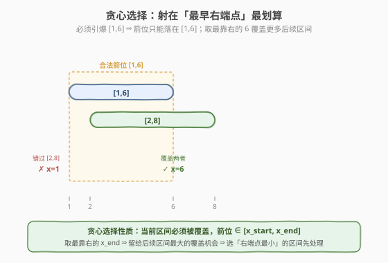
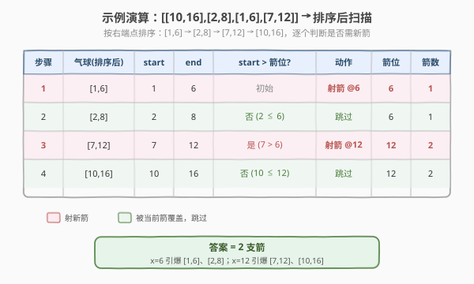

# 用最少数量的箭引爆气球

- **题目名称**：用最少数量的箭引爆气球
- **链接**：[452. 用最少数量的箭引爆气球](https://leetcode.cn/problems/minimum-number-of-arrows-to-burst-balloons/)
- **难度**：中等
- **标签**：贪心、区间调度、数组、排序

## 1. 题目概述

在二维平面的 x 轴上贴着一些球形气球。给你一个二维整数数组 `points`，其中 `points[i] = [x_start, x_end]` 表示第 `i` 个气球的**水平直径**介于 `x_start` 和 `x_end` 之间（含端点）。你不知道气球的精确 y 坐标。

一支弓箭可以**从 x 轴上任意一点垂直向上射出**。若某气球的 `x_start <= x <= x_end`，则该气球被引爆（弓箭会一直向上飞行，引爆路径上所有气球）。求引爆所有气球所需的**最少弓箭数**。

**示例 1**：

```text
输入：points = [[10,16],[2,8],[1,6],[7,12]]
输出：2
解释：在 x = 6 射一支箭引爆 [2,8] 和 [1,6]；在 x = 11 射一支箭引爆 [10,16] 和 [7,12]。
```

**示例 2**：

```text
输入：points = [[1,2],[3,4],[5,6],[7,8]]
输出：4
解释：所有气球互不重叠，每个都需要一支箭。
```

**示例 3**：

```text
输入：points = [[1,2],[2,3],[3,4],[4,5]]
输出：2
解释：在 x = 2 射箭引爆 [1,2] 与 [2,3]；在 x = 4 射箭引爆 [3,4] 与 [4,5]。
```

**约束条件**：

- `1 <= points.length <= 10^5`
- `points[i].length == 2`
- $-2^{31} \leq x_{start} < x_{end} \leq 2^{31} - 1$

> 💡 这是**区间贪心的经典模板**：把每个气球看成 x 轴上的一个**闭区间**，一支箭等价于在 x 轴上选一个**点**，引爆所有覆盖该点的区间。问题即「用最少点覆盖所有区间」。它与 [435. 无重叠区间](435_无重叠区间.md)（删最小区间使剩余不重叠）、[56. 合并区间](../0001-0100/56_合并区间.md)（合并相交区间）并称「区间三部曲」，核心都是「**按端点排序 + 一次扫描**」。

---

## 2. 解题思路

### 2.1 暴力思路

枚举所有「选点方案」：每个区间要么被某个已选点覆盖，要么新选一个点。直接搜索是指数级。退一步，把问题看成「**最多能有多少个区间被同一支箭引爆**」也无从下手——因为能合并的区间组数取决于彼此重叠结构。

一个稍好的思路是：按某种顺序处理，维护「当前箭的位置」，尽量让一支箭覆盖尽可能多的区间。这引出贪心。

### 2.2 核心观察：贪心——按右端点排序，射在右端点


**关键转化**：一支箭 = x 轴上一个点；能被同一支箭引爆的气球 = 所有**包含该点**的区间。因此「最少箭数」= 把区间分成最少的组，使每组存在公共交点。

**贪心策略**：

1. 把所有区间按**右端点升序**排序。
2. 顺序扫描：在**当前区间右端点**射一支箭（此时这支箭必然引爆它）。
3. 跳过所有 `x_start <= 箭位` 的后续区间（它们已被这支箭引爆）。
4. 遇到第一个 `x_start > 箭位` 的区间时，它无法被当前箭引爆，于是**新射一支箭**在其右端点，重复。

**为什么射在「右端点」而不是左端点或中点？**



> 💡 **贪心选择性质的直觉**：要让一支箭「尽可能多」地覆盖后续区间，箭位应尽量靠右（覆盖更多右边的区间）。但箭位又必须落在当前必须引爆的区间内，**最靠右的合法位置正是该区间的右端点**。而选择「右端点最小的那个区间」作为当前处理对象，是因为它的右端点最早——任何能引爆它的箭都不能超过这个右端点，所以先把这支「位置最受限」的箭定下来，留给后续区间的覆盖机会最大。

> ⚠️ **为什么必须按右端点排序，而不是左端点？** 按**左端点**排序在某些变体（如合并区间 56）可行，但本题要「最少点覆盖」，按左端点排序会导致：一个右端点很早的区间被排到后面，前面已经射出的箭可能错过它，被迫多射。按**右端点**排序保证每次处理的都是「最该立刻被覆盖」的区间，这正是该贪心正确性的来源。

### 2.3 算法流程图


**完整步骤**：

1. **排序**：`points` 按右端点 `x_end` 升序排列。
2. **初始化**：`arrows = 1`，`arrow_pos = points[0][1]`（第一支箭射在第一个区间右端点）。
3. **扫描** `i = 1 .. n-1`：
   - 若 `points[i][0] > arrow_pos`：当前箭覆盖不到，`arrows += 1`，`arrow_pos = points[i][1]`（新箭射在此区间右端点）。
   - 否则：已被当前箭覆盖，跳过。
4. **返回** `arrows`。

> 💡 **边界提示**：题目端点为闭区间，`x_start == arrow_pos` 时仍算被覆盖（不必新箭），所以判断条件是**严格大于** `>`。这一点与 [435](435_无重叠区间.md)「无重叠」用 `>=` 恰好相反——435 中端点相接视为不重叠（要删），本题端点相接视为可被同一箭引爆（不删）。

### 2.4 示例演算

以 `points = [[10,16],[2,8],[1,6],[7,12]]` 为例：



**按右端点排序后**：`[1,6]`、`[2,8]`、`[7,12]`、`[10,16]`

| 步骤 | 气球(排序后) | start | end | `start > 箭位`? | 动作 | 箭位 | 箭数 |
|------|-------------|-------|-----|----------------|------|------|------|
| 1 | `[1,6]` | 1 | 6 | 初始，必新箭 | 射箭 @6 | 6 | 1 |
| 2 | `[2,8]` | 2 | 8 | 否（2 ≤ 6） | 被覆盖，跳过 | 6 | 1 |
| 3 | `[7,12]` | 7 | 12 | 是（7 > 6） | 射箭 @12 | 12 | 2 |
| 4 | `[10,16]` | 10 | 16 | 否（10 ≤ 12） | 被覆盖，跳过 | 12 | 2 |

最终只需 **2 支箭**：`x=6` 引爆前两个，`x=12` 引爆后两个。

---

## 3. 参考代码

### C++

```cpp
// 用最少数量的箭引爆气球.cpp —— 区间贪心
// 编译: g++ -O2 -std=c++17 用最少数量的箭引爆气球.cpp -o balloons
class Solution {
public:
    int findMinArrowShots(vector<vector<int>>& points) {
        if (points.empty()) return 0;
        // 按右端点升序排序
        sort(points.begin(), points.end(), [](const auto& a, const auto& b) {
            return a[1] < b[1];
        });
        int arrows = 1;
        int arrow_pos = points[0][1];          // 第一支箭射在首个区间右端点
        for (int i = 1; i < (int)points.size(); i++) {
            if (points[i][0] > arrow_pos) {     // 当前箭覆盖不到
                arrows++;                       // 新射一支箭
                arrow_pos = points[i][1];
            }
            // 否则已被覆盖，跳过
        }
        return arrows;
    }
};
```

### Python

```python
class Solution:
    def findMinArrowShots(self, points: List[List[int]]) -> int:
        if not points:
            return 0
        points.sort(key=lambda p: p[1])        # 按右端点升序
        arrows = 1
        arrow_pos = points[0][1]
        for start, end in points[1:]:
            if start > arrow_pos:              # 当前箭覆盖不到
                arrows += 1
                arrow_pos = end
        return arrows
```

> 💡 **实现细节**：① 排序比较只看右端点 `a[1] < b[1]`，**不要**写成 `return a[1] <= b[1]`——标准库 `sort` 要求严格弱序，相等时返回 `true` 会导致未定义行为（尤其在大量重复右端点时可能触发越界）。② 判断用严格 `>`：端点相接视为可被同一箭引爆。③ 坐标范围达 `±2^31`，C++ `int`（32 位有符号）恰好能容纳，无需 `long long`；Python 整数无此问题。

---

## 4. 复杂度分析

| 维度 | 复杂度 | 说明 |
|------|--------|------|
| 时间复杂度 | $O(n \log n)$ | 排序主导；后续单次扫描 $O(n)$ |
| 空间复杂度 | $O(\log n)$ | 排序的栈空间（原地排序，无额外数据结构） |

> ⚠️ $n \leq 10^5$ 时 $n \log n \approx 1.7 \times 10^6$，远低于时限。扫描阶段每步 $O(1)$，总体高效。

---

## 5. 扩展：区间贪心三部曲对比

区间问题是面试高频考点，三道核心题共享「排序 + 一次扫描」框架，但排序键与处理逻辑不同：

| 题目 | 目标 | 排序键 | 扫描逻辑 | 端点相接 |
|------|------|--------|----------|----------|
| [56. 合并区间](../0001-0100/56_合并区间.md) | 合并所有相交区间 | 左端点升序 | 维护当前区间右界，若下个左端 ≤ 右界则扩展右界 | 相接可合并 |
| [435. 无重叠区间](435_无重叠区间.md) | 删最少区间使剩余不重叠 | 右端点升序 | 维护当前右界，若下个左端 ≥ 右界则更新，否则删除 | 相接视为不重叠（`>=`） |
| **452. 引爆气球（本题）** | 最少点覆盖所有区间 | 右端点升序 | 维护箭位，若下个左端 > 箭位则新箭 | 相接可同箭引爆（`>`） |

> 💡 **对偶关系**：452 与 435 是对偶的。435 求「保留最多不重叠区间数」$M$，答案为 $n - M$；452 求「最少点覆盖所有区间数」，恰等于「最多不重叠区间数」$M$。直觉：每一支箭必须落在某一组公共交点内，而「最多不重叠区间」中的每个区间都需要一支独立的箭（它们两两不相交），所以最少箭数 $\geq M$；贪心又证明了 $\leq M$ 可达。理解这层对偶，就能把 435 的模板直接迁移过来。

### 区间贪心通用模板

```python
def interval_sweep(points):
    points.sort(key=lambda p: p[1])   # 按右端点
    cur = points[0][1]
    ans = 1
    for l, r in points[1:]:
        if l > cur:                   # 题目定阈值：> / >=
            ans += 1
            cur = r
    return ans
```

阈值取 `>`（452）或 `>=`（435）取决于「端点相接是否算重叠」。**面试时先把端点语义问清楚**，再决定用哪个比较符。

---

## 6. 面试要点

1. **为什么按右端点排序而不是左端点？**

   > 按右端点排序保证每次处理的都是「右端点最小、最该被立刻覆盖」的区间。若按左端点排序，一个右端点很早的区间可能被排到后面，导致前面射出的箭错过它而被迫多射。右端点排序是该贪心正确性的关键。

2. **为什么箭要射在区间的右端点？**

   > 当前区间必须被某支箭覆盖，箭位落在 $[x_{start}, x_{end}]$ 内。为了让这支箭尽可能多地覆盖后续区间，箭位应尽量靠右，而右端点是合法范围内最靠右的位置，故选右端点。

3. **判断条件为什么用严格大于 `>`？端点相接算不算被同一箭引爆？**

   > 题目区间是闭区间，`x_start == arrow_pos` 时该点仍落在区间内，能被同一支箭引爆，所以新箭条件是 `start > arrow_pos`（严格大于）。这与 435 用 `>=` 相反——435 中端点相接视为「不重叠」需删除，本题端点相接视为「可同箭」不删。

4. **排序比较函数写成 `a[1] <= b[1]` 会有什么问题？**

   > C++ `std::sort` 要求比较函数满足**严格弱序**（strict weak ordering），相等时必须返回 `false`。写成 `<=` 会在相等时返回 `true`，破坏严格弱序，触发未定义行为，可能越界崩溃。正确写法是 `a[1] < b[1]`。Python 的 `key=lambda p: p[1]` 用 Timsort，不存在此问题。

5. **本题与 435 的对偶关系是什么？**

   > 452 的最少箭数 = 435 的最多不重叠区间数。两者都按右端点排序、一次扫描，仅比较符不同（`>` vs `>=`）。掌握这个对偶，就能把任一题的解法直接改写为另一题。

> 💡 **一句话总结**：452 是「最少点覆盖所有区间」的经典区间贪心——按右端点排序，每次在当前区间右端点射箭，跳过被覆盖的区间，遇到未覆盖就新射一箭。$O(n \log n)$ 时间、$O(1)$ 额外空间。与 435 互为对偶，与 56 共享「排序 + 扫描」框架，是面试区间题必须秒切的模板。

---

## 7. 同类练习题

- [435. 无重叠区间](https://leetcode.cn/problems/non-overlapping-intervals/)（[题解](435_无重叠区间.md)）：删最少区间使剩余不重叠，与本题对偶，比较符 `>=` vs `>`
- [56. 合并区间](https://leetcode.cn/problems/merge-intervals/)（[题解](../0001-0100/56_合并区间.md)）：合并相交区间，按左端点排序，组成区间三部曲
- [352. 将数据流变为多个不相交区间](https://leetcode.cn/problems/data-stream-as-disjoint-intervals/)：动态维护不相交区间，区间贪心 + 有序结构进阶
- [1288. 删除被覆盖区间](https://leetcode.cn/problems/remove-covered-intervals/)：按左端点排序、右端点降序，扫描判断包含关系
- [763. 划分字母区间](https://leetcode.cn/problems/partition-labels/)（[题解](../0701-0800/763_划分字母区间.md)）：把字母出现范围看成区间，求最多不重叠分段，思路同源
