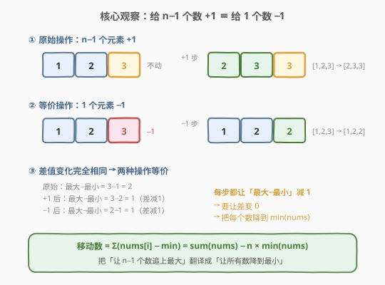
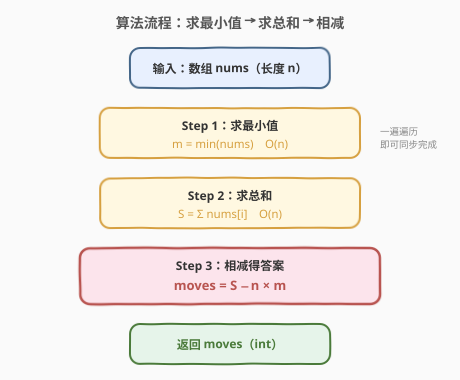
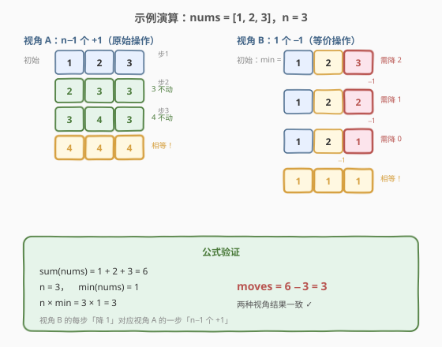

# 最小操作次数使数组元素相等

- **题目名称**：最小操作次数使数组元素相等
- **链接**：[453. 最小操作次数使数组元素相等](https://leetcode.cn/problems/minimum-moves-to-equal-array-elements/)
- **难度**：中等
- **标签**：数组、数学、贪心

## 1. 题目概述

给你一个长度为 `n` 的整数数组 `nums`，每次操作可以使其中 **$n - 1$ 个元素** 同时加 1。返回使数组中**所有元素相等**所需的**最少操作次数**。

**示例 1**：

```text
输入：nums = [1,2,3]
输出：3
解释：只需要三步（每步给其中 2 个元素 +1）：
[1,2,3] => [2,3,3] => [3,4,3] => [4,4,4]
```

**示例 2**：

```text
输入：nums = [1,1,1]
输出：0
解释：所有元素已经相等，无需操作。
```

**约束条件**：

- $n = \text{nums.length}$
- $1 \le n \le 10^5$
- $-10^9 \le \text{nums}[i] \le 10^9$
- 答案保证可以填入 32 位有符号整数

> 💡 **关键直觉**：每步给 $n-1$ 个数加 1，等价于「让 1 个数不变」——那个不动的数相对所有同伴**下降了一格**。把视角翻转过来，这道题就从「模拟追赶」变成了一行公式。

---

## 2. 解题思路

### 2.1 暴力思路

最直观的模拟：**每步选出最大的元素不动，其余 $n-1$ 个都 +1**，重复直到所有元素相等。

```text
while not all_equal(nums):
    找到最大值 max_val
    对所有 != max_val 的元素 +1
    moves += 1
```

问题很明显：若数组很大、元素差距很大，步数可能高达 $10^{14}$ 量级（如 `[-10^9, 10^9, ...]`），逐步模拟必然超时。需要找到**直接计算步数**的数学方法。

> ⚠️ 朴素模拟的复杂度正比于答案本身，而答案可以远大于 $n$。突破口在于把「$n-1$ 个加 1」翻译成对称的对偶操作，直接消去步数循环。

### 2.2 核心观察：$n-1$ 个加 1 $\equiv$ 1 个减 1



关键观察分两步：

1. **操作对偶**：给 $n-1$ 个元素加 1，等价于给剩下的 1 个元素**减 1**——因为这两种操作对「任意两元素之差」的影响完全相同（都让「被选中的不动元素」相对其余下降 1）。
2. **目标翻译**：原目标是「所有元素相等」。在对偶视角下，每步只把一个数减 1，那么**让所有数降到最小值 $\min(\text{nums})$** 即可达成目标。每个元素 $\text{nums}[i]$ 需要减 $\text{nums}[i] - \min(\text{nums})$ 次，总步数即：

$$
\text{moves} = \sum_{i=0}^{n-1} \bigl(\text{nums}[i] - \min(\text{nums})\bigr) = \sum \text{nums} - n \times \min(\text{nums})
$$

> 💡 **为什么是降到最小值而非升到最大值？** 在对偶操作「1 个减 1」下，元素只能减少不能增加，最小值是所有元素能共同达到的「下限」。若降到比 $\min$ 更低，最小值会先到目标但其余还在下降，反而多走步数；所以降到 $\min$ 恰好是最优。

### 2.3 算法流程图



算法只需两趟扫描（可合并为一趟）：

1. 遍历数组求最小值 $m = \min(\text{nums})$。
2. 遍历数组求总和 $S = \sum \text{nums}[i]$。
3. 返回 $\text{moves} = S - n \times m$。

> 💡 两趟可合并：一次遍历中同时维护 `min_val` 和 `sum`，最后做一次乘减即可。

### 2.4 示例演算

以 `nums = [1, 2, 3]`，$n = 3$ 为例：



**视角 A（原始操作：$n-1$ 个 +1）**：

| 步数 | 不动的元素 | 数组状态 | 说明 |
|------|------------|----------|------|
| 0 | — | [1, 2, 3] | 初始 |
| 1 | 3 | [2, 3, 3] | 给 1、2 各 +1 |
| 2 | 4（第二个） | [3, 4, 3] | 给两个 3 各 +1 |
| 3 | 4（第一个） | [4, 4, 4] | 给 3、3 各 +1 → 相等 |

**视角 B（等价操作：1 个 −1，目标降到 $\min = 1$）**：

| 元素 | 初始值 | 需减次数 | 贡献 |
|------|--------|----------|------|
| nums[0] | 1 | 1 − 1 = 0 | 0 |
| nums[1] | 2 | 2 − 1 = 1 | 1 |
| nums[2] | 3 | 3 − 1 = 2 | 2 |
| **合计** | | | **3** |

**公式验证**：$S = 6$，$n = 3$，$m = 1$，$\text{moves} = 6 - 3 \times 1 = 3$ ✓

两种视角结果完全一致。

---

## 3. 参考代码

### C++

```cpp
class Solution {
  public:
    int minMoves(vector<int>& nums) {
        int minVal = nums[0];
        long long sum = 0;
        for (int x : nums) {
            minVal = min(minVal, x);
            sum += x;
        }
        return (int)(sum - (long long)nums.size() * minVal);
    }
};
```

### Python

```python
class Solution:
    def minMoves(self, nums: List[int]) -> int:
        return sum(nums) - min(nums) * len(nums)
```

> ⚠️ **溢出提醒**：$\text{nums}[i]$ 可达 $\pm 10^9$，$n$ 可达 $10^5$，故 $S$ 和 $n \times m$ 均可达 $10^{14}$ 量级，超出 32 位 `int` 范围。C++ 中必须用 `long long` 计算 `sum` 与乘积，最后再转回 `int`（题目保证答案在 32 位内）。Python 无此问题。

---

## 4. 复杂度分析

| 维度 | 复杂度 | 说明 |
|------|--------|------|
| 时间复杂度 | $O(n)$ | 一趟遍历求 $\min$ 与 $\sum$，各 $n$ 次 $O(1)$ 操作 |
| 空间复杂度 | $O(1)$ | 仅用 `minVal`、`sum` 等常数变量 |

> 💡 这是该题的最优解：时间已达下界 $O(n)$（必须至少看一遍所有元素才能确定最小值与总和），空间为常数。数学转换把看似需要逐步模拟的 $O(\text{答案})$ 过程压缩为 $O(n)$。

---

## 5. 扩展：数学推导与严格证明

### 5.1 代数推导

设经过 $m$ 步后所有元素相等为 $x$。每步让 $n-1$ 个元素加 1，故总和每步增加 $n - 1$：

$$
n \cdot x = S + (n - 1) \cdot m \quad \cdots (1)
$$

又因为**最小元素在每步中都被加 1**（若某步跳过最小值，它将变得更小，永远追不上其余元素，不可能最优），所以最终值 $x = m + \min$。代入式 (1)：

$$
n \cdot (m + \min) = S + (n - 1) \cdot m
$$

展开整理：

$$
n \cdot m + n \cdot \min = S + n \cdot m - m \implies n \cdot \min + m = S \implies m = S - n \cdot \min
$$

### 5.2 对偶等价性的形式说明

设原数组为 $a$，一次「$n-1$ 个 +1」操作后为 $a'$，一次「1 个减 1」操作后为 $a''$。对任意下标对 $(i, j)$：

- 原操作：若两元素同时被加 1，差不变；若一加一不加，差变化 1。
- 对偶操作：若两元素同时被减 1，差不变；若一减一不减，差变化 1。

两者的**差分矩阵变化完全一致**，因此对「让所有差归零」这一目标而言两种操作等价。对偶操作下每步只减一个数，自然把所有数拉向 $\min$。

---

## 6. 面试要点

1. **为什么「$n-1$ 个加 1」等价于「1 个减 1」？**
   - 两种操作对任意两元素之差的影响相同：要么差不变（两元素同时变动），要么差变化 1（一变一不变）。目标只是让所有差归零，故两种操作在效果上等价，只是基准偏移不同（整体加 1 vs 整体不变）。

2. **为什么答案是 $\sum - n \cdot \min$ 而非 $\sum - n \cdot \max$？**
   - 在对偶「1 个减 1」视角下元素只能减少，所以共同目标是降到最小值 $\min$（无法把最小值再升高）。每个元素贡献 $\text{nums}[i] - \min$，求和即得答案。

3. **最小元素在每步原操作中是否一定被加 1？为什么？**
   - 是。若某步跳过最小值，则最小值不变而其余都 +1，差距进一步拉大，永远无法收敛到相等。因此最优策略中每步都给最小值加 1，最终值 $x = \min + m$，这是代数推导的关键一步。

4. **溢出如何处理？**
   - $S$ 可达 $10^{14}$，$n \cdot \min$ 也可达 $10^{14}$，中间计算必须用 64 位整数。最终答案虽在 32 位内，但若用 `int` 累加 `sum` 会溢出导致错误。C++ 用 `long long`，Java 用 `long`。

5. **如果题目改成「每步给 $n-1$ 个元素减 1」呢？**
   - 对偶地，等价于「1 个元素加 1」，目标升到最大值 $\max$。答案变为 $n \cdot \max - \sum$。套路完全对称，只是方向翻转。

---

## 7. 同类练习题

- [452. 用最少数量的箭引爆气球](https://leetcode.cn/problems/minimum-number-of-arrows-to-burst-balloons/)（[题解](../0401-0500/452_用最少数量的箭引爆气球.md)）：同区间的贪心最值题，对比「差分视角转换」与「区间端点排序」两类贪心
- [462. 最小操作使数组元素相等 II](https://leetcode.cn/problems/minimum-moves-to-equal-array-elements-ii/)：本题的变体——每步只能改**一个**元素（±1），答案是所有元素到中位数的距离之和，对比「$n-1$ 个 +1」与「1 个 ±1」两种操作模型
- [238. 除自身以外数组的乘积](https://leetcode.cn/problems/product-of-array-except-self/)：同样利用「$n-1$ 个元素」的对称性——前缀积 × 后缀积，思想同构（整体与个体的关系转换）
- [319. 灯泡开关](https://leetcode.cn/problems/bulb-switcher/)：另一道「朴素模拟超时、数学转换一步到位」的题，$\lfloor\sqrt{n}\rfloor$ 即答案，同属「观察对偶性/周期性化简」的数学贪心
- [134. 加油站](https://leetcode.cn/problems/gas-station/)：贪心 + 数学性质（总盈余非负则必有解），同为「把看似需要逐步模拟的过程用整体性质一步判定」的套路
