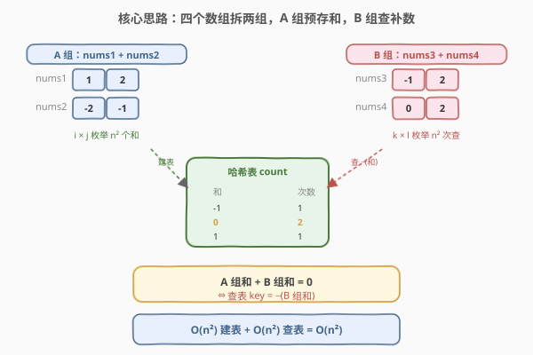
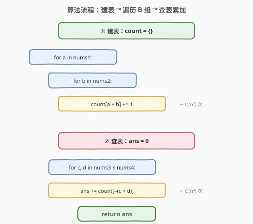
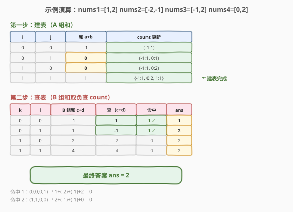

# LeetCode 四数相加 II 题解

## 1. 题目概述

- **标题 / 题号**：四数相加 II（#454，medium）
- **链接**：https://leetcode.cn/problems/4sum-ii/
- **难度**：中等
- **标签**：数组、哈希表

**题意**：给定四个长度相同的整数数组 `nums1`、`nums2`、`nums3`、`nums4`，统计满足 `nums1[i] + nums2[j] + nums3[k] + nums4[l] == 0` 的四元组 `(i, j, k, l)` 的**个数**。

**示例 1**：

```text
输入：nums1 = [1,2], nums2 = [-2,-1], nums3 = [-1,2], nums4 = [0,2]
输出：2
解释：两个满足条件的四元组：
  (0, 0, 0, 1) → 1 + (-2) + (-1) + 2 = 0
  (1, 1, 0, 0) → 2 + (-1) + (-1) + 0 = 0
```

**示例 2**：

```text
输入：nums1 = [0], nums2 = [0], nums3 = [0], nums4 = [0]
输出：1
```

**约束**：

- `n == nums1.length == nums2.length == nums3.length == nums4.length`
- `1 <= n <= 200`
- $-2^{28} \leq \text{nums}[i] \leq 2^{28} - 1$
- 答案保证在 32 位带符号整数范围内

> 💡 本题与 [18. 四数之和](../0001-0100/18_四数之和.md) 名字相似但**套路完全不同**：18 题是「同一个数组、要返回不重复的四元组」，用排序 + 双指针 $O(n^3)$；本题是「四个独立数组、只需计数」，四个下标各自独立、天然不冲突，用**分组 + 哈希**可做到 $O(n^2)$。

## 2. 解题思路

### 2.1 暴力思路：四重循环枚举

最直接的做法：四重循环枚举所有 `(i, j, k, l)` 组合，判断四数之和是否为 0。

```text
for i in 0..n:
    for j in 0..n:
        for k in 0..n:
            for l in 0..n:
                if nums1[i]+nums2[j]+nums3[k]+nums4[l]==0: ans++
```

时间复杂度 $O(n^4)$，`n=200` 时约 $1.6 \times 10^9$ 次运算，**超时**。问题在于：四个数组各自独立，却没有利用「两两分组可预计算」的结构。

> ⚠️ 与 18 题不同，本题**不能排序 + 双指针**。双指针依赖「同一数组有序」来夹逼，而这里是四个独立数组，排序某个数组并不能让「四数之和」产生可用于夹逼的单调性。正解是换一个维度——**分组**。

### 2.2 核心观察：分组 + 哈希（Meet in the Middle）



**关键转换**：把四个数组拆成**两组**——A 组 `(nums1, nums2)`，B 组 `(nums3, nums4)`。

要使四数之和为 0，即：

$$
\text{nums1}[i] + \text{nums2}[j] = -(\text{nums3}[k] + \text{nums4}[l])
$$

左侧只涉及 A 组，右侧只涉及 B 组。于是：

1. **预计算 A 组**：枚举所有 $(i, j)$ 共 $n^2$ 对，把 `nums1[i] + nums2[j]` 的值存入哈希表，记录每个和出现的**次数**。
2. **查询 B 组**：枚举所有 $(k, l)$ 共 $n^2$ 对，对 `nums3[k] + nums4[l]` 取负，在哈希表中查该值出现的次数，累加到答案。

> 💡 **为什么这比暴力快？** 暴力法把「四个维度」同时枚举，$n^4$ 无法拆解。分组后，A 组的 $n^2$ 个和**预计算一次、复用 $n^2$ 次**——用 $O(n^2)$ 空间换掉了两重循环，时间从 $n^4$ 降到 $n^2$。这正是「**Meet in the Middle**」（中间相遇）思想：把问题从中间劈开，两侧各做一半，在中间汇合。

### 2.3 与 18 题的对比

| 维度 | 18. 四数之和 | 454. 四数相加 II |
|------|-------------|-----------------|
| 输入 | **一个**数组 | **四个**独立数组 |
| 目标 | 返回不重复四元组 | 统计满足条件的个数 |
| 下标关系 | 同一数组，需互不相同 | 四个数组，天然独立 |
| 去重 | 三层去重（排序后跳过相邻） | **无需去重**（下标不同即不同元组） |
| 解法 | 排序 + 双指针 $O(n^3)$ | 分组 + 哈希 $O(n^2)$ |
| 空间 | $O(\log n)$（排序栈） | $O(n^2)$（哈希表） |

> ⚠️ **为什么 18 题不用分组 + 哈希？** 18 题要求「不重复的四元组」，若用哈希预计算两数之和，去重会极其复杂（四元组无序，需排序后入集合，常数大、易错），且 18 题 `n≤200` 时 $O(n^3)$ 仅 $8 \times 10^6$ 完全够用。而本题只需计数、无需去重，分组 + 哈希是最自然的选择。

### 2.4 算法流程图



**完整步骤**：

1. **建表**：创建哈希表 `count`，双重循环枚举 `nums1[i]` × `nums2[j]`，`count[nums1[i] + nums2[j]]++`。
2. **查询累加**：双重循环枚举 `nums3[k]` × `nums4[l]`，`ans += count[-(nums3[k] + nums4[l])]`（不存在则计 0）。
3. 返回 `ans`。

### 2.5 示例演算

以 `nums1 = [1,2], nums2 = [-2,-1], nums3 = [-1,2], nums4 = [0,2]` 为例：



**第一步：预计算 A 组 (nums1 + nums2) 的所有和**

| i | nums1[i] | j | nums2[j] | 和 | 哈希表更新 |
|---|----------|---|----------|----|-----------|
| 0 | 1 | 0 | -2 | -1 | {-1: 1} |
| 0 | 1 | 1 | -1 | 0 | {-1: 1, 0: 1} |
| 1 | 2 | 0 | -2 | 0 | {-1: 1, 0: 2} |
| 1 | 2 | 1 | -1 | 1 | {-1: 1, 0: 2, 1: 1} |

建表后 `count = {-1: 1, 0: 2, 1: 1}`。

**第二步：遍历 B 组 (nums3 + nums4)，查 -(和)**

| k | nums3[k] | l | nums4[l] | B 组和 | 查询 −(和) | 命中次数 | 累计答案 |
|---|----------|---|----------|--------|-----------|----------|----------|
| 0 | -1 | 0 | 0 | -1 | 1 | 1 | 1 |
| 0 | -1 | 1 | 2 | 1 | -1 | 1 | 2 |
| 1 | 2 | 0 | 0 | 2 | -2 | 0 | 2 |
| 1 | 2 | 1 | 2 | 4 | -4 | 0 | 2 |

最终答案为 `2`，对应四元组 `(0,0,0,1)` 和 `(1,1,0,0)`。

## 3. 参考代码

### C++

```cpp
class Solution {
  public:
    int fourSumCount(vector<int>& nums1, vector<int>& nums2,
                     vector<int>& nums3, vector<int>& nums4) {
        unordered_map<int, int> count;
        for (int a : nums1)
            for (int b : nums2)
                count[a + b]++;

        int ans = 0;
        for (int c : nums3)
            for (int d : nums4)
                ans += count[-(c + d)];
        return ans;
    }
};
```

### Python

```python
class Solution:
    def fourSumCount(self, nums1: List[int], nums2: List[int],
                     nums3: List[int], nums4: List[int]) -> int:
        count = {}
        for a in nums1:
            for b in nums2:
                count[a + b] = count.get(a + b, 0) + 1

        ans = 0
        for c in nums3:
            for d in nums4:
                ans += count.get(-(c + d), 0)
        return ans
```

> 💡 **溢出说明**：单个元素范围 $[-2^{28}, 2^{28}-1]$，两数之和范围 $[-2^{29}, 2^{29}-2]$，在 32 位 `int`（上限约 $2.1 \times 10^9$）范围内，C++ 无需用 `long`。这与 [18 题](../0001-0100/18_四数之和.md)（四个 $10^9$ 相加会溢出）不同，是两题的又一个差异点。

## 4. 复杂度分析

| 维度 | 复杂度 | 说明 |
|------|--------|------|
| 时间复杂度 | $O(n^2)$ | 建表 $n \times n$ 次枚举 + 查表 $n \times n$ 次枚举，每次哈希操作均摊 $O(1)$ |
| 空间复杂度 | $O(n^2)$ | 最坏情况 A 组 $n^2$ 个和各不相同，哈希表存 $n^2$ 个键 |

> 💡 `n=200` 时 $n^2 = 4 \times 10^4$，哈希表最多 4 万条目，时间和空间都在舒适区间。

## 5. 扩展：Meet in the Middle 的通用性

「分组 + 哈希」本质是 **Meet in the Middle** 技巧：把一个 $k$ 维枚举问题从中间劈成两半，各做 $k/2$ 维，在中间汇合。

| 问题 | 暴力 | Meet in the Middle | 关键 |
|------|------|---------------------|------|
| 两数之和 (1) | $O(n^2)$ | $O(n)$ | 预存一个数，查补数 |
| 四数相加 II (454) | $O(n^4)$ | $O(n^2)$ | 两组各两数，预存 A 组和 |
| 四数之和 (18) | $O(n^4)$ | $O(n^3)$ | 不用哈希（去重难），双指针 |

> 💡 当问题可拆成「左半 = −右半」且**无需去重**时，Meet in the Middle + 哈希是最优选择。若需去重（如返回所有不重复解），则排序 + 双指针更稳妥。

## 6. 面试要点

1. **为什么本题用哈希而 18 题用双指针？**

   - 本题是四个**独立**数组，下标天然不冲突，无需去重，用哈希预计算两数之和可 $O(n^2)$ 完成。18 题是**同一个**数组，要返回不重复四元组，哈希去重极复杂，排序 + 双指针 $O(n^3)$ 去重简洁、空间 $O(1)$，是标准解法。

2. **为什么先建表再查表，而不是边查边建？**

   - 本题 A、B 两组来自不同数组，互不依赖，先完整建表再查表逻辑最清晰。不像 [1. 两数之和](../0001-0100/1_两数之和.md) 在同一数组内「边查边存」——那是为了避免同一元素用两次。这里四组下标独立，不存在自配问题。

3. **哈希表存的是「次数」而非「下标」，为什么？**

   - 题目只问「有多少个四元组」，不关心具体下标。存次数可直接累加：A 组若有 3 对和为 5，B 组某对和为 −5，则贡献 3 个四元组。若改成「返回所有四元组」，则需存下标列表，空间和实现都更复杂。

4. **能否把分组换成「3 + 1」？**

   - 理论可以：预计算 3 个数组的所有 $n^3$ 个和存哈希，再枚举第 4 个数组查。但 $n^3 = 8 \times 10^6$（n=200），建表 $O(n^3)$ 远慢于 $O(n^2)$。「2 + 2」均分是最优分组，因 $n^{k/2} + n^{k/2}$ 在 $k=4$ 时最小。

5. **如果 nums 值域很大，哈希表会有性能问题吗？**

   - 哈希表对值域无要求，$O(1)$ 均摊查找不依赖值大小。最坏情况哈希冲突退化到 $O(n)$，但 C++ `unordered_map` 和 Python `dict` 在面试场景下表现稳定。若追求极致，可用排序 + 双指针在 A 组和上做两数之和，但常数不一定更优。

## 同类练习题

| # | 题目 | 与本题的关联 |
|---|------|-------------|
| 1 | [两数之和](https://leetcode.cn/problems/two-sum/)（[题解](../0001-0100/1_两数之和.md)） | 哈希查补数的母题，本题的思路起点 |
| 18 | [四数之和](https://leetcode.cn/problems/4sum/)（[题解](../0001-0100/18_四数之和.md)） | 同名不同套路，对比「排序 + 双指针」与「分组 + 哈希」的适用场景 |
| 15 | [三数之和](https://leetcode.cn/problems/3sum/)（[题解](../0001-0100/15_三数之和.md)） | 固定一个 + 双指针，k-sum 系列的中间形态 |
| 560 | [和为 K 的子数组](https://leetcode.cn/problems/subarray-sum-equals-k/)（[题解](../0501-0600/560_和为K的子数组.md)） | 前缀和 + 哈希查补数，同样是「预存 + 查询」思路 |
| 494 | [目标和](https://leetcode.cn/problems/target-sum/)（[题解](../0401-0500/494_目标和.md)） | 把 ± 选择转化为子集和，可用哈希或背包，思路可迁移 |
