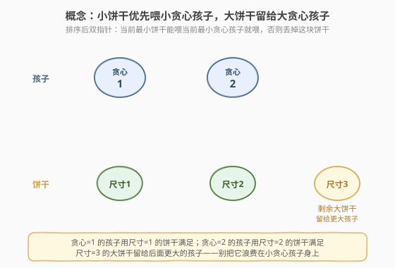
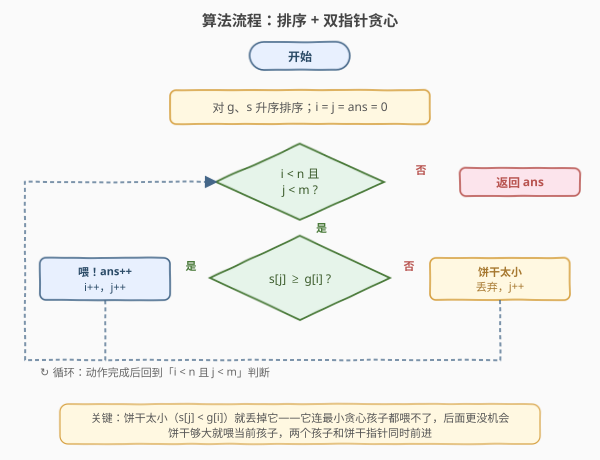
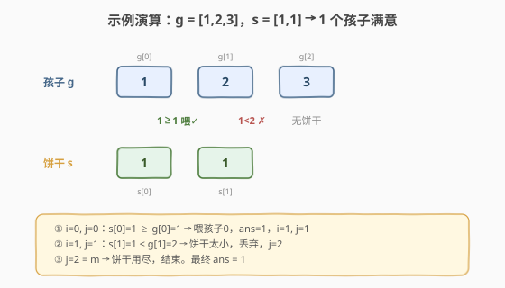

# LeetCode 分发饼干 题解

## 1. 题目概述

- **标题 / 题号**：分发饼干（#455，easy）
- **链接**：https://leetcode.cn/problems/assign-cookies/
- **难度**：简单
- **标签**：贪心、数组、排序、双指针

**题意**：你是一位很棒的家长，想给孩子们分发一些饼干。每个孩子**最多只能得到一块饼干**。每个孩子 `i` 有一个**贪心因子** `g[i]`，表示能让孩子满意的饼干**最小尺寸**；每块饼干 `j` 有一个尺寸 `s[j]`。当 `s[j] >= g[i]` 时，饼干 `j` 可以分给孩子 `i`，孩子 `i` 就会**满意**。目标是**最大化满意孩子的数量**。

**示例 1**：

```text
输入：g = [1,2,3], s = [1,1]
输出：1
解释：让贪心因子为 1 的孩子拿到尺寸 1 的饼干，他满意；剩下尺寸 1 的饼干喂不饱贪心因子为 2 的孩子。
```

**示例 2**：

```text
输入：g = [1,2], s = [1,2,3]
输出：2
解释：贪心因子 1 的孩子拿尺寸 1，贪心因子 2 的孩子拿尺寸 2，两人都满意，尺寸 3 的饼干剩余。
```

**约束**：

- $1 \leq \text{g.length} \leq 3 \times 10^4$
- $0 \leq \text{s.length} \leq 3 \times 10^4$
- $1 \leq g[i],\ s[j] \leq 2^{31} - 1$

> 💡 本题是**排序 + 双指针贪心**的入门招牌题：每个孩子/饼干只参与一次配对，且「能否喂饱」由数值大小决定，存在天然的可排序结构。把两个数组都升序排序后，对贪心最小的孩子优先用**最小的能喂饱他的饼干**去喂，就能让满意孩子数最大。

## 2. 解题思路

### 2.1 暴力思路

对每个孩子枚举所有未分配的饼干，搜索一种「使最多孩子满意」的分配方案。这是朴素的回溯/二分图匹配问题：孩子与饼干构成二分图，边表示 `s[j] >= g[i]`，求**最大匹配**。匈牙利算法可做到 $O(VE)$，但 $n, m$ 均可达 $3 \times 10^4$，规模过大。

> 💡 暴力的低效说明需要利用**贪心选择性质**——是否存在「先喂谁、用哪块饼干喂一定不亏」的策略？答案是：**先喂贪心最小的孩子，用最小的能喂饱他的饼干**。

### 2.2 核心观察：贪心——双指针 + 排序，小饼干喂小贪心孩子



**关键直觉**：饼干的「喂养能力」由其尺寸决定——**小饼干只能喂小贪心孩子，大饼干谁都能喂**。因此：

- 小饼干应当**优先留给小贪心孩子**（只有他们能吃）；若把大饼干浪费在小贪心孩子身上，小饼干就找不到主了；
- 大饼干**灵活**，可以喂大贪心孩子，应留到后面再分配。

把 `g`、`s` 都升序排序后，用**双指针** `i`（孩子）、`j`（饼干）从最小端同步扫描：

- 若 `s[j] >= g[i]`：这块饼干能喂饱当前孩子，**配对**，`i++`、`j++`、`ans++`；
- 若 `s[j] < g[i]`：这块饼干连当前最小贪心孩子都喂不饱，后面孩子贪心更大更喂不饱，**丢弃这块饼干**，`j++`；
- 当 `i == n`（孩子都喂完）或 `j == m`（饼干用尽）时停止。

> ⚠️ 为什么 `s[j] < g[i]` 时直接丢弃饼干、而不是换块更大的给孩子？因为数组已排序，**当前 `j` 是剩下最小的饼干**，它喂不饱当前贪心最小的孩子 `i`，就注定喂不饱任何人（后面孩子贪心只增不减）。丢弃它去看下一块更大的饼干才是正解——这正是双指针「同步推进」的依据。

> 💡 **交换论证（直觉版）**：设贪心解把最小的可喂饱饼干 `s*` 给了贪心最小的孩子 `c`。任取一个最优解 `OPT`，若 `OPT` 没这么分配——要么 `c` 在 `OPT` 中没饼干（但 `s*` 存在却没给 `c`，说明给了贪心更大的孩子 `c'` 或闲置；闲置则给 `c` 直接增加计数，矛盾；给了 `c'` 则把 `s*` 转给 `c`、把 `OPT` 原给 `c` 的更大饼干转给 `c'`，两人仍都满意、计数不变）。因此总能把 `OPT` 改写成「`c` 用 `s*`」的形式而不减少满意数，对剩余子问题递归即得贪心最优。

### 2.3 算法流程图



**完整步骤**：

1. **排序**：`g`、`s` 分别升序排序。
2. **初始化**：`i = 0`、`j = 0`、`ans = 0`。
3. **循环**（`i < n` 且 `j < m`）：
   - `s[j] >= g[i]`：配对成功，`ans++`、`i++`、`j++`；
   - 否则：饼干太小，`j++`。
4. **返回** `ans`。

### 2.4 示例演算

以 `g = [1,2,3], s = [1,1]` 为例（已升序）：



| 步骤 | `i`（孩子） | `j`（饼干） | `s[j] >= g[i]`? | 动作 | `ans` |
|------|------------|------------|-----------------|------|-------|
| 1 | 0（g=1） | 0（s=1） | $1 \geq 1$ ✓ | 喂孩子 0，`i++`、`j++` | 1 |
| 2 | 1（g=2） | 1（s=1） | $1 \geq 2$ ✗ | 饼干太小丢弃，`j++` | 1 |
| 3 | 1（g=2） | 2 = m（越界） | — | 饼干用尽，结束 | 1 |

最终 `ans = 1` ✓。孩子 0 用饼干 0 满意；饼干 1 太小喂不饱孩子 1；孩子 1、2 无饼干可分。

## 3. 参考代码

### C++

```cpp
class Solution {
public:
    int findContentChildren(vector<int>& g, vector<int>& s) {
        sort(g.begin(), g.end());
        sort(s.begin(), s.end());
        int i = 0, j = 0, ans = 0;
        int n = g.size(), m = s.size();
        while (i < n && j < m) {
            if (s[j] >= g[i]) {   // 这块饼干能喂饱当前孩子
                ++ans;
                ++i;
                ++j;
            } else {              // 饼干太小，丢弃看下一块
                ++j;
            }
        }
        return ans;
    }
};
```

### Python

```python
class Solution:
    def findContentChildren(self, g: List[int], s: List[int]) -> int:
        g.sort()
        s.sort()
        child = cookie = 0
        n, m = len(g), len(s)
        while child < n and cookie < m:
            if s[cookie] >= g[child]:   # 能喂饱，配对
                child += 1
            # 无论是否配对，饼干指针都前进：配对了用掉，没配对是太小丢弃
            cookie += 1
        return child
```

> 💡 **实现细节**：① Python 版把「配对则 `child++`」「`cookie` 总是 `++`」合并：饼干被用掉（配对）或被丢弃（太小）都要前进，所以 `cookie += 1` 无条件执行；孩子只在配对时前进。这样语义更紧凑。② 排序比较函数用 `<`（严格弱序），不要写成 `<=`。③ `s` 可能为空，循环条件 `j < m` 已覆盖，无需特判；坐标范围达 $2^{31}-1$，C++ `int` 恰好容纳，Python 无溢出问题。

## 4. 复杂度分析

| 维度 | 复杂度 | 说明 |
|------|--------|------|
| 时间复杂度 | $O(n \log n + m \log m)$ | 排序主导；双指针扫描 $O(n + m)$ |
| 空间复杂度 | $O(\log n + \log m)$ | 原地排序的递归栈；额外仅常数变量 |

> 💡 $n, m \leq 3 \times 10^4$ 时排序约 $3 \times 10^4 \log$ 量级，远低于时限。双指针部分每步 $O(1)$，整体高效。这是该题的最优解——排序下界 $O(n \log n)$ 已无法突破。

## 5. 扩展：双指针贪心的两类范式

「排序 + 双指针」是贪心题的高频模板，按指针推进方式可分两类：

| 范式 | 代表题 | 双指针走向 | 本题归属 |
|------|--------|-----------|----------|
| **同步推进型** | [455. 分发饼干](https://leetcode.cn/problems/assign-cookies/) | `i`、`j` 都从左端起，按条件各自前进，**不回头** | ✅ 本题 |
| **对撞型** | [881. 救生艇](https://leetcode.cn/problems/boats-to-save-people/) | `i` 在最左、`j` 在最右，按条件向中间靠拢 | — |

> 💡 **判定技巧**：若问题可描述为「把两类排序后的对象按大小关系一一配对，且配对一旦达成双方都消耗」，多半是**同步推进型**双指针；若是「在有序序列里挑两个端点满足某约束」，则是**对撞型**。本题属前者——孩子和饼干各自消耗，配对后双方指针都前进。

### 通用模板（同步推进型）

```python
def assign_two_sorted(g, s):
    g.sort(); s.sort()
    i = j = ans = 0
    while i < len(g) and j < len(s):
        if s[j] >= g[i]:   # 满足配对条件
            ans += 1; i += 1
        j += 1             # 配对则用掉，否则丢弃，饼干总前进
    return ans
```

## 6. 面试要点

1. **为什么小饼干优先喂小贪心孩子，而不是大贪心孩子？**

   > 小饼干的「喂养能力」有限，只能喂小贪心孩子；大饼干灵活，谁都能喂。若把大饼干给小贪心孩子，小饼干就找不到能喂的人（小贪心孩子已被喂走），白白浪费。所以小饼干必须留给小贪心孩子，大饼干留到后面给大贪心孩子——这是「稀缺资源优先满足受限对象」的通用贪心直觉。

2. **`s[j] < g[i]` 时为什么直接丢弃饼干，而不是换块更大的给孩子？**

   > 数组已排序，当前 `s[j]` 是剩余饼干里最小的，它喂不饱贪心最小的孩子 `i`，后面孩子贪心只增不减，更喂不饱。所以这块饼干注定无人可用，丢弃它去看下一块更大的饼干才对。这是双指针「同步推进、不回头」的依据。

3. **如何用交换论证证明这个贪心是正确的？**

   > 设贪心把最小可喂饱饼干 `s*` 给了贪心最小的孩子 `c`。任取最优解 `OPT`：若 `OPT` 中 `c` 没饼干，则 `s*` 要么闲置（给 `c` 可增加计数，矛盾 `OPT` 最优）要么给了贪心更大的 `c'`（把 `s*` 转给 `c`，`OPT` 原给 `c` 的更大饼干转给 `c'`，两人仍满意、计数不变）；若 `OPT` 中 `c` 用了别的饼干，同理可换成 `s*` 而不减少计数。故总能改写 `OPT` 为「`c` 用 `s*`」形式，递归即得贪心最优。

4. **`s` 为空时怎么办？需要特判吗？**

   > 不需要。循环条件 `while i < n and j < m` 在 `m == 0` 时直接不进入，返回 `ans = 0`，符合「没饼干则没有孩子满意」的语义。这也是把 `j < m` 写进循环条件的好处。

5. **本题和区间贪心（435/452）有什么区别？**

   > 435/452 处理的是**区间**（有左右端点），按**单端点**排序后用单指针维护边界；本题处理的是**两个独立数组**的配对，按**整体排序**后用**双指针**分别推进。前者是「区间调度」家族，后者是「配对贪心」家族，套路同源（排序 + 贪心扫描）但指针结构不同。

> 💡 **一句话总结**：455 是「排序 + 双指针贪心」的入门模板——两个数组升序排序，对贪心最小的孩子用最小能喂饱他的饼干，饼干太小就丢弃。$O(n \log n + m \log m)$ 时间、$O(1)$ 额外空间。记住「小饼干喂小贪心孩子」这八个字就够了。

## 同类练习题

| # | 题目 | 与本题的关联 |
|---|------|-------------|
| 881 | [救生艇](https://leetcode.cn/problems/boats-to-save-people/) | 排序 + **对撞双指针**贪心，每船最多两人，最重配最轻，与本题对照双指针两种推进方式 |
| 435 | [无重叠区间](https://leetcode.cn/problems/non-overlapping-intervals/)（[题解](435_无重叠区间.md)） | 区间贪心招牌题，按右端点排序 + 单指针扫描，与本题同为「排序 + 贪心」家族 |
| 452 | [用最少数量的箭引爆气球](https://leetcode.cn/problems/minimum-number-of-arrows-to-burst-balloons/)（[题解](452_用最少数量的箭引爆气球.md)） | 区间贪心，按右端点排序求最少点覆盖，与 435 对偶 |
| 2418 | [按身高排序](https://leetcode.cn/problems/sort-the-people/) | 排序 + 索引数组，把名字按身高重排，简单的「排序后按下标取值」练习 |
| 56 | [合并区间](https://leetcode.cn/problems/merge-intervals/)（[题解](../0001-0100/56_合并区间.md)） | 区间贪心祖师题，按左端点排序后合并相交区间，组成「排序 + 贪心」三部曲 |
