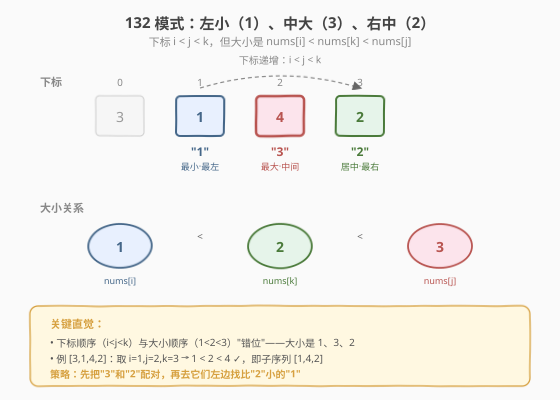
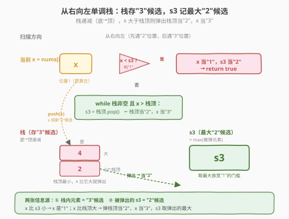
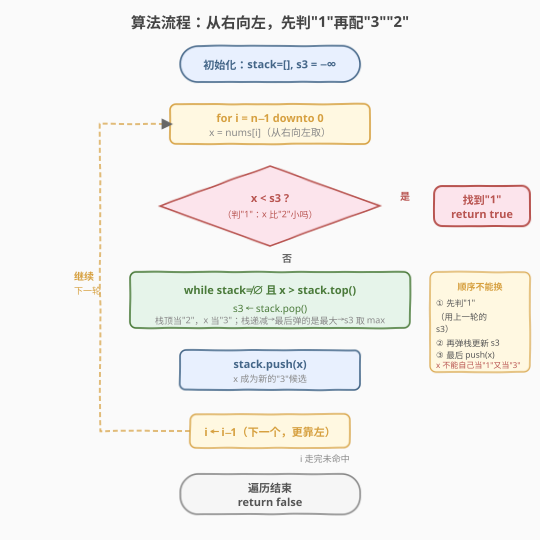

# 132模式

- **题目名称**：132模式
- **链接**：[456. 132 模式](https://leetcode.cn/problems/132-pattern/)
- **难度**：中等
- **标签**：栈、数组、单调栈

## 1. 题目概述

给你一个整数数组 `nums`，判断其中是否存在 **132 模式**。132 模式是三个下标 `i < j < k` 的子序列，满足：

$$\text{nums[i]} < \text{nums[k]} < \text{nums[j]}$$

即：**左侧的"1"最小，中间的"3"最大，右侧的"2"居中**（按大小记为 1、3、2，对应下标顺序 i、j、k）。存在则返回 `true`，否则返回 `false`。

**示例 1**：

```text
输入：nums = [1,2,3,4]
输出：false
解释：整个数组单调递增，找不到"中间大、右边居中"的三元组。
```

**示例 2**：

```text
输入：nums = [3,1,4,2]
输出：true
解释：[1, 4, 2] 是一个 132 模式：1 < 2 < 4，下标 1 < 2 < 3。
```

**示例 3**：

```text
输入：nums = [-1,3,2,0]
输出：true
解释：存在三个 132 模式：[-1, 3, 2]、[-1, 3, 0]、[-1, 2, 0]。
```

**约束条件**：

- `n == nums.length`
- `1 <= n <= 2 * 10^5`
- `-10^9 <= nums[i] <= 10^9`

> 💡 本题是 **单调栈** 的进阶题，与 [下一个更大元素 I（496）](../0401-0500/496_下一个更大元素 I.md)、[每日温度（739）](../0701-0800/739_每日温度.md) 同源——都用"遍历 + while 弹栈结算 + 入栈"的骨架。区别在于：本题要找的不是"下一个更 X"，而是"三个位置的大小关系"，所以**扫描方向反过来（从右向左）**，并额外维护一个变量 `s3` 记录"被弹出的最大值"当 "2" 候选。这个"弹出的东西也有用"的视角是单调栈题里的高阶用法。

---

## 2. 解题思路

### 2.1 暴力思路：枚举三元组

最直接的做法是三重循环枚举 `i < j < k`，判断 `nums[i] < nums[k] < nums[j]` 是否成立：

```text
for i in 0 .. n-3:
    for j in i+1 .. n-2:
        for k in j+1 .. n-1:
            if nums[i] < nums[k] < nums[j]:
                return true
return false
```

时间复杂度 $O(n^3)$，`n = 2×10^5` 时完全不可行。

**优化一：固定 "3"，预处理左侧最小当 "1"**

观察：对固定的 `j`（"3" 的位置），"1" 越小越容易满足 `nums[i] < nums[k]`。所以把 `j` 左侧的最小值预算出来：`left_min[j] = min(nums[0..j-1])`。再对每个 `j`，向右扫一个 `k`，看是否存在 `left_min[j] < nums[k] < nums[j]`：

```text
left_min[0] = ∞
for j in 1 .. n-2:
    left_min[j] = min(left_min[j-1], nums[j-1])    # O(n) 预处理
    for k in j+1 .. n-1:                            # 每个 j 再 O(n) 找 "2"
        if left_min[j] < nums[k] < nums[j]:
            return true
return false
```

时间 $O(n^2)$，对 `2×10^5` 仍可能超时（$4×10^{10}$），但思路已接近正解——**只要把"找右侧某个范围内的 2"从 $O(n)$ 降到 $O(1)$ 均摊即可**。

> ⚠️ 暴力的核心浪费在于：对每个 `j` 都要重新扫右侧找 "2"，而右侧的"比 nums[j] 小且比 left_min 大"的信息本可复用。正解的 monotonic stack 正是"**从右向左一次性算完所有 '3' 与 '2' 的配对**"，把 $O(n^2)$ 降到 $O(n)$。

### 2.2 核心观察：单调栈（从右向左扫描）

把 132 模式记成三个角色：**"1"（最小，最左）、"3"（最大，中间）、"2"（居中，最右）**。关键想法是——**先把 "3" 和 "2" 配好对，再去找它们左边的 "1"**。



**配对 "3" 和 "2"**：从右向左扫描，维护一个**单调递减栈**（栈底到栈顶递减，栈顶最小）。栈里存的是"**还没找到更大左邻居的元素**"——它们是 "3" 的候选。当遇到一个比栈顶更大的元素 `nums[i]` 时，`nums[i]` 就是栈顶元素的"左边的更大值"，于是栈顶可以当 "2"、`nums[i]` 当 "3"——弹出栈顶，记下它作为 "2" 候选。

**为什么从右向左？** 因为 "2"（nums[k]）在 "3"（nums[j]）的**右边**。从右向左扫，先遇到的是 "2" 的位置，后遇到的是 "3" 的位置——这样当 "3" 出现时，它右边的 "2" 已经在栈里等着被弹出了。



**维护最大的 "2"**：被弹出的元素都是"某个 '3' 右边的、比该 '3' 小的值"，都是合法的 "2" 候选。为了让"左边能找到一个比 '2' 更小的 '1'"尽可能容易，我们维护 `s3 = max(所有被弹出的元素)`——`s3` 越大，越容易在左侧找到 `nums[i] < s3` 当 "1"。

**判定 "1"**：每次扫描到一个新元素 `nums[i]`（在当前 "3"/"2" 配对的**更左边**），只要 `nums[i] < s3`，就找到了 "1"：因为 `s3` 是某个被弹出的 "2"，弹出它的那个 "3" 比 `s3` 大且在 `nums[i]` 右边，于是 `nums[i] < s3 < "3"`，下标 `i < "3"的位置 < "2"的位置`，正是 132 模式，立即返回 `true`。

> 💡 **为什么 `s3` 取最大？** "1" 的条件是 `nums[i] < "2"`。"2" 越大，门槛越宽松，越容易命中。被弹出的每个元素都是合法 "2"，取它们的上界 `s3 = max` 是"最宽松的判定门槛"，不漏掉任何可能的 "1"。这是本题最精妙的一步——**单调栈不仅用栈内元素，还把"弹出的元素"作为第二个信息源**。

### 2.3 算法流程图



**完整步骤**：

1. **初始化**：空栈 `stack`（单调递减，栈底到栈顶递减），`s3 = -∞`（记录被弹出的最大 "2" 候选）。
2. **从 `i = n-1` 到 `0` 逆向遍历** `nums[i]`：
   - **判 "1"**：若 `nums[i] < s3`，找到 132 模式（`nums[i]` 是 "1"，`s3` 是某 "2"，弹 `s3` 的那个 "3" 在 `nums[i]` 右边且更大），返回 `true`。
   - **配 "3"/"2"**：`while stack 非空 且 nums[i] > stack.top()`：`s3 = stack.pop()`（栈顶当 "2"，`nums[i]` 当 "3"，更新 `s3` 为更大的 "2" 候选）。
   - **入栈**：`stack.push(nums[i])`（`nums[i]` 成为新的 "3" 候选，等左边更大的来弹它）。
3. **遍历完未命中**：返回 `false`。

> ⚠️ 注意 `s3` 的更新顺序：`while` 弹栈时**逐个**把弹出的值赋给 `s3`，由于栈从底到顶递减，弹出顺序是从栈顶（小）往栈底（大），所以最后一次赋值给 `s3` 的就是被弹元素里的最大值——天然得到 `max(被弹元素)`，无需额外取 max。

### 2.4 示例演算

以 `nums = [3, 1, 4, 2]`（示例 2）为例，从右向左扫描：

![示例演算：[3,1,4,2] 从右向左单调栈，i=1 时 1&lt;s3=2 命中](../images/pattern132_example_walkthrough.svg)

| 步骤 | i | nums[i] | 判"1"：nums[i]&lt;s3? | 弹栈（nums[i]&gt;栈顶） | 栈（底→顶，递减） | s3 | 结果 |
|------|---|---------|----------------------|------------------------|--------------------|----|------|
| 1 | 3 | 2 | 2 &lt; −∞? 否 | 栈空，不弹 | [2] | −∞ | 继续 |
| 2 | 2 | 4 | 4 &lt; −∞? 否 | 4 &gt; 2 → 弹 2 | [4] | 2 | 继续 |
| 3 | 1 | 1 | **1 &lt; 2? 是** | — | [4] | 2 | **返回 true** |

步骤 3 命中：`nums[1]=1` 当 "1"，`s3=2` 当 "2"（来自步骤 2 弹出的 `nums[3]=2`），弹出它的 `nums[2]=4` 当 "3"。验证 `1 < 2 < 4`，下标 `1 < 2 < 3`，正是 `[1, 4, 2]`，与示例一致。

> 💡 再看示例 3 `[-1, 3, 2, 0]`：从右向左，`s3` 依次被更新为 `0`（弹 `nums[3]=0` 时由 `nums[2]=2` 弹出）、`2`（弹 `nums[2]=2` 时由 `nums[1]=3` 弹出）。最后 `i=0` 时 `nums[0]=-1 < s3=2`，命中 `[-1, 3, 2]`。注意 `s3` 一路取 max，从 `0` 涨到 `2`，最终让 `-1` 轻松过关——这正是"取最大 '2' 放宽门槛"的威力。

---

## 3. 参考代码

### C++

```cpp
// 132模式.cpp —— 从右向左单调递减栈，s3 记被弹出的最大"2"候选
// 编译: g++ -O2 -std=c++17 132模式.cpp -o pattern132
#include <vector>
#include <stack>
#include <climits>
using namespace std;

class Solution {
  public:
    bool find132pattern(vector<int>& nums) {
        stack<int> stk;          // 单调递减（底→顶递减），存"3"候选
        long long s3 = LLONG_MIN; // 被弹出的最大"2"候选，用 long long 防 -10^9 溢出

        for (int i = (int)nums.size() - 1; i >= 0; --i) {
            int x = nums[i];
            if (x < s3) {        // 找到"1"：x 比"2"小，返回 true
                return true;
            }
            while (!stk.empty() && x > stk.top()) {
                s3 = stk.top();  // 栈顶当"2"，x 当"3"，更新 s3（栈递减→最后赋的是最大）
                stk.pop();
            }
            stk.push(x);         // x 成为新的"3"候选
        }
        return false;
    }
};
```

### Python

```python
class Solution:
    def find132pattern(self, nums: list[int]) -> bool:
        stack = []                # 单调递减（底→顶递减），存"3"候选
        s3 = float("-inf")        # 被弹出的最大"2"候选

        for x in reversed(nums):
            if x < s3:            # 找到"1"：x 比"2"小，返回 true
                return True
            while stack and x > stack[-1]:
                s3 = stack.pop()  # 栈顶当"2"，x 当"3"，更新 s3
            stack.append(x)       # x 成为新的"3"候选
        return False
```

> 💡 注意 `s3` 的初值要足够小（比所有可能的 `nums[i]` 都小），C++ 用 `LLONG_MIN`、Python 用 `float("-inf")`。题面 `nums[i] ≥ -10^9`，`INT_MIN`（约 −2.1×10^9）其实也够，但用更小的值更稳妥、避免边界争议。`while` 里赋值 `s3 = stk.top()` 后再 `pop`——由于栈递减，连续弹多个时后弹的更大，`s3` 自然取到 max。

---

## 4. 复杂度分析

| 维度 | 复杂度 | 说明 |
|------|--------|------|
| **时间复杂度** | $O(n)$ | 每个元素至多入栈 1 次、出栈 1 次，`while` 总弹出 ≤ `n`；外层 `for` 跑 `n` 次，均摊后总操作 $O(n)$ |
| **空间复杂度** | $O(n)$ | 栈最坏存 `n` 个元素（数组严格递增时，从右向左看即严格递减，全部入栈无弹出） |

> ⚠️ `while` 嵌套在 `for` 里看似 $O(n^2)$，但**均摊分析**：每个元素一生只入栈 1 次、出栈 1 次，`while` 的累计弹出次数 ≤ `n`。所以总时间是 $O(n)$ 而非 $O(n^2)$——与 [496 下一个更大元素](../0401-0500/496_下一个更大元素 I.md)、[739 每日温度](../0701-0800/739_每日温度.md) 完全同理。`s3` 只是一个标量，不占额外空间。

---

## 5. 扩展：暴力 O(n²) 解法与思路对照

面试中如果一时想不到单调栈，$O(n^2)$ 的"**固定 '3'，预算左侧最小当 '1'，右侧线性找 '2'**"是能讲清楚的好退路：

```python
def find132pattern(self, nums: list[int]) -> bool:
    n = len(nums)
    left_min = [float("inf")] * n   # left_min[j] = min(nums[0..j-1])
    for j in range(1, n):
        left_min[j] = min(left_min[j - 1], nums[j - 1])
    for j in range(1, n - 1):
        if left_min[j] >= nums[j]:
            continue                # "1" >= "3"，本 j 无解
        for k in range(j + 1, n):   # 右侧找 (left_min[j], nums[j]) 之间的 "2"
            if left_min[j] < nums[k] < nums[j]:
                return True
    return False
```

**两种思路对照**：

| 维度 | O(n²) 预算最小 | O(n) 单调栈 |
|------|---------------|------------|
| **扫描方向** | 从左向右（先 '1' 后 '3' 再 '2'） | 从右向左（先 '2' 后 '3' 再 '1'） |
| **核心数据** | `left_min[j]`（左侧最小，当 "1"） | `s3`（被弹出的最大，当 "2"） |
| **找 "2" 的方式** | 对每个 `j` 线性扫右侧 O(n) | 弹栈时 O(1) 均摊配对 |
| **瓶颈** | 外层 `j` × 内层 `k` = $O(n^2)$ | 每元素均摊 $O(1)$ 入出栈 |

> 💡 两种思路是**镜像**的：O(n²) "先固定 '1' 再找 '3''2'"，O(n) "先配 '3''2' 再找 '1'"。后者之所以快，是因为单调栈把"右侧所有可能的 '2'"压成了一次性的弹栈动作，避免了重复扫描。这种"**换扫描方向让预处理信息可复用**"的思路，和 [接雨水](../0001-0100/42_接雨水.md) 用单调栈"按行结算"替代"按列重复算左右最大"是同一种优化直觉。

---

## 6. 面试要点

1. **为什么从右向左扫描？**

   - 132 模式里 "2"（nums[k]）在 "3"（nums[j]）**右边**。从右向左扫，先遇到的元素位置更靠右，先入栈的元素当 "2" 候选，后遇到的更靠左的更大元素当 "3"——"3" 出现时它右边的 "2" 已经在栈里，正好被弹出配对。若从左向右扫，"3" 先出现但右边的 "2" 还没见到，配不上对。

2. **`s3` 为什么取被弹元素的最大值？**

   - "1" 的判定是 `nums[i] < "2"`，"2" 越大门槛越宽松、越容易命中。被弹出的每个元素都是合法 "2"（它右边有更大的 "3" 吗？不——是被弹时它左边的 `nums[i]` 当 "3"，且 `nums[i]` 在更左），取它们的 max 作为判定门槛，保证不漏掉任何能当 "1" 的元素。
   - 栈递减意味着连续弹多个时后弹的更大，`s3` 顺次赋值天然得到 max，无需额外取最大。

3. **栈里存值还是存下标？**

   - 存**值**。本题只关心大小关系（`nums[i] < s3`、`x > stack.top()`），不需要位置差。对比 [739 每日温度](../0701-0800/739_每日温度.md) 要算"隔几天"才存下标。**口诀**：需要位置差存下标，只需比值存值——和 496 一致。

4. **时间复杂度为什么是 O(n) 而不是 O(n²)？**

   - `while` 虽嵌套在 `for` 里，但**均摊**：每个元素至多入栈 1 次、出栈 1 次，`while` 累计弹出 ≤ `n`，总操作 $O(n)$。和 496、739、[接雨水单调栈](../0001-0100/42_接雨水.md) 同理。

5. **`s3` 的初值为什么是负无穷？**

   - `s3` 表示"目前找到的最好的 '2' 候选"。开始时还没弹出任何元素，不存在 "2"，所以 `s3` 应让"判 '1'"必然不命中——即比所有 `nums[i]` 都小。题面 `nums[i] ≥ -10^9`，用 `float("-inf")` 或 `LLONG_MIN` 最稳妥。

6. **如果数组严格单调递增会怎样？**

   - 从右向左看就是严格递减，每个新元素都比栈顶小，`while` 永远不弹，`s3` 始终是 `−∞`，"判 '1'"永不命中，最后返回 `false`——符合"单调递增无 132 模式"的直觉（示例 1 即如此）。

> 💡 **一句话总结**：456 是单调栈的高阶题——把骨架"遍历 + while 弹栈 + 入栈"反过来用：**从右向左扫，栈存 '3' 候选，弹出的最大值 `s3` 当 '2' 候选，当前元素比 `s3` 小就是 '1'**。核心创新在于"弹出的元素也是信息"，这和 496/739"只用栈内元素"形成对照，是把单调栈用活的关键一步。

---

## 7. 同类练习题

- [496. 下一个更大元素 I](https://leetcode.cn/problems/next-greater-element-i/)（[题解](../0401-0500/496_下一个更大元素 I.md)）：单调栈入门，同"遍历+弹栈+入栈"骨架，从左向右找下一个更大
- [739. 每日温度](https://leetcode.cn/problems/daily-temperatures/)（[题解](../0701-0800/739_每日温度.md)）：单调栈招牌题，存下标算距离，本题的姊妹模板
- [42. 接雨水](https://leetcode.cn/problems/trapping-rain-water/)（[题解](../0001-0100/42_接雨水.md)）：单调栈"按行结算"，弹栈后用新栈顶当左墙，与本题"弹出的值当 '2'"同为"弹出元素也有用"的范例
- [503. 下一个更大元素 II](https://leetcode.cn/problems/next-greater-element-ii/)：循环数组单调栈，可对照本题"换扫描方向"的灵活性
