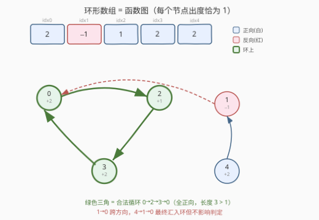
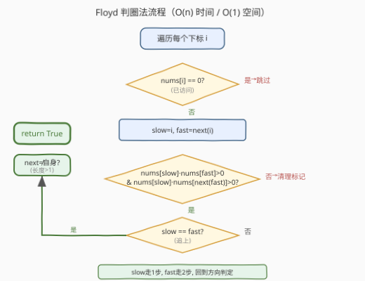
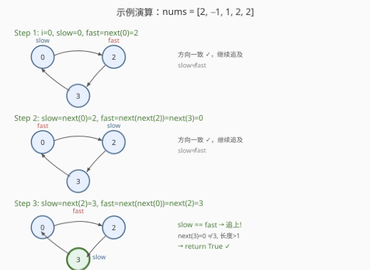

# LeetCode 环形数组是否存在循环 题解

## 1. 题目概述

- **标题 / 题号**：环形数组是否存在循环（#457，medium）
- **链接**：https://leetcode.cn/problems/circular-array-loop/
- **难度**：中等
- **标签**：数组、双指针、Floyd 判圈

**题意**：给定一个不含 `0` 的**环形**数组 `nums`，每个 `nums[i]` 表示位于下标 `i` 的角色应该向前（正数）或向后（负数）移动的步数。由于数组是环形的，最后一个元素向前一步到达第一个元素，第一个元素向后一步到达最后一个元素。

判断数组中是否存在**循环**：一组下标序列 `seq[0] → seq[1] → … → seq[k-1] → seq[0] → …`，满足：

1. `k > 1`（循环长度大于 1，不能自环）
2. 序列中所有 `nums[seq[j]]` **全正**或**全负**（方向一致）

**示例 1**：

```text
输入：nums = [2,-1,1,2,2]
输出：true
解释：存在循环 0 → 2 → 3 → 0 → …，所有节点均为正向，长度 3 > 1
```

**示例 2**：

```text
输入：nums = [-1,-2,-3,-4,-5,6]
输出：false
解释：唯一的循环是 5 → 5（自环），长度 1，不满足 k > 1
```

**示例 3**：

```text
输入：nums = [1,-1,5,1,4]
输出：true
解释：存在循环 3 → 4 → 3 → …，全正向，长度 2 > 1
      （0 → 1 → 0 虽是环但跨方向，不算合法循环）
```

**约束**：

- `1 <= nums.length <= 5000`
- `-1000 <= nums[i] <= 1000`
- `nums[i] != 0`
- **进阶**：时间 $O(n)$，额外空间 $O(1)$

> 💡 本题是 [141 环形链表](../0101-0200/141_环形链表.md)（链表判环）和 [287 寻找重复数](../0201-0300/287_寻找重复数.md)（数组当链表找环入口）的变体——把数组看作**函数图**（每个节点出度恰为 1），用 **Floyd 快慢指针判圈**。难点在于额外的两个约束：**方向一致**和**长度 > 1**。

## 2. 解题思路

### 2.1 暴力思路：每个起点走 n 步

对每个下标 `i` 作为起点，沿 `next` 函数走最多 `n` 步，检查是否回到 `i` 且途中方向一致、无自环。

```text
for i in 0..n:
    dir = sign(nums[i])
    j = i
    for step in 0..n:
        j = next(j)
        if sign(nums[j]) != dir: break   # 方向不一致
        if j == i and step > 0:          # 回到起点
            return step > 1              # 长度 > 1
```

时间 $O(n^2)$，空间 $O(1)$。`n=5000` 时约 $2.5 \times 10^7$ 次，勉强能 AC，但不满足进阶的 $O(n)$ 要求。

> ⚠️ 暴力法的关键缺陷：**重复访问**。不同起点可能走到同一条路径，每次都从头走一遍。若能标记「已确认无环的路径」，就能跳过——这正是 $O(n)$ 优化的切入点。

### 2.2 核心观察：函数图 + Floyd 判圈



**关键转换**：把数组看作一个**函数图**——节点 `i` 的唯一出边指向 $\text{next}(i) = ((i + \text{nums}[i]) \bmod n + n) \bmod n$。每个节点出度恰为 1，因此从任意节点出发，路径**必然最终进入一个环**（可能是自环）。

问题转化为：在函数图中找一个满足以下条件的环：

1. **方向一致**：环上所有 `nums[i]` 同号
2. **长度 > 1**：非自环（即 $\text{next}(i) \neq i$）

**Floyd 快慢指针**天然适合在函数图中找环：

- `slow` 每次走 1 步，`fast` 每次走 2 步
- 若有环，`fast` 终将追上 `slow`（在环内相遇）
- 若无环（路径终止于方向变更处），`slow` ≠ `fast`，退出循环

> 💡 **与 141/287 的区别**：141/287 的 `next` 函数天然同向（链表 `next` / 数组值映射），只需判环。本题的 `next` 可能跨方向（正负交替），因此**追及过程中必须同步检查方向一致性**——一旦 `slow` 或 `fast` 跨入异向区域，立即终止。

### 2.3 算法流程图



**完整步骤**：

1. **遍历每个下标** `i`：若 `nums[i] == 0`（已被标记为访问过），跳过。
2. **初始化**：`slow = i`，`fast = next(i)`。
3. **追及循环**：检查方向一致性 `nums[slow] * nums[fast] > 0` 且 `nums[slow] * nums[next(fast)] > 0`（确保 `fast` 走两步都不跨方向）。
   - 若 `slow == fast`：找到环，检查 `next(slow) != slow`（非自环）→ 返回 `true`。
   - 否则：`slow = next(slow)`，`fast = next(next(fast))`，继续追及。
4. **路径清理**：追及结束未找到合法环，把从 `i` 出发**同向路径**上的所有节点标记为 `0`（原数组不含 0，用 0 表示"已确认无环"）。这样后续遍历到这些节点时直接跳过。

> ⚠️ **标记为何安全？** 函数图中每个节点出度为 1，从 `i` 出发的路径是唯一的。若这条路径经 Floyd 判定无合法环，则路径上**同方向的每个节点** `j` 的路径是 `i` 路径的后缀，同样无合法环。标记为 0 不会丢失信息。异向节点不标记，因为它们可能属于另一方向的合法环。

### 2.4 示例演算

以 `nums = [2,-1,1,2,2]` 为例（`n=5`，`next` 映射：0→2, 1→0, 2→3, 3→0, 4→1）：



**Step 1**：`slow=0, fast=next(0)=2`
- `nums[0]*nums[2] = 2*1 = 2 > 0` ✓，`nums[0]*nums[next(2)] = 2*nums[3] = 4 > 0` ✓
- `slow ≠ fast`，继续

**Step 2**：`slow=next(0)=2, fast=next(next(2))=next(3)=0`
- `nums[2]*nums[0] = 1*2 = 2 > 0` ✓，`nums[2]*nums[next(0)] = 1*nums[2] = 1 > 0` ✓
- `slow ≠ fast`，继续

**Step 3**：`slow=next(2)=3, fast=next(next(0))=next(2)=3`
- `slow == fast` → 追上！
- 检查自环：`next(3) = 0 ≠ 3` → 长度 > 1 ✓
- **返回 `true`**

## 3. 参考代码

### C++

```cpp
class Solution {
  public:
    bool circularArrayLoop(vector<int>& nums) {
        int n = nums.size();

        auto nxt = [&](int i) {
            return ((i + nums[i]) % n + n) % n;
        };

        for (int i = 0; i < n; i++) {
            if (nums[i] == 0) continue;

            int slow = i, fast = nxt(i);

            while (nums[slow] * nums[fast] > 0 &&
                   nums[slow] * nums[nxt(fast)] > 0) {
                if (slow == fast) {
                    if (slow == nxt(slow)) break;
                    return true;
                }
                slow = nxt(slow);
                fast = nxt(nxt(fast));
            }

            int val = nums[i];
            int j = i;
            while (nums[j] * val > 0) {
                int nj = ((j + nums[j]) % n + n) % n;
                nums[j] = 0;
                j = nj;
            }
        }
        return false;
    }
};
```

### Python

```python
class Solution:
    def circularArrayLoop(self, nums: List[int]) -> bool:
        n = len(nums)

        def nxt(i):
            return ((i + nums[i]) % n + n) % n

        for i in range(n):
            if nums[i] == 0:
                continue

            slow = i
            fast = nxt(i)

            while nums[slow] * nums[fast] > 0 and \
                  nums[slow] * nums[nxt(fast)] > 0:
                if slow == fast:
                    if slow == nxt(slow):
                        break
                    return True
                slow = nxt(slow)
                fast = nxt(nxt(fast))

            val = nums[i]
            j = i
            while nums[j] * val > 0:
                nj = ((j + nums[j]) % n + n) % n
                nums[j] = 0
                j = nj

        return False
```

> 💡 **取模技巧**：`((i + nums[i]) % n + n) % n` 保证了负数取模的正确性（C++/Python 通用）。`nums[i]` 为负时，`i + nums[i]` 可能为负，单层 `% n` 在 C++ 中会得到负数，需 `+n` 再 `% n` 修正。

> ⚠️ **清理标记的顺序**：必须先计算 `nj = nxt(j)`，再执行 `nums[j] = 0`。若先置 0，`nxt(j)` 会变成 `(i + 0) % n = i`，导致跳回起点、清理出错。

## 4. 复杂度分析

| 维度 | 复杂度 | 说明 |
|------|--------|------|
| 时间复杂度 | $O(n)$ | 每个节点最多被 Floyd 遍历一次 + 清理标记一次，总共 $2n$ 次访问 |
| 空间复杂度 | $O(1)$ | 仅用 `slow`/`fast`/`j` 等常数变量，原地修改 `nums` 作为 visited 标记 |

> 💡 **为何 $O(n)$？** 关键在于**清理标记**：Floyd 判定无环后，把同向路径上的节点全部置 0。后续遍历到这些节点时 `nums[i] == 0` 直接跳过，不会重复进入 Floyd 循环。每个节点在整个算法中至多被访问两次（一次 Floyd + 一次清理），总时间为 $O(n)$。

## 5. 扩展：O(n) 空间的 visited 数组解法

若不要求 $O(1)$ 空间，可用 `visited` 数组简化逻辑：

```python
def circularArrayLoop(self, nums: List[int]) -> bool:
    n = len(nums)
    visited = [False] * n

    def nxt(i):
        return ((i + nums[i]) % n + n) % n

    for i in range(n):
        if visited[i]:
            continue
        path = {}
        j = i
        while not visited[j]:
            visited[j] = True
            nj = nxt(j)
            if nj == j:
                break
            if nums[j] * nums[nj] < 0:
                break
            if nj in path:
                return True
            path[j] = True
            j = nj
    return False
```

此法逻辑更直观（用字典记录当前路径上的节点，命中即成环），但空间 $O(n)$。面试时若面试官不要求 $O(1)$ 空间，此法更易写对。

## 6. 面试要点

1. **为什么用 Floyd 快慢指针而不是哈希集合？**

   - 哈希集合（记录路径上所有节点，命中即成环）需要 $O(n)$ 空间。Floyd 快慢指针利用「快者追慢者」的追及原理，在函数图上不需要额外空间即可判环。题目进阶明确要求 $O(1)$ 空间，Floyd 是标准解法。

2. **方向一致性如何检查？为什么要检查 `nums[next(fast)]`？**

   - `fast` 每次走两步，需保证两步都不跨方向。条件 `nums[slow] * nums[fast] > 0` 检查第一步，`nums[slow] * nums[nxt(fast)] > 0` 检查第二步。若只查第一步，`fast` 的第二步可能跨入异向区域，导致误判。

3. **自环（长度 1）如何排除？**

   - 当 `slow == fast` 时，检查 `next(slow) == slow`。若成立，说明该节点指向自己（`nums[i] % n == 0`），是长度 1 的自环，`break` 跳出，进入清理标记。

4. **清理标记为什么安全？会不会把合法环的节点误标记？**

   - 不会。Floyd 追及在以下两种情况终止：(a) 方向不一致——路径上的同向节点不可能形成合法环；(b) 自环——自环节点指向自己，路径上的其他节点最终汇入自环，也不可能是合法环。两种情况下，同向路径上的所有节点都**确定无合法环**，标记为 0 安全。异向节点不标记，保留给后续遍历。

5. **与 287 寻找重复数的区别？**

   - 287 的 `next` 函数是 `nums[i]`（值域 `[1,n]` 映射到下标），天然同向，只需找环入口。457 的 `next` 是 `(i + nums[i]) % n`，可能跨方向，追及过程中需同步检查方向，且要排除自环。457 多了「方向一致」和「长度 > 1」两个约束。

## 同类练习题

| # | 题目 | 与本题的关联 |
|---|------|-------------|
| 141 | [环形链表](https://leetcode.cn/problems/linked-list-cycle/)（[题解](../0101-0200/141_环形链表.md)） | Floyd 判圈母题，链表版快慢指针 |
| 142 | [环形链表 II](https://leetcode.cn/problems/linked-list-cycle-ii/)（[题解](../0101-0200/142_环形链表II.md)） | Floyd 找环入口，公式推导 a = c - b |
| 287 | [寻找重复数](https://leetcode.cn/problems/find-the-duplicate-number/)（[题解](../0201-0300/287_寻找重复数.md)） | 数组当链表找环入口，同构于 142 |
| 202 | [快乐数](https://leetcode.cn/problems/happy-number/)（[题解](../0201-0300/202_快乐数.md)） | 数位平方和当 next，隐式链表判环，Floyd 三件套之一 |
| 918 | [环形子数组的最大和](https://leetcode.cn/problems/maximum-sum-circular-subarray/) | 环形数组问题，思路不同（Kadane 环形变体）但同为"环形"场景 |
