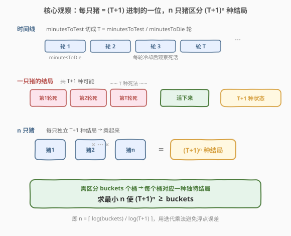
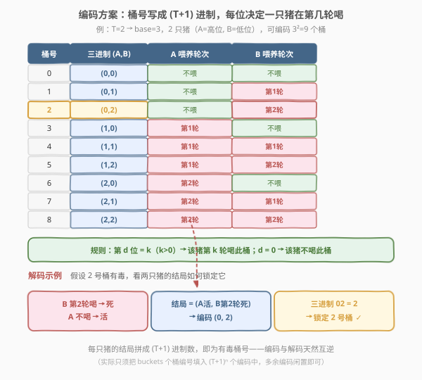
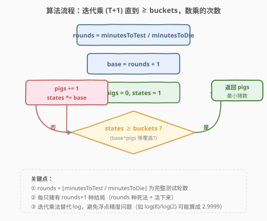
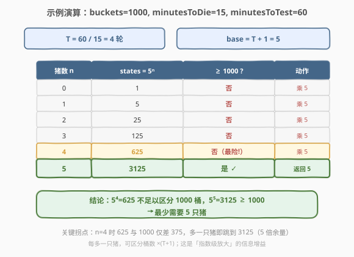

# 可怜的小猪

- **题目名称**：可怜的小猪
- **链接**：[458. 可怜的小猪](https://leetcode.cn/problems/poor-pigs/)
- **难度**：困难
- **标签**：数学、信息论、对数、思维题

## 1. 题目概述

有 `buckets` 桶液体，其中**正好有一桶**含有毒药，其余装的都是水，外观无法区分。你只有 `minutesToTest` 分钟来确定哪一桶有毒。喂猪规则：

1. 选择若干**活**猪进行喂养；
2. 一只猪可**同时**饮用任意多桶的水，过程不耗时；
3. 喝完后必须等 `minutesToDie` 分钟冷却，期间只能观察、不能继续喂；
4. `minutesToDie` 分钟后，所有喝到毒药的猪死亡，其余存活；
5. 重复直到时间用完。

返回在规定时间内判断出有毒桶所需的**最小猪数**。

**示例 1**：

```text
输入：buckets = 1000, minutesToDie = 15, minutesToTest = 60
输出：5
解释：60 / 15 = 4 轮测试，每只猪有 5 种结局，5⁵ = 3125 ≥ 1000。
```

**示例 2**：

```text
输入：buckets = 4, minutesToDie = 15, minutesToTest = 15
输出：2
解释：只有 1 轮测试，每只猪 2 种结局（死/活），2² = 4 ≥ 4。
```

**示例 3**：

```text
输入：buckets = 4, minutesToDie = 15, minutesToTest = 30
输出：2
解释：30 / 15 = 2 轮测试，每只猪 3 种结局，3² = 9 ≥ 4。
```

**约束条件**：

- $1 \le \text{buckets} \le 1000$
- $1 \le \text{minutesToDie} \le \text{minutesToTest} \le 100$

> 💡 这是一道披着「模拟」外衣的**信息论思维题**。核心不是设计喂养流程的细节，而是回答一个信息下界问题：「一只猪一次实验能携带多少比特信息？n 只猪在 T 轮内能区分多少种情况？」想清楚这个，答案就是一行对数。

---

## 2. 解题思路

### 2.1 暴力思路：把猪当成一次性二分探针

最容易想到的朴素想法是：一只猪只能告诉你「它喝过的桶里有没有毒」——死 = 有，活 = 没有。于是把猪当成一个二分探针，用二分搜索在 `buckets` 个桶里找毒桶，每只猪承担一轮比较，需要 $\lceil \log_2(\text{buckets}) \rceil$ 只猪。

这个想法在**只有一轮测试**时（`minutesToTest == minutesToDie`，即 $T=1$）是正确的——此时每只猪确实只有「死/活」2 种结局，$n$ 只猪区分 $2^n$ 种情况。

> ⚠️ 但当 `minutesToTest` 比 `minutesToDie` 大时，我们可以进行**多轮**喂养。同一只猪可以在第 1 轮喝一批桶、等它没死再在第 2 轮喝另一批……它的结局不再只是「死/活」二元，而是「第 1 轮死 / 第 2 轮死 / … / 第 T 轮死 / 活下来」共 $T+1$ 种。**一只猪能携带的信息量随轮数线性增长**，二分思路白白浪费了这个增益，得到的猪数偏大。

暴力思路的失败提示我们：**不要盯着「怎么喂」的流程细节，而要数「最终能区分多少种结局」**。这正是信息论的切入点。

### 2.2 核心观察：信息论——每只猪是 $(T+1)$ 进制的一位



设完整测试轮数 $T = \lfloor \text{minutesToTest} / \text{minutesToDie} \rfloor$。注意必须是整轮：若总时间不够再等一个 `minutesToDie` 周期，那一轮无法观察到结局，不能计入。

**每只猪的结局有 $T+1$ 种**：

- 第 1 轮喝到毒 → 第 1 轮死；
- 第 2 轮喝到毒（前几轮没喝到）→ 第 2 轮死；
- …；
- 第 $T$ 轮喝到毒 → 第 $T$ 轮死；
- 全程没喝到毒 → 活下来。

这 $T+1$ 种结局**互斥且完备**，每只猪恰取其一。

> 💡 **关键转化**：一只猪不再是一个 1 比特的二分探针，而是一个能取 $T+1$ 个值的「计数器」。把 $n$ 只猪看作 $n$ 个独立的计数器，每个有 $T+1$ 种取值，组合起来共有

$$\underbrace{(T+1) \times (T+1) \times \cdots \times (T+1)}_{n} = (T+1)^n$$

种不同的「结局向量」。**每一种结局向量必须唯一对应一个有毒桶**，否则出现两个桶产生相同结局，就无法分辨。因此必要条件为

$$(T+1)^n \ge \text{buckets}$$

> ⚠️ **这是下界还是上界？** 上面论证的是**下界**（必要性）：少于这个 $n$，结局数不够，必有两桶无法区分。但信息论下界未必可达——还需要构造一个喂养方案证明这个 $n$ 确实够用。下一小节给出构造。

### 2.3 编码方案：桶号写成 $(T+1)$ 进制（构造可达性）



为证明 $n = \lceil \log_{T+1}(\text{buckets}) \rceil$ 确实足够，给出一个**显式喂养方案**：

1. 把 `buckets` 个桶编号为 $0, 1, \dots, \text{buckets}-1$；
2. 选定 $n = \lceil \log_{T+1}(\text{buckets}) \rceil$，使 $(T+1)^n \ge \text{buckets}$；
3. 把每个桶号写成 **$n$ 位 $(T+1)$ 进制数**：桶 $j = (d_{n-1}, d_{n-2}, \dots, d_1, d_0)$，其中 $0 \le d_i \le T$；
4. **第 $i$ 只猪的喂养规则**：对所有 $d_i \ne 0$ 的桶 $j$，让猪 $i$ 在**第 $d_i$ 轮**喝桶 $j$；若 $d_i = 0$ 则猪 $i$ 永不喝桶 $j$。

**解码**：若桶 $j$ 有毒，猪 $i$ 恰在第 $d_i(j)$ 轮喝到它（$d_i \ne 0$ 时）从而在该轮死亡，或全程不喝（$d_i = 0$ 时）存活。于是观察到的「猪 $i$ 在第几轮死 / 存活」正好拼出 $(d_{n-1}, \dots, d_0)$，按 $(T+1)$ 进制合成即为桶号 $j$。**编码与解码天然互逆**，每个桶对应唯一的结局向量。

上图以 $T=2$（base 3）、2 只猪、9 个桶为例，展示完整编码表，并演示「2 号桶有毒」时如何由猪的结局锁定桶号。

> 💡 **为什么多余的编码不影响？** 当 $\text{buckets}$ 不是 $(T+1)$ 的整次幂时（如 $\text{buckets}=4, T=2$，$(T+1)^2=9$），会有 $9-4=5$ 个编码不对应任何真实桶。这些编码对应的结局向量**永远不会出现**——没有任何一个桶的喂法会产生它。一旦观察到这种结局，说明输入不合法（题目保证恰一桶有毒），所以直接忽略即可。多余的编码只是「闲置容量」，不影响合法情况下的判定。

### 2.4 算法流程图



由 $n = \lceil \log_{T+1}(\text{buckets}) \rceil$，直接用对数计算存在浮点精度隐患（例如 $\log_2 8$ 理论为 $3$，但浮点可能算成 $2.9999$，`ceil` 后得到 $4$）。改用**迭代乘法**精确计数：

1. `rounds = minutesToTest / minutesToDie`（整数除法得 $T$）；
2. `base = rounds + 1`；
3. `pigs = 0, states = 1`；
4. 当 `states < buckets`：`pigs += 1; states *= base`；
5. 返回 `pigs`。

循环每执行一次，`states` 从 $\text{base}^{\text{pigs}}$ 跳到 $\text{base}^{\text{pigs}+1}$，恰对应 $n$ 递增 1。首次满足 `states >= buckets` 时的 `pigs` 即为最小猪数。

### 2.5 示例演算



以示例 1 `buckets=1000, minutesToDie=15, minutesToTest=60` 为例：

- $T = 60 / 15 = 4$ 轮，`base = 5`；
- 逐次乘 5，直到覆盖 1000：

| 猪数 $n$ | states $= 5^n$ | $\ge 1000$? | 动作 |
|---------|----------------|-------------|------|
| 0 | 1 | 否 | 乘 5 |
| 1 | 5 | 否 | 乘 5 |
| 2 | 25 | 否 | 乘 5 |
| 3 | 125 | 否 | 乘 5 |
| 4 | 625 | 否（最险！） | 乘 5 |
| 5 | 3125 | 是 ✓ | 返回 5 |

关键拐点：$n=4$ 时 $5^4 = 625$ 距 1000 仅差 375，**4 只猪不够**；再加一只猪跳到 $5^5 = 3125$（5 倍余量），首次覆盖。最终答案 **5**。

> 💡 **为什么 625 < 1000 却只差一只猪就能跳过？** 因为每多一只猪，可区分桶数乘以 $(T+1)$——这是**指数级放大**。当 $(T+1)$ 较大（本题 5）时，单只猪的信息增益极可观，猪数对 `buckets` 极不敏感：$\text{buckets}$ 从 626 到 3125 都只需 5 只猪。

---

## 3. 参考代码

### C++

```cpp
class Solution {
  public:
    int poorPigs(int buckets, int minutesToDie, int minutesToTest) {
        int rounds = minutesToTest / minutesToDie;   // 完整测试轮数 T
        int base = rounds + 1;                       // 每只猪的结局数
        int pigs = 0;
        long long states = 1;                        // base^pigs
        while (states < buckets) {
            ++pigs;
            states *= base;
        }
        return pigs;
    }
};
```

### Python

```python
class Solution:
    def poorPigs(self, buckets: int, minutesToDie: int, minutesToTest: int) -> int:
        rounds = minutesToTest // minutesToDie        # 完整测试轮数 T
        base = rounds + 1                             # 每只猪的结局数
        pigs = 0
        states = 1                                    # base^pigs
        while states < buckets:
            pigs += 1
            states *= base
        return pigs
```

> 💡 **实现细节**：① `rounds` 用**整数除法**——余下的时间不足一个 `minutesToDie` 周期，无法观察到结局，不能算一轮。② 用 `states *= base` 迭代而非 `log`，规避浮点精度问题（$\log_2 8$ 可能算成 $2.9999$ 使 `ceil` 多 1）。③ C++ 中 `states` 用 `long long` 防御性编程：虽然本题 `buckets ≤ 1000`、`base ≤ 101`，循环在 `states ≥ 1000` 即停，最大约 $101^2$ 远小于 `INT_MAX`，`int` 也够，但 `long long` 让代码在约束放宽时依然安全。④ `buckets == 1` 时 `states = 1 ≥ 1` 不进循环，返回 0——只有一桶，无需测试即可确定它有毒，符合题意。

### 对数写法（等价，慎用）

```python
import math
class Solution:
    def poorPigs(self, buckets: int, minutesToDie: int, minutesToTest: int) -> int:
        if buckets == 1:
            return 0
        base = minutesToTest // minutesToDie + 1
        return math.ceil(math.log(buckets) / math.log(base))
```

此写法更贴近公式 $n = \lceil \log_{T+1}(\text{buckets}) \rceil$，但 `math.log` 在边界值（如 `buckets` 恰为 `base` 的整次幂）可能因浮点误差返回略小值，需 `+1e-10` 之类的容差修正。**面试推荐迭代乘法版**，既精确又好讲。

---

## 4. 复杂度分析

| 维度 | 复杂度 | 说明 |
|------|--------|------|
| 时间复杂度 | $O\!\left(\left\lceil \log_{T+1}(\text{buckets}) \right\rceil\right)$ | 循环每轮 `states` 乘以 $(T+1)$，次数即答案 $n$。最坏 $T=1$（base=2）时约 $\lceil \log_2 1000 \rceil = 10$ 次 |
| 空间复杂度 | $O(1)$ | 仅 `rounds`、`base`、`pigs`、`states` 四个变量 |

> ⚠️ 注意复杂度是关于**答案 $n$** 的，而 $n \le \lceil \log_2 1000 \rceil = 10$，所以实际上是个常数级小循环，远比模拟喂养流程高效。

---

## 5. 扩展：信息论下界与可达性的对偶

本题完整地体现了一个信息论思维范式：**先证下界，再构造上界**。

**下界（必要性）**：$n$ 只猪在 $T$ 轮内最多产生 $(T+1)^n$ 种互异结局向量，要区分 `buckets` 个桶，每种桶至少占用一个结局向量，故 $(T+1)^n \ge \text{buckets}$，即 $n \ge \lceil \log_{T+1}(\text{buckets}) \rceil$。这是**信息容量**论证，与具体喂法无关——任何方案都不能突破它。

**上界（可达性）**：第 2.3 节的 $(T+1)$ 进制编码构造证明了这个下界确实能达到：把桶号写进 $n$ 位 $(T+1)$ 进制，每位控制一只猪的喂轮，编码-解码互逆。下界 = 上界，故答案恰好是 $\lceil \log_{T+1}(\text{buckets}) \rceil$。

> 💡 **信息论思维的迁移**：这类「用最少的探针/实验/问题确定一个未知对象」的题，通用思路是：① 数**单次实验能产生的互异结局数** $k$（这里是 $T+1$）；② $n$ 次独立实验可区分 $k^n$ 种情况；③ 令 $k^n \ge \text{候选数}$ 求 $n$；④ 给出构造证明可达。经典同构问题包括「称球问题」（天平每次 3 种结局 → $3^n \ge 2M$ 求最少称重次数）和「猜数字问题」（每次比较 3 种结局 `</=/>`）。458 是这套范式的最直白应用——单次实验的结局数从 2 跃升到 $T+1$，是理解「探针信息量随轮数增长」的最佳入口。

---

## 6. 面试要点

1. **一只猪只有「死/活」2 种结局，为什么能区分超过 $2^n$ 个桶？**

   > 因为有多轮测试。同一只猪可在第 1 轮喝一批、没死就在第 2 轮喝另一批……它的结局不是「死/活」二元，而是「第 1 轮死 / 第 2 轮死 / … / 第 $T$ 轮死 / 活下来」共 $T+1$ 种。每只猪携带 $\log_2(T+1)$ 比特信息，$n$ 只猪可区分 $(T+1)^n$ 种情况。关键洞察是**单只猪的信息量随测试轮数线性增长**。

2. **$(T+1)^n \ge \text{buckets}$ 是下界还是上界？怎么证明这个 $n$ 真的够用？**

   > 下界由信息容量论证给出（结局向量数 $\ge$ 桶数）。上界靠构造：把桶号写成 $n$ 位 $(T+1)$ 进制数 $(d_{n-1},\dots,d_0)$，第 $i$ 只猪对所有 $d_i \ne 0$ 的桶在第 $d_i$ 轮喂；若该桶有毒，猪 $i$ 恰在第 $d_i$ 轮死（或 $d_i=0$ 时存活），结局向量拼回桶号。编码-解码互逆，证明 $n$ 够用。下界=上界即最优。

3. **为什么用整数除法 `minutesToTest / minutesToDie`，余下的时间不算一轮？**

   > 一轮需要先喂、再等 `minutesToDie` 分钟观察死活。若剩余时间不足一个 `minutesToDie`，就无法观察到这一轮的结局，喂了也白喂，不能计入有效测试轮数。所以 $T = \lfloor \text{minutesToTest} / \text{minutesToDie} \rfloor$ 用整数除法。

4. **为什么不用 `math.ceil(math.log(buckets) / math.log(base))` 直接算？**

   > 浮点精度问题。当 `buckets` 恰为 `base` 的整次幂时（如 `buckets=8, base=2`），`math.log(8)/math.log(2)` 理论为 3，但浮点可能算成 $2.9999999$，`ceil` 后错误得到 4。迭代乘法 `states *= base` 全程整数运算，精确无误差，且循环次数即答案，直观好讲，是面试首选。

5. **`buckets` 不是 $(T+1)$ 的整次幂时，多余编码怎么处理？会影响判定吗？**

   > 不会。多余的编码不对应任何真实桶，其对应的结局向量永远不出现（没有桶按那种方式喂）。一旦观察到这种结局，说明输入不合法（题目保证恰一桶有毒）。这些编码只是「闲置容量」，合法情况下每个有毒桶都映射到唯一的、属于合法编码集的结局向量，判定不受影响。类比：用 3 位二进制（8 种）编码 5 个物品，多出 3 个编码闲置，不影响对 5 个物品的区分。

6. **如果 `minutesToDie` 不能整除 `minutesToTest`，能否利用余数时间多做一轮？**

   > 不能。一轮的结局必须在 `minutesToDie` 分钟后才能观察到，余下时间不足一个完整周期，无法获得该轮的「死/活」反馈，这轮的喂法无法转化为可观察的结局向量，对信息量没有贡献。所以有效轮数严格是 $T = \lfloor \text{minutesToTest} / \text{minutesToDie} \rfloor$。

> 💡 **一句话总结**：458 是信息论思维题——每只猪在 $T = \lfloor\text{test}/\text{die}\rfloor$ 轮测试下有 $T+1$ 种结局，$n$ 只猪区分 $(T+1)^n$ 种情况，令其 $\ge$ `buckets` 求最小 $n$；用 $(T+1)$ 进制编码桶号即可构造出达到该下界的喂养方案。答案 $n = \lceil \log_{T+1}(\text{buckets}) \rceil$，用迭代乘法精确计算，$O(n)$ 时间 $O(1)$ 空间。

---

## 7. 同类练习题

- [319. 灯泡开关](https://leetcode.cn/problems/bulb-switcher/)：同样披着模拟外衣的数学题，最终答案化为 $\lfloor\sqrt{n}\rfloor$，训练「从过程细节跳到数学结构」的直觉
- [29. 两数相除](https://leetcode.cn/problems/divide-two-integers/)（[题解](../0001-0100/29_两数相除.md)）：用位运算/迭代累乘替代浮点除法，与本题「迭代乘法替代 log」同属「用整数运算规避浮点精度」的套路
- [372. 超级次方](https://leetcode.cn/problems/super-pow/)：快速幂 + 取模，共享「指数增长 → 取对数降阶」的思维方式，可对比「指数运算」与「对数计数」两个方向
- [1018. 可被 5 整除的二进制前缀](https://leetcode.cn/problems/binary-prefix-divisible-by-5/)：进制转换 + 同余，与本题「把桶号写进 $(T+1)$ 进制」共享进制编码思想
- [1802. 序列中不同最大值对的数目](https://leetcode.cn/problems/maximum-value-at-a-given-index-in-a-bounded-array/)：二分答案 + 数学边界，同为「用数学结构替代暴力枚举」的思维题，训练从约束反推闭合公式的能力
