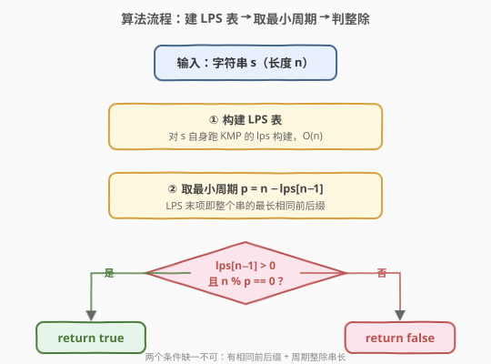
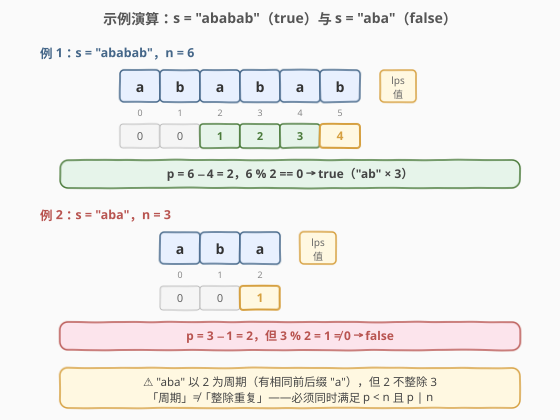

# LeetCode 重复的子字符串 题解

## 1. 题目概述

- **标题 / 题号**：重复的子字符串（#459，medium）
- **链接**：https://leetcode.cn/problems/repeated-substring-pattern/
- **难度**：中等
- **标签**：字符串、KMP、字符串匹配

**题意**：给定一个非空字符串 `s`，检查是否可以通过将它的**某个非空子串**重复拼接若干次（至少两次）得到。等价地：是否存在长度为 $p$（$1 \leq p \leq n/2$ 且 $p \mid n$）的子串 `s[0:p]`，使得 $s$ 由 $n/p$ 个该子串首尾相接构成。

**示例 1**：

```text
输入：s = "abab"
输出：true
解释：s 可由子串 "ab" 重复 2 次得到："ab" + "ab" = "abab"。
```

**示例 2**：

```text
输入：s = "aba"
输出：false
解释：没有哪个非空子串重复至少两次能得到 "aba"。
```

**示例 3**：

```text
输入：s = "abcabcabcabc"
输出：true
解释：s 可由子串 "abc" 重复 4 次得到。
```

**约束**：

- $1 \leq \text{s.length} \leq 10^4$
- `s` 由小写英文字母组成

> 💡 本题问的是「**整个串**是否由某个**真子串**重复构成」，本质是在问字符串的**最小周期**是否整除串长。这正好是 KMP 的 LPS（最长相同前后缀）表的「开箱即用」场景——与 [28. 找出字符串中第一个匹配项的下标](../0001-0100/28_找出字符串中第一个匹配项的下标.md) 一脉相承。

## 2. 解题思路

### 2.1 暴力思路：枚举周期长度

最直观的做法：枚举可能的周期长度 $p$（从 1 到 $n/2$），若 $p$ 整除 $n$，就验证 $s$ 是否「以 $p$ 为周期」——即对所有 $i$ 检查 $s[i] == s[i \bmod p]$。

```text
for p in 1..n/2:
    if n % p != 0: continue
    ok = true
    for i in p..n-1:
        if s[i] != s[i % p]: ok = false; break
    if ok: return true
return false
```

时间复杂度 $O(n^2)$：最坏情况（如 $s$ 全是同一字符）要枚举 $n/2$ 个 $p$、每个验证 $O(n)$。`n = 10^4` 时约 $10^8$ 次比较，能过但偏慢。

> ⚠️ 暴力法的浪费在于：它对每个候选 $p$ 都「从头验一遍」，却没有利用「周期性」这个全局结构。事实上，字符串的周期性信息已经完整编码在它的 **LPS 表**里，只需一次线性扫描就能取出。

### 2.2 核心观察：LPS 表与字符串的最小周期

![LPS 表与最小周期：n − lps[n−1] 即为最小周期长度](../images/repeated_substring_lps_period.svg)

KMP 的 LPS 表（最长相同真前后缀）藏着一个关于字符串周期的定理：

> **周期定理**：设 $n = |s|$，$l = \text{lps}[n-1]$（整个串的最长相同前后缀长度），则 $s$ 的**最小周期** $p^* = n - l$。

**直观证明**：

- LPS 的含义是：$s$ 存在长度为 $l$ 的相同前后缀，即 $s[0..l-1] == s[n-l..n-1]$。
- 把这两个重叠的「同形」片段对齐：$s$ 的前 $l$ 个字符等于后 $l$ 个字符，等价于「$s$ 整体向右平移 $n - l$ 位后，重叠部分仍然相同」。
- 这正是**周期 $p = n - l$** 的定义：$s[i] == s[i + p]$（对所有合法 $i$）。

于是判断「$s$ 是否由重复子串构成」只需两步：

1. 计算 $p^* = n - \text{lps}[n-1]$。
2. 若 $p^* < n$ 且 $n \bmod p^* == 0$，则 $s$ 由长度为 $p^*$ 的子串重复 $n / p^*$ 次构成，返回 `true`；否则 `false`。

> 💡 **两个边界**：
> - 若 $l = 0$（无相同前后缀），则 $p^* = n$，即「最小周期等于自身」，不可能由更短的子串重复构成 → `false`。
> - $p^* < n$ 保证了重复次数 $\geq 2$；$n \bmod p^* == 0$ 保证了整除（无零头）。

### 2.3 算法流程图



**完整步骤**：

1. **构建 LPS 表**：对 $s$ 自身跑一遍 KMP 的 `lps` 构建（与 [28 题](../0001-0100/28_找出字符串中第一个匹配项的下标.md) 完全相同的模板）。
2. **取最小周期**：$p = n - \text{lps}[n-1]$。
3. **判定**：返回 `lps[n-1] > 0 && n % p == 0`。

> ⚠️ `lps[n-1] > 0` 等价于 $p < n$，二者可任选其一作为「最小周期短于自身」的判据。写成 `n % p == 0 && p < n` 更直观。

### 2.4 示例演算

以 $s = \text{"ababab"}$ 为例逐位构建 LPS：



| 步骤 | $i$ | $s[i]$ | $j$（前） | 动作 | $\text{lps}[i]$ |
|------|-----|--------|-----------|------|-----------------|
| 1 | 1 | b | 0 | b ≠ a | 0 |
| 2 | 2 | a | 0 | a == a → j=1 | 1 |
| 3 | 3 | b | 1 | b == b → j=2 | 2 |
| 4 | 4 | a | 2 | a == a → j=3 | 3 |
| 5 | 5 | b | 3 | b == b → j=4 | 4 |

最终 $\text{LPS} = [0, 0, 1, 2, 3, 4]$，$\text{lps}[5] = 4$。

- 最小周期 $p = 6 - 4 = 2$。
- $p = 2 < 6$ 且 $6 \bmod 2 == 0$ → 返回 `true`，子串为 `"ab"` 重复 3 次。

**反例**：$s = \text{"aba"}$，$\text{LPS} = [0, 0, 1]$，$\text{lps}[2] = 1$，$p = 3 - 1 = 2$。$3 \bmod 2 = 1 \neq 0$ → 返回 `false`。

> 💡 注意「$p$ 不整除 $n$」时，虽然 $s$ 确实以 $p$ 为周期（存在相同前后缀），但无法由整数个长度为 $p$ 的片段拼成，故仍为 `false`。周期性与「整除重复」是两个层次的概念。

## 3. 参考代码

### 方法一：KMP LPS 表（$O(n)$，推荐）

### C++

```cpp
class Solution {
  public:
    bool repeatedSubstringPattern(string s) {
        int n = s.size();
        vector<int> lps(n, 0);
        for (int i = 1, j = 0; i < n; ++i) {
            while (j > 0 && s[i] != s[j]) j = lps[j - 1];
            if (s[i] == s[j]) ++j;
            lps[i] = j;
        }
        int p = n - lps[n - 1];
        return lps[n - 1] > 0 && n % p == 0;
    }
};
```

### Python

```python
class Solution:
    def repeatedSubstringPattern(self, s: str) -> bool:
        n = len(s)
        lps = [0] * n
        j = 0
        for i in range(1, n):
            while j > 0 and s[i] != s[j]:
                j = lps[j - 1]
            if s[i] == s[j]:
                j += 1
            lps[i] = j
        p = n - lps[-1]
        return lps[-1] > 0 and n % p == 0
```

> 💡 这段构建 LPS 的代码与 [28 题](../0001-0100/28_找出字符串中第一个匹配项的下标.md) 的构建部分**逐字相同**——区别只在主串换成了 $s$ 自身（自比），以及构建后多了一行「取周期判整除」。把 28 题的 KMP 模板背熟，本题就是顺手的延伸。

### 方法二：拼接字符串技巧（$O(n)$，一行解法）

### C++

```cpp
class Solution {
  public:
    bool repeatedSubstringPattern(string s) {
        string t = s + s;
        t = t.substr(1, t.size() - 2);   // 去掉首尾字符
        return t.find(s) != string::npos;
    }
};
```

### Python

```python
class Solution:
    def repeatedSubstringPattern(self, s: str) -> bool:
        return s in (s + s)[1:-1]
```

> 💡 **原理**：若 $s$ 由子串 $u$ 重复 $k$ 次（$k \geq 2$）构成，则 $s + s$ 由 $u$ 重复 $2k$ 次构成。去掉首尾各一个字符后，仍剩下至少 $2k - 2 \geq k$ 个完整的 $u$，故 $s$（$= u^k$）必然出现在 $(s+s)[1:-1]$ 中。反之，若 $s$ 出现在 $(s+s)[1:-1]$ 中，可通过位移反推出 $s$ 的周期性，进而证明整除性（与 LPS 法殊途同归）。这是一条「**$s$ 是自身的非平凡旋转 $\Leftrightarrow$ $s$ 有整除周期**」的等价链。

### 方法三：暴力枚举周期（$O(n^2)$，直观）

### C++

```cpp
class Solution {
  public:
    bool repeatedSubstringPattern(string s) {
        int n = s.size();
        for (int p = 1; p <= n / 2; ++p) {
            if (n % p != 0) continue;
            bool ok = true;
            for (int i = p; i < n && ok; ++i)
                if (s[i] != s[i % p]) ok = false;
            if (ok) return true;
        }
        return false;
    }
};
```

### Python

```python
class Solution:
    def repeatedSubstringPattern(self, s: str) -> bool:
        n = len(s)
        for p in range(1, n // 2 + 1):
            if n % p != 0:
                continue
            if all(s[i] == s[i % p] for i in range(p, n)):
                return True
        return False
```

## 4. 复杂度分析

| 维度 | 方法 | 复杂度 | 说明 |
|------|------|--------|------|
| 时间复杂度 | KMP LPS | $O(n)$ | 构建 LPS 扫一遍 $s$，主串与模式串指针均摊单调前进 |
| 空间复杂度 | KMP LPS | $O(n)$ | LPS 表长度等于 $s$ 长度 |
| 时间复杂度 | 拼接法 | $O(n)$ | `find` / `in` 在现代实现下为 $O(n)$（KMP 或 Sunday 型） |
| 空间复杂度 | 拼接法 | $O(n)$ | 拼出长度 $2n$ 的串 |
| 时间复杂度 | 暴力枚举 | $O(n^2)$ | 最坏枚举 $n/2$ 个周期、每个验证 $O(n)$ |
| 空间复杂度 | 暴力枚举 | $O(1)$ | 仅用常数指针 |

> 💡 Python 的 `s in t` 底层使用 Crochemore-Perrin 两路比较算法，最坏 $O(n)$；C++ `string::find` 标准未规定最坏复杂度，主流实现（libc++/libstdc++）在良性输入下近 $O(n)$，本题 $n \leq 10^4$ 足够安全。若追求严格 $O(n)$ 保证，仍推荐 KMP 法。

## 5. 扩展：字符串周期与 Lyndon 因子分解

「最小周期 $p^* = n - \text{lps}[n-1]$」并非偶然，它是**字符串周期理论**的一个基本结论：

- **周期（period）**：$p$ 是 $s$ 的周期，指 $s[i] == s[i + p]$ 对所有 $0 \leq i < n - p$ 成立。注意周期不要求整除 $n$。
- **整除周期（full period）**：若 $p \mid n$ 且 $p$ 是周期，则 $s$ 可表示为长度 $p$ 的串重复 $n/p$ 次。本题问的正是「是否存在 $p < n$ 的整除周期」。
- **Fine–Wilf 定理**：若 $p, q$ 都是 $s$ 的周期且 $\gcd(p, q) \leq n - p - q$，则 $\gcd(p, q)$ 也是周期。它刻画了「两个周期可推出更小周期」的条件。

> 💡 本题的 LPS 法对应「最小周期是否整除」；若进一步问「最小整除周期是多少」，答案就是 $\min\{p : p \mid n,\, p \text{ 是周期}\}$，可用 Lyndon 因子分解（Duval 算法，$O(n)$）求解，是 [459 → 1392 → Lyndon] 这条字符串算法线的延伸。

## 6. 面试要点

1. **为什么 $n - \text{lps}[n-1]$ 是最小周期？**

   - $\text{lps}[n-1] = l$ 意味着 $s[0..l-1] == s[n-l..n-1]$。把这两段对齐，等价于「$s$ 向右平移 $n-l$ 位后重叠部分仍相等」，即 $s[i] == s[i + (n-l)]$，这正是周期 $n-l$ 的定义。而 LPS 取的是「最长」相同前后缀，对应的 $n-l$ 就是「最小」周期。

2. **为什么还要判 $n \bmod p == 0$？只判 $p < n$ 不够吗？**

   - $p < n$ 只说明 $s$ **有**周期 $p$（存在相同前后缀），但不保证 $p$ 整除 $n$。反例 `"aba"`：$\text{lps} = [0,0,1]$，$p = 2 < 3$ 是周期，但 $3 \bmod 2 \neq 0$，无法由长度 2 的片段整数次拼成 → `false`。「周期」与「整除重复」是两个层次。

3. **拼接法 `(s+s)[1:-1]` 里找 $s$ 为什么等价？**

   - $s$ 出现在 $(s+s)[1:-1]$ 中 $\Leftrightarrow$ $s$ 是自身的非平凡循环移位 $\Leftrightarrow$ $s$ 存在整除周期 $< n$。三条命题等价，证明的关键是「循环移位对应周期」与「整除周期对应子串重复」两条引理。这条等价链让一行代码就能 AC。

4. **LPS 表法和拼接法哪个更值得掌握？**

   - LPS 法展示了对 KMP 的深度理解，面试追问「为什么」时更有说服力，且严格 $O(n)$；拼接法简洁优雅，适合快速 AC 或作为「彩蛋解法」补充讲解。建议主答 LPS 法，附带提一句拼接法作为「还有个巧妙的一行解」。

5. **暴力法在什么情况下值得写？**

   - 数据极小（$n \leq 100$）或面试官明确要求「先给一个最直观的做法」时。它能迅速建立对问题的理解，再过渡到 KMP 的优化显得自然。但 $n = 10^4$ 时 $O(n^2)$ 偏慢，不应作为最终解。

## 同类练习题

| # | 题目 | 与本题的关联 |
|---|------|-------------|
| 28 | [找出字符串中第一个匹配项的下标](https://leetcode.cn/problems/find-the-index-of-the-first-occurrence-in-a-string/)（[题解](../0001-0100/28_找出字符串中第一个匹配项的下标.md)） | KMP 与 LPS 表的母题，本题复用其构建模板 |
| 214 | [最短回文串](https://leetcode.cn/problems/shortest-palindrome/)（[题解](../0201-0300/214_最短回文串.md)） | 对 `s + "#" + reverse(s)` 跑 KMP 求 LPS，找出最长回文前缀——LPS 表的另一妙用 |
| 1392 | [最长快乐前缀](https://leetcode.cn/problems/longest-happy-prefix/) | $\text{lps}[n-1]$ 即为所求最长相同前后缀，LPS 表的「开箱即用」 |
| 796 | [旋转字符串](https://leetcode.cn/problems/rotate-string/) | 判断 `goal` 是否为 `s` 的循环移位，等价于 `goal in s+s`，与本题拼接法同源 |
| 686 | [重复叠加字符串匹配](https://leetcode.cn/problems/repeated-string-match/) | 判断 `A` 重复几次后包含 `B`，结合周期性与 KMP 匹配 |
