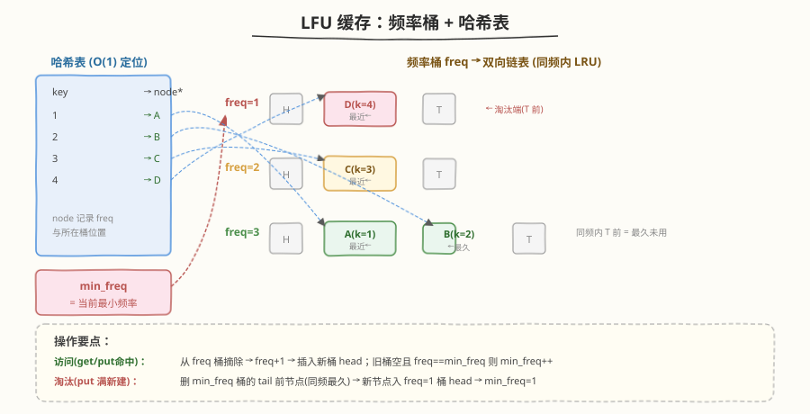
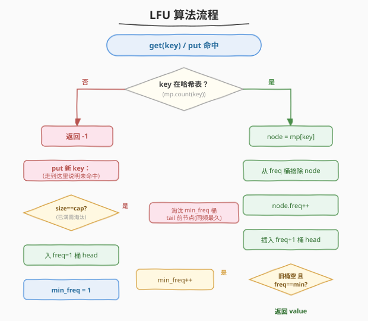
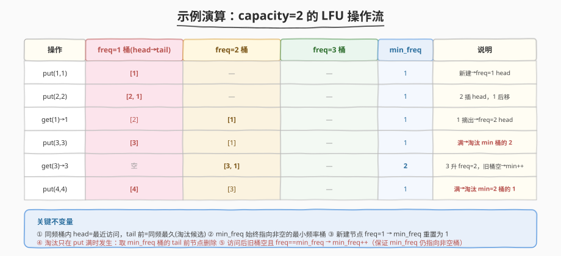

# LeetCode LFU 缓存 题解

## 1. 题目概述

- **标题 / 题号**：LFU 缓存（#460，hard）
- **链接**：https://leetcode.cn/problems/lfu-cache/
- **难度**：困难
- **标签**：设计、哈希表、双向链表

**题意**：请你为 **LFU（最不经常使用）** 缓存算法设计并实现数据结构 `LFUCache`：

- `LFUCache(int capacity)`：用正整数 `capacity` 初始化 LFU 缓存
- `int get(int key)`：若 `key` 存在返回其值，否则返回 `-1`。**每次访问（get 或 put 命中）都使该 key 的频率计数 +1**
- `void put(int key, int value)`：若 `key` 存在则更新值；若不存在则插入。当插入导致超过 `capacity` 时，**淘汰最不经常使用的 key**；若有多个 key 频率相同（并列最少），则淘汰其中**最久未使用**的那个

`get` 与 `put` 必须各自以 `O(1)` 平均时间复杂度运行。

**示例 1**：

```text
输入：
LFUCache lfu = new LFUCache(2);
lfu.put(1, 1);   // cache=[1_(freq=1)]
lfu.put(2, 2);   // cache=[2_(freq=1),1_(freq=1)]，2 最近
lfu.get(1);      // 返回 1，cache=[2_(freq=1),1_(freq=2)]
lfu.put(3, 3);   // 淘汰 key 2（freq=1 中最久），cache=[3_(freq=1),1_(freq=2)]
lfu.get(2);      // 返回 -1（未找到）
lfu.get(3);      // 返回 3，cache=[3_(freq=2),1_(freq=2)]，3 最近
lfu.put(4, 4);   // 淘汰 key 1（freq=2 中最久），cache=[4_(freq=1),3_(freq=2)]
lfu.get(1);      // 返回 -1（未找到）
lfu.get(3);      // 返回 3，cache=[4_(freq=1),3_(freq=3)]
lfu.get(4);      // 返回 4，cache=[4_(freq=2),3_(freq=3)]
```

**约束**：

- `0 <= capacity <= 10^4`
- `0 <= key <= 10^5`
- `0 <= value <= 10^5`
- 最多调用 `2 * 10^5` 次 `get` 和 `put`

## 2. 解题思路

### 2.1 暴力思路

用哈希表存 `key → (value, freq)`，再用一个按频率排序的结构（如最小堆或有序数组）找最小频率。`get` 时频率 +1 后需要调整堆，`O(log n)`；`put` 淘汰时取堆顶 `O(log n)`。不满足 `O(1)`。

若再退一步——用数组线性扫描所有 key 找最小频率——则是 `O(n)`，更不可行（最多 `2×10^5` 次调用）。

### 2.2 核心观察：频率桶 + 哈希表



LFU 比 LRU 多了一维「频率」，关键洞察是**把频率相同的节点放进同一个双向链表（频率桶）**，桶内再按 LRU 排序：

- **哈希表** `key → node`：`O(1)` 定位节点
- **频率桶** `freq → 双向链表`：每个频率维护一条链表，**head 端是最近访问的，tail 前一个是同频中最久未用的**（淘汰候选）
- **`min_freq`**：始终指向当前非空的最小频率桶，淘汰时直接取 `freqTable[min_freq]` 的 tail 前节点

三个数据结构分工：

| 数据结构 | 职责 | 复杂度 |
|---------|------|--------|
| 哈希表 `keyTable` | `key → node` 定位 | `O(1)` 查找 |
| 频率桶 `freqTable` | `freq → 双向链表`，桶内 LRU 排序 | `O(1)` 摘除/插头 |
| `min_freq` | 指向最小频率桶，淘汰无需扫描 | `O(1)` 找淘汰目标 |

> 💡 **与 LRU 的关系**：LRU（[146](../0101-0200/146_LRU缓存.md)）只有一条链表维护访问时序；LFU 是「**多条链表 + 一个频率维度**」——每个频率桶内部就是一个小 LRU。可以说 **LFU = 分频段的 LRU**。

### 2.3 算法流程



**`get(key)` / `put` 命中（已有 key）—— 统一走 `access(node)`**：

1. 哈希表查 key，不存在 → `get` 返回 `-1`
2. 从当前 `freq` 桶摘除 node
3. `node.freq++`，插入 `freq+1` 桶的 head
4. 若旧 `freq` 桶变空**且** `freq == min_freq` → `min_freq++`（保证 `min_freq` 仍指向非空桶）

**`put` 未命中（新 key）**：

1. 若 `size == capacity`：删 `freqTable[min_freq]` 的 tail 前节点（同频最久）+ 哈希表删对应 key
2. 新建 node（`freq=1`），插入 `freq=1` 桶 head + 哈希表登记
3. `min_freq = 1`（新节点频率必为 1，是最小的）

### 2.4 示例演算

以 `capacity=2` 为例，跟踪各频率桶状态：



核心要点：

- **同频桶内** head=最近访问，tail 前=同频最久（淘汰候选）
- **`min_freq` 维护**：访问后旧桶空且 `freq==min_freq` 才 `++`；新建节点必把 `min_freq` 重置为 1
- **淘汰规则**：先比频率（取 `min_freq` 桶），频率相同再比时序（取桶内 tail 前）

## 3. 参考代码

### C++

```cpp
class LFUCache {
    struct Node {
        int key, val, freq;
        Node *prev, *next;
        Node(int k, int v) : key(k), val(v), freq(1), prev(nullptr), next(nullptr) {}
    };
    // 每个频率一条带哨兵的双向链表，head 端最近、tail 前=同频最久
    struct DList {
        Node *head, *tail;
        DList() {
            head = new Node(0, 0);
            tail = new Node(0, 0);
            head->next = tail;
            tail->prev = head;
        }
        bool empty() const { return head->next == tail; }
        void addToHead(Node* node) {
            node->prev = head;
            node->next = head->next;
            head->next->prev = node;
            head->next = node;
        }
        void removeNode(Node* node) {
            node->prev->next = node->next;
            node->next->prev = node->prev;
        }
        Node* removeTail() {
            Node* node = tail->prev;
            removeNode(node);
            return node;
        }
    };

    int cap, minFreq;
    unordered_map<int, Node*> keyTable;          // key -> node
    unordered_map<int, DList> freqTable;         // freq -> 双向链表

    void access(Node* node) {
        int f = node->freq;
        freqTable[f].removeNode(node);
        if (freqTable[f].empty()) {
            freqTable.erase(f);
            if (minFreq == f) minFreq++;          // 旧桶空且是最小频率，min_freq 上移
        }
        node->freq = f + 1;
        freqTable[f + 1].addToHead(node);
    }

  public:
    LFUCache(int capacity) : cap(capacity), minFreq(0) {}

    int get(int key) {
        auto it = keyTable.find(key);
        if (it == keyTable.end()) return -1;
        access(it->second);
        return it->second->val;
    }

    void put(int key, int value) {
        if (cap == 0) return;
        auto it = keyTable.find(key);
        if (it != keyTable.end()) {
            it->second->val = value;
            access(it->second);
            return;
        }
        if ((int)keyTable.size() >= cap) {
            Node* evicted = freqTable[minFreq].removeTail();
            keyTable.erase(evicted->key);
            if (freqTable[minFreq].empty()) freqTable.erase(minFreq);
            delete evicted;
        }
        Node* node = new Node(key, value);
        keyTable[key] = node;
        freqTable[1].addToHead(node);
        minFreq = 1;                               // 新节点 freq=1，必为最小
    }
};
```

### Python

```python
from collections import defaultdict, OrderedDict


class LFUCache:
    def __init__(self, capacity: int):
        self.cap = capacity
        self.min_freq = 0
        self.key_table = {}                             # key -> [val, freq]
        self.freq_table = defaultdict(OrderedDict)      # freq -> OrderedDict(key -> val)

    def _access(self, key: int) -> None:
        """访问已有 key：从旧 freq 桶摘出，freq+1，入新桶 head（OrderedDict 末尾=最近）。"""
        val, f = self.key_table[key]
        del self.freq_table[f][key]
        if not self.freq_table[f]:
            del self.freq_table[f]
            if self.min_freq == f:
                self.min_freq += 1
        self.key_table[key] = [val, f + 1]
        self.freq_table[f + 1][key] = val               # 新桶末尾=最近访问

    def get(self, key: int) -> int:
        if key not in self.key_table:
            return -1
        self._access(key)
        return self.key_table[key][0]

    def put(self, key: int, value: int) -> None:
        if self.cap == 0:
            return
        if key in self.key_table:
            self.key_table[key][0] = value
            self._access(key)
            return
        if len(self.key_table) >= self.cap:
            evict_key, _ = self.freq_table[self.min_freq].popitem(last=False)
            del self.key_table[evict_key]
            if not self.freq_table[self.min_freq]:
                del self.freq_table[self.min_freq]
        self.key_table[key] = [value, 1]
        self.freq_table[1][key] = value
        self.min_freq = 1
```

## 4. 复杂度分析

| 维度 | 复杂度 | 说明 |
|------|--------|------|
| 时间复杂度 | `O(1)` | `get`/`put` 仅哈希表查询 + 链表指针操作 + `min_freq` 常数维护，无扫描无排序 |
| 空间复杂度 | `O(capacity)` | 哈希表、频率桶中的节点总数不超过 `capacity`；频率桶数量 ≤ 节点数 |

## 5. 扩展：LFU vs LRU

| 维度 | LRU（146） | LFU（460） |
|------|-----------|-----------|
| 淘汰依据 | 最久未访问（时间） | 频率最少；同频取最久未访问 |
| 链表条数 | 1 条（全局访问时序） | 多条（每个频率一条，桶内 LRU） |
| `min` 维护 | 无（直接取 tail） | `min_freq` 指针，访问后按需 `++` |
| 新节点频率 | 无频率概念 | `freq=1`，`min_freq` 重置为 1 |
| 复杂度 | `O(1)` | `O(1)` |

> ⚠️ **LFU 的「缓存污染」问题**：早期高频访问、之后再也不用的 key 会长期占据缓存（频率高难淘汰）。实际系统（如 Redis 4.0+ 的 LFU）会给频率加**衰减**：随时间推移频率计数衰减，避免老热点永不淘汰。LeetCode 这题不考察衰减，纯计数即可。

## 6. 面试要点

1. **为什么需要 `min_freq`？没有它会怎样？**

   - 没有 `min_freq`，淘汰时要遍历所有频率桶找最小非空频率，`O(频率数)`。`min_freq` 让淘汰变成 `O(1)` 直接定位。关键是维护它的不变量：**始终指向非空的最小频率桶**。

2. **`min_freq` 何时改变？**

   - **只增不减**：访问 node 后，若其旧 `freq` 桶变空**且** `freq == min_freq`，则 `min_freq++`（因为该频率的节点都升到 `freq+1` 了，最小非空频率至少是 `freq+1`）。
   - **重置为 1**：put 新 key 时，新节点 `freq=1`，必为最小，`min_freq = 1`。
   - 淘汰后**不重置** `min_freq`（因为淘汰的可能不是唯一的最小频率节点，但紧接着若 put 新节点会重置；若只是 get 则 min_freq 已由 access 逻辑保证正确）。

3. **同频内为什么也要用双向链表（LRU）？**

   - 题目要求「频率相同时淘汰最久未使用的」。同一个频率桶内的多个节点，需要按访问时序排序，双向链表 head=最近、tail 前=最久，淘汰取 tail 前 `O(1)`。本质是「桶内再做一次 LRU」。

4. **`capacity == 0` 怎么处理？**

   - 约束允许 `capacity = 0`，此时 `put` 应直接返回（不存任何东西），`get` 永远返回 `-1`。在 `put` 开头加 `if (cap == 0) return;` 即可，否则会误删不存在的节点。

5. **能否用 `OrderedDict` / 标准库简化？**

   - Python 可用 `defaultdict(OrderedDict)`：`popitem(last=False)` 淘汰桶内最久、重新赋值即「移到末尾=最近」。C++ 无现成 OrderedDict，需手写双向链表。面试官通常要求手写以考察指针操作与数据结构设计能力。

## 同类练习题

| # | 题目 | 与本题的关联 |
|---|------|-------------|
| 146 | [LRU 缓存](https://leetcode.cn/problems/lru-cache/)（[题解](../0101-0200/146_LRU缓存.md)） | LFU 的姐妹题，单链表维护访问时序，建议先做 |
| 380 | [O(1) 时间插入、删除和获取随机元素](https://leetcode.cn/problems/insert-delete-getrandom-o1/) | 哈希表 + 动态数组的 `O(1)` 设计套路 |
| 432 | [全 O(1) 数据结构](https://leetcode.cn/problems/all-oone-data-stores/) | 与 LFU 几乎同构，频率桶 + 双向链表，还要求取最大值 |
| 295 | [数据流的中位数](https://leetcode.cn/problems/find-median-from-data-stream/)（[题解](../0201-0300/295_数据流的中位数.md)） | 双堆维护中位数，另一种 `O(log n)` 设计题 |
