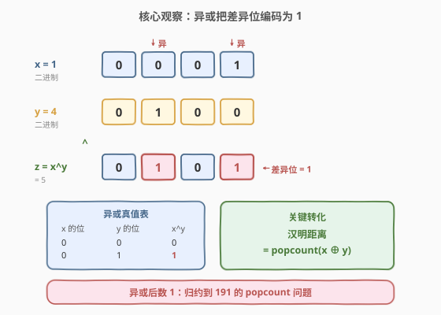
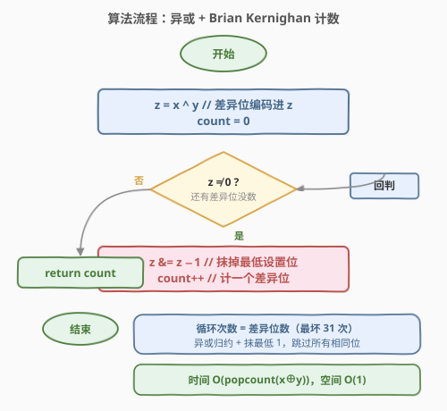
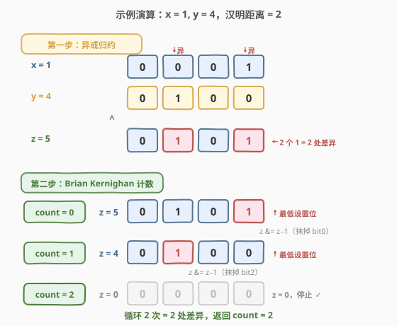

# 汉明距离

- **题目名称**：汉明距离
- **链接**：[461. 汉明距离](https://leetcode.cn/problems/hamming-distance/)
- **难度**：简单
- **标签**：位运算

## 1. 题目概述

给定两个整数 `x` 和 `y`，返回它们的**汉明距离**——即二进制表示中**对应位不同的位数**。

> 💡 **汉明距离**由 Richard Hamming 提出，是信息论与编码理论中的基础度量：两个等长字符串在相同位置上不同字符的个数。本题限定为两个整数的二进制位串之间的差异位数，广泛用于错误检测/纠正码（如汉明码）、DNA 序列比对、相似度度量等场景。

**示例 1**：

```text
输入：x = 1, y = 4
输出：2
解释：
1   (0 0 0 1)
4   (0 1 0 0)
       ↑   ↑
对应位不同的位置有 2 处（从右数的第 2 位和第 0 位），故汉明距离为 2。
```

**示例 2**：

```text
输入：x = 3, y = 1
输出：1
```

**约束条件**：

- $0 \leq x, y \leq 2^{31} - 1$

> ⚠️ **注意取值范围**：输入为非负 31 位整数（C++/Java 的 `int` 正数范围），无需像 [191. 位 1 的个数](https://leetcode.cn/problems/number-of-1-bits/) 那样处理 32 位补码负数的「无限前导 1」问题。`x ^ y` 的结果也是非负数，Python 下直接用 `n & (n - 1)` 计数不会陷入死循环。

---

## 2. 解题思路

### 2.1 暴力思路：逐位比较

最直观的做法是固定循环 32 次，每次取 `x` 和 `y` 的最低位 `(x & 1)` 与 `(y & 1)` 比较，不等则计数 `+1`，再各自右移：

```python
count = 0
for _ in range(32):
    if (x & 1) != (y & 1):
        count += 1
    x >>= 1
    y >>= 1
return count
```

时间 $O(32) = O(1)$，空间 $O(1)$。能 AC，但**无论两数差异多少都要循环满 32 次**——当差异很稀疏时（如 `x = 1, y = 4` 只有 2 位不同），仍要空转 30 次检查相同的位，做了大量无用功；同时每次都要对 `x`、`y` 各做一次取位与移位，操作冗余。

> 💡 转机在于：能否**先把所有不同的位一次性收集出来**，再只对这些位计数？按位异或 `x ^ y` 恰好能做到——它把「对应位是否不同」编码成一个数的二进制位。

### 2.2 核心观察：异或把「差异」编码为 1



异或 `^` 的运算规则是「**相同为 0，不同为 1**」：

| `x` 的位 | `y` 的位 | `x ^ y` 的位 |
|----------|----------|--------------|
| 0 | 0 | 0 |
| 0 | 1 | 1 |
| 1 | 0 | 1 |
| 1 | 1 | 0 |

也就是说，`z = x ^ y` 的第 `k` 位为 `1`，**当且仅当** `x` 和 `y` 在第 `k` 位不同。于是「`x` 与 `y` 的汉明距离」被精确转化为「`z` 的二进制中 `1` 的个数」——即 `z` 的 **popcount**（汉明重量）。

> 💡 **关键转化**：汉明距离 = $\text{popcount}(x \oplus y)$。这一步把「两数之间的位差异」问题归约为 [191. 位 1 的个数](https://leetcode.cn/problems/number-of-1-bits/) 的单数 popcount 问题，复用其全部技巧。

归约后，对 `z` 应用 **Brian Kernighan 技巧** `z &= z - 1`：每执行一次抹去 `z` 的最低设置位（最低的 `1`），计数 `+1`，直到 `z = 0`。循环次数恰好等于差异位数，跳过所有连续的 `0` 位，比逐位比较法更高效。

### 2.3 算法流程图



算法分两步走：

1. **归约**：`z = x ^ y`，把所有差异位编码进 `z` 的二进制。
2. **计数**：`count = 0`；只要 `z ≠ 0`，执行 `z &= z - 1`（抹掉最低设置位），`count += 1`。循环结束时 `count` 即为汉明距离。

> ⚠️ **正确性**：异或保证 `z` 的每个 `1` 唯一对应一对差异位；`z & (z - 1)` 每轮严格抹掉一个 `1` 且不动其它位。故 `count` 严格累加差异位数，有限位整数必有有限个 `1`，循环必终止于 `z = 0`，此时 `count` 恰为汉明距离。

### 2.4 示例演算

以示例 1 的 `x = 1, y = 4` 为例：



**第一步：异或归约**

| 数 | 十进制 | 二进制（4 位） |
|----|--------|----------------|
| `x` | 1 | `0 0 0 1` |
| `y` | 4 | `0 1 0 0` |
| `z = x ^ y` | 5 | `0 1 0 1` |

`z = 5`（二进制 `0101`），有 2 个 `1`，分别对应 `x`、`y` 在第 0 位（`1` vs `0`）和第 2 位（`0` vs `1`）的差异。

**第二步：Brian Kernighan 计数**

| 轮次 | `z`（十进制） | `z`（二进制） | `z−1`（二进制） | `z & (z−1)` | `count` |
|------|--------------|--------------|-----------------|-------------|---------|
| 初始 | 5 | `0101` | — | — | 0 |
| 1 | 5 → 4 | `0101` | `0100` | `0100` | 1 |
| 2 | 4 → 0 | `0100` | `0011` | `0000` | 2 |

2 轮后 `z = 0`，循环结束，`count = 2` ✓。注意每轮被抹掉的都是当前 `z` 的最低设置位（bit0 → bit2），中间的 `0` 位被一次性跳过——这正是该技巧比逐位比较更高效的根源。

---

## 3. 参考代码

### C++

```cpp
class Solution {
  public:
    int hammingDistance(int x, int y) {
        int z = x ^ y;
        int count = 0;
        while (z) {
            z &= z - 1;   // 抹掉最低设置位
            count++;
        }
        return count;
    }
};
```

### Python

```python
class Solution:
    def hammingDistance(self, x: int, y: int) -> int:
        z = x ^ y
        count = 0
        while z:
            z &= z - 1    # 抹掉最低设置位
            count += 1
        return count
```

也可一行调用内置函数（语义等价，底层走 C 实现）：

```python
class Solution:
    def hammingDistance(self, x: int, y: int) -> int:
        return (x ^ y).bit_count()          # Python 3.10+，最快
        # 或：return bin(x ^ y).count('1')
```

> 💡 **C++ 也可用 `__builtin_popcount`**：`return __builtin_popcount(x ^ y);`，编译器会映射到 CPU 的 `POPCNT` 单指令。但面试中 `z &= z - 1` 是展示位运算功底的标准答案，且能自然衔接 [191](https://leetcode.cn/problems/number-of-1-bits/) 的思路。

---

## 4. 复杂度分析

| 维度 | 复杂度 | 说明 |
|------|--------|------|
| 时间复杂度 | $O(\text{popcount}(x \oplus y))$ | 循环次数恰为差异位数；最坏情况（两数互为按位取反，31 位全不同）为 $O(31) = O(1)$ |
| 空间复杂度 | $O(1)$ | 仅用 `z` 和 `count` 两个变量 |

> 💡 与逐位比较法固定循环 32 次相比，本解法在差异稀疏时优势明显（`x = 1, y = 4` 只循环 2 次）。由于输入为 31 位非负整数，popcount 上界为 31，故也可视作 $O(1)$。两种表述都对，关键是能说清「循环次数 = 差异位数」这一性质。

---

## 5. 扩展：汉明距离的更多应用与变体

### 5.1 汉明重量 vs 汉明距离

- **汉明重量**（Hamming Weight）：一个数的二进制中 `1` 的个数，即 `popcount(n)`——[191. 位 1 的个数](https://leetcode.cn/problems/number-of-1-bits/)。
- **汉明距离**（Hamming Distance）：两个数的二进制中**对应位不同**的个数，即 $\text{popcount}(x \oplus y)$——本题。

二者的桥梁就是异或：汉明距离 = $x \oplus y$ 的汉明重量。这一归约揭示了「距离」与「重量」的本质关系——距离是「差异的重量」。

### 5.2 总汉明距离（[477. 总汉明距离](https://leetcode.cn/problems/total-hamming-distance/)）

若要求一个数组中**所有两两数对的汉明距离之和**，朴素做法是 $O(n^2)$ 地套用本题。但可按位独立统计：对第 `k` 位，设数组中有 `c` 个数该位为 `1`，则 `n - c` 个数该位为 `0`，这一位贡献的差异数对数为 $c \times (n - c)$。对所有 31 位求和即得总距离，时间 $O(31n) = O(n)$，远优于 $O(n^2)$。

> 💡 这一「按位拆解」的思想在位运算题中反复出现：把「整体配对差异」拆成「逐位贡献求和」，是降维的关键。

### 5.3 字符串汉明距离

若把输入从整数换成等长字符串（如 DNA 序列 `ACGT`），汉明距离的定义完全一致——逐字符比较不同个数。只需把异或换成字符相等判断，把 popcount 换成一次线性扫描。本题的「逐位归约」思想可直接迁移。

---

## 6. 面试要点

1. **为什么汉明距离等于 `popcount(x ^ y)`？**

   - 异或的规则是「相同为 0，不同为 1」。`z = x ^ y` 的第 `k` 位为 `1` 当且仅当 `x` 与 `y` 在第 `k` 位不同。故 `z` 的二进制中 `1` 的个数恰为两数差异位数，即汉明距离。这一步把「两数之间的差异」归约为「单数的 1 的个数」。

2. **`z & (z - 1)` 为什么能抹去最低设置位？**

   - 设 `z` 的最低设置位在第 `k` 位。`z - 1` 向低位借位：第 `k` 位 `1→0`，第 `0..k-1` 位 `0→1`，更高位不变。与 `z` 按位与后，第 `k` 位 `1 & 0 = 0`（抹掉），更低位的 `0 & 1 = 0`（仍为 0），更高位 `原 & 原 = 原`。故结果只比 `z` 少一个最低设置位。详见 [191. 位 1 的个数](https://leetcode.cn/problems/number-of-1-bits/)。

3. **本题需要处理 Python 负数补码的坑吗？**

   - **不需要**。约束保证 $0 \leq x, y \leq 2^{31} - 1$，`x ^ y` 也是非负数，Python 下 `z & (z - 1)` 必然归零，不会死循环。这是本题与 [191](https://leetcode.cn/problems/number-of-1-bits/) 的关键区别——191 可能传入 32 位补码负数（无限前导 1），需先 `z &= 0xFFFFFFFF` 截断；本题输入恒为非负，直接用即可。但面试时主动提及这一语言差异是加分项。

4. **能否用内置函数？哪个最快？**

   - C++ 用 `__builtin_popcount(x ^ y)`，Python 3.10+ 用 `(x ^ y).bit_count()`，均映射到 CPU 的 `POPCNT` 单指令，常数时间最快。但面试中手写 `z &= z - 1` 是展示位运算功底的标准答案，且能自然衔接到 popcount 的原理讲解。

5. **如果要求一个数组中所有数对的汉明距离之和呢？**

   - 见 [477. 总汉明距离](https://leetcode.cn/problems/total-hamming-distance/)。朴素 $O(n^2)$ 套用本题会超时；按位拆解：对第 `k` 位，`c` 个数该位为 `1`、`n-c` 个为 `0`，贡献 $c \times (n-c)$ 个差异对，31 位求和即得 $O(n)$ 解法。「按位独立统计」是位运算降维的通用思想。

---

## 7. 同类练习题

- [191. 位 1 的个数](https://leetcode.cn/problems/number-of-1-bits/)（[题解](../0001-0100/191_位1的个数.md)）：本题的前置母题——异或归约后剩下的就是 popcount，`n & (n-1)` 技巧的源头
- [477. 总汉明距离](https://leetcode.cn/problems/total-hamming-distance/)：数组所有数对汉明距离之和，按位拆解 $O(n)$，本题的「批量版」
- [231. 2 的幂](https://leetcode.cn/problems/power-of-two/)：用 `n & (n-1) == 0` 判定，同一技巧的另一经典应用
- [190. 颠倒二进制位](https://leetcode.cn/problems/reverse-bits/)：同样逐位处理 32 位无符号数，位运算基础练习
- [338. 比特位计数](https://leetcode.cn/problems/counting-bits/)：对 `0..n` 每个数求 popcount，DP 复用 `ans[i & (i-1)]`，popcount 的批量计数
