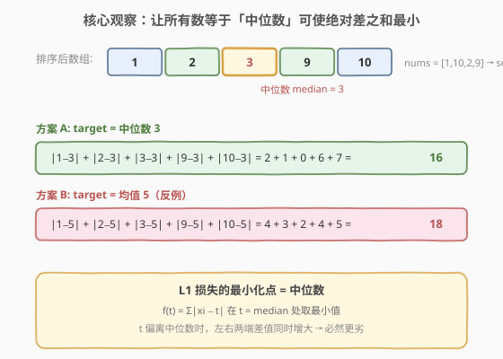
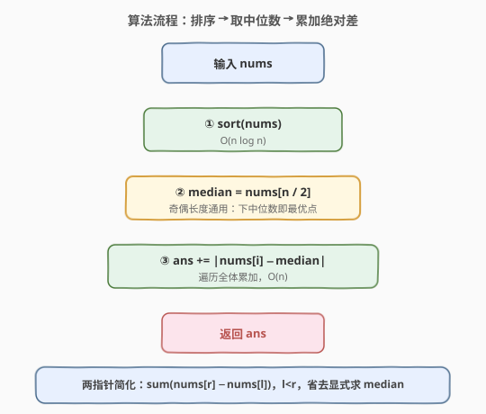
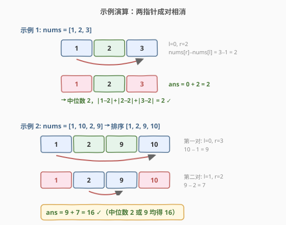

# LeetCode 最小操作次数使数组元素相等 II 题解

## 1. 题目概述

- **标题 / 题号**：最小操作次数使数组元素相等 II（#462，medium）
- **链接**：https://leetcode.cn/problems/minimum-moves-to-equal-array-elements-ii/
- **难度**：中等
- **标签**：数组、数学、排序、双指针

**题意**：给定一个长度为 $n$ 的整数数组 `nums`，每次操作可以将数组中**任意一个元素**增加或减少 $1$。求使**所有元素相等**所需的最少操作次数。

**示例 1**：

```text
输入：nums = [1,2,3]
输出：2
解释：[1,2,3] => [2,2,3] => [2,2,2]，两次操作后全部等于 2。
```

**示例 2**：

```text
输入：nums = [1,10,2,9]
输出：16
解释：全部归到 2（或 9），需要 |1−2|+|10−2|+|2−2|+|9−2| = 1+8+0+7 = 16 次。
```

**约束**：

- $n = \text{nums.length}$
- $1 \le n \le 10^5$
- $-10^9 \le \text{nums}[i] \le 10^9$

> 💡 本题与 [453. 最小操作次数使数组元素相等 I](https://leetcode.cn/problems/minimum-moves-to-equal-array-elements/) 是一对姊妹题：453 只允许「让 $n-1$ 个元素 +1」（等价于让 $1$ 个元素 $-1$，只能减），答案是 $\sum \text{nums} - n \cdot \min$；而 462 允许**任意元素加减 1**，目标值自由选取，最优解落点为**中位数**。两题的「等价转化」思路相通，但 462 是标准的 $L_1$ 损失最小化问题。

## 2. 解题思路

### 2.1 暴力思路

枚举所有可能的目标值 $t$，对每个 $t$ 计算 $\sum_{i} |\text{nums}[i] - t|$，取最小值。问题在于 $t$ 的取值范围与 `nums[i]` 同量级（$-10^9 \sim 10^9$），枚举不可行。

退一步：**目标值 $t$ 一定取自数组中某个元素**（否则可微调 $t$ 使某个 $|x_i - t|$ 减小而不增加其它项，结论由 $L_1$ 凸性保证）。于是可以 $O(n^2)$ 枚举每个元素作为 $t$，但这仍不足以应对 $n = 10^5$。

### 2.2 核心观察：中位数最小化绝对差之和



**关键定理**：函数 $f(t) = \sum_{i=1}^{n} |x_i - t|$ 在 $t$ 等于**中位数**时取得最小值。

直观理解（两种角度）：

1. **导数/次梯度角度**：$|x_i - t|$ 对 $t$ 的次梯度是 $[-1, +1]$（在 $t = x_i$ 处）或 $\{-1\}$（$t > x_i$）或 $\{+1\}$（$t < x_i$）。当 $t$ 小于中位数时，$f$ 的下降速率（右侧项数 − 左侧项数）为正，应继续增大 $t$；当 $t$ 大于中位数时，下降速率为负，应减小 $t$。临界点恰在中位数。

2. **配对相消角度**：将数组排序后，最左与最右配对，二者对 $f(t)$ 的贡献为 $(x_r - t) + (t - x_l) = x_r - x_l$（当 $x_l \le t \le x_r$）。只要 $t$ 落在 $[x_l, x_r]$ 之间，这对的贡献就是**常数** $x_r - x_l$，与 $t$ 无关。所有外层配对相消后，$t$ 只需落在最内层（中位数附近）即可使所有配对的常数贡献同时成立，累加即为答案。

> ⚠️ **为什么不是均值？** 均值是 $L_2$ 损失 $\sum (x_i - t)^2$ 的最小化点（平方误差回归），而本题是 $L_1$ 损失，最小化点是**中位数**。下图反例显示：取均值 5 时答案为 18，取中位数 3 时答案为 16，均值更劣。

> 💡 **奇偶长度通用**：$n$ 为奇数时中位数唯一（$\text{nums}[n/2]$）；$n$ 为偶数时，$t$ 取 $\text{nums}[n/2 - 1]$ 与 $\text{nums}[n/2]$ 之间任意值都使 $f$ 取最小（中位数区间），工程上统一取 $\text{nums}[n/2]$（下中位数）即可。

### 2.3 算法流程图



**完整步骤**：

1. **排序**：对 `nums` 升序排序，$O(n \log n)$。
2. **取中位数**：`median = nums[n / 2]`（下中位数，奇偶通用）。
3. **累加绝对差**：遍历所有元素，`ans += abs(nums[i] - median)`。
4. **返回** `ans`。

**两指针简化版**（推荐）：排序后用 `l = 0, r = n - 1` 双指针从两端向中间收拢，每次累加 `nums[r] - nums[l]`（保证非负），直到 `l >= r`。这等价于配对相消，省去了显式求中位数的步骤，代码更简洁。

> 💡 **两指针为何等价？** 排序后，最外层对 $(x_l, x_r)$ 的贡献为 $x_r - x_l$，恰好等于该对两端到任意 $t \in [x_l, x_r]$ 的绝对差之和。所有配对的贡献之和即为答案，与中位数法结果一致。

### 2.4 示例演算

以 `nums = [1, 2, 3]` 和 `nums = [1, 10, 2, 9]` 为例：



**`nums = [1, 2, 3]`**（已排序）：

- 中位数 `median = nums[1] = 2`
- $|1-2| + |2-2| + |3-2| = 1 + 0 + 1 = 2$
- 两指针法：$l=0, r=2$，`nums[2] - nums[0] = 3 - 1 = 2`，`l=1, r=1` 停止，答案 $2$

**`nums = [1, 10, 2, 9]`**（排序后 `[1, 2, 9, 10]`）：

- 中位数 `median = nums[2] = 9`（下中位数，取 `nums[2]` 亦可取 `nums[1] = 2`，结果相同）
- $|1-9| + |2-9| + |9-9| + |10-9| = 8 + 7 + 0 + 1 = 16$
- 两指针法：
  - $l=0, r=3$：`nums[3] - nums[0] = 10 - 1 = 9`
  - $l=1, r=2$：`nums[2] - nums[1] = 9 - 2 = 7`
  - $l=2, r=1$ 停止，答案 $9 + 7 = 16$

## 3. 参考代码

### C++

```cpp
// 最小操作次数使数组元素相等II.cpp —— 中位数 + 绝对差累加
// 编译: g++ -O2 -std=c++17 最小操作次数使数组元素相等II.cpp -o minmoves2
class Solution {
public:
    int minMoves2(vector<int>& nums) {
        sort(nums.begin(), nums.end());
        int n = nums.size();
        int median = nums[n / 2];
        long long ans = 0;
        for (int x : nums) ans += abs(x - median);
        return (int)ans;
    }
};
```

**两指针版**（更简洁）：

```cpp
class Solution {
public:
    int minMoves2(vector<int>& nums) {
        sort(nums.begin(), nums.end());
        int l = 0, r = (int)nums.size() - 1, ans = 0;
        while (l < r) {
            ans += nums[r] - nums[l];
            l++; r--;
        }
        return ans;
    }
};
```

### Python

```python
class Solution:
    def minMoves2(self, nums: List[int]) -> int:
        nums.sort()
        median = nums[len(nums) // 2]
        return sum(abs(x - median) for x in nums)
```

**两指针版**：

```python
class Solution:
    def minMoves2(self, nums: List[int]) -> int:
        nums.sort()
        l, r, ans = 0, len(nums) - 1, 0
        while l < r:
            ans += nums[r] - nums[l]
            l += 1
            r -= 1
        return ans
```

> 💡 **实现细节**：① 中位数取 `nums[n / 2]`（下中位数），奇偶长度通用，无需分类讨论。② 值域达 $10^9$、$n$ 达 $10^5$，最坏累加和约 $10^{14}$，C++ 用 `long long` 累加再转 `int` 返回更稳妥（本题 LeetCode 数据范围内 `int` 不溢出，但工程实践建议用 `long long`）。③ 两指针法避免了 `abs` 调用，且 `nums[r] - nums[l]` 在排序后天然非负，逻辑更清晰。

## 4. 复杂度分析

| 维度 | 复杂度 | 说明 |
|------|--------|------|
| 时间复杂度 | $O(n \log n)$ | 排序主导 $O(n \log n)$；中位数取出 $O(1)$；遍历累加 $O(n)$ |
| 空间复杂度 | $O(\log n)$ | 排序的栈空间（快排/归并），C++ `std::sort` 为 $O(\log n)$；不计输入数组本身 |

> ⚠️ 本题瓶颈在排序。若用**快速选择**（`nth_element`）以 $O(n)$ 平均时间找到中位数，再 $O(n)$ 累加，可把整体降到 $O(n)$ 平均。但快速选择的最坏为 $O(n^2)$，且常数不小，实际面试中排序法更稳更简洁，$n = 10^5$ 时 $O(n \log n) \approx 1.7 \times 10^6$ 完全够用。

## 5. 扩展：快速选择 O(n) 平均解法

当追求严格 $O(n)$ 平均时间时，可用 `nth_element` 在无序数组中**部分排序**定位中位数，再线性累加：

### C++

```cpp
class Solution {
public:
    int minMoves2(vector<int>& nums) {
        int n = nums.size();
        auto mid = nums.begin() + n / 2;
        nth_element(nums.begin(), mid, nums.end());
        int median = *mid;
        long long ans = 0;
        for (int x : nums) ans += abs(x - median);
        return (int)ans;
    }
};
```

**原理**：`std::nth_element` 将第 $k$ 小的元素放到第 $k$ 个位置，左侧均小于它、右侧均大于它，但不保证两侧内部有序。平均时间 $O(n)$，最坏 $O(n^2)$（C++ 标准库实现通常带 introselect 防御，退化为 $O(n \log n)$ 上界）。

> 💡 **何时用快速选择？** 仅当 $n$ 极大且对延迟敏感时（如 $n > 10^7$）。面试题 $n \le 10^5$ 时排序法已足够，且代码更短、最坏复杂度更可控。优先讲排序法，快速选择作为加分项提及即可。

## 6. 面试要点

1. **为什么目标是中位数而非均值？**

   > 本题最小化的是 $L_1$ 损失 $\sum |x_i - t|$，其最优点是中位数；均值是 $L_2$ 损失 $\sum (x_i - t)^2$ 的最优点。两者只在分布对称时重合。反例 `[1,2,9,10]`：中位数法得 16，均值（5.5）法得 $4.5+3.5+3.5+4.5 = 16$（此例恰好接近），但 `[1,1,1,100]`：中位数 1 得 99，均值 25.75 得 $24.75 \times 2 + 74.25 \times 2 = 198$，差异巨大。

2. **如何用配对相消证明中位数最优？**

   > 排序后，外层对 $(x_l, x_r)$ 对 $f(t)$ 的贡献为 $x_r - x_l$（只要 $t \in [x_l, x_r]$）。逐层剥去外层对后，$t$ 只需落在最内层区间（中位数区间）即可让所有对的常数贡献同时成立。任何偏离中位数的 $t$ 都会让某一侧的外层对脱离区间，使该对贡献增大。

3. **偶数长度时取哪个中位数？**

   > 任意一个都正确。偶数 $n$ 时，$f(t)$ 在 $[\text{nums}[n/2-1], \text{nums}[n/2]]$ 上为常数（平顶），取下中位数 `nums[n/2]` 或上中位数 `nums[n/2-1]` 答案相同。工程上统一取 `nums[n/2]` 最简洁。

4. **两指针法为何等价于中位数法？**

   > 两指针法的每次 `nums[r] - nums[l]` 恰是外层对在 $t \in [x_l, x_r]$ 时的常数贡献。所有配对贡献之和就是 $f(t)$ 在中位数处的最小值，与显式求中位数再累加绝对差完全等价，但避免了 `abs` 与显式取中位数。

5. **本题与 453 的区别？**

   > 453 每次只能让 $n-1$ 个元素 $+1$（等价于让 $1$ 个元素 $-1$，**只能减不能加**），目标是把所有数降到最小值，答案为 $\sum \text{nums} - n \cdot \min$。462 允许任意元素加减 1，目标值自由选取，最优解落点为中位数。两题都是「等价转化」的经典案例，但限制不同导致结论不同。

> 💡 **一句话总结**：462 是 $L_1$ 损失最小化的招牌题——排序取中位数，累加绝对差，$O(n \log n)$ 一把梭。两指针配对相消是其等价简化，快速选择可降至 $O(n)$ 平均。与 453（只能减）对照记忆，结论一中位数、一最小值，限制决定答案。

## 同类练习题

| # | 题目 | 与本题的关联 |
|---|------|-------------|
| 453 | [最小操作次数使数组元素相等 I](https://leetcode.cn/problems/minimum-moves-to-equal-array-elements/) | 姊妹题，每次让 $n-1$ 个元素 $+1$，等价转化后只能减，答案 $\sum - n \cdot \min$ |
| 296 | [最佳的碰头地点](https://leetcode.cn/problems/best-meeting-point/) | 二维版中位数最小化，行列独立求中位数曼哈顿距离之和 |
| 317 | [离建筑物最近的距离](https://leetcode.cn/problems/shortest-distance-from-all-buildings/) | 多源 BFS + 中位数选址思想的综合 |
| 2033 | [获取单值网格的最小操作数](https://leetcode.cn/problems/minimum-operations-to-make-a-univalue-grid/) | 二维网格 + 限定步长 $x$，模 $x$ 同余分组后各组取中位数 |
