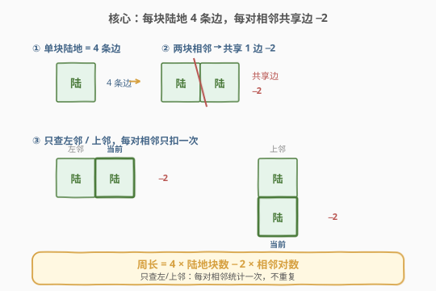
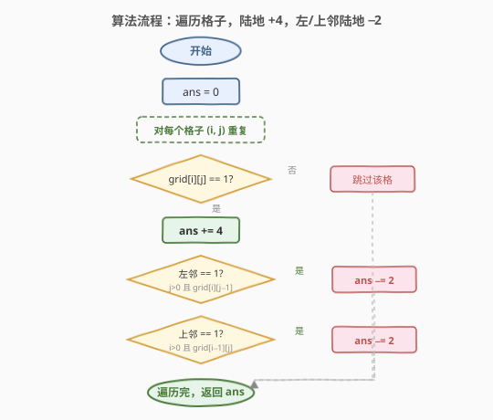
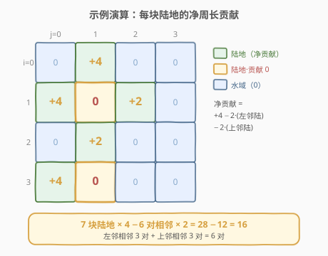

# 岛屿的周长

- **题目名称**：岛屿的周长
- **链接**：[463. 岛屿的周长](https://leetcode.cn/problems/island-perimeter/)
- **难度**：简单
- **标签**：数组、矩阵、网格遍历

## 1. 题目概述

给定一个 $row \times col$ 的二维网格 `grid`，其中 `grid[i][j] = 1` 表示陆地，`grid[i][j] = 0` 表示水域。网格**被水完全包围**，其中**恰好只有一个岛屿**（一组水平/竖直相连的陆地），且岛上**没有「湖」**（即岛内的水都与岛外水域相连）。

求该岛屿的**周长**——即所有陆地格子暴露在水域或网格边界一侧的边数之和。

**示例 1**：

```text
输入：grid = [[0,1,0,0],
             [1,1,1,0],
             [0,1,0,0],
             [1,1,0,0]]
输出：16
解释：岛屿轮廓如上图，周长为 16。
```

**示例 2**：

```text
输入：grid = [[1]]
输出：4
解释：单块陆地，四条边全部暴露。
```

**示例 3**：

```text
输入：grid = [[1,0]]
输出：4
解释：单块陆地，四条边全部暴露。
```

**约束条件**：

- $row == \text{grid.length}$
- $col == \text{grid}[i].\text{length}$
- $1 \le row, col \le 100$
- $\text{grid}[i][j] \in \{0, 1\}$

> 💡 **关键前提**：「单一岛屿 + 无湖」保证了周长就是陆地与水/边界的全部交界边数。事实上本解法（统计每条陆地的暴露边）**不依赖**这两条前提，对多岛、有湖同样给出「陆地−水域交界总长」；前提只是让答案的语义无歧义。

---

## 2. 解题思路

### 2.1 暴力思路

对每个陆地格子，逐个检查**上下左右四个方向**：若该方向是水域或越界出界，则该方向贡献一条周长边。累加所有陆地格子的贡献即可。

该做法正确且也是 $O(mn)$，但每个陆地格子要判 4 个方向、写 4 次越界检查，代码啰嗦且易错。能否更简洁？

> ⚠️ 突破口：与其对每条边判两侧，不如**先给每块陆地默认 4 条边，再减去被相邻陆地「吃掉」的边**。一次遍历、只查两个方向即可。

### 2.2 核心观察：每块陆地 4 边，相邻共享边 −2



关键观察有三点：

1. **每块陆地初始贡献 4 条边**：一个陆地格子有上、右、下、左共 4 条边，先全部计入周长。
2. **相邻陆地共享的边不贡献周长**：两块陆地相邻时，它们之间那条边被夹在陆地内部，从周长角度看，两边各计了一次共多算 2，应**减去 2**。
3. **只查左邻与上邻避免重复计数**：若对每对相邻都查两次（A 查 B、B 查 A），会重复扣减。只看每个格子的「左」和「上」邻居，每对相邻**恰好被统计一次**。

> 💡 **等价公式**：$\text{周长} = 4 \times \text{陆地块数} - 2 \times \text{相邻对数}$。其中「相邻对数」只统计「左邻是陆地」和「上邻是陆地」的格子数（方向各算一次，不重复）。

### 2.3 算法流程图



算法步骤：

1. `ans = 0`。
2. 双重循环遍历每个格子 `(i, j)`。
3. 若 `grid[i][j] == 1`：
   - `ans += 4`（默认 4 条边）。
   - 若 `j > 0` 且 `grid[i][j - 1] == 1`（左邻是陆地）：`ans -= 2`。
   - 若 `i > 0` 且 `grid[i - 1][j] == 1`（上邻是陆地）：`ans -= 2`。
4. 遍历结束返回 `ans`。

> ⚠️ 越界守卫 `j > 0` / `i > 0` 必不可少：第 0 行没有上邻、第 0 列没有左邻，直接访问会越界。由于只查左和上，这两个守卫就足够覆盖所有边界，无需再判右、下。

### 2.4 示例演算

以 `grid = [[0,1,0,0],[1,1,1,0],[0,1,0,0],[1,1,0,0]]` 为例：



逐格计算（仅对陆地格子，左邻/上邻为陆地才扣 2）：

| 步骤 | (i, j) | grid | +4 | 左邻陆? | 上邻陆? | 净贡献 | ans 累计 |
|------|--------|------|----|---------|---------|--------|----------|
| 1 | (0, 1) | 1 | +4 | 否 (0,0)=0 | 否 (越界) | +4 | 4 |
| 2 | (1, 0) | 1 | +4 | 否 (越界) | 否 (0,0)=0 | +4 | 8 |
| 3 | (1, 1) | 1 | +4 | 是 → −2 | 是 → −2 | 0 | 8 |
| 4 | (1, 2) | 1 | +4 | 是 → −2 | 否 (0,2)=0 | +2 | 10 |
| 5 | (2, 1) | 1 | +4 | 否 (2,0)=0 | 是 → −2 | +2 | 12 |
| 6 | (3, 0) | 1 | +4 | 否 (越界) | 否 (2,0)=0 | +4 | 16 |
| 7 | (3, 1) | 1 | +4 | 是 → −2 | 是 → −2 | 0 | 16 |

最终 `ans = 16` ✓。

**用公式复核**：陆地块数 $= 7$；相邻对数 $=$ 左邻相邻 $3$ 对 $+$ 上邻相邻 $3$ 对 $= 6$；周长 $= 4 \times 7 - 2 \times 6 = 28 - 12 = 16$ ✓。

> 💡 注意 `(1,1)` 与 `(3,1)`：它们左、上都有陆地邻居，净贡献为 0——这正是「完全被陆地包夹」的格子，自身不向周长贡献任何边（橙底标红 0）。

---

## 3. 参考代码

### C++

```cpp
class Solution {
  public:
    int islandPerimeter(vector<vector<int>>& grid) {
        int m = grid.size(), n = grid[0].size();
        int ans = 0;
        for (int i = 0; i < m; ++i) {
            for (int j = 0; j < n; ++j) {
                if (grid[i][j] == 1) {
                    ans += 4;
                    if (j > 0 && grid[i][j - 1] == 1) ans -= 2;
                    if (i > 0 && grid[i - 1][j] == 1) ans -= 2;
                }
            }
        }
        return ans;
    }
};
```

### Python

```python
class Solution:
    def islandPerimeter(self, grid: List[List[int]]) -> int:
        m, n = len(grid), len(grid[0])
        ans = 0
        for i in range(m):
            for j in range(n):
                if grid[i][j] == 1:
                    ans += 4
                    if j > 0 and grid[i][j - 1] == 1:
                        ans -= 2
                    if i > 0 and grid[i - 1][j] == 1:
                        ans -= 2
        return ans
```

> 💡 两段代码结构完全一致：**一次遍历 + 三个 if**。无需额外数组、无需 DFS 栈，是本题最简洁的最优解。

---

## 4. 复杂度分析

| 维度 | 复杂度 | 说明 |
|------|--------|------|
| 时间复杂度 | $O(m \times n)$ | 单趟遍历所有格子，每个格子 $O(1)$ 操作 |
| 空间复杂度 | $O(1)$ | 仅用常数变量 `ans`，原地计算，不修改输入 |

> 💡 这是该题的最优解：时间已达下界 $O(mn)$（必须至少看一遍每个格子才能判断陆地），空间为常数。相比暴力「四方向判边」写法，本解法把 4 次越界检查压缩成 2 次，且无需区分「水域」与「越界」两种情况——越界自然落在 `j > 0` / `i > 0` 守卫之外，逻辑更清爽。

---

## 5. 扩展：DFS 写法与「四方向判边」写法

### 5.1 四方向判边（暴力但直观）

对每个陆地格子，数其暴露边（邻水或出界即为暴露）：

```python
class Solution:
    def islandPerimeter(self, grid: List[List[int]]) -> int:
        m, n = len(grid), len(grid[0])
        ans = 0
        for i in range(m):
            for j in range(n):
                if grid[i][j] == 1:
                    for di, dj in (-1, 0), (1, 0), (0, -1), (0, 1):
                        ni, nj = i + di, j + dj
                        if ni < 0 or ni >= m or nj < 0 or nj >= n or grid[ni][nj] == 0:
                            ans += 1
        return ans
```

思路最直白：一条边暴露当且仅当「另一侧是水或越界」。同为 $O(mn)/O(1)$，但每个陆地要判 4 个方向。两种写法等价——「$+4$ 再 $-2$」本质就是把「四方向判边」重排为「先全算再扣相邻」。

### 5.2 何时需要 DFS

本题因「单一岛屿 + 无湖」，遍历法最简。若题目改为**多岛且只求某个岛的周长**，或需区分**外周长与内湖边界**，则需用 DFS/BFS 先定位目标岛屿再统计边。DFS 写法对每块陆地仍可用「$+4$ 再 $-2$」逻辑，只是遍历范围限定在连通块内。相关场景见 [695. 岛屿的最大面积](https://leetcode.cn/problems/max-area-of-island/)、[1254. 统计封闭岛屿的数目](https://leetcode.cn/problems/number-of-closed-islands/)。

---

## 6. 面试要点

1. **为什么只查左和上，不查右和下？**
   - 若四个方向都查，每对相邻会被统计两次（A 查右邻 B、B 又查左邻 A），需额外去重。只查「左」和「上」，每对相邻恰好被统计一次（由右侧/下侧的那个格子负责扣减），天然无重复，且只需 `j > 0` / `i > 0` 两个越界守卫。

2. **公式 $4 \times \text{land} - 2 \times \text{pairs}$ 里的「2」怎么来的？**
   - 一对相邻陆地共享一条边。计周长时这条边两侧都不应暴露，但「每块陆地默认 +4」把这条边在两个格子各算了一次（共 2 次），故需减 2 把它彻底扣除。若只减 1 会残留 1 条虚假边。

3. **题目保证「单一岛屿 + 无湖」，解法是否依赖这两条前提？**
   - 不依赖。本解法对每个陆地格子独立统计其与「水/边界」的交界边，多岛时给出所有岛屿周长总和，有湖时会把内湖周围的陆地边也算入（即「陆地−水域交界总长」）。前提只是让「岛屿周长」一词语义唯一，避免「内湖边界算不算」的歧义。

4. **如果网格里有「湖」（被陆地包围的水），周长会怎样？**
   - 遍历法会把陆地朝向湖水的那些边也计入，即结果 = 外周长 + 内湖周长。本题靠「无湖」前提排除了这一情况；若面试官追问，可说明需用 DFS 区分外边界与内边界。

5. **能否用 DFS/BFS？复杂度如何？**
   - 可以。从任一陆地出发 DFS/BFS 遍历整个连通块，对块内每块陆地同样「$+4$ 再 $-2$」（或四方向判边）。复杂度仍 $O(mn)/O(mn)$（递归栈/队列）。DFS 优势在于能处理「多岛分别求周长」「只求某连通块」等变体；本题单岛场景下遍历法更省空间（$O(1)$）。

---

## 7. 同类练习题

- [695. 岛屿的最大面积](https://leetcode.cn/problems/max-area-of-island/)：同属岛屿系列，DFS 求连通块大小，对比「求面积」与「求周长」两种连通块统计
- [200. 岛屿数量](https://leetcode.cn/problems/number-of-islands/)（[题解](../0201-0300/200_岛屿数量.md)）：DFS/BFS/并查集数连通块个数，岛屿问题的基础模板
- [1254. 统计封闭岛屿的数目](https://leetcode.cn/problems/number-of-closed-islands/)：区分「封闭岛」与「触边岛」，用到本题第 4 点提到的边界判定思想
- [827. 最大人工岛](https://leetcode.cn/problems/making-a-large-island/)：困难，把一块水翻成陆地后求最大岛屿面积，连通块编号 + 哈希的进阶综合
- [934. 最短的桥](https://leetcode.cn/problems/shortest-bridge/)：两座岛之间的最短 BFS 距离，结合 DFS 定位与 BFS 扩展的典型题
