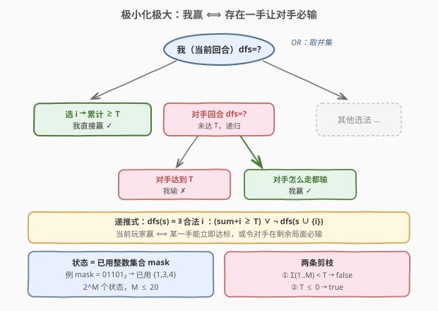
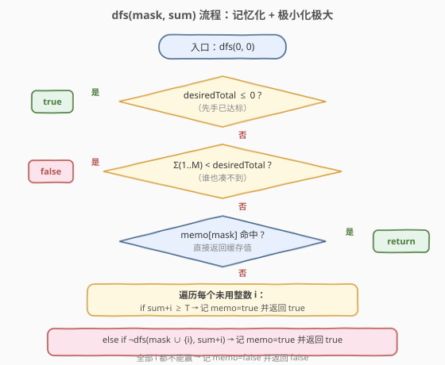
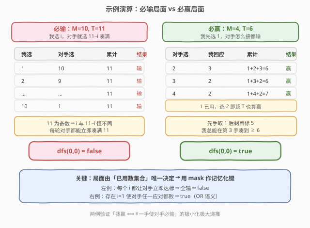

# LeetCode 我能赢吗 题解

## 1. 题目概述

- **标题 / 题号**：我能赢吗（#464，medium）
- **链接**：https://leetcode.cn/problems/can-i-win/
- **难度**：中等
- **标签**：位运算、记忆化搜索、状态压缩、博弈、极小化极大

**题意**：两名玩家轮流从整数池 $\{1, 2, \dots, \text{maxChoosableInteger}\}$ 中**不放回**地抽取一个整数，累加到公共累计和上，**先使累计和达到或超过** `desiredTotal` 的玩家获胜。给定 `maxChoosableInteger`（池中最大数，记为 $M$）和 `desiredTotal`（记为 $T$），若**先手**在双方都采取**最优策略**时能稳赢，返回 `true`，否则返回 `false`。

**示例 1**：

```text
输入：maxChoosableInteger = 10, desiredTotal = 11
输出：false
解释：先手选 1..10 中任意整数 i，后手都能选 11−i 使累计和恰为 11 而获胜。
      （11 为奇数 ⇒ i 与 11−i 恒不相同，后手总能立即凑满。）
```

**示例 2**：

```text
输入：maxChoosableInteger = 10, desiredTotal = 0
输出：true
解释：累计和初值已是 0，先手「已达或超过」目标，直接获胜。
```

**示例 3**：

```text
输入：maxChoosableInteger = 10, desiredTotal = 1
输出：true
解释：先手选 1 即达标。
```

**约束**：

- $1 \leq \text{maxChoosableInteger} \leq 20$
- $0 \leq \text{desiredTotal} \leq 300$

> ⚠️ **关键信号**：$M \leq 20$ 是**状态压缩（bitmask）**的标志性数据范围——$2^{20} \approx 10^6$ 个状态，恰好落在「可以枚举所有已用集合」的甜区。叠加「轮流博弈 + 最优策略」即指向**极小化极大 + 位掩码记忆化**。

## 2. 解题思路

### 2.1 暴力思路：枚举博弈树

把每一轮的「选哪个数」展开成一棵博弈树：先手有 $M$ 个分支，每个分支下后手有 $M-1$ 个分支……最坏到 $M!$ 个叶子。$M=20$ 时 $20! \approx 2.4 \times 10^{18}$，完全不可行。但**同一「已用集合」可以从不同顺序到达**（先选 1 再选 2，与先选 2 再选 1，都到 $\{1,2\}$），因此存在大量重复子问题——这正是记忆化的用武之地。

### 2.2 核心观察：极小化极大 + 位掩码记忆化



把局面用一个 $M$ 位的二进制整数 `mask` 编码：第 $j$ 位（0-indexed）为 `1` 表示数字 $j+1$ **已被取走**。于是状态空间是 $\{0,1,\dots,2^M-1\}$，至多 $2^{20}$ 个。

定义：

$$
\text{dfs}(\text{mask}) = \text{「当前轮到的玩家能否在局面 mask 下稳赢」}
$$

> 💡 **状态为何只需 `mask` 一维？** 累计和 $\text{sum}$ 似乎也是必要信息，但它**由 `mask` 唯一确定**——$\text{sum}(\text{mask}) = \sum_{j:\,\text{mask 第 }j\text{ 位}=1}(j+1)$。因此 `mask` 已是完整状态描述符，记忆化键只需 `mask`。代码里把 `sum` 当参数透传，仅为**避免每次重算**，并非独立维度。

**极小化极大递推**（当前玩家视角，因可主动选择故为 **OR** 节点）：

$$
\text{dfs}(\text{mask}) = \exists\, i \notin \text{mask}:\ \bigl(\text{sum}+i \geq T\bigr)\ \lor\ \bigl(\lnot\,\text{dfs}(\text{mask}\cup\{i\})\bigr)
$$

两种「赢」的来源：

1. **当手达标**：选 $i$ 后累计和 $\geq T$，立即获胜；
2. **对手必输**：选 $i$ 后未达标，但递归发现对手在 $\text{mask}\cup\{i\}$ 下无法稳赢（$\text{dfs} = \text{false}$），则我必赢。

若**所有**合法 $i$ 都不能赢，则当前玩家必输（返回 `false`）。

**两条前置剪枝**（$O(1)$ 拦掉无意义搜索）：

- $T \leq 0$：累计和初值 $0$ 已达标，先手直接赢 → `true`（示例 2）；
- $\sum_{k=1}^{M} k = \dfrac{M(M+1)}{2} < T$：两人把池子抽干也凑不到 $T$，无人能赢 → `false`。

> ⚠️ 第二条剪枝不仅是优化，更明确「无人获胜」的语义：若不剪，DFS 会把全部 $2^M$ 个状态搜完才返回 `false`，虽答案正确但浪费；剪掉后变成 $O(1)$。

### 2.3 算法流程图



流程自顶向下：先过两条剪枝，再进 `dfs(mask, sum)`。`dfs` 先查 `memo[mask]` 命中则直接返回；否则遍历每个未用整数 $i$——「当手达标」或「对手递归返回 `false`」即记 `memo[mask]=true` 并返回 `true`；所有 $i$ 都不成则记 `false` 返回。

### 2.4 示例演算

用两个小例子对照「必输」与「必赢」两类局面：



| 局面 | 推演 | 结论 |
|------|------|------|
| $M=10,\ T=11$（示例 1） | 先手选任意 $i\in[1,10]$，后手选 $11-i$（$11$ 奇 ⇒ $i\neq 11-i$，恒可用）累计即 $11$，后手立即赢。每个 $i$ 都让后手达标 ⇒ 先手全输 | `false` |
| $M=4,\ T=6$ | 先手选 $1$（累计 $1$，剩目标 $5$）。后手选 $2/3/4$ 任一，先手都能在第三手凑到 $\geq 6$：后手 $2\to$我 $3$（$6$）；后手 $3\to$我 $2$（$6$）；后手 $4\to$我 $2$（$7$）。存在 $i=1$ 使后手任一应对都败 ⇒ 先手赢 | `true` |

> 💡 左例体现 **OR 语义失效**（没有一个 $i$ 能让对手必输 → `false`）；右例体现 **OR 语义命中**（存在 $i=1$ 使对手必输 → `true`）。这正是极小化极大「**我赢 ⟺ ∃ 一手使对手必输**」的核心。

## 3. 参考代码

### C++

```cpp
class Solution {
    unordered_map<int, bool> memo;
    int M, T;
  public:
    bool canIWin(int maxChoosableInteger, int desiredTotal) {
        if (desiredTotal <= 0) return true;                       // 剪枝 ①
        int total = maxChoosableInteger * (maxChoosableInteger + 1) / 2;
        if (total < desiredTotal) return false;                   // 剪枝 ②
        M = maxChoosableInteger;
        T = desiredTotal;
        return dfs(0, 0);
    }
  private:
    bool dfs(int mask, int sum) {
        if (memo.count(mask)) return memo[mask];                  // 记忆化命中
        for (int i = 1; i <= M; ++i) {
            int bit = 1 << (i - 1);
            if (mask & bit) continue;                             // 已用
            if (sum + i >= T) return memo[mask] = true;           // 当手达标 → 赢
            if (!dfs(mask | bit, sum + i)) return memo[mask] = true; // 对手必输 → 赢
        }
        return memo[mask] = false;                                // 全部 i 都不成 → 输
    }
};
```

### Python

```python
from functools import lru_cache

class Solution:
    def canIWin(self, maxChoosableInteger: int, desiredTotal: int) -> bool:
        if desiredTotal <= 0:
            return True                                   # 剪枝 ①
        total = maxChoosableInteger * (maxChoosableInteger + 1) // 2
        if total < desiredTotal:
            return False                                  # 剪枝 ②

        @lru_cache(None)
        def dfs(mask: int, cur: int) -> bool:
            for i in range(1, maxChoosableInteger + 1):
                bit = 1 << (i - 1)
                if mask & bit:
                    continue                              # 已用
                if cur + i >= desiredTotal:              # 当手达标 → 赢
                    return True
                if not dfs(mask | bit, cur + i):         # 对手必输 → 赢
                    return True
            return False                                  # 全部 i 都不成 → 输

        return dfs(0, 0)
```

> ⚠️ **易错点**：
> 1. **两条剪枝必须先判**：`T ≤ 0` 要在 `total < T` 之前，否则 `T=0` 时 `total < 0` 恒不成立，虽不影响结果但语义混乱；`total < T` 不剪会让 DFS 搜遍 $2^M$ 个状态才返回 `false`。
> 2. **记忆化键是 `mask` 而非 `(mask, sum)`**：`sum` 由 `mask` 唯一确定（已用数之和），用 `mask` 作键既正确又省空间。代码里把 `sum`/`cur` 当参数只是为了在递归时增量维护、免去每次从 `mask` 重新求和，**不是**独立状态维度。若误把 `(mask, sum)` 当键，缓存命中率不变但浪费空间，且易让人误以为状态是二维。
> 3. **「当手达标」用 `>=`**：题面是「达到**或超过**」，故 `sum + i >= T`；若误写成 `==` 会漏掉「超过」的获胜情形。
> 4. **C++ `1 << (i-1)` 在 `M=20` 时最大 `1<<19`**，不越 `int`；但若题面改为 $M$ 更大需改 `long long`。本题 $M\leq 20$ 安全。

## 4. 复杂度分析

| 维度 | 复杂度 | 说明 |
|------|--------|------|
| 时间复杂度 | $O(2^M \cdot M)$ | 至多 $2^M$ 个 `mask` 状态，每个状态枚举 $M$ 个候选数；实际可达状态远少于 $2^M$（博弈早终），常数很小 |
| 空间复杂度 | $O(2^M)$ | `memo` 表条目数 $\leq 2^M$；递归栈深 $\leq M$ |

$M=20$ 时上界约 $2^{20}\times 20 \approx 2.1\times 10^7$ 次操作，C++ 毫秒级，Python 加 `@lru_cache` 也可在时限内。绝大多数对局因「当手达标」提前终止，真实递归调用数远小于理论上界。

> 💡 若把 `unordered_map` 换成 `vector<char>(1<<M, -1)`（用 `-1/0/1` 表示未算/假/真），可省去哈希开销、常数更小，是工程化优化。这里用 `unordered_map` 仅为代码简洁。

## 5. 扩展：α-β 剪枝与「状态等价」优化

- **α-β 剪枝**：极小化极大天然可叠加 α-β 剪枝——一旦找到一条「对手必输」的分支即可立即返回 `true`，无需遍历其余 $i$。上面的代码其实**已经隐含了这一点**：`if (!dfs(...)) return true;` 命中即返回，等价于 α-β 中「找到优于当前最好值就剪枝」。对「必输」局面才需遍历全部 $i$ 确认无解。
- **必胜步优先**：枚举 $i$ 时从大到小试，更易先碰到「当手达标」或「让对手被动」的强手，提前命中返回，进一步压缩实际搜索量。
- **状态等价压缩**：本题每个数各异，`mask` 已是最简状态。若题面改为「多个相同数字」（如多堆 Nim），可用「堆大小多元组」或 SG 值压缩状态空间，思路承接 [292. Nim 游戏](https://leetcode.cn/problems/nim-game/)。

## 6. 面试要点

1. **为什么状态只需 `mask` 一维，`sum` 不是独立维度？**
   - `sum` = `mask` 中置位对应的数字之和，由 `mask` 唯一确定。把 `sum` 当参数透传是为 $O(1)$ 增量维护而非重新求和，记忆化键仍只需 `mask`。若把 `(mask, sum)` 当键不仅浪费空间，还掩盖了「状态已完整」这一关键观察。

2. **极小化极大里「我」是 OR 还是 AND 节点？为什么？**
   - 「我」是 **OR** 节点——我主动选最优手，**只要存在一条**让我赢的分支即返回 `true`。相应地「对手」节点从我的视角看是 **AND**（对手选最劣于我的手，需**所有**分支都对我有利我才稳赢）；代码里通过 `¬dfs(对手局面)` 把对手的 OR 翻转成对我的 AND，省去显式区分。

3. **两条剪枝各自的作用？漏掉会怎样？**
   - `T ≤ 0 → true`：处理先手「未走已达标」边界（示例 2），不剪则 DFS 仍会在首个 $i$ 命中 `sum+i>=T` 返回 `true`，结果正确但多一次调用。
   - `total < T → false`：处理「池子抽干也凑不到」的必败局面。不剪则 DFS 会搜遍全部 $2^M$ 状态才返回 `false`，$M=20$ 时仍能过但严重浪费时间；剪掉后变 $O(1)$。

4. **为什么说「博弈早终」让实际状态远少于 $2^M$？**
   - 一旦某手使累计和 $\geq T$ 立即返回，搜索树被大幅截断。只有「双方互不让对方达标」的拉锯局面才会深入；最坏情况（$T$ 略大于 `total/2`）才会逼近 $2^M$，但即便如此也在时限内。

5. **能否不用记忆化、纯回溯？**
   - $M\leq 20$ 时纯回溯最坏 $M!$，必超时。记忆化把重复子问题（同一 `mask` 的不同到达顺序）合并，是本题从 $M!$ 降到 $O(2^M\cdot M)$ 的关键，不可省。

6. **和区间 DP 型博弈（如 877 石子游戏）有何区别？**
   - 877 的状态是「连续区间 `[l,r]`」，因为取端点后子问题是更短的连续区间；本题的「池」是离散集合、取走任意一个，子问题是「更小的任意子集」，故状态用 `mask` 而非区间端点。两者都是极小化极大，**状态定义由「合法移动如何切割剩余结构」决定**。

## 同类练习题

| # | 题目 | 与本题的关联 |
|---|------|-------------|
| 292 | [Nim 游戏](https://leetcode.cn/problems/nim-game/)（[题解](../0201-0300/292_Nim游戏.md)） | 博弈论入门，用「必胜态/必败态」转化（能转移到必败态即必胜），思路承接本题的极小化极大 |
| 877 | [石子游戏](https://leetcode.cn/problems/stone-game/)（[题解](../0801-0900/877_石子游戏.md)） | 博弈型**区间 DP**，状态是连续区间 `[l,r]`，对比本题的「离散集合 mask」状态定义 |
| 486 | [预测赢家](https://leetcode.cn/problems/predict-the-winner/) | 同为极小化极大博弈，区间 DP 版本（取两端），可作为 877 的等价练习 |
| 526 | [优美的排列](https://leetcode.cn/problems/beautiful-arrangement/)（[题解](../0501-0600/526_优美的安排.md)） | `mask` + 记忆化搜索的**计数型**状压 DP，与本题同模板、不同目标（计数 vs 博弈判定） |
| 698 | [划分为 K 个相等的子集](https://leetcode.cn/problems/partition-to-k-equal-sum-subsets/)（[题解](../0601-0700/698_划分为K个相等的子集.md)） | `mask` + 回溯/状压 DP 的「子集划分」型，进一步熟悉位掩码状态设计 |
