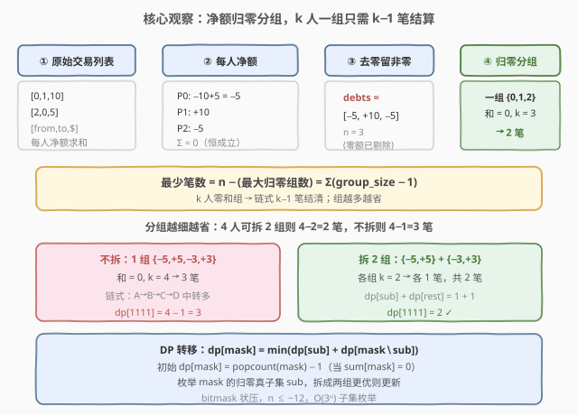
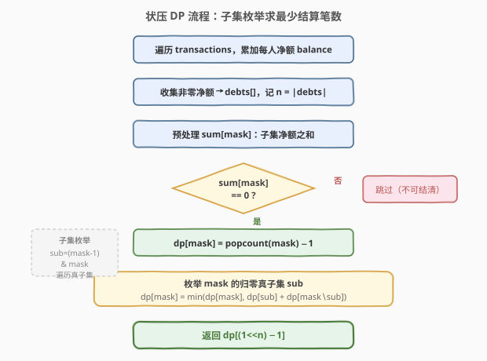
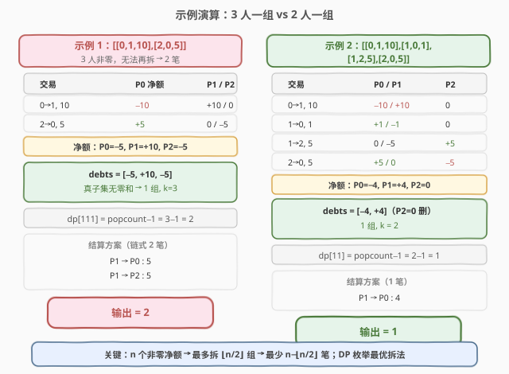

# LeetCode 最优账单平衡 题解

## 1. 题目概述

- **标题 / 题号**：最优账单平衡（#465，hard）
- **链接**：https://leetcode.cn/problems/optimal-account-balancing/
- **难度**：困难
- **标签**：位运算、数组、动态规划、回溯、位掩码

**题意**：给定一组朋友之间的借贷交易列表 `transactions`，其中 `transactions[i] = [from_i, to_i, amount_i]` 表示 `from_i` 给了 `to_i` 金额 `amount_i`。这些交易产生了人与人之间的净借贷关系。请返回**结清所有债务所需的最少交易笔数**。

**示例 1**：

```text
输入：transactions = [[0,1,10],[2,0,5]]
输出：2
解释：
  0 给了 1 共 10  → 0 净额 −10，1 净额 +10
  2 给了 0 共 5   → 2 净额 −5，0 净额 +5
  最终净额：P0 = −5, P1 = +10, P2 = −5
  结清方案：P1 → P0 支付 5，P1 → P2 支付 5，共 2 笔。
```

**示例 2**：

```text
输入：transactions = [[0,1,10],[1,0,1],[1,2,5],[2,0,5]]
输出：1
解释：
  逐笔累加后净额：P0 = −4, P1 = +4, P2 = 0
  P2 已归零无需参与；只需 P1 → P0 支付 4，共 1 笔。
```

**约束**：

- $1 \leq \text{transactions.length} \leq 10$
- `transactions[i].length == 3`
- $0 \leq \text{from\_i}, \text{to\_i} \leq 99$
- $\text{from\_i} \neq \text{to\_i}$
- $1 \leq \text{amount\_i} \leq 100$

> ⚠️ **关键信号**：交易数 $\leq 10$，涉及人数 $\leq 20$，去掉净额为零者后 $n$（非零净额人数）通常 $\leq 12$。这恰好落在**状压 DP（bitmask）**的甜区——$2^n$ 个子集可枚举，子集划分 $O(3^n)$ 可接受。叠加「分组使每组之和为零」的目标即指向**子集状压 DP**。

## 2. 解题思路

### 2.1 暴力思路：枚举所有结算配对

对 $n$ 个非零净额的人，尝试所有可能的结算配对方案——每笔结算选两人（一正一负）相互抵消。这等价于在 $n$ 个节点上枚举所有可能的「匹配/链」结构，搜索空间是排列级别 $O(n!)$，$n = 12$ 时 $12! \approx 4.8 \times 10^8$ 不可行。

核心问题在于：**同一组净额归零的人，无论以何种顺序结算，所需笔数恒为 $k-1$**（$k$ 为组内人数），因此不必枚举顺序，只需决定**如何分组**。

### 2.2 核心观察：净额归零分组 + 状压 DP



整体分两步走：

**第一步——净额化简**：把所有交易压缩成每人的净额 `balance[p]`（给出为负、收到为正），再剔除净额为零者，得到非零净额列表 `debts`。此时 $\sum \text{debts} = 0$ 恒成立（总借贷守恒）。

**第二步——最优分组**：把 `debts` 划分成若干**组和为零**的子集。关键定理：

> 💡 **$k$ 人零和组只需 $k-1$ 笔结算**：将组内 $k$ 个人按任意顺序排成链，每人把应付款交给下一人，最后一人的应收恰好为零。因此一组 $k$ 人 $\to$ $k-1$ 笔。

于是：

$$
\text{最少笔数} = \sum_{\text{group } g} (|g| - 1) = n - (\text{最大归零组数})
$$

**组数越多越省**——若能把 $n$ 个人拆成更多零和小组，总笔数就越少。这就是一个**子集划分优化问题**：在所有「每组和为零」的划分中，最大化组数（等价于最小化总笔数）。

**状压 DP** 定义：

$$
\text{dp}[\text{mask}] = \text{结清 mask 所代表子集所需的最少笔数}
$$

- 仅当 $\text{sum}[\text{mask}] = 0$ 时 `dp[mask]` 有意义（组内可自洽结清）。
- **初始化**：$\text{dp}[\text{mask}] = \text{popcount}(\text{mask}) - 1$（当作一组结清）。
- **转移**：枚举 `mask` 的归零真子集 `sub`，拆成两组各自结清：

$$
\text{dp}[\text{mask}] = \min\bigl(\text{dp}[\text{mask}],\ \text{dp}[\text{sub}] + \text{dp}[\text{mask} \setminus \text{sub}]\bigr)
$$

> ⚠️ **为什么只需枚举归零子集？** 若 $\text{sum}[\text{sub}] \neq 0$，则 `sub` 无法内部结清（`dp[sub] = ∞`），拆分无意义。只看 $\text{sum}[\text{sub}] = 0$ 的子集即可覆盖所有有效划分。

### 2.3 算法流程图



流程自顶向下：

1. **累加净额**：遍历 `transactions`，`from` 方 $-$ `amount`、`to` 方 $+$ `amount`。
2. **收集非零**：把 `balance` 中非零值收入 `debts`，记 $n = |\text{debts}|$。
3. **预处理子集和** `sum[mask]`：利用低位 `low = mask & (-mask)` 增量递推，$O(2^n)$。
4. **DP 主循环**：对每个 `mask`，若 `sum[mask] == 0` 则先置 `dp[mask] = popcount − 1`，再用子集枚举 `sub = (mask-1) & mask` 尝试拆分取更优。
5. **返回** `dp[(1<<n) - 1]`。

### 2.4 示例演算

用两个官方示例对照「3 人无法拆分」与「2 人直接结清」两类情形：



| 示例 | 净额 | debts | 归零子集 | dp 值 | 输出 |
|------|------|-------|----------|-------|------|
| `[[0,1,10],[2,0,5]]` | P0=−5, P1=+10, P2=−5 | `[−5,+10,−5]` | 仅全集 `{0,1,2}`（无真子集和为零） | `dp[111] = 3−1 = 2` | 2 |
| `[[0,1,10],[1,0,1],[1,2,5],[2,0,5]]` | P0=−4, P1=+4, P2=0 | `[−4,+4]` | 仅全集 `{0,1}` | `dp[11] = 2−1 = 1` | 1 |

> 💡 **拆分生效的典型场景**：若 `debts = [−5,+5,−3,+3]`（4 人），则可拆成 `{−5,+5}` 与 `{−3,+3}` 两组，`dp[1111] = dp[0011] + dp[1100] = 1+1 = 2`，比不拆的 `4−1 = 3` 少一笔。这正是 DP 拆分转移的价值所在。

## 3. 参考代码

### C++

```cpp
class Solution {
public:
    int minTransfers(vector<vector<int>>& transactions) {
        unordered_map<int, long long> bal;
        for (auto& t : transactions) {
            bal[t[0]] -= t[2];                 // from 给出 → 净额减少
            bal[t[1]] += t[2];                 // to 收到  → 净额增加
        }
        vector<long long> debts;
        for (auto& [k, v] : bal)
            if (v != 0) debts.push_back(v);    // 剔除净额为零者
        int n = debts.size();
        if (n == 0) return 0;

        int N = 1 << n;
        vector<long long> sumMask(N, 0);       // 子集净额之和
        for (int mask = 1; mask < N; ++mask) {
            int low = mask & (-mask);
            int i = __builtin_ctz(low);        // 最低位 1 的下标
            sumMask[mask] = sumMask[mask ^ low] + debts[i];
        }

        vector<int> dp(N, INT_MAX);
        dp[0] = 0;
        for (int mask = 1; mask < N; ++mask) {
            if (sumMask[mask] != 0) continue;  // 非零和子集不可结清
            dp[mask] = __builtin_popcount(mask) - 1;          // 当作一组
            for (int sub = (mask - 1) & mask; sub > 0; sub = (sub - 1) & mask) {
                if (sumMask[sub] == 0)         // 只考虑归零真子集
                    dp[mask] = min(dp[mask], dp[sub] + dp[mask ^ sub]);
            }
        }
        return dp[N - 1];
    }
};
```

### Python

```python
class Solution:
    def minTransfers(self, transactions: list[list[int]]) -> int:
        from collections import defaultdict
        bal = defaultdict(int)
        for f, t, a in transactions:
            bal[f] -= a                        # from 给出 → 净额减少
            bal[t] += a                        # to 收到  → 净额增加
        debts = [v for v in bal.values() if v != 0]
        n = len(debts)
        if n == 0:
            return 0

        N = 1 << n
        sum_mask = [0] * N                     # 子集净额之和
        for mask in range(1, N):
            low = mask & (-mask)
            i = low.bit_length() - 1           # 最低位 1 的下标
            sum_mask[mask] = sum_mask[mask ^ low] + debts[i]

        dp = [float('inf')] * N
        dp[0] = 0
        for mask in range(1, N):
            if sum_mask[mask] != 0:
                continue                       # 非零和子集不可结清
            dp[mask] = bin(mask).count('1') - 1              # 当作一组
            sub = (mask - 1) & mask
            while sub > 0:                     # 枚举归零真子集
                if sum_mask[sub] == 0:
                    dp[mask] = min(dp[mask], dp[sub] + dp[mask ^ sub])
                sub = (sub - 1) & mask
        return dp[N - 1]
```

> ⚠️ **易错点**：
> 1. **净额方向**：`from` 方减少、`to` 方增加。方向写反不影响结果（整体取负后和仍为零），但会影响调试时可读性，建议固定方向。
> 2. **必须剔除净额为零者**：若把净额为 $0$ 的人留在 `debts` 中，会增加 $n$ 导致 $2^n$ 翻倍，且零值子集会引入大量无意义的拆分。
> 3. **子集枚举写法** `sub = (mask-1) & mask`：这是遍历 `mask` 所有**真子集**的标准位运算技巧，每次 `sub = (sub-1) & mask` 跳到下一个真子集，直到 `sub == 0` 终止。若误写成遍历所有 `sub < mask` 则复杂度退化为 $O(4^n)$。
> 4. **`sum_mask` 增量递推**：用 `low = mask & (-mask)` 取最低位 1，`sum_mask[mask] = sum_mask[mask ^ low] + debts[i]`，避免每次 $O(n)$ 重算。若朴素求和则总复杂度变 $O(n \cdot 2^n + 3^n)$，常数更大。

## 4. 复杂度分析

| 维度 | 复杂度 | 说明 |
|------|--------|------|
| 时间复杂度 | $O(3^n)$ | 子集枚举：对每个 `mask` 枚举其所有真子集，总次数 $\sum_{k=0}^{n} \binom{n}{k} 2^k = 3^n$；预处理 `sum_mask` 为 $O(2^n)$，被 $3^n$ 吸收 |
| 空间复杂度 | $O(2^n)$ | `sum_mask` 与 `dp` 数组各 $2^n$ 长度 |

$n$ 为**非零净额人数**（剔除零额后）。交易数 $\leq 10$ 时 $n$ 通常 $\leq 12$，$3^{12} \approx 5.3 \times 10^5$，毫秒级完成。即便最坏 $n = 20$，因只处理 $\text{sum} = 0$ 的子集（远少于 $2^n$），实际开销也远小于理论上界。

> 💡 **为何 $O(3^n)$？** 对每个大小为 $k$ 的子集，其真子集有 $2^k$ 个。所有子集的真子集总数为 $\sum_{k=0}^{n}\binom{n}{k}2^k = (1+2)^n = 3^n$，这是子集枚举的经典复杂度。

## 5. 扩展：DFS 回溯 + 贪心剪枝

当 $n$ 较大（如 $\geq 15$）时，$O(3^n)$ 的状压 DP 可能偏慢。此时可用 **DFS 回溯**：对第一个非零净额，尝试与每个异号净额配对抵消，递归处理剩余。配合排序与剪枝，实际搜索量远小于理论上界。

```python
class Solution:
    def minTransfers(self, transactions: list[list[int]]) -> int:
        from collections import defaultdict
        bal = defaultdict(int)
        for f, t, a in transactions:
            bal[f] -= a
            bal[t] += a
        debts = sorted(v for v in bal.values() if v != 0)

        def dfs(start: int) -> int:
            while start < len(debts) and debts[start] == 0:
                start += 1                          # 跳过已归零
            if start == len(debts):
                return 0
            res = float('inf')
            for i in range(start + 1, len(debts)):
                if debts[i] * debts[start] < 0:     # 异号才能抵消
                    debts[i] += debts[start]        # 配对抵消
                    res = min(res, 1 + dfs(start + 1))
                    debts[i] -= debts[start]        # 回溯
            return res

        return dfs(0)
```

- **核心思路**：固定处理 `debts[start]`，枚举与它异号的 `debts[i]` 做一次抵消（一笔结算），递归处理 `start+1`。每层至少结清一人，最深 $n$ 层。
- **剪枝**：排序后异号配对更集中；若 `debts[start]` 恰好与某 `debts[i]` 完全抵消（`debts[i] + debts[start] == 0`），优先选此分支可大幅缩小搜索。
- **与状压 DP 的关系**：两者等价地求解「最少笔数」，但 DFS 无需预处理 $2^n$ 数组、空间 $O(n)$；状压 DP 复杂度确定 $O(3^n)$、无重复搜索。$n \leq 12$ 用状压 DP 更稳，$n$ 更大用 DFS 回溯更灵活。

## 6. 面试要点

1. **为什么 $k$ 人零和组只需 $k-1$ 笔？**
   - 将组内 $k$ 人按任意顺序排成链 $p_1 \to p_2 \to \cdots \to p_k$，每人把自身净额（正为应收、负为应支）转移给下一人：$p_1$ 付 $|d_1|$ 给 $p_2$，$p_2$ 的净额变为 $d_2 - |d_1|$ 再付给 $p_3$……因组和为零，最后一人的应收恰为零。共 $k-1$ 笔。少于 $k-1$ 笔无法连通 $k$ 人，故为下界。

2. **为什么拆成更多组更省？**
   - 总笔数 $= \sum(|g_i| - 1) = n - \text{组数}$。$n$ 固定，组数越多笔数越少。因此目标是**最大化归零组数**，即把 `debts` 尽可能细地拆成零和子集。

3. **子集枚举 `sub = (mask-1) & mask` 的原理？**
   - `mask - 1` 使 `mask` 最低位的 1 变 0、其下所有位变 1，再 `& mask` 截断到 `mask` 的子集范围内，得到按字典序递减的下一个真子集。循环到 `sub == 0` 恰好遍历 `mask` 的所有 $2^{|mask|} - 1$ 个真子集，无遗漏无重复。

4. **为什么只处理 `sum[mask] == 0` 的子集？**
   - 非零和子集无法内部结清（`dp = ∞`），拆分时 `dp[sub] + dp[rest]` 中只要一项为 $\infty$ 就不会更新最小值。跳过它们既正确又省时——实际处理的子集数远少于 $2^n$。

5. **净额为零者为什么要剔除？**
   - 净额为零意味着此人已收支平衡，不参与任何结算。若留在 `debts` 中，不仅无意义地增大 $n$（使 $2^n$、$3^n$ 翻倍），还会产生含零值的子集干扰拆分。

6. **状压 DP 和 DFS 回溯如何选择？**
   - $n \leq 12$ 优先状压 DP：复杂度确定 $O(3^n)$、无重复计算、代码清晰。$n$ 更大或内存受限时用 DFS 回溯：空间 $O(n)$、配合剪枝实际搜索量可控。两者求解目标完全一致。

## 同类练习题

| # | 题目 | 与本题的关联 |
|---|------|-------------|
| 698 | [划分为 K 个相等的子集](https://leetcode.cn/problems/partition-to-k-equal-sum-subsets/) | 同为 `mask` + 子集划分状压 DP，把数组分成 K 个等和子集，核心是「子集和判定 + 状态转移」，与本题的「归零分组」同模板 |
| 526 | [优美的排列](https://leetcode.cn/problems/beautiful-arrangement/)（[题解](../0501-0600/526_优美的安排.md)） | `mask` 状压 + 记忆化的计数型 DP，与本题同属位掩码状态空间设计，对比「计数」与「最优化」两类目标 |
| 464 | [我能赢吗](https://leetcode.cn/problems/can-i-win/)（[题解](../0401-0500/464_我能赢吗.md)） | $M \leq 20$ 的 `mask` 状压 + 记忆化搜索，博弈型判定，对比本题的「最优化」vs「可行性」 |
| 416 | [分割等和子集](https://leetcode.cn/problems/partition-equal-subset-sum/)（[题解](../0401-0500/416_分割等和子集.md)） | 0-1 背包判定能否分成两个等和子集，是本题「子集和为零」的单组退化版 |
| 1497 | [检查数组对是否可以被 k 整除](https://leetcode.cn/problems/check-if-array-pairs-are-divisible-by-k/) | 按余数配对分组，思路承接本题「净额配对抵消」的分组思想 |
