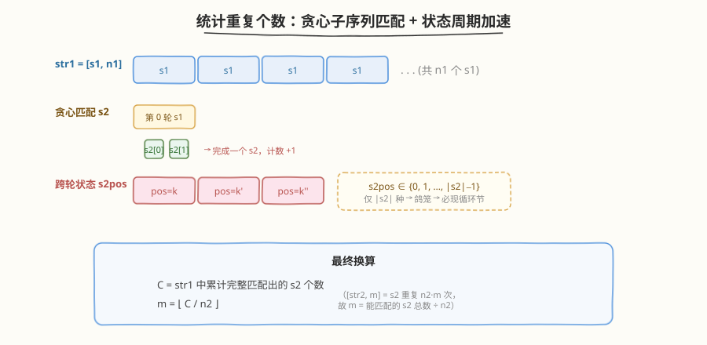
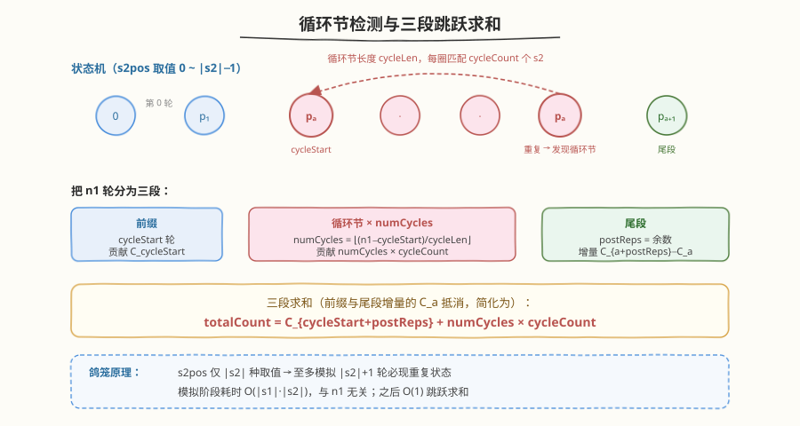
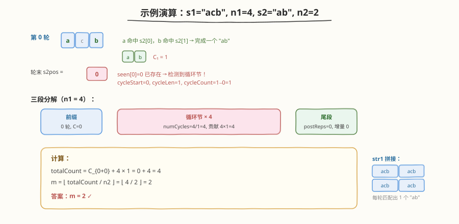

# LeetCode 统计重复个数 题解

## 1. 题目概述

- **标题 / 题号**：统计重复个数（#466，hard）
- **链接**：https://leetcode.cn/problems/count-the-repetitions/
- **难度**：困难
- **标签**：字符串、动态规划、循环节、子序列匹配

**题意**：定义 `str = [s, n]` 表示 `str` 由 `n` 个字符串 `s` 顺序连接而成（即 `s` 重复 `n` 次）。若**从 `s2` 中删除若干字符**（不改变剩余字符顺序）能得到 `s1`，则称 `s1` 可由 `s2` 获得，等价于 **`s1` 是 `s2` 的子序列**。

现给定 `s1`、`s2` 和整数 `n1`、`n2`，构造：

$$\text{str1} = [s1, n1] = \underbrace{s1\,s1\,\cdots\,s1}_{n1 \text{ 次}}, \qquad \text{str2} = [s2, n2] = \underbrace{s2\,s2\,\cdots\,s2}_{n2 \text{ 次}}$$

求**最大整数 `m`**，满足 $[\text{str2}, m]$（即 `str2` 重复 `m` 次，等价于 `s2` 重复 $n2 \times m$ 次）可由 `str1` 获得。

**示例 1**：

```text
输入：s1 = "acb", n1 = 4, s2 = "ab", n2 = 2
输出：2
解释：str1 = "acb"×4 = "acbacbacbacb"，str2 = "ab"×2 = "abab"。
      m=2 时 [str2, 2] = "abababab"（8 个字符），可从 str1 中按下标
      0,2,3,5,6,8,9,11 取出 "a b a b a b a b" 获得，故 m=2 可行。
      m=3 需要 12 个字符但 str1 中只有 4 个 a 与 4 个 b，不足，故答案为 2。
```

**示例 2**：

```text
输入：s1 = "acb", n1 = 1, s2 = "acb", n2 = 1
输出：1
解释：str1 = "acb"，str2 = "acb"，m=1 时 [str2,1]="acb" 恰为 str1 本身。
```

**约束**：

- $1 \le \text{s1.length}, \text{s2.length} \le 100$
- `s1`、`s2` 仅由小写英文字母组成
- $1 \le n1, n2 \le 10^6$

> ⚠️ `n1`、`n2` 可达 $10^6$，而 `s1`、`s2` 长度仅 100。若直接展开 `str1`（长度可达 $10^8$）做暴力子序列匹配必超时，必须利用「**重复结构**」加速。

## 2. 解题思路

### 2.1 暴力思路

最朴素的做法：把 `str1` 和目标串 `s2 × (n2·m)` 都显式展开，然后用双指针判定子序列。但 `str1` 长度可达 $10^6 \times 100 = 10^8$，光构造字符串就已超时；且 `m` 未知需二分/递增尝试，每次判定又是 $O(|\text{str1}|)$，完全不可行。

退一步——**不展开 `str1`**，而是逐个 `s1` 重复地贪心匹配 `s2`：维护「当前要匹配 `s2` 的第几位」，扫一遍 `s1` 能匹配多少算多少，完整匹配一个 `s2` 就计数 `+1` 并回到 `s2` 第 0 位继续。这样处理 $n1$ 个 `s1` 的时间是 $O(|s1| \cdot n1) = 10^8$，仍偏大。关键在于 $n1$ 太大，但**状态空间极小**——引出循环节优化。

### 2.2 核心观察：状态周期加速



把「逐个 `s1` 重复地贪心匹配 `s2`」抽象为一个**状态机**：

- **状态** = 当前要匹配 `s2` 的第几位，取值 $0, 1, \dots, |s2|-1$，共 $|s2|$ 种
- **转移** = 处理一整个 `s1`：从状态 $p$ 出发，贪心扫描 `s1` 的每个字符，匹配上的就推进 `s2` 指针，完整匹配一轮就计数 `+1` 并重置为 `0`，最终落在新状态 $p'$
- **转移函数只依赖 $p$**（`s1`、`s2` 固定），与是第几轮无关

由**鸽笼原理**，从初始状态 $0$ 出发，经过至多 $|s2|+1$ 轮 `s1`，必有某个状态**重复出现**——一旦状态重复，后续转移便进入**循环节**，无限循环下去。

> 💡 **为什么状态只有 $|s2|$ 种？** 因为每轮 `s1` 结束后，唯一「跨轮保留」的信息就是「`s2` 匹配到一半停在第几位」。这一位取值 $\in [0, |s2|)$，状态空间 $O(|s2|)$，所以至多 $|s2|+1$ 轮必现循环。这正是 $n1$ 虽大但可 $O(|s1|\cdot|s2|)$ 求解的根因。

### 2.3 算法流程：检测循环节 + 跳跃求和



设第 $k$ 轮 `s1`（$k$ 从 $0$ 起）**开始时**的状态为 $p_k$，$k$ 轮结束后累计匹配出的 `s2` 个数为 $C_k$（$C_0 = 0$）。

**步骤 1：逐轮模拟 + 记录状态**

用一个哈希表 `seen` 记录「状态 $p_k \to$ 轮号 $k$」。从 $k=0$（$p_0=0$）开始，每轮：

1. 贪心扫描一遍 `s1`，更新 `s2pos` 与 `s2count`
2. $k \mathrel{+}= 1$，记录 $C_k = \text{s2count}$
3. 若新状态 `s2pos` 已在 `seen` 中出现（设上次出现在轮 `cycleStart`），则发现循环节：
   - **循环节长度** $\text{cycleLen} = k - \text{cycleStart}$
   - **每个循环节匹配的 `s2` 数** $\text{cycleCount} = C_k - C_{\text{cycleStart}}$
   - 跳出模拟

**步骤 2：用循环节跳跃求和**

将 $n1$ 轮分为三段：

| 段 | 轮数 | 贡献的 `s2` 数 |
|----|------|----------------|
| **前缀**（循环节之前） | `cycleStart` | $C_{\text{cycleStart}}$ |
| **循环节** × `numCycles` 轮 | $\text{numCycles} = \left\lfloor\dfrac{n1 - \text{cycleStart}}{\text{cycleLen}}\right\rfloor \times \text{cycleLen}$ | $\text{numCycles} \times \text{cycleCount}$ |
| **尾段**（余下的几轮，状态同 `cycleStart`） | $\text{postReps} = (n1 - \text{cycleStart}) \bmod \text{cycleLen}$ | $C_{\text{cycleStart} + \text{postReps}} - C_{\text{cycleStart}}$ |

三者求和得总匹配数：

$$\text{totalCount} = C_{\text{cycleStart} + \text{postReps}} + \text{numCycles} \times \text{cycleCount}$$

（前缀贡献 $C_{\text{cycleStart}}$ 与尾段增量中的 $-C_{\text{cycleStart}}$ 抵消，故简化为上式。）

**步骤 3：换算 `m`**

$$\boxed{m = \left\lfloor \dfrac{\text{totalCount}}{n2} \right\rfloor}$$

因为 `str2` 重复 `m` 次等价于 `s2` 重复 $n2 \cdot m$ 次，故 $m = \lfloor \text{totalCount} / n2 \rfloor$。

> ⚠️ **快速排除**：若 `s2` 中存在 `s1` 没有的字符，则一个完整的 `s2` 永远无法匹配，直接返回 `0`。这既是对拍第一个边界用例的来源，也避免了无意义的模拟。

### 2.4 示例演算

以示例 1 为例：`s1="acb"`, `n1=4`, `s2="ab"`, `n2=2`。



逐轮跟踪（`s2pos` = 本轮开始时要匹配的 `s2` 下标，`C` = 累计 `s2` 数）：

| 轮号 $k$ | 本轮 `s1` | 匹配过程 | 轮末 `s2pos` | $C_k$ | 说明 |
|-----------|-----------|----------|--------------|-------|------|
| 0 | `acb` | `a`(命中 s2[0]) → `c`(跳过) → `b`(命中 s2[1]，完成一轮) | 0 | 1 | 首轮即完整匹配一个 `s2` |
| — | — | `seen[0]=0` 已存在 | — | — | **检测到循环节**：`cycleStart=0`, `cycleLen=1`, `cycleCount=1-0=1` |

循环节参数：`cycleStart=0`, `cycleLen=1`, `cycleCount=1`。

- `remaining = 4 - 0 = 4`
- `numCycles = 4 / 1 = 4`，`postReps = 4 % 1 = 0`
- $\text{totalCount} = C_{0+0} + 4 \times 1 = 0 + 4 = 4$
- $m = \lfloor 4 / 2 \rfloor = 2$ ✓

## 3. 参考代码

### C++

```cpp
class Solution {
public:
    int getMaxRepetitions(string s1, int n1, string s2, int n2) {
        int len2 = s2.size();
        // 快速排除：s2 含 s1 没有的字符 → 永远无法完整匹配一个 s2
        int inS1[26] = {0};
        for (char c : s1) inS1[c - 'a'] = 1;
        for (char c : s2)
            if (!inS1[c - 'a']) return 0;

        // countAfter[k] = 前 k 轮 s1 累计匹配出的 s2 个数（countAfter[0]=0）
        vector<int> countAfter = {0};
        unordered_map<int, int> seen;   // 轮开始时的 s2pos → 轮号 k
        seen[0] = 0;

        int s2count = 0, s2pos = 0, k = 0;
        int cycleStart = -1, cycleLen = 0, cycleCount = 0;

        while (k < n1) {
            for (char c : s1) {                 // 贪心扫描一轮 s1
                if (c == s2[s2pos]) {
                    if (++s2pos == len2) { s2pos = 0; s2count++; }
                }
            }
            ++k;
            countAfter.push_back(s2count);
            if (seen.count(s2pos)) {            // 状态重复 → 发现循环节
                cycleStart = seen[s2pos];
                cycleLen   = k - cycleStart;
                cycleCount = s2count - countAfter[cycleStart];
                break;
            }
            seen[s2pos] = k;
        }

        if (cycleStart == -1) return s2count / n2;   // n1 太小，未现循环节

        int remaining = n1 - cycleStart;
        int numCycles = remaining / cycleLen;
        int postReps  = remaining % cycleLen;
        int totalCount = countAfter[cycleStart + postReps] + numCycles * cycleCount;
        return totalCount / n2;
    }
};
```

### Python

```python
class Solution:
    def getMaxRepetitions(self, s1: str, n1: int, s2: str, n2: int) -> int:
        len2 = len(s2)
        # 快速排除：s2 含 s1 没有的字符
        if not set(s2).issubset(set(s1)):
            return 0

        count_after = [0]          # count_after[k] = 前 k 轮累计匹配的 s2 数
        seen = {0: 0}              # 轮开始时的 s2pos -> 轮号 k
        s2count = 0
        s2pos = 0
        k = 0
        cycle_start = -1

        while k < n1:
            for ch in s1:          # 贪心扫描一轮 s1
                if ch == s2[s2pos]:
                    s2pos += 1
                    if s2pos == len2:
                        s2pos = 0
                        s2count += 1
            k += 1
            count_after.append(s2count)
            if s2pos in seen:      # 状态重复 -> 发现循环节
                cycle_start = seen[s2pos]
                cycle_len = k - cycle_start
                cycle_count = s2count - count_after[cycle_start]
                break
            seen[s2pos] = k

        if cycle_start == -1:      # n1 太小，未现循环节
            return s2count // n2

        remaining = n1 - cycle_start
        num_cycles = remaining // cycle_len
        post_reps = remaining % cycle_len
        total = count_after[cycle_start + post_reps] + num_cycles * cycle_count
        return total // n2
```

## 4. 复杂度分析

| 维度 | 复杂度 | 说明 |
|------|--------|------|
| 时间复杂度 | $O(|s1| \cdot |s2|)$ | 至多模拟 $|s2|+1$ 轮 `s1` 即发现循环节（鸽笼原理），每轮 $O(|s1|)$；之后 $O(1)$ 跳跃求和 |
| 空间复杂度 | $O(|s2|)$ | `seen` 哈希表与 `countAfter` 数组至多存 $|s2|+2$ 项 |

> 💡 与 $n1$、$n2$ 无关——这正是循环节优化的威力：把 $O(|s1| \cdot n1)$ 压到 $O(|s1| \cdot |s2|)$，$n1=10^6$ 也只需约 $100 \times 100 = 10^4$ 次操作。

## 5. 扩展：循环节思想与同类问题

「**状态空间小 + 转移确定性 → 必现循环节**」是一类通用思想，常见于「重复执行某操作很多次」的题目：

- **关键判据**：若操作每轮的「跨轮残留信息」只有有限种取值（状态空间 $S$），则至多 $|S|+1$ 轮后必进入循环。
- **通用套路**：模拟 + 记录状态首次出现位置 → 检测循环节 → 前缀 + 循环 × numCycles + 尾段 三段求和。

> ⚠️ 另一种等价写法是**预处理转移表**：对每个起始状态 $p \in [0, |s2|)$，预算「一轮 `s1` 后的新状态与匹配数」，得到一张 $|s2|$ 项的转移表，再用倍增 / 循环节跳转。本质相同，只是把「在线检测」改成「离线预算」。

## 6. 面试要点

1. **为什么「贪心匹配」是对的？为什么不用 DP 求最长公共子序列？**

   - 题目问的是 `s2` 重复若干次能否作为 `str1` 的子序列，是**判定+计数**而非求最长。对子序列匹配而言，**贪心匹配**（能匹配就匹配，不回头）是最优的：尽早匹配完当前字符，给后续字符留更多机会，不会比任何其他策略差。DP（LCS 那套 $O(nm)$ 二维表）在这里既慢又无必要。

2. **状态为什么定义为「`s2` 的匹配位置」而不是「`s1` 的扫描位置」？**

   - 因为 `str1` 是 `s1` 重复 $n1$ 次，每轮 `s1` 都从头扫到尾，**`s1` 内部的扫描位置不跨轮保留**；唯一跨轮保留的是「`s2` 匹配到一半停在第几位」。这个位置只有 $|s2|$ 种取值，是循环节得以出现的前提。若状态包含 `s1` 位置则状态空间 $O(|s1| \cdot |s2|)$，虽也能做但不如只看 `s2pos` 简洁。

3. **循环节的「前缀 + 循环 + 尾段」三段法怎么理解？**

   - 状态从 $p_0=0$ 出发，前若干轮可能不立即进入循环（前缀），之后状态 $p_a$ 重复出现形成闭环（循环节），$n1$ 轮里循环若干整圈后可能还剩几轮零头（尾段）。尾段的状态序列与循环节开头完全一致（同一闭环），所以尾段增量 = $C_{\text{cycleStart}+\text{postReps}} - C_{\text{cycleStart}}$，可直接查表。

4. **`s2` 含 `s1` 没有的字符时返回 0，会不会误判？**

   - 不会。若 `s2` 有 `s1` 不含的字符，则该字符永远无法被匹配，`s2pos` 卡在该字符前不动，一个完整 `s2` 都匹配不出，`totalCount=0`，`m=0`。快速排除只是省去无意义的模拟，结论一致。但反过来不成立——`s2` 字符集是 `s1` 子集时也可能匹配数为 0（如 `s1="ab"`, `s2="aba"`，单轮 `s1` 只够匹配一个 `ab`，`aba` 匹配不出，需多轮累积），所以排除只是优化不是判定。

5. **`n1` 很小（如 `n1=1`）没出现循环节怎么办？**

   - `while` 循环跑满 `n1` 轮仍未检测到状态重复时，`cycleStart` 保持 `-1`，直接返回 `s2count / n2`。此时 $n1 \le |s2|+1$，$O(|s1| \cdot n1)$ 本就很小的常数，无需循环节加速。

## 同类练习题

| # | 题目 | 与本题的关联 |
|---|------|-------------|
| 166 | [分数到小数](https://leetcode.cn/problems/fraction-to-recurring-decimal/)（[题解](../0101-0200/166_分数到小数.md)） | 长除法模拟中用哈希记录余数首次出现位置检测循环节，思想同构——「有限状态空间 → 鸽笼 → 必现循环」 |
| 202 | [快乐数](https://leetcode.cn/problems/happy-number/)（[题解](../0001-0100/202_快乐数.md)） | 数位平方和序列，状态为当前数，Floyd 判圈，同为「隐式链表判环」 |
| 287 | [寻找重复数](https://leetcode.cn/problems/find-the-duplicate-number/) | 把数组看成隐式函数 $i \to \text{nums}[i]$，Floyd 找环入口，与本题「状态重复即循环节」一脉相承 |
| 458 | [可怜的小猪](https://leetcode.cn/problems/poor-pigs/)（[题解](./458_可怜的小猪.md)） | 用信息论/进制思维把「大搜索空间」压成「小状态维度」，与本题「大 $n1$ 压成小 $\|s2\|$ 状态」异曲同工 |
