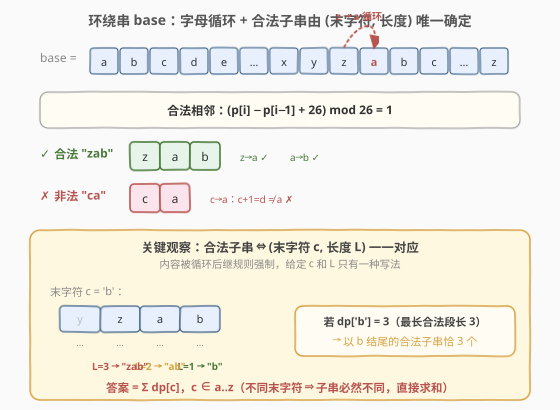
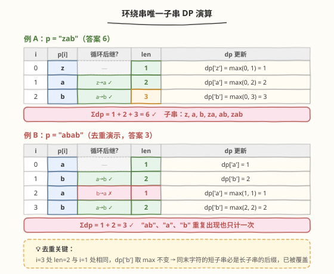

# 环绕字符串中唯一的子字符串

- **题目名称**：环绕字符串中唯一的子字符串
- **链接**：[467. 环绕字符串中唯一的子字符串](https://leetcode.cn/problems/unique-substrings-in-wraparound-string/)
- **难度**：中等
- **标签**：字符串、动态规划

## 1. 题目概述

定义**环绕串** `base` 为字母表 `"...zabcdefghijklmnopqrstuvwxyzabcdefghijklmnopqrstuvwxyz..."` 的无限循环。即 `base` 中任意位置起，每个字符都是前一个字符的**循环后继**（`z` 的后继是 `a`）。

给定字符串 `p`，求 `p` 中**互不相同**的非空子串里，有多少个出现在 `base` 中。

**示例 1**：

```text
输入：p = "a"
输出：1
解释：子串 "a" 出现在 base 中。
```

**示例 2**：

```text
输入：p = "cac"
输出：2
解释：p 的子串 "c"、"a" 在 base 中；"ca"、"ac"、"cac" 都不是 base 的子串（相邻字符不满足循环后继）。
```

**示例 3**：

```text
输入：p = "zab"
输出：6
解释：z、a、b、za、ab、zab 全部满足循环后继（z→a→b），共 6 个。
```

**约束条件**：

- `1 <= p.length <= 10^5`
- `p` 仅由小写英文字母组成。

> ⚠️ **两个易错点**：① 「**互不相同**」——同一个合法子串在 `p` 中多次出现只算一次；② `z → a` 也是合法的循环后继，别只盯着 `a → b` 这种顺延。

---

## 2. 解题思路

### 2.1 暴力思路

枚举 `p` 的所有非空子串 `O(n²)` 个，对每个子串检查「是否每对相邻字符都满足循环后继」（再 `O(长度)`），最后用哈希集合去重。总复杂度 `O(n³)`，`n = 10^5` 直接超时，且哈希集合存所有子串空间也爆炸。

### 2.2 核心观察：合法子串由 (末字符, 长度) 唯一确定



**第一步：判定合法**。子串 `s` 出现在 `base` 中，当且仅当 `s` 中每对相邻字符都满足「循环后继」：

$$
(s[i] - s[i-1] + 26) \bmod 26 = 1
$$

即 `a→b, b→c, …, y→z, z→a` 这 26 种相邻都合法，其余都不合法。这一步把「是否在 base 中」压缩成了**一次相邻比较**。

**第二步：去重**。关键观察：**一个合法子串由其末字符 `c` 和长度 `L` 唯一确定**。因为合法子串的内容被循环后继规则强制——给定末字符 `c` 和长度 `L`，整个子串就是 `c` 往前数 `L-1` 个循环前驱，只有一种写法。

> 💡 **举例**：末字符 `'b'`、长度 3 → 子串只能是 `"zab"`（b 的前驱是 a，a 的前驱是 z）。不存在另一个「末字符 b、长度 3」的合法子串。

于是**去重转化为按末字符分组**：对每个字符 `c`，只要统计「以 `c` 结尾的合法子串的最大长度 `dp[c]`」，那么以 `c` 结尾的**互不相同**的合法子串恰有 `dp[c]` 个——分别是长度 `1, 2, …, dp[c]` 这 `dp[c]` 种（更短的合法子串必然作为更长合法子串的后缀出现，所以一定都在 `p` 中存在）。

**第三步：状态定义**。令

$$
dp[c] = \text{在 } p \text{ 中以字符 } c \text{ 结尾的合法子串的最大长度}
$$

答案即为 $\sum_{c \in \text{'a'..'z'}} dp[c]$（不同末字符的子串互不相同，可直接求和）。

### 2.3 算法流程图

![算法流程：扫描 p 维护当前合法长度 len，更新 dp[末字符]](../images/usws_dp_flow.svg)

扫描时用一个滚动变量 `len` 表示「以 `p[i]` 结尾的当前合法连续段的长度」：

- 若 `p[i]` 是 `p[i-1]` 的循环后继 → `len += 1`（接上之前的段）；
- 否则 → `len = 1`（重新开始，单独一个字符永远合法）。

然后 `dp[p[i]] = max(dp[p[i]], len)`，用当前段长度刷新该末字符的最大长度记录。

> 💡 **为什么 `max` 而不是累加**：同一个末字符 `c` 可能在 `p` 中出现多次（多个合法段都以 `c` 结尾），但只有**最长**的那段决定 `dp[c]`——更短的段产生的子串是更长段的后缀，已被覆盖。这正是「去重」的关键。

### 2.4 示例演算



**例 A：`p = "zab"`**（对应示例 3，答案 6）

| i | p[i] | 前驱 | 循环后继? | len | dp 更新 |
|---|------|------|-----------|-----|---------|
| 0 | z | — | — | 1 | dp['z'] = max(0, 1) = 1 |
| 1 | a | z | (0−25+26)%26=1 ✓ | 2 | dp['a'] = max(0, 2) = 2 |
| 2 | b | a | (1−0)%26=1 ✓ | 3 | dp['b'] = max(0, 3) = 3 |

`dp = {'z':1, 'a':2, 'b':3}`，总和 `1+2+3 = 6` ✓。对应的 6 个合法子串：`z`、`a`、`b`、`za`、`ab`、`zab`。

**例 B：`p = "abab"`**（演示去重，答案 3）

| i | p[i] | 前驱 | 循环后继? | len | dp 更新 |
|---|------|------|-----------|-----|---------|
| 0 | a | — | — | 1 | dp['a'] = 1 |
| 1 | b | a | ✓ | 2 | dp['b'] = 2 |
| 2 | a | b | (0−1)%26=25 ✗ | 1 | dp['a'] = max(1, 1) = 1 |
| 3 | b | a | ✓ | 2 | dp['b'] = max(2, 2) = 2 |

`dp = {'a':1, 'b':2}`，总和 `1+2 = 3` ✓。`"ab"`、`"a"`、`"b"` 虽然在 `p` 中各出现两次，但只计一次——`dp['b']=2` 已经覆盖了长度 1（`"b"`）和长度 2（`"ab"`），第二次出现的段长度仍为 2，`max` 不变。

---

## 3. 参考代码

### C++

```cpp
class Solution {
public:
    int findSubstringInWraproundString(string p) {
        vector<int> dp(26, 0);
        int len = 0;
        for (int i = 0; i < (int)p.size(); i++) {
            if (i > 0 && (p[i] - p[i - 1] + 26) % 26 == 1) {
                len += 1;
            } else {
                len = 1;
            }
            int idx = p[i] - 'a';
            dp[idx] = max(dp[idx], len);
        }
        int total = 0;
        for (int x : dp) total += x;
        return total;
    }
};
```

### Python

```python
class Solution:
    def findSubstringInWraproundString(self, p: str) -> int:
        dp = [0] * 26
        length = 0
        for i, ch in enumerate(p):
            if i > 0 and (ord(ch) - ord(p[i - 1])) % 26 == 1:
                length += 1
            else:
                length = 1
            idx = ord(ch) - ord('a')
            dp[idx] = max(dp[idx], length)
        return sum(dp)
```

> ⚠️ **C++ 取模陷阱**：`p[i] - p[i-1]` 可能是负数（如 `'a' - 'z' = -25`），C++ 对负数取模仍得负数，必须先 `+26` 再 `% 26`。Python 的 `%` 对负数天然返回非负结果，可直接写 `(ord(ch) - ord(p[i-1])) % 26 == 1`。

---

## 4. 复杂度分析

| 维度 | 复杂度 | 说明 |
|------|--------|------|
| 时间复杂度 | $O(n)$ | 单趟扫描 `p`，每步 `O(1)`；末尾再 `O(26)` 求和 |
| 空间复杂度 | $O(1)$ | `dp` 数组大小恒为 26，与 `n` 无关 |

> 💡 本题的精妙之处在于**用 26 个桶（末字符）把「去重」消解进 DP 状态**：不去枚举子串、不去哈希集合，而是按末字符求最大长度，直接 `O(n)` 时间 `O(1)` 空间完成计数。

---

## 5. 扩展：如果问「合法子串出现的总次数」（不去重）

若改为统计 `p` 中**所有**合法子串出现次数（重复也计数），就回到经典的「连续合法段计数」：对每段长度为 `L` 的合法连续段，贡献 $\frac{L(L+1)}{2}$ 个子串。这与 [413. 等差数列划分](https://leetcode.cn/problems/arithmetic-slices/)（[题解](./413_等差数列划分.md)）的 `Σdp[i]` 计数同源，只是本题额外加了「跨段按末字符去重」的约束，因此要用 `dp[末字符]` 而非 `dp[位置]`。

---

## 6. 面试要点

1. **为什么合法子串由 (末字符, 长度) 唯一确定？**

   - 合法子串的相邻字符必须满足循环后继，即内容被「往前数循环前驱」唯一确定。给定末字符 `c` 与长度 `L`，子串就是 `c, pred(c), pred(pred(c)), …` 共 `L` 个字符，只有一种写法。

2. **为什么 `dp[c]` 取 `max` 而不是累加各段长度？**

   - 同一末字符 `c` 可能有多个合法段，但更短段生成的子串一定是更长段的后缀（都以 `c` 结尾、内容相同），已被最长段覆盖。取 `max` 即覆盖所有长度 `1..dp[c]`，恰好 `dp[c]` 个，去重自然完成。

3. **为什么答案是 `Σdp[c]` 而不是 `Σdp[i]`（按位置）？**

   - 按位置累加会重复计数（同一子串在多处出现）。按末字符分组后，不同末字符的子串必然不同（末字符都不同），同末字符的子串用 `dp[c]` 去重，因此 `Σdp[c]` 不重不漏。

4. **`z → a` 怎么处理？**

   - 用 `(p[i] - p[i-1] + 26) % 26 == 1` 判定。`'a' - 'z' = -25`，`+26` 得 1，`% 26 = 1` ✓。C++ 务必先 `+26` 规避负数取模。

5. **与 413 等差数列划分的异同？**

   - 都用「当前合法段长度 `len`」滚动递推（延续则 `+1`，中断则归 1/0）。但 413 计数不去重，直接 `Σdp[i]`；本题要求去重，状态从「按位置」改为「按末字符」，并用 `max` 而非累加。同一套「连续合法段」骨架，去重方式不同。

---

## 7. 同类练习题

- [413. 等差数列划分](https://leetcode.cn/problems/arithmetic-slices/)（[题解](./413_等差数列划分.md)）：连续合法段计数不去重，`Σdp[i]`；本题的「按末字符去重」对照「按位置计数」
- [3. 无重复字符的最长子串](https://leetcode.cn/problems/longest-substring-without-repeating-characters/)（[题解](../0001-0100/3_无重复字符的最长子串.md)）：同样在字符串上做「合法连续段」判定，滑动窗口思路
- [300. 最长递增子序列](https://leetcode.cn/problems/longest-increasing-subsequence/)（[题解](../0201-0300/300_最长递增子序列.md)）：`dp[i] = 以 i 结尾的最长长度` 思路，对照本题 `dp[c] = 以 c 结尾的最长长度`（按值而非按下标）
- [2262. 字符串中子串的总引力值](https://leetcode.cn/problems/total-appeal-of-a-string/)：按「末字符上次出现位置」分类贡献，同属「按末字符去重计数」家族
