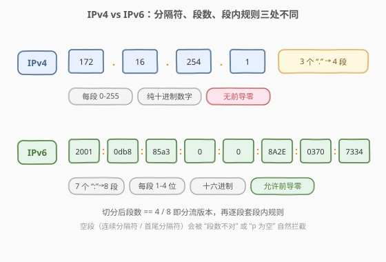
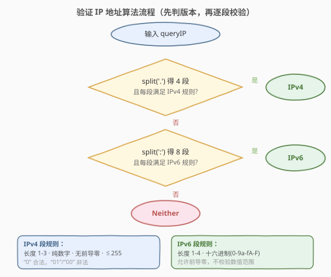
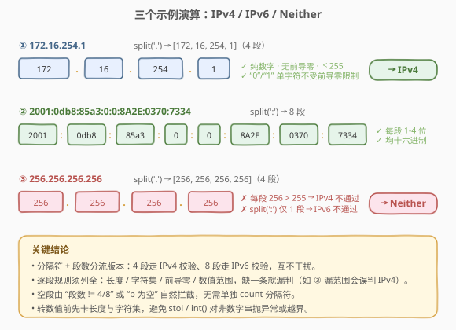

# LeetCode 验证 IP 地址 题解

## 1. 题目概述

- **标题 / 题号**：验证 IP 地址（#468，medium）
- **链接**：https://leetcode.cn/problems/validate-ip-address/
- **难度**：中等
- **标签**：字符串、模拟、规则校验

**题意**：给定一个字符串 `queryIP`，判断它是合法的 **IPv4**、合法的 **IPv6**，还是两者都不是。返回 `"IPv4"` / `"IPv6"` / `"Neither"`。

**IPv4 规则**：由 4 段十进制数组成，段之间用 `.` 分隔：

- 每段是 $0 \sim 255$ 的整数；
- 只允许十进制数字 `0-9`；
- **不允许前导零**：`"0"` 本身合法，但 `"01"`、`"00"` 非法。

**IPv6 规则**：由 8 段十六进制数组成，段之间用 `:` 分隔：

- 每段长度 $1 \sim 4$，字符取自 `0-9`、`a-f`、`A-F`；
- **允许前导零**，也允许省略前导零（如 `0` 与 `0000` 均合法）。

**示例 1**：

```text
输入：queryIP = "172.16.254.1"
输出："IPv4"
解释：4 段，每段 0-255、无前导零。
```

**示例 2**：

```text
输入：queryIP = "2001:0db8:85a3:0:0:8A2E:0370:7334"
输出："IPv6"
解释：8 段，每段 1-4 位十六进制数。
```

**示例 3**：

```text
输入：queryIP = "256.256.256.256"
输出："Neither"
解释：每段都超过 255。
```

**约束**：

- `queryIP` 仅由英文字母、数字及字符 `'.'` 和 `':'` 组成。

> 💡 本题没有「算法」上的难度，考点是**把规则逐条落成代码、不漏边界**。最容易翻车的边界是前导零、段数不足/过多、空段（连续分隔符或首尾分隔符）。

## 2. 解题思路

### 2.1 暴力思路

最直觉的做法是「用正则一把梭」。但 IPv4 的「无前导零 + 范围 0-255」与 IPv6 的「1-4 位十六进制」用单条正则写出来又长又难读，面试时手写极易出错（前导零、空段、超长段都要兼顾）。更稳的做法是**按分隔符切分后逐段套规则**——逻辑清晰、边界可控，也是官方题解与工业界 IP 校验代码的主流写法。

### 2.2 核心观察：先按分隔符判版本，再逐段校验

IPv4 与 IPv6 用不同分隔符（`.` vs `:`），且段数固定（4 vs 8）。因此**用分隔符切分后的段数即可分流版本**：

- 按 `.` 切分得 4 段 → 走 IPv4 校验；
- 按 `:` 切分得 8 段 → 走 IPv6 校验；
- 否则直接 `"Neither"`。



上图把两种格式并排展示，关键差异有三处：**分隔符**（`.`/`:`）、**段数**（4/8）、**段内规则**（十进制 0-255 无前导零 / 1-4 位十六进制允许前导零）。代码只需为每种格式各写一个 `is_valid_xxx` 函数，把对应规则逐条翻译。

> ⚠️ **「按分隔符切分」本身就把段数与空段校验都做了**：若 `split('.')` 得到的不是恰好 4 段（连续点、首尾点都会产生空段或段数不对），自然判负。无需再单独 `count('.')`。

### 2.3 算法流程图



流程是一个两层判定：先看按 `.` 切分是否恰好 4 段且每段满足 IPv4 规则；不满足再看按 `:` 切分是否恰好 8 段且每段满足 IPv6 规则；都不满足返回 `"Neither"`。两个校验函数互不依赖，可独立测试。

### 2.4 示例演算

对三个示例分别走一遍流程：



| 输入 | 切分 | 逐段校验 | 结论 |
|------|------|---------|------|
| `172.16.254.1` | `.`→`[172,16,254,1]`（4 段） | `172`∈0-255 ✓、无前导零 ✓；`16`✓；`254`✓；`1`✓ | IPv4 |
| `2001:0db8:85a3:0:0:8A2E:0370:7334` | `:`→8 段 | 每段长度 1-4、字符均十六进制 ✓ | IPv6 |
| `256.256.256.256` | `.`→`[256,256,256,256]`（4 段） | `256 > 255` ✗ → IPv4 不通过；按 `:` 切分只得 1 段 ✗ | Neither |

> 💡 第三例值得注意：`"256.256.256.256"` 按 `.` 切分确实得到 4 段、每段都是纯数字、无前导零，**唯独数值越界**——说明「逐段套规则」必须把范围校验也列进去，否则会漏判。

## 3. 参考代码

### C++

```cpp
class Solution {
  public:
    string validIPAddress(string queryIP) {
        if (isIPv4(queryIP)) return "IPv4";
        if (isIPv6(queryIP)) return "IPv6";
        return "Neither";
    }

  private:
    bool isIPv4(const string& s) {
        auto parts = split(s, '.');
        if (parts.size() != 4) return false;
        for (const string& p : parts) {
            if (p.empty() || p.size() > 3) return false;       // 长度 1-3
            for (char c : p)
                if (c < '0' || c > '9') return false;          // 仅十进制数字
            if (p.size() > 1 && p[0] == '0') return false;     // 无前导零
            if (stoi(p) > 255) return false;                   // 范围 0-255
        }
        return true;
    }

    bool isIPv6(const string& s) {
        auto parts = split(s, ':');
        if (parts.size() != 8) return false;
        for (const string& p : parts) {
            if (p.empty() || p.size() > 4) return false;       // 长度 1-4
            for (char c : p)
                if (!isHex(c)) return false;                   // 十六进制字符
        }
        return true;
    }

    vector<string> split(const string& s, char delim) {
        vector<string> res;
        string cur;
        for (char c : s) {
            if (c == delim) { res.push_back(cur); cur.clear(); }
            else cur.push_back(c);
        }
        res.push_back(cur);                                    // 末段
        return res;
    }

    bool isHex(char c) {
        return (c >= '0' && c <= '9') ||
               (c >= 'a' && c <= 'f') ||
               (c >= 'A' && c <= 'F');
    }
};
```

### Python

```python
class Solution:
    def validIPAddress(self, queryIP: str) -> str:
        if self._is_ipv4(queryIP):
            return "IPv4"
        if self._is_ipv6(queryIP):
            return "IPv6"
        return "Neither"

    def _is_ipv4(self, s: str) -> bool:
        parts = s.split('.')
        if len(parts) != 4:
            return False
        for p in parts:
            if not p or len(p) > 3:                 # 长度 1-3
                return False
            if not all('0' <= c <= '9' for c in p): # 仅十进制数字
                return False
            if len(p) > 1 and p[0] == '0':          # 无前导零
                return False
            if int(p) > 255:                        # 范围 0-255
                return False
        return True

    def _is_ipv6(self, s: str) -> bool:
        parts = s.split(':')
        if len(parts) != 8:
            return False
        hexset = set("0123456789abcdefABCDEF")
        for p in parts:
            if not (1 <= len(p) <= 4):              # 长度 1-4
                return False
            if not all(c in hexset for c in p):     # 十六进制字符
                return False
        return True
```

> ⚠️ **三个易错点**：
> 1. **`split` 的实现**：Python 的 `str.split('.')` 在 `"1.2.3."` 上会得到 `['1','2','3','']`（保留末尾空段），长度 4，会被后续 `not p` 拦截，正确。但 C++ 若用 `stringstream + getline`，连续分隔符会**跳过空段**导致段数虚减——因此这里手写 `split` 保留空段，保证「段数 == 4/8」的判定可靠。
> 2. **前导零判定**：用 `len(p) > 1 && p[0] == '0'`，单独的 `"0"` 不受影响。切勿写成 `p[0] == '0'` 直接否决，会把合法的 `0` 误杀。
> 3. **范围校验顺序**：先判「纯数字」、再 `stoi`/`int(p)`，避免对非数字串转换抛异常；同时 `p.size() > 3` 已把 IPv4 段长度限制在 3 位以内（`<= 999`），`stoi` 不会越界。

## 4. 复杂度分析

| 维度 | 复杂度 | 说明 |
|------|--------|------|
| 时间复杂度 | $O(n)$ | 单趟扫描字符串做切分，再对每段做 $O(\text{段长})$ 校验，总字符数 $\leq n$ |
| 空间复杂度 | $O(n)$ | 切分产生的段数组，总长度 $\leq n$（若返回值不计则为 $O(1)$ 额外） |

> 💡 题面长度上限很小，任何写法都毫秒级完成。复杂度本身不是考点，**边界用例的覆盖率**才是。

## 5. 面试要点

1. **为什么用「切分 + 逐段校验」而不是正则？**
   - 正则要把「0-255 + 无前导零」编码进去，可读性差、易错；逐段校验把规则拆成可读的几条 `if`，边界清晰、好测试，是工业界 IP 校验的主流写法。

2. **IPv4 的前导零怎么判？**
   - `len(p) > 1 && p[0] == '0'`。`"0"` 合法（长度 1 不触发），`"01"`/`"00"` 非法。切勿把单独的 `0` 误杀。

3. **空段（连续分隔符、首尾分隔符）如何被拦住？**
   - 手写 `split` 保留空段：`"1..3.4"` 切出 `['1','','3','4']`，空段被 `p.empty()` 拦截；`"1.2.3.4."` 切出 5 段，`size != 4` 拦截。若用会吞空段的库函数（如 C++ `getline`），段数会虚减导致误判。

4. **IPv6 为什么不校验数值范围？**
   - IPv6 每段是 16 位（$0 \sim \text{FFFF}$），1-4 位十六进制天然不超过 16 位，只需校验「长度 1-4 + 字符是十六进制」即可，无需转数值比范围。

5. **`stoi` / `int(p)` 会对非法输入抛异常吗？**
   - 会。所以必须**先**确认整段都是数字、且长度 $\leq 3$（IPv4）再转换。代码里 `p.size() > 3` 与「纯数字」检查在 `stoi` 之前，保证了转换安全。

6. **如果输入同时含 `.` 和 `:` 怎么办？**
   - 按 `.` 切分若得 4 段会先走 IPv4 校验，IPv4 段内只允许数字（冒号会被「仅十进制数字」拦截）→ IPv4 不通过；再按 `:` 切分，点号会被「十六进制字符」拦截 → IPv6 不通过 → `"Neither"`。两个校验互为兜底，结果正确。

## 同类练习题

| # | 题目 | 与本题的关联 |
|---|------|-------------|
| 93 | [复原 IP 地址](https://leetcode.cn/problems/restore-ip-addresses/)（[题解](../0001-0100/93_复原IP地址.md)） | 回溯枚举 IPv4 分段，段合法性判定与本题完全相同 |
| 165 | [比较版本号](https://leetcode.cn/problems/compare-version-numbers/)（[题解](../0101-0200/165_比较版本号.md)） | 按 `.` 切分逐段比较，同属「分隔符切分 + 逐段处理」套路 |
| 8 | [字符串转换整数（atoi）](https://leetcode.cn/problems/string-to-integer-atoi/)（[题解](../0001-0100/8_字符串转换整数atoi.md)） | 字符串规则逐字符模拟，前导空格/符号/溢出边界处理，与本题同为「规则校验型」字符串题 |
| 125 | [验证回文串](https://leetcode.cn/problems/valid-palindrome/) | 逐字符规则过滤（字母数字）+ 双指针，更简单的规则校验入门 |
