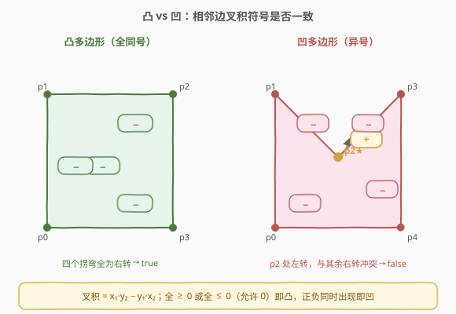
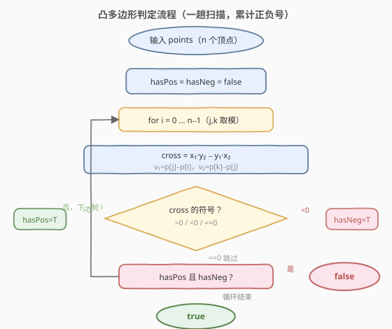
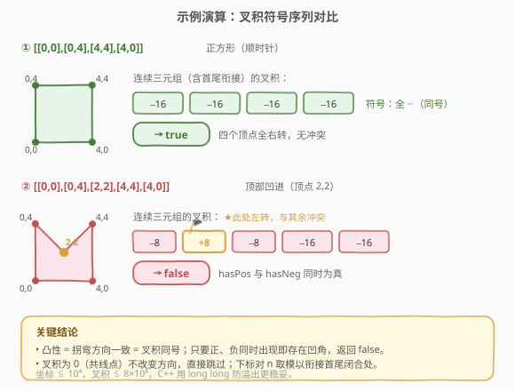

# LeetCode 凸多边形 题解

## 1. 题目概述

- **标题 / 题号**：凸多边形（#469，medium）
- **链接**：https://leetcode.cn/problems/convex-polygon/
- **难度**：中等
- **标签**：几何、数学、叉积

**题意**：给定一个按顺时针或逆时针顺序排列的点数组 `points`，其中 `points[i] = [xi, yi]` 表示平面上的一个顶点。这些点按给定顺序首尾相连构成一个多边形。请判断该多边形是否为**凸多边形**。

- **凸多边形**：多边形内部任意两点的连线仍在内部，等价于**所有内角都不超过 $180°$**——即相邻边在拐弯时**方向始终一致**（全左转或全右转）。
- 题目保证多边形是**简单多边形**（不自交）。

**示例 1**：

```text
输入：points = [[0,0],[0,4],[4,4],[4,0]]
输出：true
解释：四个顶点构成正方形，所有拐弯同向（全右转），为凸多边形。
```

**示例 2**：

```text
输入：points = [[0,0],[0,4],[2,2],[4,4],[4,0]]
输出：false
解释：顶点 (2,2) 向内凹进，在该处拐弯方向与其余顶点相反，为凹多边形。
```

**约束**：

- $3 \leq \text{points.length} \leq 10^4$
- `points[i].length == 2`
- $-10^4 \leq x_i, y_i \leq 10^4$
- 给定点按顺时针或逆时针顺序构成简单多边形

> 💡 本题是计算几何入门题。核心是把「所有内角 $\leq 180°$」翻译成「相邻边叉积**同号**」——一个纯代数判定，无需真正算角度。

## 2. 解题思路

### 2.1 暴力思路

最直觉的暴力的做法是「逐个顶点算内角」：对每个顶点，用两相邻边作向量，通过点积与模长反算 $\cos\theta$，再检查 $\theta \leq 180°$。但反复调用 `acos` 既慢又因浮点误差容易在「共线」「接近 $180°$」的边界上误判。

更根本的问题是：**凸性本质是「拐弯方向一致」，与角度大小无关**。把方向转化为符号即可避开浮点，全程整数运算。

### 2.2 核心观察：相邻边叉积同号

对每三个相邻顶点 $p_i, p_{i+1}, p_{i+2}$（下标循环），构造两条边向量：

$$
\vec{v_1} = p_{i+1} - p_i, \qquad \vec{v_2} = p_{i+2} - p_{i+1}
$$

二维叉积为：

$$
\vec{v_1} \times \vec{v_2} = x_1 y_2 - y_1 x_2
$$

其几何意义是 $p_{i+1}$ 处的**转弯方向**：

| 叉积符号 | 含义 |
|---------|------|
| $> 0$ | 左转（逆时针，内角 $< 180°$ 的「凸」拐） |
| $< 0$ | 右转（顺时针） |
| $= 0$ | 共线（不拐弯，三点在一条直线上） |

**关键结论**：多边形为凸 $\iff$ 所有相邻边叉积**同号**（允许出现 $0$，$0$ 不改变方向）。只要同时出现严格正与严格负的叉积，就存在一个「反向拐弯」的顶点（内角 $> 180°$ 的凹角），多边形非凸。



> ⚠️ **三点共线（叉积为 $0$）不影响判定**：一条直边上插入若干共线点是允许的，它们不改变转弯方向。因此只比较「严格正」与「严格负」是否同时出现，跳过 $0$。

### 2.3 算法流程图



流程很简洁：一趟扫描所有连续三元组，累计是否见过正、负叉积；一旦两者都出现立即返回 `false`；扫完仍不冲突则返回 `true`。循环下标对 $n$ 取模以衔接首尾。

### 2.4 示例演算

对两个示例分别走一遍，观察叉积符号序列：



| 示例 | 顶点序列 | 叉积序列 | 符号 | 结论 |
|------|---------|---------|------|------|
| ① | $[0,0]\to[0,4]\to[4,4]\to[4,0]$ | $-16, -16, -16, -16$ | 全负（同号） | true（凸） |
| ② | $[0,0]\to[0,4]\to[2,2]\to[4,4]\to[4,0]$ | $-8, +8, -8, -16, -16$ | 负正混合（异号） | false（凹） |

> 💡 示例②中顶点 $(2,2)$ 处叉积由负变正，正是「向内凹进」的那一刀——其余顶点都在右转，唯独这里左转，故非凸。

## 3. 参考代码

### C++

```cpp
class Solution {
  public:
    bool isConvex(vector<vector<int>>& points) {
        int n = points.size();
        bool hasPos = false, hasNeg = false;
        for (int i = 0; i < n; i++) {
            int j = (i + 1) % n;
            int k = (i + 2) % n;
            long long x1 = points[j][0] - points[i][0];
            long long y1 = points[j][1] - points[i][1];
            long long x2 = points[k][0] - points[j][0];
            long long y2 = points[k][1] - points[j][1];
            long long cross = x1 * y2 - y1 * x2;
            if (cross > 0) hasPos = true;
            else if (cross < 0) hasNeg = true;
            if (hasPos && hasNeg) return false;
        }
        return true;
    }
};
```

### Python

```python
class Solution:
    def isConvex(self, points: List[List[int]]) -> bool:
        n = len(points)
        has_pos = has_neg = False
        for i in range(n):
            j = (i + 1) % n
            k = (i + 2) % n
            x1, y1 = points[j][0] - points[i][0], points[j][1] - points[i][1]
            x2, y2 = points[k][0] - points[j][0], points[k][1] - points[j][1]
            cross = x1 * y2 - y1 * x2
            if cross > 0:
                has_pos = True
            elif cross < 0:
                has_neg = True
            if has_pos and has_neg:
                return False
        return True
```

> ⚠️ **两个易错点**：
> 1. **整数溢出**：坐标范围 $[-10^4, 10^4]$，边向量分量达 $2\times10^4$，叉积最大 $8\times10^8$，刚好不超 32 位有符号整数上界 $\approx 2.1\times10^9$，但 C++ 仍建议用 `long long` 保险（Python 无此问题）。
> 2. **循环衔接首尾**：最后一组三元组是 $(p_{n-1}, p_0, p_1)$，用 `(i+1)%n`、`(i+2)%n` 取模即可，切勿只扫到 $n-3$ 漏掉闭合处的拐弯。

## 4. 复杂度分析

| 维度 | 复杂度 | 说明 |
|------|--------|------|
| 时间复杂度 | $O(n)$ | 一趟扫描 $n$ 个连续三元组，每组 $O(1)$ 叉积运算 |
| 空间复杂度 | $O(1)$ | 仅用两个布尔标记与若干临时变量 |

> 💡 $n \leq 10^4$，$O(n)$ 毫秒级完成。本题考点不在性能，而在**把凸性正确翻译为叉积同号判定**并处理共线、首尾衔接等边界。

## 5. 扩展：自交多边形与方向归一

本题假设输入是简单多边形（不自交）。若放宽该假设，会出现「边互相交叉」的情况，此时即便叉积同号也可能是复杂（自交）多边形，不能仅靠本算法判定凸性——需先验证简单性（如检查所有非相邻边是否相交）。

另一个常见变体是**方向归一**：有些场景给定点顺序不保证顺/逆时针，此时可先用「所有叉积之和」的符号（鞋带公式面积的符号）确定整体绕向，再据此统一比较；本题因为只比「同号与否」，与绕向无关，故无需归一。

## 6. 面试要点

1. **为什么用叉积而不是算角度？**

   凸性的本质是「拐弯方向一致」，与角度数值无关。叉积的符号恰好编码了方向（左/右转），全程整数运算，避开了 `acos` 的浮点误差与性能开销。算角度是把「方向问题」错误地升维成「数值问题」。

2. **叉积为 $0$（三点共线）怎么处理？**

   共线点不改变拐弯方向，是合法的。代码里 `cross == 0` 时既不置 `hasPos` 也不置 `hasNeg`，相当于跳过。只要不同时出现严格正、严格负即判凸。

3. **为什么循环要对 $n$ 取模？**

   多边形是闭合的，最后一个顶点到第一个顶点之间也有一次拐弯。三元组 $(p_{n-1}, p_0, p_1)$ 必须覆盖，用 `(i+1)%n`、`(i+2)%n` 取模衔接。漏掉这组会在「闭合处恰好凹」的用例上误判。

4. **坐标范围会导致溢出吗？**

   叉积最大 $8\times10^8$，理论上不超 32 位上界 $\approx 2.1\times10^9$，但乘法中间项接近上界，C++ 中用 `long long` 更稳妥；Python 整数任意精度无此虑。

5. **顺时针和逆时针顺序都适用吗？**

   适用。顺时针时所有叉积为负、逆时针时为正，本算法只比「是否同号」，不关心具体正负，故两种顺序统一处理，无需额外归一。

## 同类练习题

| # | 题目 | 与本题的关联 |
|---|------|-------------|
| 149 | [直线上最多的点数](https://leetcode.cn/problems/max-points-on-a-line/)（[题解](../0101-0200/149_直线上最多的点数.md)） | 同为几何题，用叉积/斜率判定三点共线，叉积是计算几何的基础工具 |
| 2280 | [表示一个折线图的最少线段数](https://leetcode.cn/problems/minimum-lines-to-represent-a-line-chart/) | 叉积判共线方向，相邻段方向变化即切分新线段，与本题「方向一致性」思想相通 |
| 1039 | [多边形三角剖分的最低得分](https://leetcode.cn/problems/minimum-score-triangulation-of-polygon/) | 同为多边形几何题，区间 DP 切三角形，需理解多边形顶点的顺序与结构 |
| 1401 | [圆和矩形是否有重叠](https://leetcode.cn/problems/circle-and-rectangle-overlapping/) | 几何判定题，把几何关系翻译为代数不等式，与本题「几何转代数」的思路一脉相承 |
