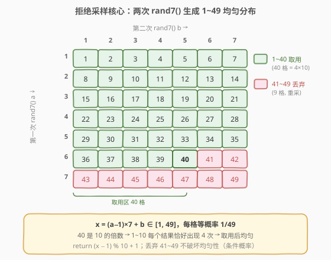
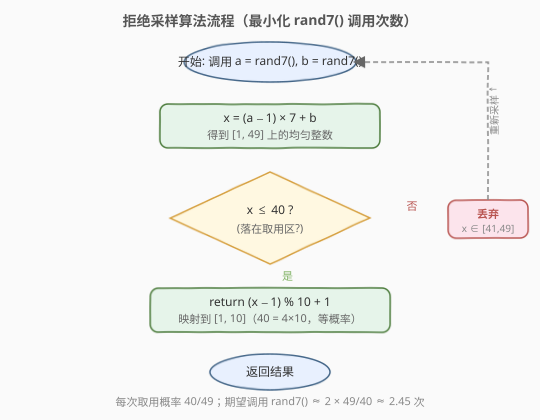
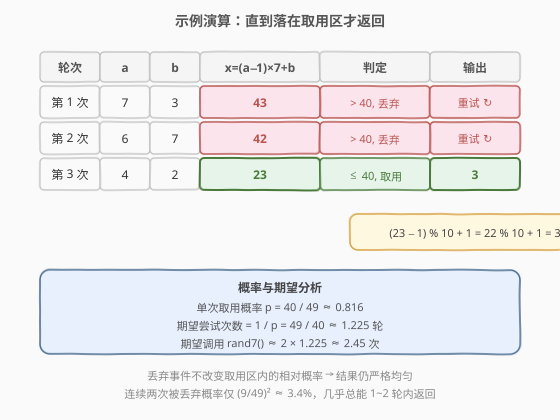

# 用 Rand7() 实现 Rand10()

- **题目名称**：用 Rand7() 实现 Rand10()
- **链接**：[470. 用 Rand7() 实现 Rand10()](https://leetcode.cn/problems/implement-rand10-using-rand7/)
- **难度**：中等
- **标签**：数学、概率与随机、拒绝采样

## 1. 题目概述

给定已有 API `rand7()`，它能**均匀**生成 `[1, 7]` 范围内的整数（每个数概率均为 $1/7$）。请你实现 `rand10()`，使其**均匀**生成 `[1, 10]` 范围内的整数（每个数概率均为 $1/10$）。除调用 `rand7()` 外不能使用任何其它随机源，且应**尽量减少** `rand7()` 的调用次数。

**示例 1**：

```text
输入：n = 1
输出：[2]
解释：rand10() 返回 [1,10] 上的随机整数，这里返回 2。
```

**示例 2**：

```text
输入：n = 3
输出：[3, 8, 10]
```

**约束条件**：

- `1 <= n <= 10^5`
- 至多调用 `rand7()` 的次数有要求（评测机统计调用次数，应尽量少）

> 💡 这道题不考数据结构与算法，而考**概率采样**的核心套路：如何用「小范围均匀源」构造「大范围均匀源」。关键不是「凑出 10」，而是「保证每个结果**等概率**」。

---

## 2. 解题思路

### 2.1 暴力思路

最直觉的做法是「`rand7()` 取模」：`rand7() % 10 + 1`。但 `rand7()` 只能产生 `1~7`，取模后 `1~7` 各占一份、`8~10` 概率为 0，根本覆盖不到。

退一步，多调几次相加呢？比如 `(rand7() + rand7()) % 10 + 1`。两个 `rand7()` 之和的分布是**三角型**而非均匀的（和为 8 的组合最多），取模后依然严重偏斜。**直接做线性组合无法得到均匀分布**——这是最常见的踩坑点。

> ⚠️ **均匀分布不能简单相加或取模得到**：两个独立均匀变量之和服从三角分布，不再是均匀的。必须用「**拒绝采样**」：先构造一个**等概率覆盖更大范围**的整数源，再丢弃多余部分。

### 2.2 核心观察：拒绝采样（Rejection Sampling）



关键直觉分两步：

**第一步：把 `rand7()` 放大到 `[1, 49]` 的均匀整数源。**

调用两次 `rand7()`，记为 $a, b$（各自均匀分布于 $[1,7]$）。构造

$$
x = (a - 1) \times 7 + b
$$

由于 $a-1 \in [0,6]$、$b \in [1,7]$，且 $(a-1)\times 7$ 把 $a$ 的 $7$ 种取值映射到 $7$ 个互不重叠的区间 $\{0,7,14,\dots,42\}$，每个区间内由 $b$ 细分出 $7$ 个值。因此 $x$ **均匀**覆盖 $[1, 49]$ 的每一个整数，每个概率均为 $1/49$。

> 💡 为什么是 $7$ 进制拼接而不是相加？相加会产生「不同 $(a,b)$ 组合对应同一个和」的碰撞（如 $(1,6)$ 与 $(3,4)$ 和都是 $7$），破坏均匀性；而 $(a-1)\times 7 + b$ 是一个**双射**，$49$ 种 $(a,b)$ 组合一一对应 $49$ 个不同的 $x$，每个等概率。

**第二步：从 $49$ 中取用 $40$，丢弃多余的 $9$。**

$49$ 不能被 $10$ 整除，无法直接等分。但 $40$ 是 $10$ 的倍数（$40 = 4 \times 10$）。于是规则定为：

- 若 $x \le 40$：**取用**，返回 $(x - 1) \bmod 10 + 1$。由于 $[1,40]$ 中每个结果 $1 \sim 10$ 恰好出现 $4$ 次，概率为 $4/40 = 1/10$，严格均匀。
- 若 $x \in [41, 49]$：**丢弃**，重新采样。

为什么「丢弃」不破坏均匀性？因为丢弃是一个**条件**事件——我们只在「$x \le 40$」发生时返回，相当于把概率重新归一化到取用区内。取用区内每个 $x$ 的相对概率仍相等（都是 $1/49$），归一化后仍是 $1/40$，映射到结果后自然是 $1/10$。

### 2.3 算法流程图



整体是一个 `while` 循环：反复生成 $x$，命中取用区则返回，否则继续。循环必然终止——每次命中概率为 $40/49 \approx 81.6\%$，几乎总在 $1 \sim 2$ 轮内返回。

### 2.4 示例演算



上表演示了一次典型执行：

- 第 1 次：$a=7, b=3 \Rightarrow x=43 \in [41,49]$，丢弃。
- 第 2 次：$a=6, b=7 \Rightarrow x=42 \in [41,49]$，丢弃。
- 第 3 次：$a=4, b=2 \Rightarrow x=23 \le 40$，取用，返回 $(23-1)\bmod 10 + 1 = 22\bmod 10 + 1 = 3$。

> 💡 **期望调用次数**：单次取用概率 $p = 40/49$，期望尝试轮数 $1/p = 49/40 \approx 1.225$，每轮调用 $2$ 次 `rand7()`，故期望调用 $\approx 2.45$ 次。

---

## 3. 参考代码

### C++

```cpp
// The rand7() API is already defined for you.
// int rand7();
// returns a uniform random integer in the range [1, 7]

class Solution {
  public:
    int rand10() {
        while (true) {
            int a = rand7();
            int b = rand7();
            int x = (a - 1) * 7 + b; // 均匀 [1, 49]
            if (x <= 40) {
                return (x - 1) % 10 + 1; // 映射到 [1, 10]
            }
            // x in [41, 49]: 丢弃，重新采样
        }
    }
};
```

### Python

```python
# The rand7() API is already defined for you.
# def rand7():
# @return a random integer in the range [1, 7]

class Solution:
    def rand10(self) -> int:
        while True:
            a = rand7()
            b = rand7()
            x = (a - 1) * 7 + b  # 均匀 [1, 49]
            if x <= 40:
                return (x - 1) % 10 + 1  # 映射到 [1, 10]
            # x in [41, 49]: 丢弃，重新采样
```

> ⚠️ **常见错误**：写成 `return x % 10` 会让 $x=10,20,30,40$ 都映射到 $0$，而 $0$ 不在 $[1,10]$ 内；且 $x=10$ 与 $x=20$ 共映射到同一结果但「跨段」会让计数混乱。务必用 `(x - 1) % 10 + 1`，把 $[1,40]$ 整体平移到 $[0,39]$ 再取模，语义清晰且每个结果恰出现 $4$ 次。

---

## 4. 复杂度分析

| 维度 | 复杂度 | 说明 |
|------|--------|------|
| 时间复杂度（期望） | O(1) | 每轮 O(1)；期望 $49/40 \approx 1.225$ 轮即返回 |
| 空间复杂度 | O(1) | 仅用常数变量 |
| 期望 `rand7()` 调用数 | $\approx 2.45$ | $2 \times 49/40$，远低于题目上限 |

> 几何分布的无记忆性保证了「最坏情况」几乎不存在：连续 $k$ 轮被丢弃的概率为 $(9/49)^k$，$k=5$ 时已不足 $0.07\%$。

---

## 5. 扩展：复用丢弃值进一步降低调用次数

朴素做法把 $[41,49]$ 这 $9$ 个值完全丢弃，浪费了信息。可以利用它们**再凑一次均匀采样**：

- 丢弃值 $x \in [41,49]$，令 $u = x - 41 \in [0,8]$（$9$ 个等概率值）。
- 再调用一次 `rand7()` 得 $c$，构造 $y = u \times 7 + c \in [1, 63]$（均匀）。
- 若 $y \le 60$：返回 $(y - 1) \bmod 10 + 1$（$60 = 6 \times 10$，均匀）。
- 否则 $y \in [61,63]$（$3$ 个值）：这 $3$ 个值还能继续复用，或直接重来。

```cpp
class Solution {
  public:
    int rand10() {
        while (true) {
            int a = rand7(), b = rand7();
            int x = (a - 1) * 7 + b;        // [1, 49]
            if (x <= 40) return (x - 1) % 10 + 1;
            // 复用丢弃值: x in [41,49] -> u in [0,8]
            int u = x - 41;
            int c = rand7();
            int y = u * 7 + c;              // [1, 63]
            if (y <= 60) return (y - 1) % 10 + 1;
            // y in [61,63] 还可继续复用，此处简化为重来
        }
    }
};
```

**期望调用次数分析**：设从头开始的期望调用数为 $E$，进入第二轮（丢弃后）的期望额外调用为 $E_1$。

- 第一轮必花 $2$ 次调用：命中（$40/49$）即结束；未命中（$9/49$）进入第二轮。
- 第二轮花 $1$ 次调用：命中（$60/63 = 20/21$）即结束；未命中（$3/63 = 1/21$）回到起点，需再花 $E$。

$$
E = 2 + \frac{9}{49} E_1,\qquad E_1 = 1 + \frac{1}{21} E
$$

解得 $E = 2 + \frac{9}{49}\!\left(1 + \frac{E}{21}\right)$，化简 $E\!\left(1 - \frac{9}{1029}\right) = 2 + \frac{9}{49}$，得

$$
E \approx 2.203 \text{ 次}
$$

相比朴素做法的 $2.45$ 次，下降约 $10\%$。若继续把 $[61,63]$ 这 $3$ 个值再复用（$3 \times 7 = 21$，取用 $20$），收益已边际递减，工程上一般复用一到两层即可。

> 💡 **推广模板**：用 `randN()` 实现 `randM()`（$M > N$）时，找到最小的 $k$ 使 $N^k \ge M$，构造 $x \in [1, N^k]$ 的均匀源，取用最大的 $N^k$ 以下、$M$ 的倍数 $q = \lfloor N^k / M \rfloor \times M$，丢弃 $[q+1, N^k]$。本题 $N=7, M=10, k=2, q=40$。

---

## 6. 面试要点

1. **为什么不能直接 `rand7() % 10` 或 `(rand7()+rand7()) % 10`？**

   - 前者连 $8,9,10$ 都产生不了；后者两个均匀变量之和服从**三角分布**（和为中间值的组合数最多），取模后各结果概率严重不等。**均匀分布对加法不封闭**，必须用拒绝采样。

2. **为什么用 $(a-1)\times 7 + b$ 而不是 $a + b$ 或 $a \times b$？**

   - $(a-1)\times 7 + b$ 是 $(a,b) \to x$ 的**双射**，$49$ 种组合一一对应 $49$ 个不同 $x$，每个概率 $1/49$，保证均匀。$a+b$ 有碰撞（多对一），$a\times b$ 既碰撞又取值不连续，都破坏均匀性。本质是「$7$ 进制位拼接」。

3. **为什么丢弃 $[41,49]$ 不破坏结果的均匀性？**

   - 丢弃是**条件事件**：只在 $x \le 40$ 时返回。取用区内每个 $x$ 的相对概率仍相等（$1/49$），归一化（除以 $40/49$）后变为 $1/40$，映射到 $[1,10]$ 后每个结果恰 $4$ 次，概率 $1/10$。只要「被丢弃的余项不整除 $M$」且「取用区是 $M$ 的倍数」，均匀性就成立。

4. **为什么取 $40$ 而不是 $49$ 或 $45$？**

   - 取用区大小必须是 $M=10$ 的倍数，才能等分。$49$ 以下最大的 $10$ 的倍数就是 $40$（$50 > 49$）。取 $40$ 使丢弃数最少（仅 $9$），命中概率最高（$40/49$）。若取 $30$ 也能均匀，但命中概率降到 $30/49$，调用次数更多。

5. **如何最小化 `rand7()` 调用次数？**

   - 朴素拒绝采样期望 $\approx 2.45$ 次。进一步可**复用丢弃值**：把 $[41,49]$ 的 $9$ 个值再乘 $7$ 扩展到 $[1,63]$，取用 $60$，期望降到 $\approx 2.20$ 次。还可多层复用，但收益边际递减。面试中能讲清朴素版 + 复用思路即可拿满分。

---

## 7. 同类练习题

- [478. 在圆内随机生成点](https://leetcode.cn/problems/generate-random-point-in-a-circle/)：拒绝采样经典应用，用外接正方形拒绝圆外点。
- [497. 非重叠矩形中的随机点](https://leetcode.cn/problems/random-point-in-non-overlapping-rectangles/)：按面积加权前缀和 + 二分 + 拒绝/直接定位，概率采样进阶。
- [519. 随机翻转矩阵](https://leetcode.cn/problems/random-flip-matrix/)：用哈希压缩 + Fisher–Yates 思想在稀疏空间均匀采样。
- [382. 链表随机节点](https://leetcode.cn/problems/linked-list-random-node/)：蓄水池抽样，另一种「未知总量下的均匀采样」套路。
- [398. 随机数索引](https://leetcode.cn/problems/random-pick-index/)：蓄水池抽样 R 实现，与拒绝采样互为补充的概率套路。
