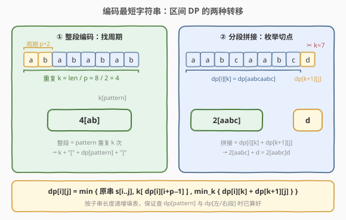
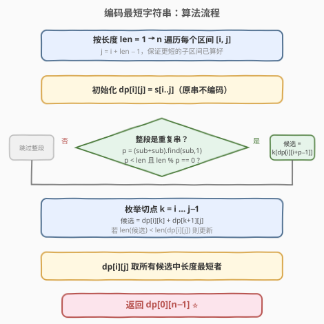
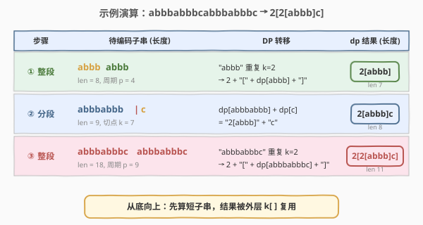

# LeetCode 编码最短字符串 题解

## 1. 题目概述

- **标题 / 题号**：编码最短字符串（#471，hard）
- **链接**：https://leetcode.cn/problems/encode-string-with-shortest-length/
- **难度**：困难
- **标签**：字符串、动态规划、区间 DP

**题意**：给定一个**非空**字符串 `s`，请你将其**编码**，使编码后的字符串尽可能短。编码规则为 `k[encoded_string]`，其中方括号内的 `encoded_string` 被精确重复 `k` 次（`k` 为正整数且 $\geq 2$）。若某种编码不能使字符串变更短，则**不要编码**；若存在多种编码方案，返回**任意一种**即可。

**示例 1**：

```text
输入：s = "aaa"
输出："aaa"
解释："3[a]" 长度为 4，比原串 "aaa"（长度 3）更长，故不编码。
```

**示例 2**：

```text
输入：s = "aaaaa"
输出："5[a]"
解释："5[a]" 长度为 4，比原串 "aaaaa"（长度 5）更短。
```

**示例 3**：

```text
输入：s = "aabcaabcd"
输出："2[aabc]d"
解释：把串切成 "aabcaabc" 与 "d" 两段，前者是 "aabc" 重复 2 次，编码为 "2[aabc]"，再拼上 "d"。
```

**示例 4**：

```text
输入：s = "abbbabbbcabbbabbbc"
输出："2[2[abbb]c]"
解释："abbbabbbc" 重复 2 次组成原串；而 "abbbabbbc" = "abbbabbb" + "c"，"abbbabbb" 又是 "abbb" 重复 2 次。
```

**约束**：

- `1 <= s.length <= 150`
- `s` 仅由小写英文字母组成

> 💡 本题是「**区间 DP + 字符串周期性**」的经典综合题。难点不在状态定义，而在想清楚：一个子串要么**整段被 `k[...]` 包裹**（前提是它本身是某个更短串的重复），要么**从某个切点断开拼接**——两种转移取更短者，且允许嵌套（编码里再套编码）。

## 2. 解题思路

### 2.1 暴力思路

最朴素的做法是「枚举所有可能的编码嵌套结构」。但编码可以层层嵌套（如示例 4 的 `2[2[abbb]c]`），组合数是指数级的；再加上每个候选都要判断「某段是否为重复串」，暴力搜索完全不可行。

> ⚠️ 看到「**最优值**（最短编码）」+「**子问题可复用**（子串的最短编码会被外层反复引用）」，应直接联想到**动态规划**。而且操作对象是「区间 `[i,j]`」，子结构由更短的区间组成——这是典型的**区间 DP**。

### 2.2 核心观察：区间 DP 的两种转移



定义 `dp[i][j]` 为子串 `s[i..j]` 的**最短编码字符串**。对每个区间，只有两种产生候选的方式：

**① 整段编码：找周期。**

如果 `s[i..j]` 整体是某个更短串 `pattern` 的 $k$ 次重复（$k \geq 2$），那么它可以编码为

$$
\text{cand}_1 = \text{str}(k) + \text{"["} + dp[i][i+p-1] + \text{"]"}
$$

其中 $p$ 为**最小周期**（`pattern` 的长度），$k = (j-i+1)/p$。注意方括号里**不是 `pattern` 原串，而是 `pattern` 的最短编码 `dp[i][i+p-1]`**——这正是「嵌套编码」的来源：`pattern` 本身可能还能继续压缩（如示例 4 中 `pattern="abbbabbbc"` 被进一步压成 `2[abbb]c`）。

> 💡 **如何快速判断 `s[i..j]` 是重复串并求最小周期 $p$？** 经典技巧：令 `sub = s[i..j]`，在 `sub + sub` 中从下标 1 开始查找 `sub` 的首次出现位置，即 $p = (\text{sub}+\text{sub}).\text{find}(\text{sub}, 1)$。若 $p < |\text{sub}|$（且 $|\text{sub}| \bmod p = 0$），则 `sub` 是 `sub[0..p-1]` 重复 $|\text{sub}|/p$ 次；否则 `sub` 是**本原串**（不可由更短串重复得到），无法整段编码。

**② 分段拼接：枚举切点。**

在任意位置 $k$（$i \leq k < j$）把 `s[i..j]` 切成左右两段，各自取最短编码再拼接：

$$
\text{cand}_2 = dp[i][k] + dp[k+1][j]
$$

枚举所有切点 $k$ 取最短者。

**③ 不编码。**

初始时 `dp[i][j] = s[i..j]`（原串本身），代表「编码后并不更短就保留原样」这一兜底选项。

综合三者：

$$
dp[i][j] = \min\Big\{\,|\text{s[i..j]}|,\ \ |\text{cand}_1|,\ \ \min_k |dp[i][k] + dp[k+1][j]|\,\Big\}
$$

> ⚠️ **关键细节**：比较的是**编码字符串的长度**；只有当候选**严格更短**时才更新（题目要求「不能变短就不编码」）。由于按子串长度从小到大填表，查 `dp[i][i+p-1]`（长度 $p < L$）和 `dp[i][k]`、`dp[k+1][j]`（长度都 $< L$）时它们均已算好，转移无后效性。

### 2.3 算法流程图



整体双重循环按长度递增遍历区间：先初始化为原串；再尝试整段编码（用 `(sub+sub).find(sub,1)` 判周期）；最后枚举切点做分段拼接；三者取最短作为 `dp[i][j]`。最终答案为 `dp[0][n-1]`。

### 2.4 示例演算



以 `s = "abbbabbbcabbbabbbc"` 为例，区间 DP **从短到长**填表，长区间的转移会复用短区间的结果，自然形成嵌套编码：

| 步骤 | 待编码子串 | DP 转移 | dp 结果 |
|------|-----------|---------|---------|
| ① 整段 | `"abbbabbb"` (len 8) | 周期 $p=4$，`"abbb"` 重复 $k=2$ → `2[` + `dp[abbb]` + `]` | `2[abbb]` (len 7) |
| ② 分段 | `"abbbabbbc"` (len 9) | 切点 $k=7$：`dp[abbbabbb]` + `dp[c]` = `"2[abbb]"` + `"c"` | `2[abbb]c` (len 8) |
| ③ 整段 | `"abbbabbbcabbbabbbc"` (len 18) | 周期 $p=9$，`"abbbabbbc"` 重复 $k=2$ → `2[` + `dp[abbbabbbc]` + `]` = `2[2[abbb]c]` | `2[2[abbb]c]` (len 11) |

- **步骤 ①**：`"abbbabbb"` 是 `"abbb"` 重复 2 次，`dp["abbb"]` 本身不可再压（`"4[b]"` 长度 4 ≥ 4），故 `dp["abbb"] = "abbb"`，整段编码为 `"2[abbb]"`（7 < 8）。
- **步骤 ②**：`"abbbabbbc"` 不是任何串的完美重复（长度 9，无 $<9$ 的周期），整段编码不适用；枚举切点发现 $k=7$ 最优，左段复用步骤 ① 的 `"2[abbb]"`，右段 `"c"`，拼成 `"2[abbb]c"`（8 < 9）。
- **步骤 ③**：原串是 `"abbbabbbc"` 重复 2 次（周期 9），整段编码为 `2[` + `dp["abbbabbbc"]` + `]` = `2[2[abbb]c]`（11 < 18）。

最终 `dp[0][17] = "2[2[abbb]c]"`，长度从 18 压缩到 11。

## 3. 参考代码

### C++

```cpp
class Solution {
public:
    string encode(string s) {
        int n = s.size();
        // dp[i][j] = s[i..j] 的最短编码字符串
        vector<vector<string>> dp(n, vector<string>(n, ""));

        // 按子串长度递增填表，保证更短的子区间已算好
        for (int len = 1; len <= n; ++len) {
            for (int i = 0; i + len - 1 < n; ++i) {
                int j = i + len - 1;
                string sub = s.substr(i, len);
                dp[i][j] = sub;  // 兜底：原串不编码

                // ① 整段编码：判断 sub 是否为某个更短串的重复
                //    (sub+sub).find(sub, 1) 给出最小周期 p
                int p = (sub + sub).find(sub, 1);
                if (p != string::npos && p < len && len % p == 0) {
                    int k = len / p;                 // 重复次数
                    string cand = to_string(k) + "[" + dp[i][i + p - 1] + "]";
                    if (cand.size() < dp[i][j].size()) dp[i][j] = cand;
                }

                // ② 分段拼接：枚举切点
                for (int m = i; m < j; ++m) {
                    string cand = dp[i][m] + dp[m + 1][j];
                    if (cand.size() < dp[i][j].size()) dp[i][j] = cand;
                }
            }
        }
        return dp[0][n - 1];
    }
};
```

### Python

```python
class Solution:
    def encode(self, s: str) -> str:
        n = len(s)
        # dp[i][j] = s[i..j] 的最短编码字符串
        dp = [[""] * n for _ in range(n)]

        # 按子串长度递增填表
        for length in range(1, n + 1):
            for i in range(n - length + 1):
                j = i + length - 1
                sub = s[i:j + 1]
                dp[i][j] = sub  # 兜底：原串不编码

                # ① 整段编码：找最小周期
                #    (sub+sub).find(sub, 1) 给出周期 p
                t = sub + sub
                p = t.find(sub, 1)
                if p != -1 and p < length and length % p == 0:
                    k = length // p
                    cand = f"{k}[{dp[i][i + p - 1]}]"
                    if len(cand) < len(dp[i][j]):
                        dp[i][j] = cand

                # ② 分段拼接：枚举切点
                for m in range(i, j):
                    cand = dp[i][m] + dp[m + 1][j]
                    if len(cand) < len(dp[i][j]):
                        dp[i][j] = cand

        return dp[0][n - 1]
```

> ⚠️ **常见坑**：
> - 方括号里必须填 `dp[pattern]`（pattern 的最短编码）而**不是 pattern 原串**，否则会漏掉嵌套压缩（如 `"abbbabbbcabbbabbbc"` 压不出 `"2[2[abbb]c]"`）。
> - 用 `find` 求周期时，务必从**下标 1** 开始查找（`find(sub, 1)`），否则会在下标 0 命中自身得到 $p=0$ 的错误结论。
> - 判定重复要加 `len % p == 0` 防御性检查：虽然 `(s+s).find(s,1) < |s|` 时 $p$ 理论上必整除 $|s|$，加上检查更稳妥。

## 4. 复杂度分析

| 维度 | 复杂度 | 说明 |
|------|--------|------|
| 时间复杂度 | $O(n^3 \cdot L)$ | 区间数 $O(n^2)$；每区间内：求周期 $O(L)$（`find`）+ 枚举切点 $O(n)$ 次拼接，每次拼接涉及 $O(L)$ 的字符串拷贝；$L \leq n$，总计约 $O(n^3 \cdot n)$。$n \leq 150$ 时可接受 |
| 空间复杂度 | $O(n^2 \cdot L)$ | `dp` 表存 $O(n^2)$ 个字符串，每个长度 $O(L)$ |

> 💡 实际运行远好于最坏上界：绝大多数区间并非重复串，整段编码分支很快被跳过；且 `dp[i][j]` 的长度随压缩递减，拼接代价低于理论上界。若追求更优复杂，可把「存字符串」改为「存 $(\text{长度}, \text{切点}/\text{周期})$ 决策」事后回溯构造，时间 $O(n^3)$、空间 $O(n^2)$。

## 5. 扩展：用决策表优化空间与构造

上面的实现把**最短编码字符串本身**存进 `dp`，写起来直观但每次拼接都做字符串拷贝。更高效的做法是只存「最优决策」：`dp[i][j]` 存一个结构体 `(最短长度, 类型, 切点/周期)`，其中类型标记该区间是「原串」「整段编码」还是「分段拼接」，并记录对应的切点 $m$ 或周期 $p$。最后从 `dp[0][n-1]` **递归回溯**出编码字符串。

```cpp
struct Dec {
    int len;            // 该区间的最短编码长度
    int type;           // 0=原串, 1=整段编码, 2=分段拼接
    int split;          // type=1 时为周期 p；type=2 时为切点 m
};

class Solution {
public:
    string encode(string s) {
        int n = s.size();
        vector<vector<Dec>> dp(n, vector<Dec>(n, {INT_MAX, 0, 0}));
        for (int len = 1; len <= n; ++len) {
            for (int i = 0; i + len - 1 < n; ++i) {
                int j = i + len - 1;
                string sub = s.substr(i, len);
                // 原串
                dp[i][j] = {len, 0, 0};
                // 整段编码
                int p = (sub + sub).find(sub, 1);
                if (p != string::npos && p < len && len % p == 0) {
                    int cand = to_string(len / p).size() + 2 + dp[i][i + p - 1].len;
                    if (cand < dp[i][j].len) dp[i][j] = {cand, 1, p};
                }
                // 分段拼接
                for (int m = i; m < j; ++m) {
                    int cand = dp[i][m].len + dp[m + 1][j].len;
                    if (cand < dp[i][j].len) dp[i][j] = {cand, 2, m};
                }
            }
        }
        return build(s, dp, 0, n - 1);
    }
private:
    string build(const string& s, const vector<vector<Dec>>& dp, int i, int j) {
        const Dec& d = dp[i][j];
        if (d.type == 0) return s.substr(i, j - i + 1);
        if (d.type == 1) {  // 整段编码：周期 = d.split
            int p = d.split, k = (j - i + 1) / p;
            return to_string(k) + "[" + build(s, dp, i, i + p - 1) + "]";
        }
        // 分段拼接：切点 = d.split
        return build(s, dp, i, d.split) + build(s, dp, d.split + 1, j);
    }
};
```

| 方法 | 时间 | 空间 | 特点 |
|------|------|------|------|
| 存字符串（主代码） | $O(n^3 L)$ | $O(n^2 L)$ | 直观，易写易调，$n \leq 150$ 足够 |
| 存决策 + 回溯 | $O(n^3)$ | $O(n^2)$ | 避免字符串拷贝，空间更优 |

> 💡 **面试推荐**：先讲清「两种转移 + 周期判定」的主代码版本，再提决策表优化（展示对字符串拷贝开销的意识）。若面试官追问「能否不存字符串」，再展开回溯构造版本。

## 6. 面试要点

1. **为什么用区间 DP 而不是线性 DP？**

   - 编码可以**嵌套**（`2[2[abbb]c]`），外层的编码依赖内层子串的最优编码，且子串由「连续区间」定义。`dp[i][j]` 表示一段连续子串的最短编码，转移只依赖更短的连续子区间，天然是区间 DP。线性 DP 的状态难以表达「任意一段都能被 `k[...]` 包裹」这种结构。

2. **如何判断一段子串是重复串并求最小周期？**

   - 令 `sub = s[i..j]`，计算 `(sub + sub).find(sub, 1)`：返回值 $p$ 是 `sub` 在拼接串中从下标 1 起的首次出现位置。若 $p < |\text{sub}|$，则 `sub` 是 `sub[0..p-1]` 重复 $|\text{sub}|/p$ 次，$p$ 即最小周期；否则 `sub` 本原、不可整段编码。这比「枚举所有因数长度再逐一比对」更简洁。

3. **为什么方括号里要放 `dp[pattern]` 而不是 `pattern` 原串？**

   - `pattern` 本身可能还能继续压缩（如 `"abbbabbbc"` 可压成 `"2[abbb]c"`）。放 `dp[pattern]` 保证嵌套结构被充分利用，这是得到全局最优的关键。若放原串，示例 4 只能得到 `"2[abbbabbbc]"`（长度 12）而非最优的 `"2[2[abbb]c]"`（长度 11）。

4. **为什么要按子串长度递增填表？**

   - 整段编码分支查 `dp[i][i+p-1]`（长度 $p < L$），分段拼接分支查 `dp[i][m]`、`dp[m+1][j]`（长度均 $< L$）。按长度递增可保证被依赖的更短区间已算好，转移无后效性。这是区间 DP 的标准填表顺序。

5. **「不能变短就不编码」是如何保证的？**

   - 初始化 `dp[i][j] = s[i..j]`（原串），所有候选只在**严格更短**时才更新。因此若整段编码与分段拼接都不能产生更短的串，`dp[i][j]` 自然保留原串，符合题意。例如 `"aaa"`：`"3[a]"` 长度 4 > 3，不更新，结果为 `"aaa"`。

## 同类练习题

| # | 题目 | 与本题的关联 |
|---|------|-------------|
| 394 | [字符串解码](https://leetcode.cn/problems/decode-string/) | 本题的逆操作——把 `k[encoded_string]` 展开成原串，用栈处理嵌套。 |
| 131 | [分割回文串](https://leetcode.cn/problems/palindrome-partitioning/) | 同为「字符串区间切分」，把「重复串判定」换成「回文判定」。 |
| 132 | [分割回文串 II](https://leetcode.cn/problems/palindrome-partitioning-ii/)（[题解](../0101-0200/132_分割回文串II.md)） | 区间 DP + 预处理表的典范，与本题同为「预处理性质 + 主 DP」范式。 |
| 459 | [重复的子字符串](https://leetcode.cn/problems/repeated-substring-pattern/) | 单纯考察「字符串是否为重复串」，即本题整段编码分支的判定核心 `(s+s).find(s,1) < n`。 |
| 5 | [最长回文子串](https://leetcode.cn/problems/longest-palindromic-substring/)（[题解](../0001-0100/5_最长回文子串.md)） | 字符串区间性质 + DP 的入门题，承接区间 DP 思路。 |
