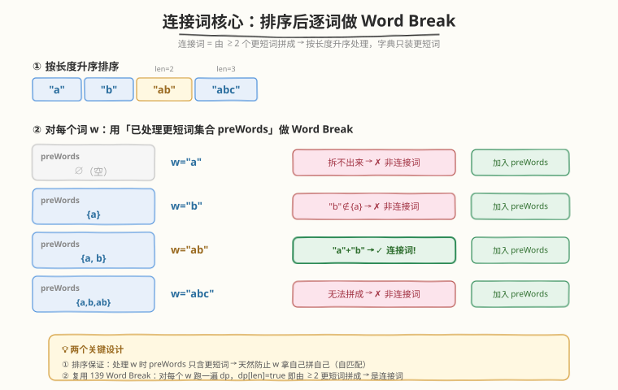
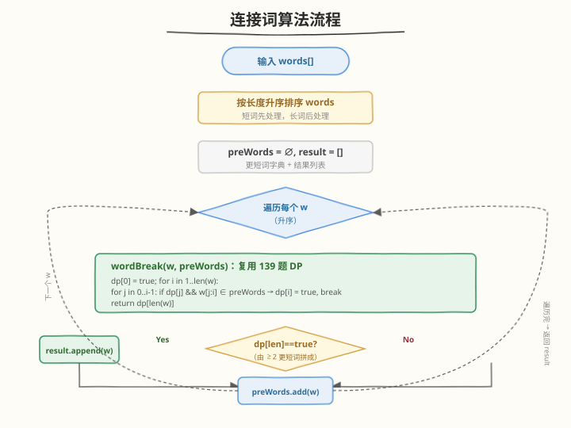
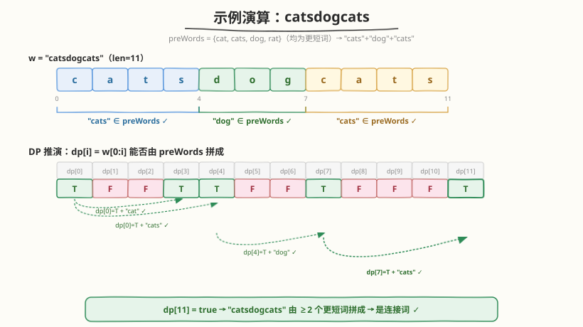

# 连接词

- **题目名称**：连接词
- **链接**：[472. 连接词](https://leetcode.cn/problems/concatenated-words/)
- **难度**：困难
- **标签**：动态规划、深度优先搜索、字典树、字符串、数组

## 1. 题目概述

给定一个**不含重复字符串**的字符串数组 `words`，返回其中所有的**连接词**。

> 💡 **连接词**的定义：一个字符串，如果能由数组中**至少两个更短的**字符串（可重复使用）拼接而成，就是连接词。注意被拼接的词必须来自原数组本身，且**比目标词更短**。

**示例 1**：

```text
输入：words = ["cat","cats","catsdogcats","dog","dogcatsdog","hippopotamuses","rat","ratcatdogcat"]
输出：["catsdogcats","dogcatsdog","ratcatdogcat"]
解释：
  "catsdogcats"  = "cats" + "dog" + "cats"
  "dogcatsdog"   = "dog"  + "cats" + "dog"
  "ratcatdogcat" = "rat"  + "cat" + "dog" + "cat"
```

**示例 2**：

```text
输入：words = ["a","b","ab","abc"]
输出：["ab"]
解释："ab" = "a" + "b"；"abc" 无法由更短词拼成（"ab"+"c" 中 "c" 不在数组）。
```

**示例 3**：

```text
输入：words = ["a"]
输出：[]
解释：数组中只有一个词，没有「至少两个更短词」可拼。
```

**约束条件**：

- $1 \le \text{words.length} \le 10^4$
- $1 \le \text{words[i].length} \le 30$
- `words[i]` 仅由小写英文字母组成
- `words` 中所有字符串互不相同

---

## 2. 解题思路

### 2.1 暴力思路：枚举每个词的所有拆分

对每个词 $w$，枚举它的所有切分点组合（$2^{|w|-1}$ 种），判断是否存在一种切分使**每段都出现在 `words` 中且至少两段**。单词长度 $\le 30$，$2^{29}$ 仍不可行；且对 $10^4$ 个词逐一枚举更是雪上加霜。

> ⚠️ 暴力的根本低效在于：**没有复用「更短词是否可拆」的子问题答案**，每个词都从零开始重复搜索。

### 2.2 核心观察：排序 + 复用 139 单词拆分 DP



关键洞察有两条：

1. **连接词必由更短词拼成**。若把 `words` 按**长度升序**排序，处理某个词 $w$ 时，所有「可能参与拼接」的更短词都已在前面处理过。于是维护一个 `preWords` 集合（已处理的更短词），它天然不含 $w$ 本身 → **自动规避「拿自己拼自己」的自匹配问题**。

2. **判断 $w$ 能否由 `preWords` 拼成，正是 [139. 单词拆分](https://leetcode.cn/problems/word-break/) 的同构问题**。对每个 $w$ 跑一遍 139 题的 DP：若 `dp[|w|] = true`，则 $w$ 能由 `preWords` 中的词拼成；又因 `preWords` 不含 $w$ 自身，拼它的至少是两个更短词 → 满足「连接词」定义。

> 💡 这与 [139. 单词拆分](https://leetcode.cn/problems/word-break/)（[题解](../0101-0200/139_单词拆分.md)）的 `dp[j]` 前缀缓存思想一脉相承：`dp[j]` 缓存「前 $j$ 个字符能否拼成」的子问题答案，`w[j:i] ∈ preWords` 是增量计算，二者合体避免重复搜索。区别在于：139 对单个字符串做一次 DP，472 对每个词做一次 DP、且字典是「动态增长」的更短词集合。

**状态定义**（对当前词 $w$，长度 $n$）：

$$
dp[i] = \text{前缀 } w[0{:}i] \text{ 能否由 preWords 中的词拼成}
$$

- $dp[0] = \text{true}$（空前缀可拼）。
- 转移：$dp[i] = \bigvee_{j=0}^{i-1} \bigl(dp[j] \wedge w[j{:}i] \in \text{preWords}\bigr)$。
- 若 $dp[n] = \text{true}$，则 $w$ 是连接词。

### 2.3 算法流程图



完整流程：

1. 把 `words` 按字符串长度**升序**排序（长度相同顺序无所谓）。
2. 初始化 `preWords = ∅`（哈希集合）、`result = []`。
3. 对每个词 $w$（按排序后顺序）：
   - 若 `preWords` 非空，对 $w$ 跑一遍 139 题 Word Break DP（字典 = `preWords`）。
   - 若 $dp[|w|] = \text{true}$ → $w$ 是连接词，加入 `result`。
   - **无论是否为连接词**，都把 $w$ 加入 `preWords`（更长的词可能用到它）。
4. 返回 `result`。

> ⚠️ **必须先判 DP 再加入 `preWords`**：若先把 $w$ 加入集合再做 DP，$w$ 会被自己匹配（`dp[|w|]` 因 `w ∈ preWords` 直接为 true），所有词都被误判为连接词。排序 + 「先判后加」是规避自匹配的双重保险。

### 2.4 示例演算

以示例 2 `words = ["a","b","ab","abc"]` 为例，按长度升序处理后逐词判定（见概念图）。这里演示一个更长的连接词 `"catsdogcats"`（示例 1），其 `preWords = {cat, cats, dog, rat}`（均为更短词）：



$w =$ `"catsdogcats"`，长度 $n=11$，DP 数组推演如下：

| $i$ | 命中的 $j$ | $w[j{:}i]$ | $\in$ preWords? | $dp[i]$ |
|-----|-----------|------------|-----------------|---------|
| 0   | —         | —          | —               | T       |
| 1–2 | —         | —          | —               | F       |
| 3   | 0         | "cat"      | ✓               | T       |
| 4   | 0         | "cats"     | ✓               | T       |
| 5–6 | —         | —          | —               | F       |
| 7   | 4         | "dog"      | ✓               | T       |
| 8–10| —         | —          | —               | F       |
| 11  | 7         | "cats"     | ✓               | T ⭐    |

$dp[11] = \text{true}$ → `"catsdogcats"` 由 `"cats"` + `"dog"` + `"cats"` 三个更短词拼成，是连接词。

> 💡 注意 $dp[3]$ 和 $dp[4]$ 同时为 true（`"cat"` 与 `"cats"` 都能从下标 0 拼出），但 $dp[7]$ 必须依赖 $dp[4]$（因为 `w[3:7]` = `"sdog"` 不在字典）。这说明 DP 会自动探索所有合法切分路径，无需手动枚举。

---

## 3. 参考代码

### C++

```cpp
class Solution {
  public:
    vector<string> findAllConcatenatedWordsInADict(vector<string>& words) {
        // 1. 按长度升序排序：处理 w 时 preWords 只含更短词，天然防自匹配
        sort(words.begin(), words.end(),
             [](const string& a, const string& b) { return a.size() < b.size(); });

        unordered_set<string> preWords;
        vector<string> result;

        for (const string& w : words) {
            if (!preWords.empty() && canForm(w, preWords)) {
                result.push_back(w);
            }
            preWords.insert(w);   // 先判后加：避免 w 拿自己拼自己
        }
        return result;
    }

  private:
    // 复用 139 单词拆分 DP：判断 w 能否由 dict 中的词拼成
    bool canForm(const string& w, const unordered_set<string>& dict) {
        int n = w.size();
        vector<bool> dp(n + 1, false);
        dp[0] = true;
        for (int i = 1; i <= n; ++i) {
            for (int j = 0; j < i; ++j) {
                if (dp[j] && dict.count(w.substr(j, i - j))) {
                    dp[i] = true;
                    break;   // 命中即可，无需枚举其余 j
                }
            }
        }
        return dp[n];
    }
};
```

### Python

```python
class Solution:
    def findAllConcatenatedWordsInADict(self, words: List[str]) -> List[str]:
        words.sort(key=len)                       # 按长度升序
        pre_words: set[str] = set()
        result: list[str] = []

        for w in words:
            if pre_words and self._can_form(w, pre_words):
                result.append(w)
            pre_words.add(w)                      # 先判后加
        return result

    def _can_form(self, w: str, dic: set[str]) -> bool:
        """复用 139 单词拆分 DP：w 能否由 dic 中的词拼成。"""
        n = len(w)
        dp = [False] * (n + 1)
        dp[0] = True
        for i in range(1, n + 1):
            for j in range(i):
                if dp[j] and w[j:i] in dic:
                    dp[i] = True
                    break
        return dp[n]
```

> ⚠️ **易错点**：
> - **先判后加**：必须在 `canForm` 返回后再 `preWords.insert(w)`，否则 $w$ 自己进字典后 `dp[n]` 恒为 true。
> - **空集合跳过**：`preWords` 为空时直接跳过 DP（最短的词不可能由更短词拼成），避免无意义计算。
> - **`substr` 越界**：`w.substr(j, i - j)` 的第二参数是长度，`i - j ≥ 1`，不会越界；但内层 `j` 必须从 `0` 到 `i-1`，写成 `j < i` 而非 `j <= i`。

---

## 4. 复杂度分析

| 维度 | 复杂度 | 说明 |
|------|--------|------|
| 时间复杂度 | $O\bigl(N \cdot L^2 \cdot \ell\bigr)$ | $N$ 个词；每个词跑 DP 为 $O(L^2)$ 次转移（$L$=词长 $\le 30$），每次转移含一次 `substr` + 哈希查询 $O(\ell)$（$\ell$=子串长 $\le L$）；总计 $N \cdot L^2 \cdot \ell$ |
| 空间复杂度 | $O(N \cdot L + L)$ | `preWords` 集合存所有词 $O(N \cdot L)$；单次 DP 数组 $O(L)$ |

> 💡 本题 $N \le 10^4$、$L \le 30$，最坏约 $10^4 \times 30^2 \times 30 \approx 2.7 \times 10^8$ 次「字符合比较」（哈希查询内部）。但由于 `break` 提前剪枝、`preWords` 增长缓慢（短词阶段几乎全 false 快速结束），实际运行远低于理论上界，C++ 可轻松通过。
>
> 若需进一步优化：内层循环只枚举 `preWords` 中**实际存在的词长** `len`，即 `j = i - len`，把 $O(L^2)$ 降为 $O(L \cdot K)$（$K$=不同词长数 $\le 30$）；或用 **字典树** 替代哈希集合，沿 Trie 一边匹配一边推进 $j$，详见第 5 节。

---

## 5. 扩展：字典树 + DFS 记忆化

DP 解法对每个词独立跑一遍 Word Break，已足够高效。但若追求更优常数或面试中想展示字典树功底，可用 **Trie + 记忆化 DFS**：

**思路**：把所有更短词插入 Trie，对 $w$ 从下标 `start` 出发 DFS：沿 Trie 走，遇到词尾节点时可选「在此切分」→ 递归 `dfs(start + word_len)`，只要某条路径能切 $\ge 2$ 段走到末尾即成功。用 `memo[start]` 缓存避免重复搜索。

```python
class TrieNode:
    __slots__ = ("children", "is_end")
    def __init__(self):
        self.children: dict[str, TrieNode] = {}
        self.is_end = False

class Solution:
    def findAllConcatenatedWordsInADict(self, words: List[str]) -> List[str]:
        words.sort(key=len)
        root = TrieNode()
        result: list[str] = []

        def insert(w: str) -> None:
            node = root
            for ch in w:
                node = node.children.setdefault(ch, TrieNode())
            node.is_end = True

        def can_form(w: str, start: int, memo: list[int]) -> bool:
            if start == len(w):
                return 0           # 切到末尾，需由上层统计段数
            if memo[start] != -1:
                return memo[start] == 1
            node = root
            for i in range(start, len(w)):
                ch = w[i]
                if ch not in node.children:
                    break
                node = node.children[ch]
                if node.is_end:
                    # 在此切分，递归剩余部分；末段需保证至少切了 2 段
                    if i == len(w) - 1:
                        memo[start] = 1 if start > 0 else 0   # start>0 表示前面已切过
                        return memo[start] == 1
                    if can_form(w, i + 1, memo):
                        memo[start] = 1
                        return True
            memo[start] = 0
            return False

        for w in words:
            if root.children:                      # Trie 非空才判
                memo = [-1] * len(w)
                if can_form(w, 0, memo):
                    result.append(w)
            insert(w)
        return result
```

| 对比维度 | DP + 哈希集合 | Trie + 记忆化 DFS |
|----------|---------------|--------------------|
| 时间复杂度 | $O(N L^2 \ell)$ | $O(N L^2)$（匹配沿 Trie 共享前缀，省去哈希） |
| 实现难度 | 简单，复用 139 模板 | 较高，需手写 Trie + memo |
| 适用场景 | 首选，面试推荐 | 追求极致常数 / 词长很大时 |
| 空间 | 哈希集合 $O(NL)$ | Trie 节点 $O(NL)$，常数略大 |

> 💡 Trie 解法的本质优势：多个更短词共享前缀（如 `cat`/`cats`/`catdog`）时，一次 Trie 遍历同时匹配多个词，避免 DP 中对每个 $j$ 重新做 `substr` + 哈希。但本题 $L \le 30$ 很小，DP 的常数已足够优。

---

## 6. 面试要点

1. **为什么必须排序？不排序会怎样？**

   - 连接词由「更短词」拼成。排序后处理 $w$ 时，`preWords` 中只有更短的词，天然排除 $w$ 自身。若不排序，$w$ 可能在更长的词之前被处理，此时 `preWords` 含更长的词——它们无法参与拼 $w$（更长的词塞不进 $w$），逻辑虽不错但会引入「自匹配」风险（若 $w$ 已在集合中，`dp[n]` 直接 true）。排序 + 先判后加，是简洁正确的双重保险。

2. **为什么不直接把所有词放字典、对每个 $w$ 做一次 139 DP？**

   - 这样 $w$ 自己在字典里，`dp[|w|]` 恒为 true（整串匹配自身），所有词都被误判为连接词。需要额外加「至少切成两段」的判定（如限制 $j \in [1, n-1]$ 而非 $j=0$），不如排序 + 先判后加来得自然——后者从源头保证字典不含 $w$。

3. **`dp[i]` 的含义和 139 题有何异同？**

   - 完全相同：`dp[i]` = 前 $i$ 个字符能否由字典拼成。区别仅在「字典的来源」：139 的字典是外部给定的 `wordDict`，472 的字典是「已处理的更短词」动态增长。两者都是 [139 题解](../0101-0200/139_单词拆分.md) 所述的「前缀缓存 + 增量计算」范式。

4. **能否优化内层 `for j` 循环？**

   - 可以。记录 `preWords` 中所有**不同词长** `lens`，内层只枚举 `j = i - l`（$l \in \text{lens}$，$j \ge 0$），把 $O(L^2)$ 降为 $O(L \cdot K)$，$K$ 为不同词长数（$\le 30$）。或直接用 Trie 沿前缀推进（见第 5 节）。本题 $L \le 30$，朴素 DP 已够用。

5. **如果 `words` 中有词长度相同，排序会出错吗？**

   - 不会。长度相同的词互不为「更短词」，无法参与拼接彼此。排序时长度相同的词顺序无关：先处理者加入 `preWords`，后处理者即便能用前者拼，前者长度也等于自身——塞不进等长的串里（拼接要求至少两段，总长必大于任一段）。故等长词的处理顺序不影响结果。

---

## 7. 同类练习题

- [139. 单词拆分](https://leetcode.cn/problems/word-break/)（[题解](../0101-0200/139_单词拆分.md)）：本题的直接前置模板——单字符串 Word Break DP，472 是其「批量 + 动态字典」扩展
- [140. 单词拆分 II](https://leetcode.cn/problems/word-break-ii/)（[题解](../0101-0200/140_单词拆分II.md)）：Word Break 的「枚举所有方案」版，记忆化 DFS 思路对应本题第 5 节 Trie + memo
- [208. 实现 Trie (前缀树)](https://leetcode.cn/problems/implement-trie-prefix-tree/)（[题解](../0201-0300/208_实现Trie.md)）：字典树基础模板，掌握后可替换本题哈希集合做前缀共享匹配
- [212. 单词搜索 II](https://leetcode.cn/problems/word-search-ii/)（[题解](../0201-0300/212_单词搜索II.md)）：Trie + DFS 回溯的另一经典应用，对比 Trie 在「批量查询」场景的威力
- [47. 全排列 II](https://leetcode.cn/problems/permutations-ii/)（[题解](../0001-0100/47_全排列II.md)）：同样是「排序 + 处理顺序规避自重复」的范式，与本题「排序 + 先判后加防自匹配」思想相通
